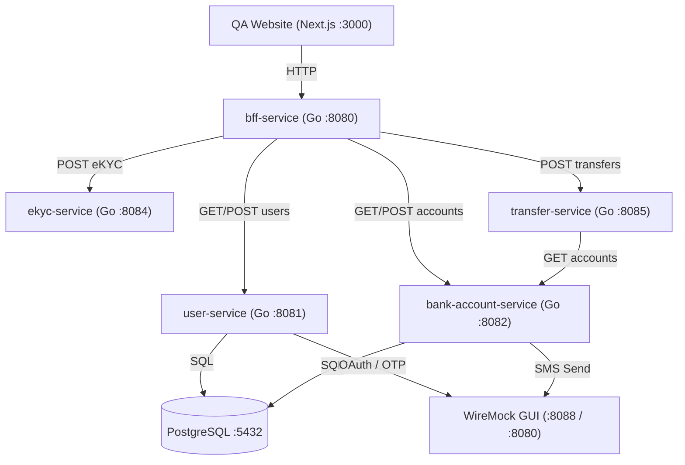
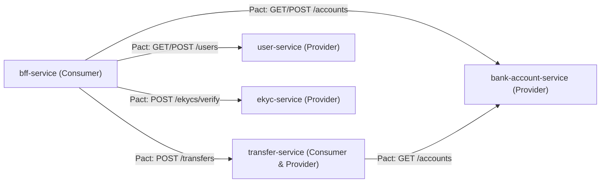

# Ultra Smoooooth Testing

A microservices ecosystem POC demonstrating **Consumer-Driven Contract Testing (Pact)**, **Go Workspaces (`go.work`)**, and full-stack integration testing with **Docker Compose**, **WireMock**, and **Playwright**.

---

## 🏗 System Architecture



### Microservices

- **`bff-service`** (`:8080`): Backend-for-Frontend service exposing unified API endpoints.
- **`user-service`** (`:8081`): User profile management microservice backed by PostgreSQL.
- **`bank-account-service`** (`:8082`): Bank account management microservice backed by PostgreSQL.
- **`ekyc-service`** (`:8084`): Electronic Know Your Customer identity verification service (`POST /ekycs/verify`, `GET /ekycs/{id}`).
- **`transfer-service`** (`:8085`): Funds transfer management service (`POST /transfers`, `GET /transfers`, `GET /transfers/{id}`).
- **`website`** (`:3000`): Next.js web client interface.
- **`wiremock`** (`:8088`): WireMock GUI mocking third-party integrations (Paotang Pass, OTP, SMS).

---

## 🛠 Local Development & Go Workspace

This repository uses **Go Workspaces (`go.work`)** to manage multiple Go modules seamlessly:

```work
go 1.25.7

use (
	./services/bank-account-service
	./services/bff-service
	./services/ekyc-service
	./services/transfer-service
	./services/user-service
)
```

### Build Commands (`Makefile`)

All compiled binaries output exclusively to the root `./bin/` folder:

```bash
# Build all Go services into ./bin/
make build

# Sync workspace dependencies & tidy all service go.mod files
make sync

# Run unit & contract tests across all services
make test

# Clean compiled binaries
make clean
```

---

## 🤝 Pact Contract Testing (Consumer-Driven)

We use **Pact Go (v2)** for consumer-driven contract testing between services:



### Contract Specifications & Tests

- **`bff-service` (Consumer)**:
  - [`user_pact_test.go`](services/bff-service/contract-testing/user_pact_test.go): Contract expectations for `GET /users/{id}` & `POST /users`.
  - [`account_pact_test.go`](services/bff-service/contract-testing/account_pact_test.go): Contract expectations for `GET /accounts` & `POST /accounts`.
  - [`ekyc_pact_test.go`](services/bff-service/contract-testing/ekyc_pact_test.go): Contract expectations for `POST /ekycs/verify`.
  - [`transfer_pact_test.go`](services/bff-service/contract-testing/transfer_pact_test.go): Contract expectations for `POST /transfers`.
- **`ekyc-service` (Provider)**:
  - [`ekyc_provider_pact_test.go`](services/ekyc-service/contract-testing/ekyc_provider_pact_test.go): Verifies provider contract against production `api.SetupRouter()`.
- **`transfer-service` (Consumer & Provider)**:
  - [`transfer_pact_test.go`](services/transfer-service/contract-testing/transfer_pact_test.go): Verifies consumer expectations and provider contract against `api.SetupRouter()`.
- **`user-service` (Provider)**:
  - [`user_provider_pact_test.go`](services/user-service/contract-testing/user_provider_pact_test.go): Verifies provider contract against production `api.SetupUserRouter()`.
  - [`paotang_pact_test.go`](services/user-service/contract-testing/paotang_pact_test.go): Consumer contract test for Paotang Pass token exchange.
- **`bank-account-service` (Provider & Consumer)**:
  - [`account_provider_pact_test.go`](services/bank-account-service/contract-testing/account_provider_pact_test.go): Verifies provider contract against production `api.SetupAccountRouter()`.
  - [`sms_pact_test.go`](services/bank-account-service/contract-testing/sms_pact_test.go): Consumer contract test for SMS service.

Generated JSON contracts are published into the root `./pacts/` directory.

---

## 🚀 Running with Docker Compose

Spin up the entire microservices environment (Postgres, WireMock, User Service, Bank Account Service, eKYC Service, Transfer Service, BFF Service, and Website):

```bash
# Start all services
docker compose up --build

# Stop all services
docker compose down
```

---

## 🧪 Integration & E2E Testing

Separated testing suites using Playwright and Testcontainers:

```bash
# Run Integration Tests (specs/integration)
make test-integration

# Run End-to-End Browser Tests (specs/e2e)
make test-e2e
```
