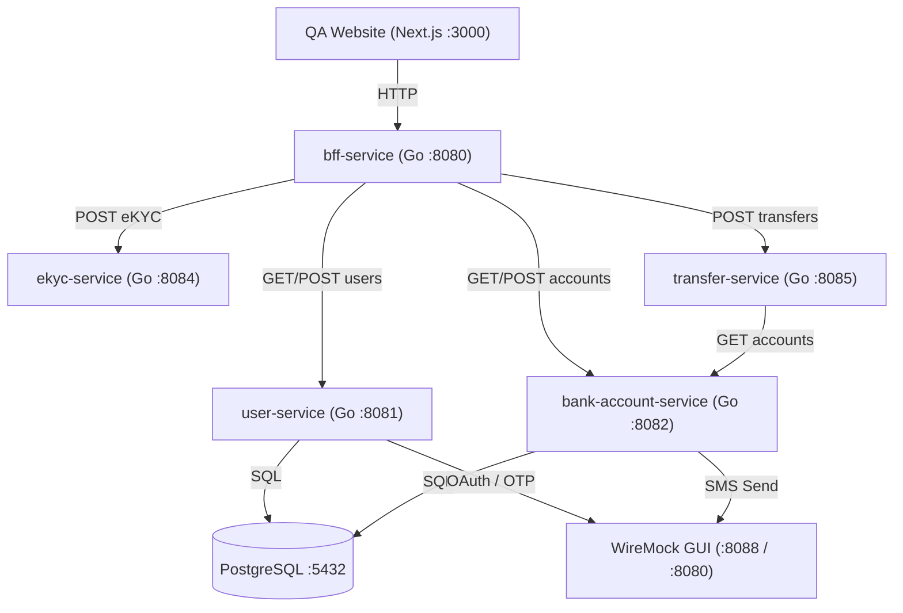

# Ultra Smoooooth Testing

A microservices ecosystem POC demonstrating **Consumer-Driven Contract Testing (Pact)**, **Go Workspaces (`go.work`)**, and full-stack integration testing with **Docker Compose**, **WireMock**, and **Playwright**.

---

## 🏗 System Architecture



### Microservices

- **`bff-service`** (`:8080`): Backend-for-Frontend service exposing unified API endpoints.
- **`user-service`** (`:8081`): User profile management microservice backed by PostgreSQL.
- **`bank-account-service`** (`:8082`): Bank account management microservice backed by PostgreSQL.
- **`ekyc-service`** (`:8084`): Electronic Know Your Customer identity verification service (`POST /ekycs/verify`, `GET /ekycs/{id}`).
- **`transfer-service`** (`:8085`): Funds transfer management service (`POST /transfers`, `GET /transfers`, `GET /transfers/{id}`).
- **`website`** (`:3000`): Next.js web client interface.
- **`wiremock`** (`:8088`): WireMock GUI mocking third-party integrations (Paotang Pass, OTP, SMS).

---

## 📋 Prerequisites

Before setting up and running the microservices ecosystem, ensure the following prerequisite tools are installed:

| Tool | Recommended Version | Purpose |
| :--- | :--- | :--- |
| **Docker & Docker Compose** | Docker Desktop 4.x+ | Orchestrating containerized services (PostgreSQL, WireMock, microservices). |
| **Burp Suite** | Community / Professional | **MITM Proxy**: Intercepting, inspecting, and security testing HTTP API traffic between frontend, BFF, and microservices. |
| **Go** | 1.25+ | Compiling Go binaries and running workspace-level unit & integration tests (`go.work`). |
| **Node.js & npm** | Node v18+ / npm v9+ | Building the QA Website and running Playwright E2E & integration test suites. |

---

## 🛠 Local Development & Go Workspace

This repository uses **Go Workspaces (`go.work`)** to manage multiple Go modules seamlessly:

```work
go 1.25.7

use (
	./services/bank-account-service
	./services/bff-service
	./services/ekyc-service
	./services/transfer-service
	./services/user-service
)
```

### Build Commands (`Makefile`)

All compiled binaries output exclusively to the root `./bin/` folder:

```bash
# Build all Go services into ./bin/
make build

# Sync workspace dependencies & tidy all service go.mod files
make sync

# Run unit & contract tests across all services
make test

# Clean compiled binaries
make clean
```

---

---

## 🤝 Contract Testing

Pact consumer-driven contract testing specifications and tests have been preserved in the [`feature/pact-contract-testing`](https://github.com/SiwakornSitti/ultra-smoooooth-testing/tree/feature/pact-contract-testing) branch.

To run Pact contract tests, switch to the Pact testing branch:
```bash
git checkout feature/pact-contract-testing
```

---

## 🚀 Running with Docker Compose

Spin up the entire microservices environment (Postgres, WireMock, User Service, Bank Account Service, eKYC Service, Transfer Service, BFF Service, and Website):

```bash
# Start all services
docker compose up --build

# Stop all services
docker compose down
```

---

## 🧪 Integration & E2E Testing

Separated testing suites using Playwright and Testcontainers:

```bash
# Run Integration Tests (specs/integration)
make test-integration

# Run End-to-End Browser Tests (specs/e2e)
make test-e2e
```
