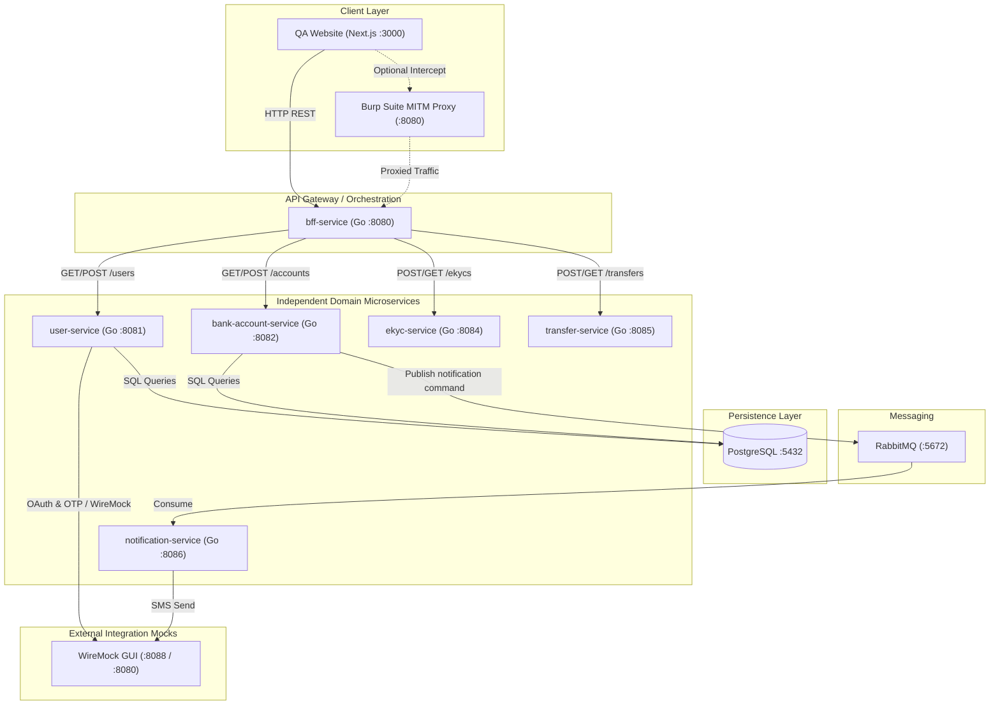

# Ultra Smoooooth Testing

A microservices ecosystem POC demonstrating **Go Workspaces (`go.work`)**, full-stack integration testing with **Docker Compose**, **WireMock**, and **Playwright**.

👉 **Check out the full [Integration Testing Workshop Guide](WORKSHOP.md) for 10 practical thinking cases and hands-on scenarios!**

---

## 🏗 System Architecture

See the detailed [system architecture document](SYSTEM-ARCHITECTURE.md) for
component responsibilities, request flows, WireMock modes, and testing
boundaries.


```mermaid
flowchart TD
    subgraph Clients["Client Layer"]
        Website["QA Website (Next.js :3000)"]
        Burp["Burp Suite MITM Proxy (:8080)"]
    end

    subgraph API_Gateway["API Gateway / Orchestration"]
        BFF["bff-service (Go :8080)"]
    end

    subgraph Core_Services["Independent Domain Microservices"]
        UserService["user-service (Go :8081)"]
        BankService["bank-account-service (Go :8082)"]
        EKYCService["ekyc-service (Go :8084)"]
        TransferService["transfer-service (Go :8085)"]
        NotificationService["notification-service (Go :8086)"]
    end

    subgraph Persistence["Persistence Layer"]
        DB[(PostgreSQL :5432)]
    end

    subgraph External_Mocks["External Integration Mocks"]
        WireMock["WireMock GUI (:8088 / :8080)"]
    end

    subgraph Messaging["Messaging"]
        RabbitMQ["RabbitMQ (:5672)"]
    end

    Website -->|HTTP REST| BFF
    Website -.->|Optional Intercept| Burp
    Burp -.->|Proxied Traffic| BFF

    BFF -->|GET/POST /users| UserService
    BFF -->|GET/POST /accounts| BankService
    BFF -->|POST/GET /ekycs| EKYCService
    BFF -->|POST/GET /transfers| TransferService

    UserService -->|SQL Queries| DB
    BankService -->|SQL Queries| DB

    UserService -->|OAuth & OTP / WireMock| WireMock
    BankService -->|Publish notification command| RabbitMQ
    RabbitMQ -->|Consume| NotificationService
    NotificationService -->|SMS Send| WireMock
```

### Microservices

- **`bff-service`** (`:8080`): Backend-for-Frontend service exposing unified API endpoints.
- **`user-service`** (`:8081`): User profile management microservice backed by PostgreSQL.
- **`bank-account-service`** (`:8082`): Bank account management microservice backed by PostgreSQL.
- **`ekyc-service`** (`:8084`): Electronic Know Your Customer identity verification service (`POST /ekycs/verify`, `GET /ekycs/{id}`).
- **`transfer-service`** (`:8085`): Money movement and transfer history service; atomically updates source and target account balances.
- **`notification-service`** (`:8086`): Consumes `notification.commands` from RabbitMQ and delivers SMS notifications.
- **`website`** (`:3000`): Next.js 16 web client interface.
- **`wiremock`** (`:8088`): WireMock GUI mocking third-party integrations (Paotang Pass, OTP, SMS).

---

## 📋 Prerequisites

Before setting up and running the microservices ecosystem, ensure the following prerequisite tools are installed:

| Tool | Recommended Version | Purpose |
| :--- | :--- | :--- |
| **Docker & Docker Compose** | Docker Desktop 4.x+ | Orchestrating containerized services (PostgreSQL, WireMock, microservices). |
| **Burp Suite** | Community / Professional | **MITM Proxy**: Intercepting, inspecting, and security testing HTTP API traffic between frontend, BFF, and microservices. |
| **Playwright** | v1.40+ | **Test Runner**: Executing end-to-end (E2E) browser automation tests and API integration test suites (`specs/e2e`, `specs/integration`). |
| **Go** | 1.27+ | Compiling Go binaries and running workspace-level unit & integration tests (`go.work`). |
| **Node.js & npm** | Node v18+ / npm v9+ | Building the QA Website and running Playwright test suites. |

---

## 🛠 Local Development & Go Workspace

This repository uses **Go Workspaces (`go.work`)** to manage multiple Go modules seamlessly:

```work
go 1.27.0

use (
 ./services/bank-account-service
 ./services/bff-service
 ./services/ekyc-service
 ./services/notification-service
 ./services/transfer-service
 ./services/user-service
)
```

### Build Commands (`Makefile`)

All compiled binaries output exclusively to the root `./bin/` folder:

```bash
# Build all Go services into ./bin/
make build

# Sync workspace dependencies & tidy all service go.mod files
make sync

# Run unit & contract tests across all services
make test

# Clean compiled binaries
make clean
```

---

## 🚀 Running with Docker Compose

Spin up the entire microservices environment (Postgres, RabbitMQ, WireMock, User Service, Bank Account Service, eKYC Service, Transfer Service, Notification Service, BFF Service, and Website):

```bash
# Start all services
docker compose up --build

# Stop all services
docker compose down
```

To test the frontend against the BFF mappings in the existing WireMock service:

```bash
BFF_URL=http://localhost:8088 docker compose up --build
```

Open `http://localhost:3000`.

Mocked BFF mappings require a `Mock-Scenario` header; requests without it fall back to the real `bff-service:8080` through WireMock.

---

## 🧪 Integration & E2E Testing

Separated testing suites using Playwright and Testcontainers:

```bash
# Run Integration Tests (specs/integration)
make test-integration

# Run End-to-End Browser Tests (specs/e2e)
make test-e2e

# Run WireMock Stateful Stub Lab (specs/labs)
make test-lab
```

---

## 🔬 Practical Labs

- 🖥️ **[WireMock Web UI & GUI Management Guide](labs/wiremock-ui/README.md)**: Interactive guide for viewing, creating, searching, and inspecting WireMock stubs and request logs via the Web GUI (`http://localhost:8088/__admin/`).
- 🎓 **[WireMock Stateful Stubbing & Scenario State Machines](labs/wiremock-stateful/README.md)**: Hands-on guide and test suite for studying stateful stubs, state transitions, auth token replay prevention, order fulfillment state machines, and transient retry self-healing.
- 🎓 **[WireMock Stateless Stubbing & Pattern Matching](labs/wiremock-stateless/README.md)**: Hands-on guide and test suite for studying stateless request matching (query params, headers, JSONPath body patterns), priority overrides, Handlebars response templating, and delay latency injection.
- 🎓 **[Burp Suite MITM Proxy & API Security Inspection](labs/burp-suite/README.md)**: Hands-on guide for intercepting, inspecting, modifying, and security-testing HTTP/HTTPS microservice traffic, header injection, and Burp Repeater testing.

---

## 📊 Presentation Slides (Slidev)

A complete Markdown presentation built with **[Slidev](https://sli.dev)** is included in the `slides/` directory:

```bash
# Launch interactive Slidev presentation deck
make slides
# OR
cd slides && bunx @slidev/cli slides.md
```
