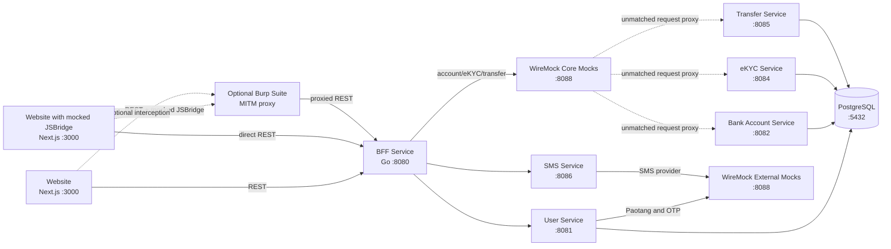
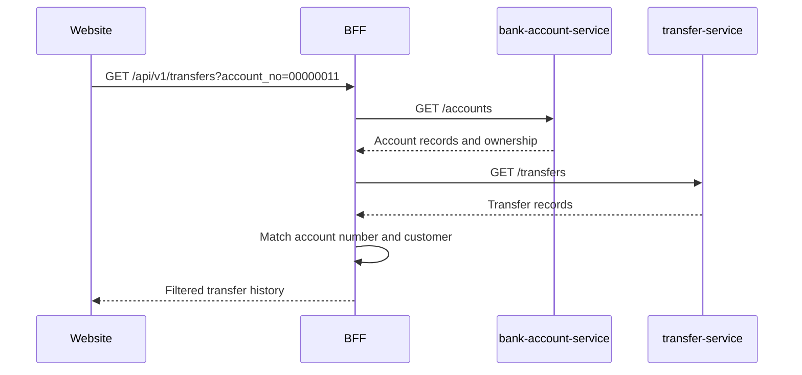

# System Architecture

## Purpose

Ultra Smoooooth Testing is a local microservices ecosystem used to demonstrate
integration testing, end-to-end testing, API inspection, and controlled external
service failures. Docker Compose runs the application, infrastructure, and
WireMock test doubles together.

## Runtime topology



All ports in the diagram are host-facing Compose ports. The website has only
one application API boundary: `bff-service`. Core services are internal and
must not be called directly by the browser. Cross-service coordination uses
the BFF and the shared database transaction used by transfers.

The two WireMock nodes are logical views of the same WireMock container: one
groups core-service mappings and the other groups external-provider mappings
for readability.

The BFF is explicitly allowed to connect to the core services. This is the
intended direction for synchronous application requests: `website → BFF → core
service`.

The core services are `user-service`, `bank-account-service`, `ekyc-service`,
`transfer-service`, and `sms-service`. `sms-service` is an internal HTTP
adapter used by the BFF to call the external SMS provider.

## Tech lead awareness

- The BFF is the only synchronous application entry point for the website.
  Clients must not call any core service directly.
- Core services own their domain behavior. The BFF orchestrates the account
  creation and SMS delivery calls synchronously.
- `sms-service` is a core adapter, not the external provider. It owns the HTTP
  integration with the configured SMS provider.
- WireMock represents external systems and test doubles only: Paotang, OTP,
  SMS, and optional BFF scenario/proxy behavior.
- `transfer-service` currently uses the shared PostgreSQL database transaction
  to lock and update account rows together with the transfer record. Any future
  database ownership split must preserve this atomicity or introduce an
  explicit distributed-transfer design.

## Components and responsibilities

| Component | Responsibility | Data or integration boundary |
| --- | --- | --- |
| `website` | Browser-facing QA application and scenario selector | Calls the configured BFF URL; defaults to `http://localhost:8080` |
| `bff-service` | Backend-for-Frontend and API orchestration layer | Routes requests, loads accounts for transfer-history filters, and filters transfer results |
| `user-service` | User profile, Paotang authentication, and OTP workflows | PostgreSQL; Paotang and OTP through WireMock |
| `bank-account-service` | Bank account operations | PostgreSQL |
| `ekyc-service` | eKYC verification requests and retrieval | PostgreSQL |
| `transfer-service` | Transfer validation, balance movement, and transfer records | PostgreSQL; updates both account balances and the transfer record in one transaction; history reads only query `transfers` |
| `sms-service` | Internal HTTP adapter that sends SMS | SMS provider through WireMock |
| PostgreSQL | Shared local database used by the persistence-backed services | Temporary container-local storage |
| WireMock | Deterministic external-provider and core-service mocks | Paotang, OTP, SMS, transfer-service, stateless labs, and stateful labs |

## Request flows

### Normal application flow

1. The website reads `/api/config` and sends API requests to the configured BFF
   endpoint.
2. The BFF translates the frontend contract into calls to the appropriate
   domain service.
3. Domain services validate and persist their own operation data in PostgreSQL.
4. The synchronous result travels back through the BFF to the browser.

The BFF is the browser integration boundary. The website must not call
`user-service`, `bank-account-service`, `ekyc-service`, `transfer-service`, or
`sms-service` directly.

### External authentication and OTP

`user-service` calls WireMock for Paotang and OTP integrations. This keeps
external behavior deterministic while allowing tests to select success,
failure, replay, and other response scenarios.

### SMS flow

The BFF creates the account through `bank-account-service`, then calls
`sms-service` directly when a phone number is present. `sms-service` calls the
mocked SMS provider in WireMock. SMS delivery failures are returned to the
caller.

### Transfer flow

The BFF sends create-transfer requests to `transfer-service`. Transfer
validation and atomic balance movement remain in the transfer service, which
locks the source and target account rows and writes the transfer record in one
PostgreSQL transaction.

For Transfer History, the BFF owns filtering. It reads accounts from
`bank-account-service`, resolves the requested customer or eight-digit account
number, fetches transfer records from `transfer-service`, and filters the
response before returning it to the website. `transfer-service` only queries
the `transfers` table for history and does not use the bank-account service's
`accounts` table for that read path. A failed validation, currency mismatch, or
insufficient balance is returned as a domain error without completing the
transfer.



## WireMock modes

WireMock has two roles in this repository:

- External-provider mock: domain services call WireMock for Paotang, OTP, and
  SMS behavior.
- Core-service mocks: the BFF sends bank-account and transfer requests to
  WireMock; WireMock
  matches `TRANSFER:*` scenarios or proxies unmatched requests to the real
  core service.

The repository separates deterministic stateless mappings from scenario-based
stateful mappings:

- `wiremock/mappings/lab-stateless` contains independent request/response
  examples.
- `wiremock/mappings/transfer-service` contains transfer-service scenarios.
- `wiremock/mappings/bank-account-service` contains bank-account-service scenarios.
- `labs/wiremock-stateful` contains request sequences whose responses depend on
  WireMock scenario state.

WireMock's administrative API and GUI are protected by the Compose-configured
basic-auth credentials. Its host port is `8088`, while the container listens on
`8080`.

## Testing architecture

| Test surface | What it exercises |
| --- | --- |
| Go service tests | Individual service handlers, domain logic, and contracts |
| Playwright integration tests | Cross-service API behavior using the test environment |
| Playwright E2E tests | Browser flows through the website and BFF boundary |
| WireMock stateless labs | Matching, templating, delays, priorities, and proxying |
| WireMock stateful labs | Replay prevention, retries, webhooks, and lifecycle transitions |
| Burp Suite lab | Inspection and controlled modification of HTTP traffic |

Playwright/Testcontainers owns test-specific database setup and service
fixtures. Compose provides the long-running local environment; database seed
mounts are not part of the Compose startup path.

## Startup and configuration

Start the complete environment with:

```bash
docker compose up --build
```

The main configuration boundaries are:

- `BFF_URL`: website runtime BFF endpoint.
- `*_SERVICE_URL`: BFF-to-domain-service endpoints.
- `PAOTANG_SERVICE_URL` and `OTP_SERVICE_URL`: mocked external-provider endpoints.
- `SMS_SERVICE_URL`: BFF-to-sms-service endpoint.
- `SMS_UPSTREAM_URL` and `SMS_API_KEY`: sms-service provider settings.
- `WIREMOCK_ADMIN_USER` and `WIREMOCK_ADMIN_PASSWORD`: WireMock admin access.

See [`README.md`](README.md), [`docs/integration.md`](docs/integration.md), and
[`docs/e2e.md`](docs/e2e.md) for operating and testing procedures.
