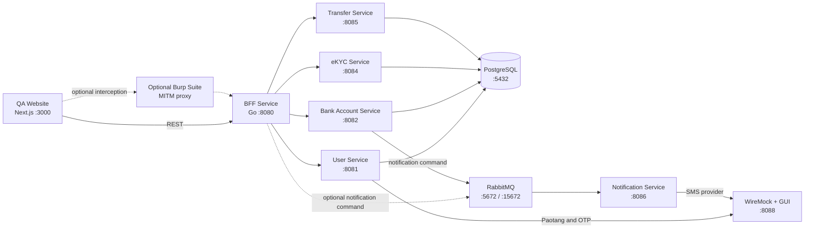

# System Architecture

## Purpose

Ultra Smoooooth Testing is a local microservices ecosystem used to demonstrate
integration testing, end-to-end testing, API inspection, and controlled external
service failures. Docker Compose runs the application, infrastructure, and
WireMock test doubles together.

## Runtime topology



All ports in the diagram are host-facing Compose ports. The website has only
one application API boundary: `bff-service`. Core services are internal and
must not be called directly by the browser. Core services also do not make
direct HTTP requests to one another; cross-service coordination uses the BFF,
the shared database transaction used by transfers, or RabbitMQ where the flow
is asynchronous.

The BFF is explicitly allowed to connect to the core services. This is the
intended direction for synchronous application requests: `website → BFF → core
service`.

The core services are `user-service`, `bank-account-service`, `ekyc-service`,
`transfer-service`, and `notification-service`. `notification-service` is an
internal core service even though it is reached asynchronously through
RabbitMQ rather than directly by the BFF.

## Tech lead awareness

- The BFF is the only synchronous application entry point for the website.
  Clients must not call any core service directly.
- Core services own their domain behavior and must not make direct HTTP calls to
  other core services. The BFF may call core services synchronously or publish
  notification commands through RabbitMQ for asynchronous delivery.
- `notification-service` is a core service, not an external provider. It owns
  notification delivery after consuming `notification.commands`.
- The current account-creation flow publishes its notification command from
  `bank-account-service`; a BFF-originated notification command follows the
  same RabbitMQ queue and consumer contract.
- WireMock represents external systems and test doubles only: Paotang, OTP,
  SMS, and optional BFF scenario/proxy behavior.
- `transfer-service` currently uses the shared PostgreSQL database transaction
  to lock and update account rows together with the transfer record. Any future
  database ownership split must preserve this atomicity or introduce an
  explicit distributed-transfer design.

## Components and responsibilities

| Component | Responsibility | Data or integration boundary |
| --- | --- | --- |
| `website` | Browser-facing QA application and scenario selector | Calls the configured BFF URL; defaults to `http://localhost:8080` |
| `bff-service` | Backend-for-Frontend and API orchestration layer | Routes user, account, eKYC, and transfer requests to domain services |
| `user-service` | User profile, Paotang authentication, and OTP workflows | PostgreSQL; Paotang and OTP through WireMock |
| `bank-account-service` | Bank account operations and notification publishing | PostgreSQL; RabbitMQ notification queue |
| `ekyc-service` | eKYC verification requests and retrieval | PostgreSQL |
| `transfer-service` | Transfer validation, balance movement, and transfer history | PostgreSQL; updates both account balances and the transfer record in one transaction |
| `notification-service` | Core service that consumes notification commands and sends SMS | RabbitMQ; SMS provider through WireMock |
| PostgreSQL | Shared local database used by the persistence-backed services | Named volume `postgres-data-v18` |
| RabbitMQ | Asynchronous notification command transport | BFF or core services may publish to `notification.commands` |
| WireMock | Deterministic external-provider mocks and optional BFF façade | Paotang, OTP, SMS, stateless labs, stateful labs, and BFF mappings |

## Request flows

### Normal application flow

1. The website reads `/api/config` and sends API requests to the configured BFF
   endpoint.
2. The BFF translates the frontend contract into calls to the appropriate
   domain service.
3. Domain services validate and persist their own operation data in PostgreSQL.
4. The synchronous result travels back through the BFF to the browser.

The BFF is the browser integration boundary. The website must not call
`user-service`, `bank-account-service`, `ekyc-service`, `transfer-service`, or
`notification-service` directly.

### External authentication and OTP

`user-service` calls WireMock for Paotang and OTP integrations. This keeps
external behavior deterministic while allowing tests to select success,
failure, replay, and other response scenarios.

### Notification flow

Account operations publish a command to RabbitMQ. `notification-service`
consumes `notification.commands` and calls the mocked SMS provider in WireMock.
This flow is asynchronous: an accepted account operation does not require the
SMS provider to complete successfully before the API response is returned.

### Transfer flow

The BFF sends transfer requests to `transfer-service`. Transfer validation and
transfer history are handled there. The transfer service locks the source and
target account rows and updates both balances together with the transfer record
in one PostgreSQL transaction; it does not call `bank-account-service` over
HTTP. A failed validation, currency mismatch, or insufficient balance is
returned as a domain error without completing the transfer.

## WireMock modes

WireMock has two roles in this repository:

- External-provider mock: domain services call WireMock for Paotang, OTP, and
  SMS behavior.
- Optional BFF façade: set `BFF_URL=http://localhost:8088` for the website.
  Scenario-specific BFF mappings are matched using the `Mock-Scenario` header;
  requests that do not match fall through to the real BFF through the proxy
  mapping.

The repository separates deterministic stateless mappings from scenario-based
stateful mappings:

- `wiremock/mappings/lab-stateless` contains independent request/response
  examples.
- `wiremock/mappings/bff` contains website and API façade scenarios.
- `labs/wiremock-stateful` contains request sequences whose responses depend on
  WireMock scenario state.

WireMock's administrative API and GUI are protected by the Compose-configured
basic-auth credentials. Its host port is `8088`, while the container listens on
`8080`.

## Testing architecture

| Test surface | What it exercises |
| --- | --- |
| Go service tests | Individual service handlers, domain logic, and contracts |
| Playwright integration tests | Cross-service API behavior using the test environment |
| Playwright E2E tests | Browser flows through the website and BFF boundary |
| WireMock stateless labs | Matching, templating, delays, priorities, and proxying |
| WireMock stateful labs | Replay prevention, retries, webhooks, and lifecycle transitions |
| Burp Suite lab | Inspection and controlled modification of HTTP traffic |

Playwright/Testcontainers owns test-specific database setup and service
fixtures. Compose provides the long-running local environment; database seed
mounts are not part of the Compose startup path.

## Startup and configuration

Start the complete environment with:

```bash
docker compose up --build
```

For a browser flow driven by WireMock BFF scenarios:

```bash
BFF_URL=http://localhost:8088 docker compose up --build
```

The main configuration boundaries are:

- `BFF_URL`: website runtime BFF endpoint.
- `*_SERVICE_URL`: BFF-to-domain-service endpoints.
- `PAOTANG_SERVICE_URL`, `OTP_SERVICE_URL`, and `SMS_SERVICE_URL`: mocked
  external-provider endpoints.
- `RABBITMQ_URL` and `NOTIFICATION_QUEUE`: notification transport settings.
- `WIREMOCK_ADMIN_USER` and `WIREMOCK_ADMIN_PASSWORD`: WireMock admin access.

See [`README.md`](README.md), [`docs/integration.md`](docs/integration.md), and
[`docs/e2e.md`](docs/e2e.md) for operating and testing procedures.
