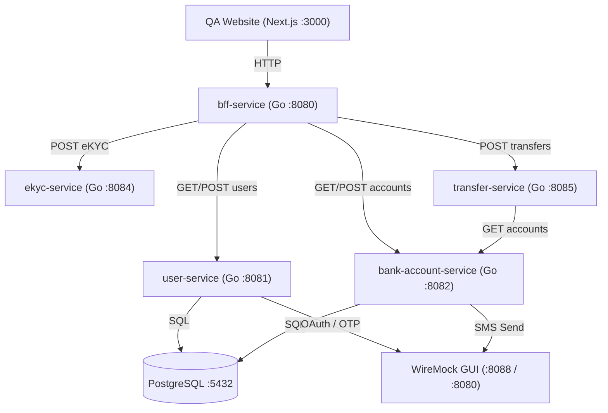

# 🧪 Microservices Integration Testing Workshop Guide

Welcome to the **Microservices Integration Testing Workshop**! This guide provides a comprehensive framework, architecture overview, setup instructions, and **10 practical thinking cases** for testing microservices in a real-world enterprise banking ecosystem.

---

## 🏗️ Ecosystem Architecture

---

## 📋 Prerequisites & Tools

| Tool | Purpose in Workshop |
| :--- | :--- |
| **Docker & Docker Compose** | Orchestrating PostgreSQL, WireMock, and microservice containers. |
| **Playwright** | Running End-to-End (E2E) browser tests and API integration test suites. |
| **Burp Suite** | **MITM Proxy**: Intercepting, inspecting, and security testing HTTP API traffic. |
| **Go (v1.26+)** | Workspace development (`go.work`) and executing unit/integration test suites. |
| **WireMock GUI** | Stubbing 3rd-party external APIs (Paotang Pass OAuth, SMS Gateway, OTP). |

---

## 🎯 10 Workshop Thinking Cases & Test Scenarios

### 📍 Category 1: Service-to-Service Workflow Integration

#### **Case 1: End-to-End Fund Transfer Execution**
- **Flow**: `Client` ➔ `BFF Service` ➔ `Transfer Service` ➔ `Bank Account Service` ➔ `PostgreSQL`
- **Challenge**: Verify that when `POST /transfers` is called, the transfer record is created, and the source account balance decreases while the target account balance increases.
- **Key Assertions**:
  - Response status: `201 Created` with `Location: /transfers/{id}` header.
  - Query `bank-account-service` before and after transfer to verify exact balance delta.

#### **Case 2: eKYC-Gated Account Opening**
- **Flow**: `Client` ➔ `BFF Service` ➔ `eKYC Service` & `User Service`
- **Challenge**: A user requests a new bank account. The system must verify eKYC status (`APPROVED`) before creating the account in `bank-account-service`.
- **Key Assertions**:
  - If eKYC is `APPROVED`: Account created successfully (`201 Created`).
  - If eKYC is `REJECTED` or missing: Account creation blocked with `400 Bad Request` or `422 Unprocessable Entity`.

---

### 📍 Category 2: Data Integrity & Database Persistence

#### **Case 3: Atomic Transaction & Rollback Validation**
- **Scenario**: Source account has 500 THB. User attempts to transfer 1,000 THB to Target account.
- **Challenge**: Ensure the database operation fails atomically. Source account balance must remain 500 THB, Target account balance must remain unchanged, and no partial transfer record is committed.
- **Key Assertions**:
  - Transfer service returns `400 Bad Request` (`INSUFFICIENT_FUNDS`).
  - Both account balances in PostgreSQL remain untouched.

#### **Case 4: Concurrent Transfers (Race Condition / Double Spend)**
- **Scenario**: User has 100 THB balance. Two transfer requests of 80 THB each arrive simultaneously.
- **Challenge**: Test database locking / optimistic concurrency control. Exactly ONE transfer must succeed (`201 Created`); the second MUST fail with insufficient balance (`400 Bad Request`).
- **Key Assertions**:
  - Total debited amount across both requests must not exceed initial balance (100 THB).
  - Remaining balance must be exactly 20 THB.

---

### 📍 Category 3: External Integrations & Stubbing (WireMock)

#### **Case 5: Outbound SMS Notification Failure (Resilience / Fail-Soft)**
- **Flow**: `Bank Account Service` ➔ `WireMock (SMS Gateway)`
- **Challenge**: Configure WireMock stub to return `503 Service Unavailable` for `POST /sms/send`. Verify that bank account creation still succeeds (`201 Created`) because SMS is an asynchronous/best-effort notification service.
- **Key Assertions**:
  - Account creation succeeds despite third-party SMS failure.
  - Error is logged silently without crashing the HTTP response.

#### **Case 6: OAuth Token Exchange (Paotang Pass)**
- **Flow**: `User Service` ➔ `WireMock (Paotang Pass OAuth)`
- **Challenge**: Test OAuth callback integration (`POST /auth/paotang/callback`) using a WireMock stub returning a mock Bearer access token.
- **Key Assertions**:
  - User Service exchanges auth code for token and logs user in successfully (`200 OK`).
  - Invalid auth code stubbed in WireMock returns `401 Unauthorized`.

---

### 📍 Category 4: Frontend & API Aggregation (BFF)

#### **Case 7: BFF Data Aggregation (User Dashboard View)**
- **Flow**: `Next.js Web Frontend` ➔ `BFF Service` ➔ (`User Service` + `Bank Account Service`)
- **Challenge**: `BFF Service` fetches user details from `user-service` and account list from `bank-account-service` concurrently, combining them into a single `UserDashboard` JSON payload.
- **Key Assertions**:
  - BFF returns aggregated response with user profile and accounts array.
  - If `bank-account-service` returns empty list `[]`, BFF still returns user profile with empty accounts list.

#### **Case 8: Strict REST Schema & Header Contract Validation**
- **Challenge**: Test that all endpoints strictly follow REST standards:
  - Resource creation returns `201 Created` with `Location` header.
  - Invalid JSON payload returns `400 Bad Request` with standard error schema: `{"error": "...", "code": "..."}`.
  - Non-existent resource returns `404 Not Found`.

---

### 📍 Category 5: Resilience, Timeouts & Fault Injection

#### **Case 9: Downstream Service Timeout (Latency Fault Injection)**
- **Challenge**: Configure WireMock or proxy delay (e.g. 10-second delay) on external dependencies. Verify that the calling microservice enforces a HTTP client timeout (e.g. 3-second timeout) and returns a clean gateway timeout response (`504 Gateway Timeout`).

#### **Case 10: Idempotent Payment Request Retries**
- **Scenario**: Client submits a transfer, but network drops before receiving HTTP response. Client retries the identical request with the same `Idempotency-Key` or transaction reference.
- **Challenge**: Verify that duplicate requests with the same idempotency key do not execute a second debit, but return the original transaction result.

---

## 🛠️ Practical Hands-on Workshop Matrix

| Exercise | Practical Activity | Primary Commands / Tools |
| :--- | :--- | :--- |
| **Ex 1** | **Build & Sync Microservices** | `make sync && make build` |
| **Ex 2** | **Run Service Unit Tests** | `make test` |
| **Ex 3** | **Spin Up Docker Ecosystem** | `docker compose up --build` |
| **Ex 4** | **Run Integration Tests** | `make test-integration` |
| **Ex 5** | **Run Playwright E2E Tests** | `make test-e2e` |
| **Ex 6** | **WireMock Fault Injection** | Open WireMock GUI at `http://localhost:8088` |
| **Ex 7** | **MITM Traffic Inspection** | Configure Burp Suite Proxy at `http://127.0.0.1:8080` |
