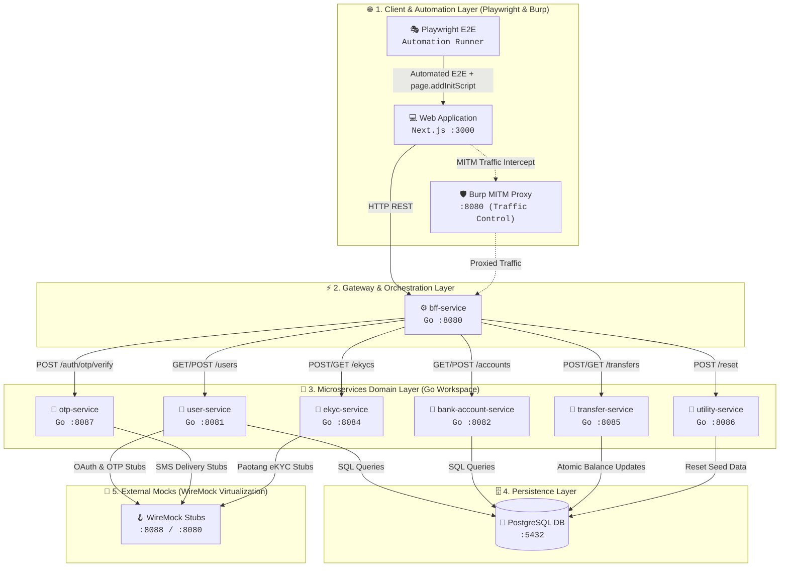

# 🧪 Microservices Integration Testing Workshop Guide

> **Mock the world. Control the chaos. Test without limits.**

Welcome to the **Microservices Integration Testing Workshop**! This guide provides a comprehensive framework, architecture overview, setup instructions, and **11 practical thinking cases with runnable verification recipes and solution keys** for testing microservices in a real-world enterprise banking ecosystem.

## Workshop Overview

This is a hands-on workshop for QA engineers, developers, SDETs, automation engineers, and tech leads to design, build, test, and debug reliable microservices through realistic banking workflows and controlled failure scenarios. Using Go, Docker Compose, WireMock, Playwright, and Burp Suite, participants connect shared requirements and risk discovery with API testing, integration testing, browser automation, service mocking, fault injection, security inspection, service-contract validation, downstream-failure testing, data-integrity checks, and end-to-end verification before production.

---

## 🏗️ Ecosystem Architecture


```mermaid
flowchart TD
    subgraph Clients["🌐 1. Client & Automation Layer (Playwright & Burp)"]
        Website["💻 Web Application<br/><code>Next.js :3000</code>"]
        Playwright["🎭 Playwright E2E<br/><code>Automation Runner</code>"]
        Burp["🛡️ Burp MITM Proxy<br/><code>:8080 (Traffic Control)</code>"]
    end

    subgraph API_Gateway["⚡ 2. Gateway & Orchestration Layer"]
        BFF["⚙️ bff-service<br/><code>Go :8080</code>"]
    end

    subgraph Core_Services["🏡 3. Microservices Domain Layer (Go Workspace)"]
        UserService["👤 user-service<br/><code>Go :8081</code>"]
        BankService["🏦 bank-account-service<br/><code>Go :8082</code>"]
        EKYCService["🪪 ekyc-service<br/><code>Go :8084</code>"]
        TransferService["💸 transfer-service<br/><code>Go :8085</code>"]
        OTPService["🔑 otp-service<br/><code>Go :8087</code>"]
        UtilityService["🧰 utility-service<br/><code>Go :8086</code>"]
    end

    subgraph Persistence["🗄️ 4. Persistence Layer"]
        DB[("🐘 PostgreSQL DB<br/><code>:5432</code>")]
    end

    subgraph External_Mocks["🤖 5. External Mocks (WireMock Virtualization)"]
        WireMock["🪝 WireMock Stubs<br/><code>:8088 / :8080</code>"]
    end

    Website -->|HTTP REST| BFF
    Playwright -->|Automated E2E + page.addInitScript| Website
    Website -.->|MITM Traffic Intercept| Burp
    Burp -.->|Proxied Traffic| BFF

    BFF -->|GET/POST /users| UserService
    BFF -->|GET/POST /accounts| BankService
    BFF -->|POST/GET /ekycs| EKYCService
    BFF -->|POST/GET /transfers| TransferService
    BFF -->|POST /auth/otp/verify| OTPService
    BFF -->|POST /reset| UtilityService

    UserService -->|SQL Queries| DB
    BankService -->|SQL Queries| DB
    TransferService -->|Atomic Balance Updates| DB
    UtilityService -->|Reset Seed Data| DB

    UserService -->|OAuth & OTP Stubs| WireMock
    OTPService -->|SMS Delivery Stubs| WireMock
    EKYCService -->|Paotang eKYC Stubs| WireMock
```

---

## 📋 Prerequisites & Tools

| Tool | Purpose in Workshop |
| :--- | :--- |
| **Docker & Docker Compose** | Orchestrating PostgreSQL, WireMock, and microservice containers. |
| **Playwright** | Running End-to-End (E2E) browser tests and API integration test suites. |
| **Burp Suite** | **MITM Proxy**: Intercepting, inspecting, and security testing HTTP API traffic. |
| **Go (v1.25+)** | Workspace development (`go.work`) and executing unit/integration test suites. |
| **WireMock GUI** | Stubbing 3rd-party external APIs (Paotang Pass OAuth, SMS Gateway, OTP) at `http://localhost:8088/__admin/webapp`. |

### 🌐 Quick Access URLs

| Service / Interface | Local URL | Notes / Credentials |
| :--- | :--- | :--- |
| 💻 **Website** | [http://localhost:3000](http://localhost:3000) | QA Application (Default user: Narin `+66800000001`) |
| 🪝 **WireMock Web UI** | [http://localhost:8088/__admin/webapp](http://localhost:8088/__admin/webapp) | Interactive Stub & Scenario Dashboard (`admin` / `password`) |
| ⚙️ **BFF Service** | [http://localhost:8080](http://localhost:8080) | Backend-for-Frontend API Gateway |
| 🗺️ **Architecture Diagram** | [http://localhost:3031](http://localhost:3031) | Interactive diagram (`make diagram`) |
| 📊 **Slidev Presentation** | [http://localhost:3030](http://localhost:3030) | Workshop slide deck (`make slides`) |

---

## 🎯 11 Workshop Thinking Cases & Test Scenarios

### 📍 Category 1: Service-to-Service Workflow Integration

#### **Case 1: End-to-End Fund Transfer Execution**

- **Flow**: `Client` ➔ `BFF Service` ➔ `Transfer Service` ➔ `Bank Account Service` ➔ `PostgreSQL`
- **Challenge**: Verify that when `POST /transfers` is called, the transfer record is created, and the source account balance decreases while the target account balance increases.
- **Runnable Verification**:
  ```bash
  # Trigger Transfer via BFF
  curl -i -X POST http://localhost:8080/api/v1/transfers \
    -H "Content-Type: application/json" \
    -d '{"source_account_id":"00000000-0000-0000-0000-000000000011","target_account_id":"00000000-0000-0000-0000-000000000012","amount":100}'
  ```
- **Key Assertions & Solution Key**:
  - Response status: `201 Created` with `Location: /transfers/{id}` header.
  - Query accounts: Source balance decreases by 100, Target increases by 100.
  - Verified in `tests/specs/integration/bff.spec.ts`.

#### **Case 2: eKYC-Gated Account Opening**

- **Flow**: `Client` ➔ `BFF Service` ➔ `eKYC Service` & `User Service`
- **Challenge**: A user requests a new bank account. The system must verify eKYC status (`APPROVED`) before creating the account in `bank-account-service`.
- **Runnable Verification**:
  ```bash
  # Submit eKYC verification
  curl -i -X POST http://localhost:8080/api/v1/ekycs/verify \
    -H "Content-Type: application/json" \
    -d '{"customer_id":"00000000-0000-0000-0000-000000000001","national_id":"1101700000001","full_name":"Narin Chaiyasit","document_type":"national_id"}'
  ```
- **Key Assertions & Solution Key**:
  - If eKYC is `APPROVED`: Account creation succeeds (`201 Created`).
  - If eKYC is `REJECTED` or missing: Blocked with `400 Bad Request`.

---

### 📍 Category 2: Data Integrity & Database Persistence

#### **Case 3: Atomic Transaction & Rollback Validation**

- **Scenario**: Source account has 500 THB. User attempts to transfer 1,000 THB to Target account.
- **Challenge**: Ensure the database operation fails atomically. Source account balance must remain 500 THB, Target account balance must remain unchanged, and no partial transfer record is committed.
- **Runnable Verification**:
  ```bash
  curl -i -X POST http://localhost:8080/api/v1/transfers \
    -H "Content-Type: application/json" \
    -d '{"source_account_id":"00000000-0000-0000-0000-000000000011","target_account_id":"00000000-0000-0000-0000-000000000012","amount":999999}'
  ```
- **Key Assertions & Solution Key**:
  - Returns `400 Bad Request` with `{"error":"insufficient funds","code":"INSUFFICIENT_FUNDS"}`.
  - PostgreSQL transaction is rolled back completely.

#### **Case 4: Concurrent Transfers (Race Condition / Double Spend)**

- **Scenario**: User has 100 THB balance. Two transfer requests of 80 THB each arrive simultaneously.
- **Challenge**: Test database locking / concurrency control. Exactly ONE transfer must succeed (`201 Created`); the second MUST fail with insufficient balance (`400 Bad Request`).
- **Solution Key**:
  - In `services/transfer-service/repository.go`, `executeMoneyTransfer` utilizes `SELECT ... FOR UPDATE` with ordered account IDs to serialize balance deductions safely.

---

### 📍 Category 3: External Integrations & Stubbing (WireMock)

#### **Case 5: OTP SMS Delivery Failure**

- **Flow**: `BFF Service` ➔ `OTP Service` ➔ `WireMock (SMS Provider)`
- **Challenge**: Configure the SMS provider stub or header to simulate provider downtime.
- **Runnable Verification**:
  ```bash
  curl -i -X POST http://localhost:8080/api/v1/accounts \
    -H "Content-Type: application/json" \
    -H "Mock-Scenario: SMS:FAIL" \
    -d '{"user_id":"00000000-0000-0000-0000-000000000001","balance":500,"phone":"+66800000001"}'
  ```
- **Key Assertions & Solution Key**:
  - BFF catches downstream SMS provider error and returns `502 Bad Gateway` with clear error details.

#### **Case 6: OAuth Token Exchange (Paotang Pass)**

- **Flow**: `User Service` ➔ `WireMock (Paotang Pass OAuth)`
- **Challenge**: Test OAuth callback integration (`POST /auth/paotang/callback`) using a WireMock stub returning a mock Bearer access token.
- **Runnable Verification**:
  ```bash
  curl -i -X POST http://localhost:8080/auth/paotang/callback \
    -H "Content-Type: application/json" \
    -d '{"code":"valid-paotang-auth-code"}'
  ```
- **Key Assertions & Solution Key**:
  - User Service exchanges auth code for token (`200 OK` with `access_token`).

#### **Case 6B: Payment Webhook Idempotency**

- **Flow**: `Payment Provider` ➔ `WireMock payment webhook stub`
- **Challenge**: Deliver a successful payment webhook, then replay the same event and verify duplicate delivery is rejected.
- **Solution Key**:
  - Check `labs/wiremock-stateful/payment-webhook-idempotency` for stateful scenario definitions.

---

### 📍 Category 4: Frontend & API Aggregation (BFF)

#### **Case 7: BFF Data Aggregation (User Dashboard View)**

- **Flow**: `Next.js Web Frontend` ➔ `BFF Service` ➔ (`User Service` + `Bank Account Service`)
- **Challenge**: `BFF Service` fetches user details from `user-service` and account list from `bank-account-service` sequentially, combining them into a single `UserDetail` JSON payload.
- **Runnable Verification**:
  ```bash
  curl -i http://localhost:8080/api/v1/users/00000000-0000-0000-0000-000000000001
  ```

#### **Case 8: Strict REST Schema & Header Contract Validation**

- **Challenge**: Test that all endpoints strictly follow REST standards:
  - Resource creation returns `201 Created` with `Location` header.
  - Invalid JSON payload returns `400 Bad Request` with standard error schema: `{"error": "...", "code": "..."}`.
  - Non-existent resource returns `404 Not Found`.

---

### 📍 Category 5: Resilience, Timeouts & Fault Injection

#### **Case 9: Downstream Service Timeout (Latency Fault Injection)**

- **Challenge**: Configure WireMock delay on external dependencies and verify microservice client timeouts.
- **Solution Key**:
  - See `labs/wiremock-stateless/08-delayed-response.http` and `labs/wiremock-stateless/09-random-delay.http`.

#### **Case 10: Idempotent Payment Request Retries**

- **Scenario**: Client submits a transfer, but network drops before receiving HTTP response. Client retries the identical request with the same `Idempotency-Key` or transaction reference.
- **Solution Key**:
  - Handled via `labs/wiremock-stateful/retry-recovery-flow`.

---

### 📍 Category 6: Mobile Web Hybrid & Native Bridge Testing

#### **Case 11: Mobile WebView JSBridge Native Feature Mocking via Playwright**

- **Flow**: `Playwright / E2E Runner (page.addInitScript)` ➔ `Web Application (window.JSBridge injected)` ➔ `BFF Service`
- **Challenge**: Simulate a hybrid mobile app container in web browsers using `page.addInitScript`.
- **Solution Key**:
  - Implemented in `tests/specs/e2e/website.spec.ts`.

---

## 🛠️ Practical Hands-on Workshop Matrix

| Exercise | Practical Activity | Primary Commands / Tools |
| :--- | :--- | :--- |
| **Ex 1** | **Build & Sync Microservices** | `make sync && make build` |
| **Ex 2** | **Run Service Unit Tests & Lint** | `make check` |
| **Ex 3** | **Spin Up Docker Ecosystem** | `make setup` |
| **Ex 4** | **Run Integration Tests** | `make test-integration` |
| **Ex 5** | **Run Playwright E2E Tests** | `make test-e2e` |
| **Ex 6** | **WireMock Fault Injection** | Open WireMock GUI at `http://localhost:8088/__admin/webapp` |
| **Ex 7** | **MITM Traffic Inspection** | Configure Burp Suite Proxy at `http://127.0.0.1:8080` |
| **Ex 8** | **Present Workshop Slides** | `make slides` |
