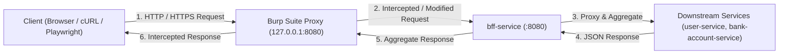

# 🧪 Lab: Burp Suite MITM Proxy & API Security Inspection

Welcome to the **Burp Suite MITM Proxy & API Security Inspection Lab**! This lab provides a hands-on guide for intercepting, inspecting, modifying, and security-testing HTTP/HTTPS API traffic in a microservices ecosystem using **Burp Suite**.

---

## 🎯 Purpose & Objectives

In modern microservices development and QA testing, an intercepting Man-In-The-Middle (MITM) proxy allows engineers to:

1. **Inspect Raw HTTP Traffic**: View unencrypted headers, query strings, and payloads exchanged between clients (Web Frontend, Mobile Apps, or cURL) and backend services.
2. **Intercept & Tamper Requests**: Modify request headers, parameters, or payloads on-the-fly before they reach the `bff-service` or downstream microservices.
3. **Inject Mock & Test Headers**: Inject headers like `Mock-Scenario: PT_PASS:SUCCESS_ONCE` or `Use-Mock: true` into live traffic to trigger specific WireMock stubs without code changes.
4. **Manual Boundary & Security Testing**: Replay API requests via **Burp Repeater** to validate error handling, input validation (`400 Bad Request`), and REST contracts.

---

## 🏗️ Proxy Traffic Topology



---

## 🛠️ Step 1: Burp Suite Setup & Proxy Listener Configuration

### 1. Launch Burp Suite

Open **Burp Suite Community Edition** (or Professional) and select **Temporary Project** ➔ **Use Burp Defaults**.

### 2. Verify Proxy Listener

1. Go to **Proxy** ➔ **Proxy settings** (or **Options**).
2. Under **Proxy Listeners**, verify that a listener is running on `127.0.0.1:8080` with the `Running` checkbox enabled.

### 3. Install Burp CA Certificate (for HTTPS Inspection)

1. Configure your browser or system proxy to `127.0.0.1:8080`.
2. Visit `http://burpsuite` in your browser and click **CA Certificate** to download `cacert.der`.
3. Import `cacert.der` into your browser's Trusted Root Certification Authorities.

---

## 📚 Practical Hands-on Exercises

### 📍 Exercise 1: Request Interception & Parameter Tampering

**Goal**: Intercept a user creation request to `bff-service`, tamper with the request payload before it hits the backend, and observe the saved state.

1. Ensure the ecosystem is running (`docker compose up --build`).
2. In Burp Suite, go to **Proxy** ➔ **Intercept** and turn **Intercept is ON**.
3. Send a user creation request via `cURL` using Burp Proxy:

   ```bash
   curl -x http://127.0.0.1:8080 -X POST http://localhost:8080/api/v1/users \
     -H "Content-Type: application/json" \
     -d '{"name": "Original Name", "email": "original@example.com", "phone": "+66800000001"}'
   ```

4. Burp will pause the request. In the **Intercept** tab:
   - Change `"name": "Original Name"` ➔ `"name": "Tampered Name via Burp"`.
5. Click **Forward**.
6. **Assertion**: Verify that the returned response contains `"name": "Tampered Name via Burp"`.

---

### 📍 Exercise 2: Header Injection for WireMock Scenario Simulation

**Goal**: Inject `Mock-Scenario` headers into live traffic through Burp to trigger specific WireMock stub behaviors (e.g. testing Paotang OAuth or OTP verification).

1. In Burp Suite **Proxy** ➔ **Intercept**, ensure **Intercept is ON**.
2. Send an OTP verification request to `bff-service`:

   ```bash
   curl -x http://127.0.0.1:8080 -X POST http://localhost:8080/auth/otp/verify \
     -H "Content-Type: application/json" \
     -d '{"phone": "+66800000001", "code": "123456"}'
   ```

3. In the intercepted request in Burp, add the following header:

   ```http
   Mock-Scenario: OTP:SUCCESS
   ```

4. Click **Forward**.
5. **Assertion**: Observe response returns `200 OK` (`{"verified": true}`).
6. Repeat the test, but change the header in Burp to:

   ```http
   Mock-Scenario: OTP:INVALID
   ```

7. Click **Forward**.
8. **Assertion**: Observe response returns `400 Bad Request` (`{"error": "invalid_otp"}`).

---

### 📍 Exercise 3: Manual API Security Testing with Burp Repeater

**Goal**: Use **Burp Repeater** to isolate requests and perform rapid boundary testing without re-typing cURL commands.

1. In Burp **Proxy** ➔ **HTTP history**, right-click any `POST /api/v1/users` request and select **Send to Repeater** (or press `Cmd+R` / `Ctrl+R`).
2. Switch to the **Repeater** tab.
3. Test **Validation Failure** (Missing required `phone` field):
   - Remove `"phone": "+66800000001"` from the JSON body.
   - Click **Send**.
   - **Expected Result**: `400 Bad Request` with `{"error": "phone is required"}`.
4. Test **Malformed JSON Payload**:
   - Change body to `{ invalid json syntax`.
   - Click **Send**.
   - **Expected Result**: `400 Bad Request`.
5. Test **SQL Injection Prevention**:
   - Set `"name": "Alice'; DROP TABLE users; --"`.
   - Click **Send**.
   - **Expected Result**: User created cleanly with name literal `Alice'; DROP TABLE users; --` because Go's `pgx` library uses parameterized queries.

---

### 📍 Exercise 4: Automated Match & Replace Rules

**Goal**: Automate header injection so all outgoing requests passing through Burp automatically have mock testing headers appended.

1. Go to **Proxy** ➔ **Proxy settings** ➔ **Match and replace rules**.
2. Click **Add**.
3. Configure the rule:
   - **Type**: `Request header`
   - **Match**: *(leave blank)*
   - **Replace**: `Mock-Scenario: PT_PASS:SUCCESS_ONCE`
   - **Comment**: `Inject Paotang Mock Scenario`
4. Click **OK** and check the enabled box.
5. Any request sent through `http://127.0.0.1:8080` will now automatically have `Mock-Scenario: PT_PASS:SUCCESS_ONCE` injected.

---

## 🛠️ Verification Script

Run the included verification script to check proxy connectivity and BFF endpoint reachability:

```bash
# Make executable and run
chmod +x labs/burp-suite/verify-proxy.sh
./labs/burp-suite/verify-proxy.sh
```

---

## 📂 Lab Files Directory

```
labs/burp-suite/
├── README.md                         # This lab guide
├── burp-config-example.json          # Example Burp Suite configuration settings
└── verify-proxy.sh                   # Helper script to test proxy connectivity
```
