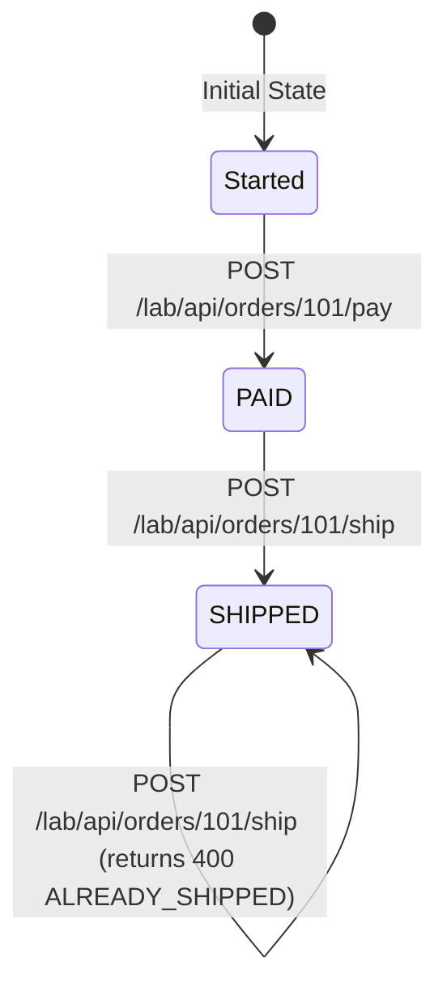
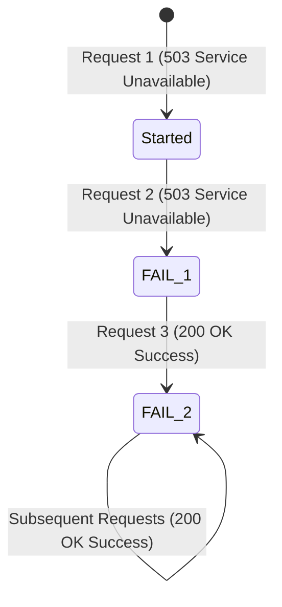

# 🧪 Lab: Stateful Stubbing & Scenario State Machines with WireMock

Welcome to the **WireMock Stateful Stubbing Lab**! This lab provides a hands-on guide and runnable test suite for learning how to build and test stateful mocks, state transitions, and finite state machines using **WireMock Scenarios**.

---

## 🎯 Purpose & Objectives

In microservices architecture, third-party APIs and downstream services are rarely stateless. Common real-world scenarios include:

1. **One-Time Operations**: OAuth authorization code exchange, OTP code validation, or single-use tokens (replay attack prevention).
2. **Multi-Step State Machines**: Order checkout flows (`PENDING` ➔ `PAID` ➔ `SHIPPED`), user onboarding, or eKYC verification pipelines.
3. **Transient Failure & Self-Healing Retries**: API endpoints that fail initially (e.g. returning `503 Service Unavailable`) and recover on subsequent retries.

WireMock's **Scenarios** feature lets you turn simple HTTP stubs into stateful finite state machines.

---

## 🧭 How to Learn with This Lab

1. Start WireMock with `docker compose up --build wiremock`.
2. Reset scenarios before each flow with `POST /__admin/scenarios/reset`.
3. Open the numbered `.http` file for the mapping you want to run with the VS Code REST Client extension. Each file resets state and includes the setup requests required to reach its target state.
4. Inspect each mapping’s `scenarioName`, required state, and next state while comparing the cURL responses.

Each stateful scenario folder contains one `00-scenario-state.http` helper and one REST Client file per numbered mapping. Use its **Reset** request before replaying a flow, or its **Inspect** request to read the current state.

## 🔑 Core Concepts of WireMock Scenarios

WireMock manages state using three primary fields in your mapping JSON definitions:

| Field | Required? | Description |
| :--- | :--- | :--- |
| `scenarioName` | **Yes** | The identifier grouping a set of stub mappings into a single state machine. |
| `requiredScenarioState` | **Yes** | The state required for this stub mapping to match. Initial default state is `"Started"`. |
| `newScenarioState` | *Optional* | The new state to transition the scenario into after this stub matches. |

### Mapping Folder and Display Convention

Stateful mappings are physically grouped by scenario under `wiremock/mappings/lab-stateful/`. Mapping names use numeric prefixes such as `1.`, `2.`, and `3.` so the steps are easy to read in the GUI. The `holomekc/wiremock-gui` does not guarantee mapping sort order, so these folders and prefixes are visual organization only; scenario state and matching behavior still come from the WireMock fields above.

### Resetting Scenario States Between Tests

To ensure test independence and prevent state leak across test cases, issue a `POST` request to the WireMock Admin API (`POST /__admin/scenarios/reset`) in your test suite's `afterEach` hook:

```typescript
test.afterEach(async ({ request }: { request: APIRequestContext }) => {
  // Reset all WireMock scenario state machines back to 'Started' after each test
  await request.post(`${wiremockUrl}/__admin/scenarios/reset`);
});
```

---

## 📚 Lab Scenarios Overview

### Scenario 1: One-Time Token Exchange (Replay Attack Prevention)

- **Endpoint**: `POST /lab/api/oauth/token`
- **Initial State (`Started`)**: Returns `200 OK` with Bearer access token and transitions state to `TOKEN_ISSUED`.
- **Next State (`TOKEN_ISSUED`)**: Repeated calls return `400 Bad Request` (`invalid_grant`) because the code has already been consumed.

---

### Scenario 2: Order Fulfillment Lifecycle State Machine



1. `GET /lab/api/orders/101` in state `Started` ➔ Returns `200 OK` (`status: PENDING`).
2. `POST /lab/api/orders/101/pay` in state `Started` ➔ Returns `200 OK`, transitions state to `PAID`.
3. `GET /lab/api/orders/101` in state `PAID` ➔ Returns `200 OK` (`status: PAID`).
4. `POST /lab/api/orders/101/ship` in state `PAID` ➔ Returns `200 OK`, transitions state to `SHIPPED`.
5. `GET /lab/api/orders/101` in state `SHIPPED` ➔ Returns `200 OK` (`status: SHIPPED`).
6. `POST /lab/api/orders/101/ship` in state `SHIPPED` ➔ Returns `400 Bad Request` (`ALREADY_SHIPPED`).

---

### Scenario 3: Transient Failure & Self-Healing Retry Flow



1. **Attempt 1** (`Started`) ➔ Returns `503 Service Unavailable`, transitions to `FAIL_1`.
2. **Attempt 2** (`FAIL_1`) ➔ Returns `503 Service Unavailable`, transitions to `FAIL_2`.
3. **Attempt 3** (`FAIL_2`) ➔ Returns `200 OK` (`status: SUCCESS`, "Service recovered on attempt 3").

---

### Scenario 4: Payment Webhook Idempotency

- **Endpoint**: `POST /lab/api/payments/{payment_id}/webhook`
- **Initial State (`Started`)**: A `payment.succeeded` webhook returns `202 Accepted` and transitions to `WEBHOOK_PROCESSED`.
- **Next State (`WEBHOOK_PROCESSED`)**: Replaying the same webhook returns `409 Conflict` (`DUPLICATE_WEBHOOK`).
- **Dynamic fields**: The response echoes `{payment_id}` from the URL and `event_id` from the webhook body.
- **Serve event listener**: The accepted webhook triggers an internal callback to `POST /lab/api/payment-events` with templated payment and event IDs.

---

## 🚀 Running the Lab

### 1. Automated Execution (Playwright & Testcontainers)

Run the automated lab test suite using npm or Makefile:

```bash
# Using npm from tests directory
cd tests
npm run test:lab

# Or using Makefile from workspace root
make test-lab
```

### 2. Manual Testing (cURL / WireMock GUI)

1. Start the Docker ecosystem:

   ```bash
   docker compose up --build wiremock
   ```

2. Test Scenario 1 (Auth Token Exchange):

   ```bash
   # First request (Success 200)
   curl -X POST http://localhost:8088/lab/api/oauth/token -d "grant_type=authorization_code"

   # Second request (Replay Rejected 400)
   curl -X POST http://localhost:8088/lab/api/oauth/token -d "grant_type=authorization_code"
   ```

3. Reset Scenarios via Admin API:

   ```bash
   curl -X POST http://localhost:8088/__admin/scenarios/reset
   ```

---

## 📂 File Structure

```
labs/wiremock-stateful/
├── README.md                         # This lab guide
├── auth-token-replay-prevention/
│   ├── 00-scenario-state.http        # Reset and inspect auth scenario
│   ├── 01-auth-token-once.http       # Mapping 01: token succeeds once
│   └── 02-auth-token-replay.http     # Mapping 02: replay rejected
├── order-fulfillment-lifecycle/
│   ├── 00-scenario-state.http        # Reset and inspect order scenario
│   ├── 01-order-get-pending.http     # Mapping 01: PENDING order
│   ├── 02-order-pay.http              # Mapping 02: pay order
│   ├── 03-order-get-paid.http         # Mapping 03: PAID order
│   ├── 04-order-ship.http             # Mapping 04: ship order
│   ├── 05-order-get-shipped.http      # Mapping 05: SHIPPED order
│   └── 06-order-ship-invalid.http     # Mapping 06: duplicate ship rejected
├── retry-recovery-flow/
│   ├── 00-scenario-state.http         # Reset and inspect retry scenario
│   ├── 01-retry-fail-1.http           # Mapping 01: first failure
│   ├── 02-retry-fail-2.http           # Mapping 02: second failure
│   └── 03-retry-success.http          # Mapping 03: recovery
└── payment-webhook-idempotency/
    ├── 00-scenario-state.http        # Reset and inspect webhook scenario
    ├── 01-payment-webhook-success.http # Mapping 01: webhook accepted
    ├── 02-payment-webhook-replay.http  # Mapping 02: duplicate rejected
    └── 03-payment-event-receiver.http  # Mapping 03: callback receiver

wiremock/mappings/lab-stateful/
├── auth-token-replay-prevention/
│   ├── 01-auth-token-once.json       # Auth code exchange success (Started -> TOKEN_ISSUED)
│   └── 02-auth-token-replay.json     # Auth code exchange replay rejection (TOKEN_ISSUED -> 400)
├── order-fulfillment-lifecycle/
│   ├── 01-order-get-pending.json     # GET order when PENDING (Started)
│   ├── 02-order-pay.json             # Pay order (Started -> PAID)
│   ├── 03-order-get-paid.json        # GET order when PAID
│   ├── 04-order-ship.json            # Ship order (PAID -> SHIPPED)
│   ├── 05-order-get-shipped.json     # GET order when SHIPPED
│   └── 06-order-ship-invalid.json    # Ship order rejected when ALREADY_SHIPPED
├── retry-recovery-flow/
│   ├── 01-retry-fail-1.json          # 1st attempt failure (Started -> FAIL_1)
│   ├── 02-retry-fail-2.json          # 2nd attempt failure (FAIL_1 -> FAIL_2)
│   └── 03-retry-success.json         # 3rd attempt success (FAIL_2 -> 200)
└── payment-webhook-idempotency/
    ├── 01-payment-webhook-success.json # Payment webhook accepted (Started -> WEBHOOK_PROCESSED)
    ├── 02-payment-webhook-replay.json  # Duplicate webhook rejected (WEBHOOK_PROCESSED -> 409)
    └── 03-payment-event-receiver.json  # Callback receiver for serveEventListeners

tests/specs/labs/
└── wiremock-stateful.spec.ts         # Playwright test suite validating stateful stubs
```
