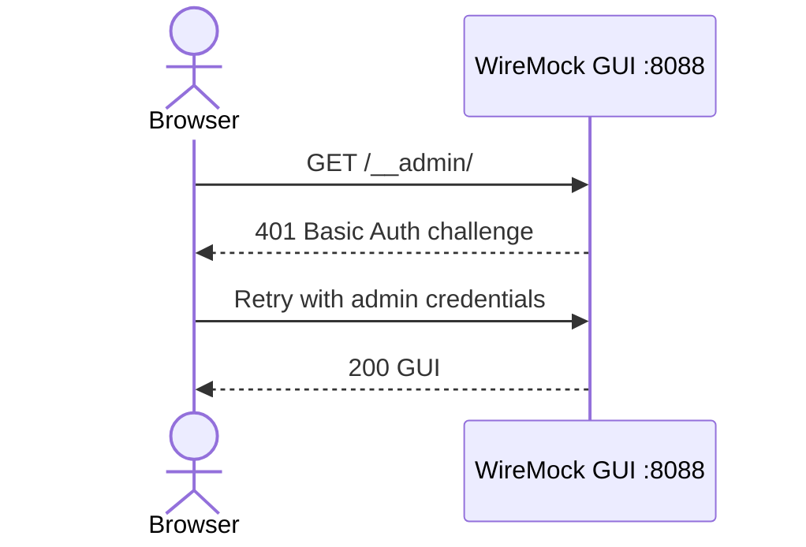

# 🖥️ WireMock Web UI & GUI Management Guide

Welcome to the **WireMock Web UI Guide**! This document explains how to view, search, inspect, create, and manage WireMock stubs interactively using the built-in Web GUI interface.

---

## 🎯 Purpose & Capabilities

The **WireMock Web UI** (`holomekc/wiremock-gui`) provides a web-based dashboard at `http://localhost:8088/__admin/webapp`.

Key Features:

1. **Interactive Stub Management**: View, search, edit, create, and delete HTTP stubs visually without manually writing JSON files.
2. **Request Log Inspection**: View real-time incoming HTTP request logs, matched stubs, unmatched requests, and exact payload diffs.
3. **Scenario State Visualization**: Inspect current state machine states for stateful stubs (`Started`, `TOKEN_ISSUED`, `PAID`, `SHIPPED`).
4. **One-Click Scenario Reset**: Reset all scenario state machines back to `Started` with a single click.

## 🧭 How to Learn with This Lab

1. Start the UI with `docker compose up -d wiremock`.
2. Sign in at `http://localhost:8088/__admin/webapp`.
3. Browse mappings, test a stub, inspect matched and unmatched requests, and reset scenarios.
4. Open `labs/wiremock-ui/requests.http` with the VS Code REST Client extension and send the Admin API examples.

The lab’s REST Client examples are kept in one file: [`requests.http`](./requests.http).

---

## 🚀 Accessing the WireMock Web UI

1. Ensure the ecosystem or WireMock container is running:

   ```bash
   docker compose up -d wiremock
   ```

2. Open your web browser and navigate to:

   ```
   http://localhost:8088/__admin/webapp
   ```

Default Basic Auth:

```text
Username: admin
Password: password
```

Override credentials before startup:

```bash
WIREMOCK_ADMIN_USER=admin \
WIREMOCK_ADMIN_PASSWORD='replace-this-password' \
docker compose up -d wiremock
```

## 🛠️ How to Use the WireMock UI

### 1. Sign in

Open `http://localhost:8088/__admin/webapp` and sign in with the configured Basic Auth credentials.

The UI is an admin surface. Mock endpoints such as `/lab/api/...` do not use these admin credentials.

### 2. Browse stub mappings

Open the **Mappings** view to:

- Browse stateless and stateful mappings.
- Open scenario folders such as `order-fulfillment-lifecycle`.
- Search by URL, method, or scenario name.
- Open a mapping to inspect its request matchers and response.

Stateful mappings use physical folders and numeric names such as `1.`, `2.`, and `3.` for visual organization. The GUI does not guarantee display sorting, so these prefixes do not control execution order.

### 3. Create or edit a mapping

Use **New Mapping** to create a stub, or open an existing mapping and choose **Edit**. Configure the request matcher, response status, headers, body, query parameters, and scenario fields as needed.

Use the mapping's **Test** action to send a request from the UI and confirm which response is returned.

After changing a mapping, click **Persist** or **Save** so the change is written to the mounted `wiremock/mappings` directory and survives a container restart.

### 4. Reload mappings from files

When mappings are changed outside the UI, reload them through the Admin API:

```bash
curl -u admin:password -X POST \
  http://localhost:8088/__admin/mappings/reset
```

This reloads the mappings from the mounted files. Refresh the browser afterward.

### 5. Inspect requests

Use **Matched** to inspect requests handled by a stub. Use **Unmatched** to find requests that returned `404` and compare their method, URL, headers, query parameters, and body with the mapping matchers.

### 6. Reset stateful scenarios

Open **StateMachine** and use **Reset All Scenarios**, or run:

```bash
curl -u admin:password -X POST \
  http://localhost:8088/__admin/scenarios/reset
```

Scenario reset changes runtime state only; it does not delete mapping files.

## 🧭 Lab Auth Sequence



Mock APIs remain separate from Admin API auth:

```bash
curl http://localhost:8088/lab/api/stateless/echo/item-1
```

Admin API requires credentials:

```bash
curl -u admin:password \
  http://localhost:8088/__admin/mappings
```

---

## 📚 Key Sections in the Web UI

### 1. 🔍 Stub Mappings Dashboard

- View all active JSON stub mappings (stateless & stateful).
- Filter stubs by URL path, HTTP method (`GET`, `POST`, `PATCH`, `DELETE`), or scenario name.
- Click any stub to inspect matching patterns (Headers, Query Params, JSONPath body expressions, and Handlebars response templates).

### 2. 📊 Request Log Journal

- View real-time audit logs of every HTTP request sent to WireMock by `user-service`, `bank-account-service`, or `bff-service`.
- Identify unmatched requests (`404 Not Found`) and view payload diffs to debug test failures quickly.

### 3. 🔄 Scenario State Manager

- View active WireMock scenario state machines.
- Monitor current states (e.g. `order-fulfillment-lifecycle` current state: `PAID`).
- Click **Reset All Scenarios** to restore states to `Started`.

---

## 📂 Related Resources

The lab walkthrough is kept in [`requests.http`](./requests.http).

- 🎓 **[WireMock Stateful Stubbing Guide](../wiremock-stateful/README.md)**
- 🎓 **[WireMock Stateless Stubbing Guide](../wiremock-stateless/README.md)**
- 🎓 **[Burp Suite MITM Proxy Guide](../burp-suite/README.md)**
