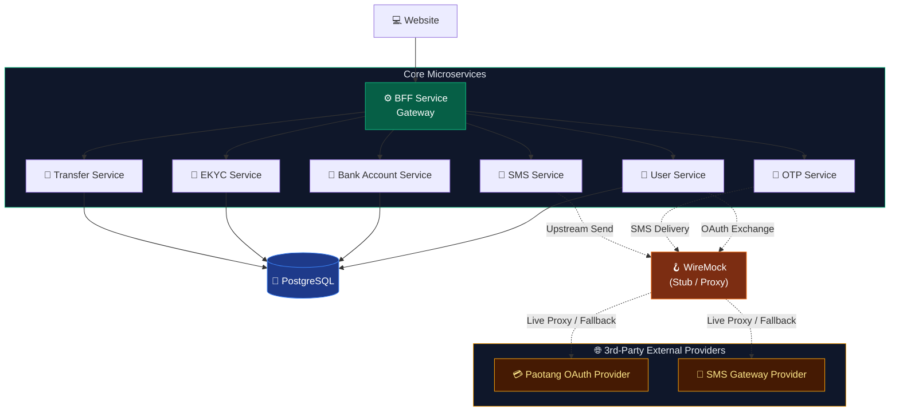
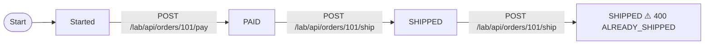

<div class="cover-slide">

<div class="cover-decor-container">
  
</div>

# Ultra Smoooooth Testing

<div class="cover-subtitle">Mock the world. Control the chaos. Test without limits.</div>

<div class="cover-tags">
  <span class="cover-tag">⚙️ Go Workspaces</span>
  <span class="cover-tag">🪝 WireMock</span>
  <span class="cover-tag">🛡️ Burp Suite</span>
  <span class="cover-tag">🎭 Playwright</span>
  <span class="cover-tag">🐳 Testcontainers</span>
</div>

</div>

---
transition: slide-left
---

# 🎯 Testing Strategy & Core Pillars

<div class="subtitle-badge mb-4 text-emerald-400 font-semibold text-center text-lg">Mock the world. Control the chaos. Test without limits.</div>

<div class="grid grid-cols-3 gap-4 my-auto py-2">

<div class="slide-card">
  <h3 class="text-emerald-400 font-bold mb-2">🌐 1. Mock the World</h3>
  <p class="text-sm text-slate-300 mb-3">Virtualize all third-party integrations with WireMock stateful stubs.</p>
  <ul class="text-xs text-slate-300 space-y-1.5">
    <li>• OAuth2 & OTP Verification</li>
    <li>• Paotang Pass Identity API</li>
    <li>• SMS Gateway Delivery Stubs</li>
    <li>• Deterministic Mock Scenarios</li>
  </ul>
</div>

<div class="slide-card">
  <h3 class="text-emerald-400 font-bold mb-2">⚡ 2. Control the Chaos</h3>
  <p class="text-sm text-slate-300 mb-3">Intercept traffic & inject real-world network edge cases with Burp Suite.</p>
  <ul class="text-xs text-slate-300 space-y-1.5">
    <li>• MITM HTTP Traffic Interception</li>
    <li>• Response Tampering & Faults</li>
    <li>• Rate Limiting & Latency Testing</li>
    <li>• Security Boundary Validation</li>
  </ul>
</div>

<div class="slide-card">
  <h3 class="text-emerald-400 font-bold mb-2">🚀 3. Test Without Limits</h3>
  <p class="text-sm text-slate-300 mb-3">Execute integration & E2E suites with zero rate limits or sandbox downtime.</p>
  <ul class="text-xs text-slate-300 space-y-1.5">
    <li>• Playwright E2E Automation</li>
    <li>• Go Workspace (`go.work`) Testing</li>
    <li>• Docker Compose Environment</li>
    <li>• CI/CD Regression Safeguards</li>
  </ul>
</div>

</div>

---
transition: fade-out
---

# 🏗️ Ecosystem System Architecture

<div class="adorable-arch-container my-auto">
  
</div>

---
transition: slide-left
---

# 🗺️ Detailed Service Topology & Flow

```mermaid {scale: 0.62}
flowchart LR
    subgraph Clients["🌐 1. Client & Automation Layer (Test Without Limits)"]
        Website["💻 Website<br/>:3000"]
        BridgeWebsite["📱 Mobile WebView<br/>JSBridge"]
        Playwright["🐦 Playwright E2E<br/>Runner"]
        Burp["🛡️ Burp MITM Proxy<br/>:8080"]
    end

    subgraph API_Gateway["⚡ 2. Gateway & Orchestration Layer"]
        BFF["⚙️ bff-service<br/>Go :8080"]
    end

    subgraph Core_Services["🏡 3. Microservices Domain Layer (Go Workspace)"]
        UserService["👤 user-service<br/>:8081"]
        BankService["🏦 bank-account-service<br/>:8082"]
        EKYCService["🪪 ekyc-service<br/>:8084"]
        TransferService["💸 transfer-service<br/>:8085"]
        OTPService["🔑 otp-service<br/>:8087"]
    end

    subgraph Persistence["🗄️ 4. Persistence Layer"]
        DB[("🐘 PostgreSQL DB<br/>:5432")]
    end

    subgraph External_Mocks["🤖 5. External Mocks (Mock The World)"]
        WireMock["🪝 WireMock Stubs<br/>:8088"]
        PaotangProvider["💳 Paotang Provider"]
        SMSProvider["📡 SMS Provider"]
    end

    Website -->|REST| BFF
    BridgeWebsite -->|REST + JSBridge| BFF
    Playwright -->|E2E| Website
    Playwright -->|E2E| BridgeWebsite
    Website -.->|MITM Intercept| Burp
    BridgeWebsite -.->|MITM Intercept| Burp
    Burp -.->|Proxied REST| BFF

    BFF -->|/users| UserService
    BFF -->|/accounts| BankService
    BFF -->|/ekycs| EKYCService
    BFF -->|/transfers| TransferService
    BFF -->|/auth/otp/verify| OTPService

    UserService -->|SQL| DB
    BankService -->|SQL| DB
    TransferService -->|SQL| DB

    UserService -->|OAuth via WireMock| WireMock
    OTPService -->|Send SMS via WireMock| WireMock
    WireMock -.->|Proxy Unmatched| PaotangProvider
    WireMock -.->|Proxy Unmatched| SMSProvider

    classDef client fill:#0e7490,stroke:#67e8f9,color:#f8fafc,stroke-width:3px
    classDef gateway fill:#1d4ed8,stroke:#93c5fd,color:#ffffff,stroke-width:3px
    classDef core fill:#047857,stroke:#6ee7b7,color:#ffffff,stroke-width:3px
    classDef persistence fill:#4338ca,stroke:#c4b5fd,color:#ffffff,stroke-width:3px
    classDef external fill:#b45309,stroke:#fcd34d,color:#fff7ed,stroke-width:3px

    class Website,BridgeWebsite,Playwright,Burp client
    class BFF gateway
    class UserService,BankService,EKYCService,TransferService,OTPService core
    class DB persistence
    class WireMock,PaotangProvider,SMSProvider external

    style Clients fill:#082f49,stroke:#0891b2,stroke-width:2px,color:#cffafe
    style API_Gateway fill:#172554,stroke:#2563eb,stroke-width:2px,color:#dbeafe
    style Core_Services fill:#052e2b,stroke:#059669,stroke-width:2px,color:#d1fae5
    style Persistence fill:#1e1b4b,stroke:#7c3aed,stroke-width:2px,color:#ede9fe
    style External_Mocks fill:#451a03,stroke:#d97706,stroke-width:2px,color:#ffedd5
```

<div class="topology-diagram w-full flex justify-center items-center my-auto py-1">



</div>

---

# 🛠️ Technology Stack & Infrastructure

<div class="tech-slide space-y-3 pt-2">

<div class="slide-card">
  <h3>⚙️ Core Runtime & Frameworks</h3>
  <ul>
    <li><span class="tech-badge">🐹 Go</span> <strong>Go Workspaces (go.work)</strong>: Monorepo module synchronization across microservices.</li>
    <li><span class="tech-badge">⚛️ Next.js</span> <strong>QA Web Frontend</strong>: Modern Web UI built with React 19 & Tailwind CSS.</li>
    <li><span class="tech-badge">🐘 PostgreSQL</span> <strong>Relational Database</strong>: Primary persistent storage with SQL transaction support.</li>
  </ul>
</div>

<div class="slide-card">
  <h3>🧪 Testing & Security Infrastructure</h3>
  <ul>
    <li><span class="tech-badge">🪝 WireMock</span> <strong>3rd-Party API Mocking</strong>: Stubbing external OAuth (Paotang Pass), OTP, & SMS gateways.</li>
    <li><span class="tech-badge">🛡️ Burp Suite</span> <strong>MITM Proxy</strong>: Live HTTP traffic inspection, parameter tampering, & header injection.</li>
    <li><span class="tech-badge">🐦 Playwright</span> <strong>Browser Automation</strong>: Drives real UI + APIs with auto-wait and retrying assertions.</li>
    <li><span class="tech-badge">🐳 Testcontainers</span> <strong>Disposable Docker Infra</strong>: Spins up real PostgreSQL, WireMock & service containers per test run; torn down after.</li>
  </ul>
</div>

</div>

---

# 🧱 Core Microservices

<div class="w-full flex justify-center items-center my-auto py-1">



</div>

<div class="text-center text-sm text-gray-400 pt-1">
  BFF orchestrates · services own domain data · WireMock isolates all 3rd-party external providers
</div>

---

# ⚡ WireMock — Request Matching Strategies

### URL Path, Method & Header Matching

```json
{
  "request": {
    "method": "GET",
    "urlPathPattern": "/lab/api/users/[0-9]+",
    "headers": {
      "Authorization": { "matches": "Bearer [A-Za-z0-9-_]+" },
      "X-Client-Version": { "equalTo": "2.4.0" }
    },
    "queryParameters": {
      "active": { "equalTo": "true" }
    }
  },
  "response": { "status": 200 }
}
```

<div class="grid grid-cols-3 gap-2 text-xs pt-2">
<div class="slide-card">
  <strong><code>urlPath / urlPathPattern</code></strong><br/>
  Match URI path ignoring query parameters, or match path using regular expressions.
</div>
<div class="slide-card">
  <strong><code>equalTo / matches</code></strong><br/>
  Exact string equality or regex patterns on headers, query params, and cookies.
</div>
<div class="slide-card">
  <strong><code>absent / contains</code></strong><br/>
  Assert that a header is omitted, or check for substring inclusion.
</div>
</div>

---

# ⚖️ WireMock — Priority & Matching Precedence

<div class="grid grid-cols-2 gap-4 text-xs pt-1">

<div>

### 🥇 Priority 1: Specific Error Override
```json
{
  "priority": 1,
  "request": {
    "method": "POST",
    "urlPath": "/lab/api/transfers",
    "headers": { "X-Test-Scenario": { "equalTo": "INSUFFICIENT_FUNDS" } }
  },
  "response": {
    "status": 400,
    "jsonBody": { "code": "ERR_INSUFFICIENT_FUNDS" }
  }
}
```

</div>

<div>

### 🥈 Priority 10: Default Happy Path
```json
{
  "priority": 10,
  "request": {
    "method": "POST",
    "urlPath": "/lab/api/transfers"
  },
  "response": {
    "status": 201,
    "jsonBody": { "status": "COMPLETED" }
  }
}
```

</div>

</div>

<div class="slide-card text-xs mt-3">
  💡 <strong>Rule of Precedence</strong>: Lower numbers have <strong>higher priority</strong> (1 = highest, default = 5, 100 = catch-all proxy). If multiple stubs match an incoming request, WireMock executes the one with the lowest priority value.
</div>

---

# 📦 WireMock — Body & Semantic JSON Matching

### Match Request Bodies with `equalToJson`

```json
{
  "request": {
    "method": "POST",
    "urlPath": "/lab/api/accounts/open",
    "bodyPatterns": [
      {
        "equalToJson": "{\"citizenId\": \"1100500123456\", \"type\": \"SAVINGS\"}",
        "ignoreExtraElements": true,
        "ignoreArrayOrder": true
      }
    ]
  },
  "response": {
    "status": 201,
    "jsonBody": { "accountId": "ACC-998877", "status": "OPENED" }
  }
}
```

<div class="grid grid-cols-2 gap-4 text-xs pt-2">
<div class="slide-card">
  <strong><code>ignoreExtraElements: true</code></strong>: Ignores unexpected extra fields in payload (lenient contract matching).
</div>
<div class="slide-card">
  <strong><code>ignoreArrayOrder: true</code></strong>: Array elements can arrive in any order without failing the match.
</div>
</div>

---

# 🔍 WireMock — JSONPath Expression Matching

### Filter & Assert Payloads with `matchesJsonPath`

```json
{
  "priority": 1,
  "request": {
    "method": "POST",
    "urlPath": "/lab/api/stateless/payments",
    "bodyPatterns": [
      { "matchesJsonPath": "$.payment[?(@.amount > 1000)]" },
      { "matchesJsonPath": "$.payment[?(@.currency == 'THB')]" },
      { "matchesJsonPath": "$[?(@.recipient.mobile =~ /^08[0-9]{8}$/)]" }
    ]
  },
  "response": {
    "status": 201,
    "jsonBody": { "status": "APPROVED", "flag": "HIGH_VALUE_TRANSACTION" }
  }
}
```

<div class="grid grid-cols-2 gap-4 text-xs pt-2">
<div class="slide-card">
  <strong>Conditional Value Filters</strong>: Compare numbers (<code>&gt;</code>, <code>&lt;</code>), boolean flags, and string equivalence within payload.
</div>
<div class="slide-card">
  <strong>Inline Regex Evaluation</strong>: Use <code>=~ /regex/</code> inside JSONPath expressions to validate nested phone numbers or IDs.
</div>
</div>

---

# 🪄 WireMock — Dynamic Response Templating

### Handlebars Response Templating (`response-template`)

```json
{
  "request": {
    "method": "POST",
    "urlPath": "/lab/api/orders"
  },
  "response": {
    "status": 201,
    "headers": { "Content-Type": "application/json" },
    "body": "{\"orderId\": \"{{randomValue type='UUID'}}\", \"userId\": \"{{jsonPath request.body '$.userId'}}\", \"traceId\": \"{{request.headers.X-Trace-ID}}\", \"createdAt\": \"{{now}}\"}",
    "transformers": ["response-template"]
  }
}
```

<div v-pre class="grid grid-cols-3 gap-2 text-xs pt-2">
<div class="slide-card">
  <strong><code>request.*</code></strong><br/>
  <code>&#123;&#123;request.headers.X-Trace-ID&#125;&#125;</code><br/>
  <code>&#123;&#123;request.query.page&#125;&#125;</code>
</div>
<div class="slide-card">
  <strong><code>jsonPath</code></strong><br/>
  <code>&#123;&#123;jsonPath request.body '$.amount'&#125;&#125;</code><br/>
  Extracts nested payload fields
</div>
<div class="slide-card">
  <strong><code>randomValue / now</code></strong><br/>
  <code>&#123;&#123;randomValue type='UUID'&#125;&#125;</code><br/>
  <code>&#123;&#123;now format='yyyy-MM-dd'&#125;&#125;</code>
</div>
</div>

---

# 🪄 WireMock — Handlebars Helper Reference

<div v-pre class="grid grid-cols-2 gap-4 text-xs pt-1">

<div>

### 📥 Request Model Extraction
| Helper | Example |
| :--- | :--- |
| **Headers** | `&#123;&#123;request.headers.[X-Trace-ID]&#125;&#125;` |
| **Query Params** | `&#123;&#123;request.query.page&#125;&#125;` |
| **Path Segments** | `&#123;&#123;request.pathSegments.[1]&#125;&#125;` *(e.g. `/users/42` ➔ `42`)* |
| **JSON Body** | `&#123;&#123;jsonPath request.body '$.account.id'&#125;&#125;` |
| **Cookies** | `&#123;&#123;request.cookies.session_id&#125;&#125;` |

### 🎲 Dynamic Data Generators
| Generator | Output |
| :--- | :--- |
| `&#123;&#123;randomValue type='UUID'&#125;&#125;` | `a1b2c3d4-e5f6-...` |
| `&#123;&#123;randomValue type='NUMERIC' length=6&#125;&#125;` | `849201` *(OTP Mock)* |
| `&#123;&#123;now format='yyyy-MM-dd'&#125;&#125;` | `2026-08-20` |
| `&#123;&#123;now offset='1 hours'&#125;&#125;` | `2026-08-20T12:30:00Z` |

</div>

<div>

### 🔀 Logic, Conditionals & Math

```handlebars
{
  "status": "{{#if (eq (jsonPath request.body '$.amount') 0)}}REJECTED{{else}}APPROVED{{/if}}",
  "fee": {{math (jsonPath request.body '$.amount') '*' 0.01}},
  "expiresAt": "{{now offset='3 days' format='yyyy-MM-dd\'T\'HH:mm:ssXXX'}}"
}
```

<div class="slide-card mt-2">
  💡 <strong>Enable Transformer</strong>: Response templating requires:
  <pre class="text-emerald-400 mt-1">"transformers": ["response-template"]</pre>
  Must be set at the root level of the stub JSON mapping.
</div>

</div>

</div>

---

# ⏱️ WireMock — Fixed Latency & Timeout Testing

### Deterministic Delay Injection (`fixedDelayMilliseconds`)

```json
{
  "request": {
    "method": "POST",
    "urlPath": "/lab/api/sms/send"
  },
  "response": {
    "status": 200,
    "fixedDelayMilliseconds": 8000,
    "jsonBody": { "status": "DELIVERED" }
  }
}
```

<div class="grid grid-cols-2 gap-4 text-xs pt-2">
<div class="slide-card">
  <strong>⏱️ Deterministic Latency Testing</strong><br/>
  Holds response for exactly <code>8000ms</code> to assert client timeout triggers (e.g. 5s HTTP context deadline).
</div>
<div class="slide-card">
  <strong>🛡️ Workshop Case 9 Connection</strong><br/>
  Verifies upstream service handles slow dependencies gracefully without thread exhaustion or hanging connections.
</div>
</div>

---

# 🎲 WireMock — Random Jitter & Latency Distributions

### Real-World Latency Simulation (`delayDistribution`)

```json
{
  "request": {
    "method": "GET",
    "urlPath": "/lab/api/rates"
  },
  "response": {
    "status": 200,
    "delayDistribution": {
      "type": "lognormal",
      "median": 150,
      "sigma": 0.5
    },
    "jsonBody": { "USD_THB": 35.85 }
  }
}
```

<div class="grid grid-cols-3 gap-2 text-xs pt-2">
<div class="slide-card">
  <strong><code>lognormal</code> (Realistic Tail)</strong><br/>
  Most requests fast (<code>median: 150ms</code>) with realistic long-tail latency spikes (<code>sigma: 0.5</code>).
</div>
<div class="slide-card">
  <strong><code>uniform</code> (Bounded Range)</strong><br/>
  Even random spread between <code>lower</code> and <code>upper</code> bounds (e.g. 200ms – 1200ms).
</div>
<div class="slide-card">
  <strong><code>normal</code> (Gaussian Curve)</strong><br/>
  Centered around <code>mean</code> with configured <code>standardDeviation</code>.
</div>
</div>

---

# 💥 WireMock — Network Fault Injection

### Simulating Hard Network Failures & Socket Errors

```json
{
  "request": {
    "method": "GET",
    "urlPath": "/lab/api/unstable-upstream"
  },
  "response": {
    "fault": "CONNECTION_RESET_BY_PEER"
  }
}
```

<div class="grid grid-cols-3 gap-2 text-xs pt-2">
<div class="slide-card">
  <strong><code>CONNECTION_RESET_BY_PEER</code></strong><br/>
  Abruptly sends TCP RST packet to client during transmission.
</div>
<div class="slide-card">
  <strong><code>MALFORMED_RESPONSE_CHUNK</code></strong><br/>
  Sends corrupted HTTP byte stream mid-response.
</div>
<div class="slide-card">
  <strong><code>EMPTY_RESPONSE</code></strong><br/>
  Closes socket connection immediately with 0 bytes.
</div>
</div>

---

# 🔄 WireMock Stateful Stubbing



<div class="slide-card" style="margin-top:1rem">

💡 **Key Takeaways**
- Use **Scenario State Machines** to test multi-step workflows.
- Prevent **Replay Attacks** — one-time auth codes rejected on 2nd attempt.
- Reset all scenarios between tests: `POST /__admin/scenarios/reset`

</div>

---

# 🔄 WireMock Stateful — Example

### Stub Mapping: `04-order-pay.json`

```json
{
  "scenarioName": "order-fulfillment-lifecycle",
  "requiredScenarioState": "Started",
  "newScenarioState": "PAID",
  "request": {
    "method": "POST",
    "urlPath": "/lab/api/orders/101/pay"
  },
  "response": { "status": 200 }
}
```

➡️ First `POST /pay` transitions state `Started → PAID`. A second call requires state `PAID` — any call in wrong state returns `409 Conflict`.

---

# 📑 WireMock External Provider Mappings

<div class="grid grid-cols-2 gap-4 text-xs pt-1">

<div class="slide-card">
  <h3 class="text-emerald-400 font-bold mb-2">💬 SMS Provider (`wiremock/mappings/sms/`)</h3>
  <ul class="space-y-1 text-slate-300">
    <li>• <code>01-proxy-real.json</code> (Live Proxy, Priority 100)</li>
    <li>• <code>02-send-invalid-number.json</code> (400 Bad Request)</li>
    <li>• <code>03-send-success.json</code> (200 Scenario Match)</li>
    <li>• <code>04-send-unavailable.json</code> (503 Unavailable)</li>
    <li>• <code>05-send-rate-limit.json</code> (429 Rate Limit)</li>
    <li>• <code>06-send-timeout.json</code> (504 Delayed Timeout)</li>
    <li>• <code>07-send-internal-error.json</code> (500 Error)</li>
    <li>• <code>08-send-default-success.json</code> (Priority 10 Catch-all)</li>
  </ul>
</div>

<div class="slide-card">
  <h3 class="text-emerald-400 font-bold mb-2">💳 Paotang OAuth (`wiremock/mappings/paotang/`)</h3>
  <ul class="space-y-1 text-slate-300">
    <li>• <code>01-oauth-invalid-authcode.json</code> (400 Invalid)</li>
    <li>• <code>02-oauth-expired-token.json</code> (401 Expired)</li>
    <li>• <code>03-oauth-replay-rejected.json</code> (409 Replay)</li>
    <li>• <code>04-profile-success.json</code> (200 Profile)</li>
    <li>• <code>05-token-success.json</code> (200 Mock Scenario)</li>
    <li>• <code>06-token-always-success.json</code> (200 Default)</li>
  </ul>
</div>

</div>

---

# 🔀 Burp Suite — Proxy Intercept

<div class="slide-card">

### What it does
- Sits between client and bff-service as a **transparent MITM proxy**.
- **Pause, inspect, and modify** any request before forwarding.
- Inject custom headers to trigger specific WireMock stubs.
- Works with HTTP and HTTPS (install Burp CA cert first).

</div>

---

# 🔀 Proxy Intercept — Example

<div class="grid grid-cols-2 gap-4 pt-2">
<div>

### 📤 Original Request (Client)
```http
POST http://localhost:8080/api/v1/users HTTP/1.1
Host: localhost:8080
Content-Type: application/json

{
  "username": "testuser",
  "password": "secret"
}
```

</div>
<div>

### 🔀 After Burp Intercept (Modified)
```http
POST http://localhost:8080/api/v1/users HTTP/1.1
Host: localhost:8080
Content-Type: application/json
Mock-Scenario: PT_PASS:SUCCESS_ONCE

{
  "username": "testuser",
  "password": "secret"
}
```

<div class="inject-highlight">
  💉 Injected: <code>Mock-Scenario: PT_PASS:SUCCESS_ONCE</code>
</div>

</div>
</div>

---

# 🔁 Burp Suite — Repeater

<div class="slide-card">

### What it does
- Capture a request once, **replay it** unlimited times with manual edits.
- Test boundary values and malformed payloads **without writing code**.
- Verify exact error response contracts `{"error":"...","code":"..."}`.
- Compare responses side-by-side across runs.

</div>

---

# 🔁 Repeater — Example

### Boundary & Error Contract Testing

```typescript
import { HttpStatusCode } from "axios";

// Run 1: normal amount
const res1 = await request.post("/api/v1/transfers",
  { data: { amount: 500, to_account: "ACC-002" } });
expect(res1.status()).toBe(HttpStatusCode.Created);

// Run 2: negative amount
const res2 = await request.post("/api/v1/transfers",
  { data: { amount: -1, to_account: "ACC-002" } });
expect(res2.status()).toBe(HttpStatusCode.BadRequest);

// Run 3: SQL injection probe
const res3 = await request.post("/api/v1/transfers",
  { data: { amount: "1; DROP TABLE transfers;--" } });
expect(res3.status()).toBe(HttpStatusCode.BadRequest); // never 500
```

---

# 💣 Burp Suite — Intruder

<div class="slide-card">

### What it does
- **Automates fuzzing** across marked payload positions `§value§`.
- **Sniper mode**: one position, iterate through a wordlist.
- **Cluster Bomb mode**: multiple positions, combine all wordlists.
- Detect IDOR, brute-force IDs, and stress rate limiters.

</div>

---

# 💣 Intruder — Example

### IDOR Detection (Sniper Mode)

```
Target:  GET /api/v1/accounts/§ACCOUNT_ID§

Payload list:
  ACC-001, ACC-002, ACC-003, ACC-100 ...

Attack result:
  ACC-001 → 200 OK   ✅  own account
  ACC-002 → 200 OK   🚨  IDOR! other user's data exposed
  ACC-999 → 404      ✅  expected not found
```

➡️ Any `200 OK` on an account not owned by the test user = **IDOR vulnerability found**.

---

# 📋 Burp Suite — Logger / HTTP History

<div class="slide-card">

### What it does
- Full **real-time audit trail** of every request/response pair.
- Filter by host, HTTP method, status code, or response size.
- Compare requests across test runs to catch regressions.
- Export full session as a **HAR file** for CI pipeline evidence.

</div>

---

# 📋 Logger — Example

### Filter & Export for CI Evidence

```
HTTP History filters:
  Host:    localhost:8080
  Method:  POST
  Status:  4xx   ← highlight unexpected errors

Export → Save as session.har

# Use in CI pipeline:
npx playwright har-diff baseline.har session.har
→ Detect any new unexpected 500 errors
   or missing validation responses between builds
```

---

# 🐳 Docker in Integration Testing — Why Containers?

<div class="grid grid-cols-2 gap-4 text-xs pt-1">

<div class="slide-card">
  <h3 class="text-rose-400 font-bold mb-2">❌ The Shared Environment Problem</h3>
  <ul class="space-y-1.5 text-slate-300">
    <li>• <strong>State Pollution</strong>: Test A mutates DB records; Test B fails intermittently.</li>
    <li>• <strong>Port Collisions</strong>: Local <code>:5432</code> or <code>:8080</code> conflicts with host services.</li>
    <li>• <strong>"Works on My Machine"</strong>: Discrepancies between macOS dev, Linux CI, and staging.</li>
    <li>• <strong>Flaky Cleanups</strong>: Crashed test runs leave orphan DB state and background zombies.</li>
  </ul>
</div>

<div class="slide-card">
  <h3 class="text-emerald-400 font-bold mb-2">✅ The Containerized Solution</h3>
  <ul class="space-y-1.5 text-slate-300">
    <li>• <strong>Hermetic Isolation</strong>: Every test suite executes against clean, ephemeral containers.</li>
    <li>• <strong>Identical Topology</strong>: Exactly matches production PostgreSQL versions and network bridges.</li>
    <li>• <strong>Zero Host Tooling</strong>: No need to install PostgreSQL or WireMock binaries on host machines.</li>
    <li>• <strong>CI/CD Parity</strong>: The exact same container topology executes locally and in GitHub Actions.</li>
  </ul>
</div>

</div>

---

# 🧪 Testcontainers — Programmable Test Infrastructure

<div class="grid grid-cols-2 gap-4 text-xs pt-1">

<div>

### 🚀 Static Compose vs. Testcontainers

| Feature | Docker Compose (`static`) | Testcontainers (`dynamic`) |
| :--- | :--- | :--- |
| **Lifecycle** | Manual `docker compose up` | Managed directly by test runner |
| **Port Binding** | Fixed (causes port conflicts) | **Random dynamic host ports** |
| **Parallelism** | Hard to run parallel suites | **Isolated parallel test suites** |
| **Teardown** | Often leaks if runner crashes | **Guaranteed cleanup via Ryuk** |
| **Orchestration** | External YAML scripts | **Native TypeScript / Go code** |

</div>

<div>

### 💡 Why We Use It in Ultra Smoooooth Testing
- **Real PostgreSQL Container**: Applies fresh SQL migrations per test run.
- **Real WireMock Container**: Injects stub mappings dynamically in code.
- **Isolated Docker Bridge Network**: Connects microservices seamlessly via `startNetwork()`.

<div class="slide-card mt-3 text-xs">
  🗑️ <strong>Automatic Teardown</strong>: Testcontainers starts a companion container (<strong>Moby Ryuk</strong>) that aggressively cleans up all created networks and containers when tests finish or terminate abnormally.
</div>

</div>

</div>

---

# 🎭 Playwright — Unified UI & API Test Engine

<div class="grid grid-cols-2 gap-4 text-xs pt-1">

<div class="slide-card">
  <h3 class="text-emerald-400 font-bold mb-2">⚡ Why Playwright for Integration?</h3>
  <ul class="space-y-1.5 text-slate-300">
    <li>• <strong>Unified Testing</strong>: Automate both headless browser DOM interactions and direct backend REST APIs in the same spec.</li>
    <li>• <strong>Auto-Waiting Assertions</strong>: Eliminates flaky <code>sleep()</code> by auto-waiting for DOM elements, navigations, and network requests.</li>
    <li>• <strong>Network Interception</strong>: Native <code>page.route()</code> and custom header injection to steer mock scenarios on the fly.</li>
    <li>• <strong>Rich Tracing & Debugging</strong>: Full video recordings, DOM snapshots, and network HAR archives on failure.</li>
  </ul>
</div>

<div class="slide-card">
  <h3 class="text-emerald-400 font-bold mb-2">🔍 Core Test Primitives</h3>
  <ul class="space-y-1.5 text-slate-300">
    <li>• <code>page.getByTestId("btn-login")</code> — Resilient selector queries.</li>
    <li>• <code>expect(page).toHaveURL(/.../)</code> — Auto-retrying assertion.</li>
    <li>• <code>request.post("/api/v1/...")</code> — Headless REST client.</li>
    <li>• <code>page.setExtraHTTPHeaders(...)</code> — Injects WireMock tags.</li>
  </ul>
</div>

</div>

---

# 🎭 Playwright — Full-Stack Browser E2E Flow

### Testing Multi-Step Auth Flow with Mock Steer (`website.spec.ts`)

```typescript
test("Paotang login verifies OTP and redirects to dashboard", async ({ page }) => {
  const setScenario = mockScenario(page);
  await page.goto(`${websiteUrl}/login`);

  // Step 1: Trigger Paotang OAuth with Mock Scenario Header
  setScenario(MOCK_SCENARIO.PAOTANG.SUCCESS);
  await page.getByTestId("btn-paotang-login").click();
  await expect(page.getByTestId("result-paotang")).toContainText("successfully");

  // Step 2: Verify OTP with WireMock Success Stub
  setScenario(MOCK_SCENARIO.OTP.SUCCESS);
  await page.getByTestId("btn-verify-otp").click();

  // Step 3: Assert redirected to dashboard
  await expect(page).toHaveURL(/\/$/);
});
```

<div class="slide-card text-xs mt-2">
  💡 <code>mockScenario(page)</code> injects custom headers into outbound browser requests so WireMock serves deterministic scenario responses.
</div>

---

# 🧪 Playwright & Testcontainers — Orchestration

### API Testing with Dynamic Ephemeral Containers (`bff.spec.ts`)

```typescript
test.beforeAll(async () => {
  const network = await startNetwork();
  const db = await startPostgres(network);
  const wm = await startWiremock(network, "wiremock", [wiremockMapping("paotang")]);
  const bff = await startBffService(network, { DB_URL: db.getConnectionString() });
});

test("fund transfer returns 201 Created and persists transaction", async ({ request }) => {
  const res = await request.post(`${bffUrl}/api/v1/transfers`, {
    data: { amount: 500, from_account: "ACC-001", to_account: "ACC-002" }
  });
  expect(res.status()).toBe(201);
});

test.afterEach(async ({ request }) => {
  await request.post(`${wiremockUrl}/__admin/scenarios/reset`); // Clean state machine
});
```

---

# 🛠️ Command Cheat Sheet

<div class="grid grid-cols-2 gap-4 text-xs pt-4">
<div>

### 🏗 Local Development (`Makefile`)
```bash
# Build all Go service binaries in ./bin/
make build

# Run unit tests across all microservices
make test

# Sync go.work dependencies
make sync
```

</div>
<div>

### 🧪 Automated Integration
```bash
# Run Integration Tests with Testcontainers
make test-integration

# Run Playwright E2E Browser Tests
make test-e2e
```

</div>
</div>

---

# 🎯 Workshop Thinking Cases (1–5)

<div class="text-sm pt-1">

| Category | Challenge / Case | Core Assertions |
| :--- | :--- | :--- |
| **Workflow** | **Case 1: Fund Transfer Execution** | `httpStatus.Created`, balance deducted from source & added to target. |
| **Workflow** | **Case 2: eKYC-Gated Opening** | eKYC `APPROVED` ➔ `httpStatus.Created`; `REJECTED` ➔ `httpStatus.BadRequest`. |
| **Data Integrity** | **Case 3: Atomic Rollback** | Insufficient funds ➔ Rollback transaction without partial write. |
| **Data Integrity** | **Case 4: Race Condition** | Simultaneous debits ➔ Exactly 1 succeeds, second fails `400`. |
| **Resilience** | **Case 5: Outbound SMS Failure** | WireMock returns `503` ➔ Account creation succeeds (fail-soft). |

</div>

---

# 🎯 Workshop Thinking Cases (6–11)

<div class="text-sm pt-1">

| Category | Challenge / Case | Core Assertions |
| :--- | :--- | :--- |
| **Integrations** | **Case 6: OAuth Authcode Exchange** | Single-use authcode ➔ Replay rejected on 2nd attempt. |
| **BFF Layer** | **Case 7: BFF Data Aggregation** | Concurrently fetches user + accounts into unified payload. |
| **Contract** | **Case 8: Strict REST Schema** | Standardized JSON error response: `{"error": "...", "code": "..."}`. |
| **Resilience** | **Case 9: Timeout Fault Injection** | 10s latency injection ➔ HTTP client returns `504 Gateway Timeout`. |
| **Resilience** | **Case 10: Idempotency Key** | Duplicate requests ➔ Returns cached transaction result. |
| **Mobile Hybrid** | **Case 11: JSBridge Mocking** | Injects mock `window.JSBridge` ➔ Verifies native bridge behavior in WebViews. |

</div>

---
layout: center
class: text-center
---

# 🎉 Thank You!
## Happy Ultra Smoooooth Testing

[GitHub Repository](https://github.com/SiwakornSitti/ultra-smoooooth-testing) • [Workshop Guide](WORKSHOP.md)
