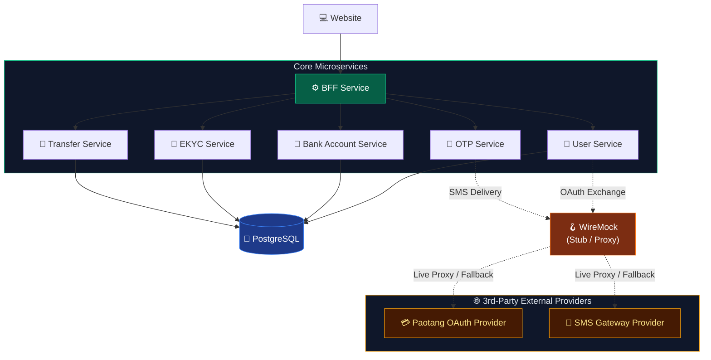
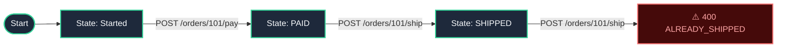

<div class="cover-slide">

<div class="cover-decor-container">
  
</div>

# Ultra Smoooooth Testing

<div class="cover-subtitle">Mock the world. Control the chaos. Test without limits.</div>

<div class="cover-tags">
  <span class="cover-tag">⚙️ Go Workspaces</span>
  <span class="cover-tag">🪝 WireMock</span>
  <span class="cover-tag">🛡️ Burp Suite</span>
  <span class="cover-tag">🎭 Playwright</span>
  <span class="cover-tag">🐳 Testcontainers</span>
</div>

</div>

---
transition: slide-left
---

# 🎯 Testing Strategy & Core Pillars

<div class="subtitle-badge mb-4 text-emerald-400 font-semibold text-center text-lg">Mock the world. Control the chaos. Test without limits.</div>

<div class="grid grid-cols-3 gap-4 my-auto py-2">

<div class="slide-card">
  <h3 class="text-emerald-400 font-bold mb-2">🌐 1. Mock the World</h3>
  <p class="text-sm text-slate-300 mb-3">Virtualize all third-party integrations with WireMock stateful stubs.</p>
  <ul class="text-xs text-slate-300 space-y-1.5">
    <li>• OAuth2 & OTP Verification</li>
    <li>• Paotang Pass Identity API</li>
    <li>• SMS Gateway Delivery Stubs</li>
    <li>• Deterministic Mock Scenarios</li>
  </ul>
</div>

<div class="slide-card">
  <h3 class="text-emerald-400 font-bold mb-2">⚡ 2. Control the Chaos</h3>
  <p class="text-sm text-slate-300 mb-3">Intercept traffic & inject real-world network edge cases with Burp Suite.</p>
  <ul class="text-xs text-slate-300 space-y-1.5">
    <li>• MITM HTTP Traffic Interception</li>
    <li>• Response Tampering & Faults</li>
    <li>• Rate Limiting & Latency Testing</li>
    <li>• Security Boundary Validation</li>
  </ul>
</div>

<div class="slide-card">
  <h3 class="text-emerald-400 font-bold mb-2">🚀 3. Test Without Limits</h3>
  <p class="text-sm text-slate-300 mb-3">Execute integration & E2E suites with zero rate limits or sandbox downtime.</p>
  <ul class="text-xs text-slate-300 space-y-1.5">
    <li>• Playwright E2E Automation</li>
    <li>• Go Workspace (`go.work`) Testing</li>
    <li>• Docker Compose Environment</li>
    <li>• CI/CD Regression Safeguards</li>
  </ul>
</div>

</div>

---
transition: fade-out
---

# 🏗️ Ecosystem System Architecture

<div class="adorable-arch-container my-auto">
  
</div>

---
transition: slide-left
---

# 🗺️ Detailed Service Topology & Flow

```mermaid {scale: 0.62}
flowchart LR
    subgraph Clients["🌐 1. Client & Automation Layer (Test Without Limits)"]
        Website["💻 Website<br/>:3000"]
        BridgeWebsite["📱 Mobile WebView<br/>JSBridge"]
        Playwright["🐦 Playwright E2E<br/>Runner"]
        Burp["🛡️ Burp MITM Proxy<br/>:8080"]
    end

    subgraph API_Gateway["⚡ 2. Gateway & Orchestration Layer"]
        BFF["⚙️ bff-service<br/>Go :8080"]
    end

    subgraph Core_Services["🏡 3. Microservices Domain Layer (Go Workspace)"]
        UserService["👤 user-service<br/>:8081"]
        BankService["🏦 bank-account-service<br/>:8082"]
        EKYCService["🪪 ekyc-service<br/>:8084"]
        TransferService["💸 transfer-service<br/>:8085"]
        OTPService["🔑 otp-service<br/>:8087"]
    end

    subgraph Persistence["🗄️ 4. Persistence Layer"]
        DB[("🐘 PostgreSQL DB<br/>:5432")]
    end

    subgraph External_Mocks["🤖 5. External Mocks (Mock The World)"]
        WireMock["🪝 WireMock Stubs<br/>:8088"]
        PaotangProvider["💳 Paotang Provider"]
        SMSProvider["📡 SMS Provider"]
    end

    Website -->|REST| BFF
    BridgeWebsite -->|REST + JSBridge| BFF
    Playwright -->|E2E| Website
    Playwright -->|E2E| BridgeWebsite
    Website -.->|MITM Intercept| Burp
    BridgeWebsite -.->|MITM Intercept| Burp
    Burp -.->|Proxied REST| BFF

    BFF -->|/users| UserService
    BFF -->|/accounts| BankService
    BFF -->|/ekycs| EKYCService
    BFF -->|/transfers| TransferService
    BFF -->|/auth/otp/verify| OTPService

    UserService -->|SQL| DB
    BankService -->|SQL| DB
    TransferService -->|SQL| DB

    UserService -->|OAuth via WireMock| WireMock
    OTPService -->|Send SMS via WireMock| WireMock
    WireMock -.->|Proxy Unmatched| PaotangProvider
    WireMock -.->|Proxy Unmatched| SMSProvider

    classDef client fill:#0e7490,stroke:#67e8f9,color:#f8fafc,stroke-width:3px
    classDef gateway fill:#1d4ed8,stroke:#93c5fd,color:#ffffff,stroke-width:3px
    classDef core fill:#047857,stroke:#6ee7b7,color:#ffffff,stroke-width:3px
    classDef persistence fill:#4338ca,stroke:#c4b5fd,color:#ffffff,stroke-width:3px
    classDef external fill:#b45309,stroke:#fcd34d,color:#fff7ed,stroke-width:3px

    class Website,BridgeWebsite,Playwright,Burp client
    class BFF gateway
    class UserService,BankService,EKYCService,TransferService,OTPService core
    class DB persistence
    class WireMock,PaotangProvider,SMSProvider external

    style Clients fill:#082f49,stroke:#0891b2,stroke-width:2px,color:#cffafe
    style API_Gateway fill:#172554,stroke:#2563eb,stroke-width:2px,color:#dbeafe
    style Core_Services fill:#052e2b,stroke:#059669,stroke-width:2px,color:#d1fae5
    style Persistence fill:#1e1b4b,stroke:#7c3aed,stroke-width:2px,color:#ede9fe
    style External_Mocks fill:#451a03,stroke:#d97706,stroke-width:2px,color:#ffedd5
```

<div class="topology-diagram w-full flex justify-center items-center my-auto py-1">



</div>

---

# 🛠️ Technology Stack & Infrastructure

<div class="tech-slide space-y-3 pt-2">

<div class="slide-card">
  <h3>⚙️ Core Runtime & Frameworks</h3>
  <ul>
    <li><span class="tech-badge">🐹 Go</span> <strong>Go Workspaces (go.work)</strong>: Monorepo module synchronization across microservices.</li>
    <li><span class="tech-badge">⚛️ Next.js</span> <strong>QA Web Frontend</strong>: Modern Web UI built with React 19 & Tailwind CSS.</li>
    <li><span class="tech-badge">🐘 PostgreSQL</span> <strong>Relational Database</strong>: Primary persistent storage with SQL transaction support.</li>
  </ul>
</div>

<div class="slide-card">
  <h3>🧪 Testing & Security Infrastructure</h3>
  <ul>
    <li><span class="tech-badge">🪝 WireMock</span> <strong>3rd-Party API Mocking</strong>: Stubbing external OAuth (Paotang Pass), OTP, & SMS gateways.</li>
    <li><span class="tech-badge">🛡️ Burp Suite</span> <strong>MITM Proxy</strong>: Live HTTP traffic inspection, parameter tampering, & header injection.</li>
    <li><span class="tech-badge">🐦 Playwright</span> <strong>Browser Automation</strong>: Drives real UI + APIs with auto-wait and retrying assertions.</li>
    <li><span class="tech-badge">🐳 Testcontainers</span> <strong>Disposable Docker Infra</strong>: Spins up real PostgreSQL, WireMock & service containers per test run; torn down after.</li>
  </ul>
</div>

</div>

---

# 🧱 Core Microservices

<div class="w-full flex justify-center items-center my-auto py-1">



</div>

<div class="text-center text-sm text-gray-400 pt-1">
  BFF orchestrates · services own domain data · WireMock isolates all 3rd-party external providers
</div>

---

# ⚡ WireMock — URL & Path Matching

### Exact Path Routing, Regex Patterns & Query Strings

<div class="grid grid-cols-2 gap-5 text-sm pt-2">

<div class="slide-card">
  <h3 class="text-emerald-400 font-bold mb-2 text-base">🌐 Path Matchers Overview</h3>
  <ul class="space-y-2 text-slate-300">
    <li>• <strong><code>url</code></strong>: Matches full absolute path <em>including</em> query parameters.</li>
    <li>• <strong><code>urlPath</code></strong>: Matches URI path only, safely ignoring query parameters.</li>
    <li>• <strong><code>urlPathPattern</code></strong>: Regular expression matching on URI paths.</li>
    <li>• <strong><code>urlPattern</code></strong>: Regular expression matching on the complete URL.</li>
  </ul>
</div>

<div class="slide-card">
  <h3 class="text-emerald-400 font-bold mb-2 text-base">💡 Best Practice & Use Cases</h3>
  <ul class="space-y-2 text-slate-300">
    <li>• Use <strong><code>urlPath</code></strong> for stable REST endpoints when query strings vary.</li>
    <li>• Use <strong><code>urlPathPattern</code></strong> for dynamic path parameters (e.g. IDs, UUIDs).</li>
    <li>• Use <strong><code>url</code></strong> only when asserting strict, unvarying full URLs.</li>
  </ul>
</div>

</div>

---

# ⚡ WireMock — Header Matching Operators

### Exact Matches, Substrings, Regex & Absence Checks

<div class="grid grid-cols-2 gap-5 text-sm pt-2">

<div class="slide-card">
  <h3 class="text-emerald-400 font-bold mb-2 text-base">🏷️ Operator Reference</h3>
  <ul class="space-y-2 text-slate-300">
    <li>• <strong><code>equalTo</code></strong>: Exact case-sensitive match (e.g. <code>Content-Type</code>).</li>
    <li>• <strong><code>matches</code></strong>: Regular expression on header value (e.g. Bearer JWTs).</li>
    <li>• <strong><code>contains</code></strong>: Substring check (e.g. <code>Mock-Scenario</code> tags).</li>
    <li>• <strong><code>absent</code></strong>: Asserts header is completely omitted.</li>
  </ul>
</div>

<div class="slide-card">
  <h3 class="text-emerald-400 font-bold mb-2 text-base">🛡️ Auth & Mock Steer Patterns</h3>
  <ul class="space-y-2 text-slate-300">
    <li>• Validate auth formats with <code>Bearer [A-Za-z0-9-_\\.]+</code>.</li>
    <li>• Steer test paths via <code>Mock-Scenario: TRANSFER:INSUFFICIENT_FUNDS</code>.</li>
    <li>• Enforce security boundaries by asserting internal headers are absent.</li>
  </ul>
</div>

</div>

---

# ⚡ WireMock — Query Parameter & Cookie Filters

### Parameter Flags, Cookie Assertions & Multi-Criteria Conjunction

<div class="grid grid-cols-2 gap-5 text-sm pt-2">

<div class="slide-card">
  <h3 class="text-emerald-400 font-bold mb-2 text-base">🔍 Query & Cookie Filters</h3>
  <ul class="space-y-2 text-slate-300">
    <li>• <strong><code>queryParameters</code></strong>: Match query flags (e.g. <code>?active=true</code>).</li>
    <li>• <strong><code>cookies</code></strong>: Assert session, auth, or tracking cookies.</li>
    <li>• <strong><code>absent: true</code></strong>: Verify query parameters are omitted.</li>
    <li>• Supports regex, equality, and substring operators on each parameter.</li>
  </ul>
</div>

<div class="slide-card">
  <h3 class="text-emerald-400 font-bold mb-2 text-base">⚡ Multi-Criteria Conjunction</h3>
  <ul class="space-y-2 text-slate-300">
    <li>• WireMock evaluates method, URL, headers, and parameters simultaneously.</li>
    <li>• <strong>All defined matchers must evaluate to true</strong> for a 200 match.</li>
    <li>• Unmatched requests fall back to lower priority stubs or 404.</li>
  </ul>
</div>

</div>

---

# ⚡ Request Matching — URL & Header Example

### Regex Path Routing & Bearer JWT Validation

<div class="grid grid-cols-2 gap-5 text-sm pt-1">

<div>

```json
{
  "request": {
    "method": "GET",
    "urlPathPattern": "/lab/api/users/[0-9]+",
    "headers": {
      "Authorization": { 
        "matches": "Bearer [A-Za-z0-9-_]+" 
      },
      "Mock-Scenario": { 
        "contains": "ACCOUNT_ACTIVE" 
      }
    }
  },
  "response": {
    "status": 200,
    "jsonBody": { "status": "ACTIVE" }
  }
}
```

</div>

<div class="space-y-3">

<div class="slide-card">
  <h3 class="text-emerald-400 font-bold mb-1 text-base">🎯 Dynamic Path Routing</h3>
  <p class="text-slate-300 leading-relaxed">
    <code>urlPathPattern</code> matches any numeric user ID (e.g. <code>/users/101</code>) while safely ignoring query strings.
  </p>
</div>

<div class="slide-card">
  <h3 class="text-emerald-400 font-bold mb-1 text-base">🔐 Auth & Scenario Discrimination</h3>
  <p class="text-slate-300 leading-relaxed">
    Validates Bearer token format and matches <code>Mock-Scenario: ACCOUNT_ACTIVE</code> substring.
  </p>
</div>

</div>

</div>

---

# ⚡ Request Matching — Query Parameter Example

### Query Flag Filtering & Multi-Criteria Evaluation

<div class="grid grid-cols-2 gap-5 text-sm pt-1">

<div>

```json
{
  "request": {
    "method": "GET",
    "urlPath": "/lab/api/users/filter",
    "queryParameters": {
      "active": { 
        "equalTo": "true" 
      },
      "limit": { 
        "matches": "[0-9]+" 
      }
    }
  },
  "response": {
    "status": 200,
    "jsonBody": { "count": 10, "users": [] }
  }
}
```

</div>

<div class="space-y-3">

<div class="slide-card">
  <h3 class="text-emerald-400 font-bold mb-1 text-base">🏷️ Query Flag Filtering</h3>
  <p class="text-slate-300 leading-relaxed">
    Enforces exact matches like <code>?active=true</code> and regex validation on parameters like <code>?limit=10</code>.
  </p>
</div>

<div class="slide-card">
  <h3 class="text-emerald-400 font-bold mb-1 text-base">✨ Multi-Criteria Conjunction</h3>
  <p class="text-slate-300 leading-relaxed">
    WireMock evaluates method, path, and all query parameters simultaneously. Every defined matcher must evaluate to true.
  </p>
</div>

</div>

</div>

---

# ⚖️ WireMock — Priority & Matching Precedence

### Resolution Order & Priority Hierarchy for Overlapping Stubs

<div class="grid grid-cols-3 gap-3 text-xs pt-1">

<div class="slide-card">
  <h3 class="text-emerald-400 font-bold mb-1.5">🥇 Priority 1: Faults & Errors</h3>
  <p class="text-slate-300">
    Fault injection and error edge cases triggered via headers (<code>Mock-Scenario</code>), query params, or exact IDs.
  </p>
</div>

<div class="slide-card">
  <h3 class="text-emerald-400 font-bold mb-1.5">🥈 Priority 5–10: Happy Paths</h3>
  <p class="text-slate-300">
    Default domain responses (<code>200 OK</code> / <code>201 Created</code>) matching standard routes when no error headers exist.
  </p>
</div>

<div class="slide-card">
  <h3 class="text-emerald-400 font-bold mb-1.5">🛡️ Priority 100: Catch-All Proxy</h3>
  <p class="text-slate-300">
    Lowest priority proxy stubs forwarding unmatched traffic to real downstream backends or live legacy services.
  </p>
</div>

</div>

<div class="slide-card text-xs mt-2.5">
  ⚡ <strong>Precedence Rule</strong>: Lower integer = <strong>Higher Precedence</strong> (<code>1 &gt; 5 &gt; 10 &gt; 100</code>). WireMock stops evaluation on the first matching highest-priority stub (defaults to <strong>priority 5</strong> if omitted).
</div>

---

# ⚖️ Priority & Precedence — Example

### Error Scenario Override vs Default Happy Path

<div class="grid grid-cols-2 gap-4 text-xs pt-1">

<div>

### 🥇 Priority 1: Specific Error Override
```json
{
  "priority": 1,
  "request": {
    "method": "POST",
    "urlPath": "/lab/api/transfers",
    "headers": {
      "Mock-Scenario": {
        "contains": "INSUFFICIENT_FUNDS"
      }
    }
  },
  "response": {
    "status": 400,
    "jsonBody": { "code": "ERR_INSUFFICIENT_FUNDS" }
  }
}
```

</div>

<div>

### 🥈 Priority 10: Default Happy Path
```json
{
  "priority": 10,
  "request": {
    "method": "POST",
    "urlPath": "/lab/api/transfers"
  },
  "response": {
    "status": 201,
    "jsonBody": { "status": "COMPLETED" }
  }
}
```

</div>

</div>

<div class="grid grid-cols-2 gap-4 text-xs mt-2">
<div class="slide-card">
  ⚡ <strong>With Header</strong>: Sending <code>Mock-Scenario: TRANSFER:INSUFFICIENT_FUNDS</code> triggers Priority 1 (returns <code>400</code>).
</div>
<div class="slide-card">
  ✅ <strong>Without Header</strong>: Standard requests match Priority 10 without needing individual stubs (returns <code>201</code>).
</div>
</div>

---

# 🎯 WireMock — URL & Header RegEx Matching

### Flexible Routing & Token Verification

<div class="grid grid-cols-2 gap-4 text-xs pt-1">

<div class="slide-card">
  <h3 class="text-emerald-400 font-bold mb-1.5">🌐 URL Path RegEx</h3>
  <ul class="space-y-1.5 text-slate-300">
    <li>• <strong><code>urlPathPattern</code></strong>: Matches path using regex, ignoring query params.</li>
    <li>• <strong><code>urlPattern</code></strong>: Matches entire URI including query strings.</li>
    <li>• Ideal for dynamic UUIDs and variable resource IDs.</li>
  </ul>
</div>

<div class="slide-card">
  <h3 class="text-emerald-400 font-bold mb-1.5">🏷️ Header & Query RegEx</h3>
  <ul class="space-y-1.5 text-slate-300">
    <li>• <strong><code>matches</code></strong>: Target string must satisfy the regular expression.</li>
    <li>• <strong><code>doesNotMatch</code></strong>: Passes only when regex fails.</li>
    <li>• Validate auth tokens (JWT Bearer) and Scenario enum branches.</li>
  </ul>
</div>

</div>

<div class="slide-card text-xs mt-3">
  💡 <strong>JSON Escaping Tip</strong>: In WireMock JSON mappings, backslashes must be double-escaped: use <code>\\d{4}</code> instead of <code>\d{4}</code> and <code>[A-Za-z0-9-_\\.]+</code> for token patterns.
</div>

---

# 🎯 WireMock — Body & JSONPath RegEx Matching

### Payload Validation & Pattern Filtering

<div class="grid grid-cols-2 gap-4 text-xs pt-1">

<div class="slide-card">
  <h3 class="text-emerald-400 font-bold mb-1.5">📝 Raw Body RegEx</h3>
  <ul class="space-y-1.5 text-slate-300">
    <li>• Match full unparsed body with <strong><code>matches</code></strong>.</li>
    <li>• Useful for legacy string formats or XML/JSON fallback matching.</li>
    <li>• Example: <code>.*"national_id"\\s*:\\s*"[0-9]{13}".*</code></li>
  </ul>
</div>

<div class="slide-card">
  <h3 class="text-emerald-400 font-bold mb-1.5">🔍 Inline JSONPath RegEx</h3>
  <ul class="space-y-1.5 text-slate-300">
    <li>• Evaluate regex inside JSONPath expressions: <code>$[?(@.field =~ /^regex$/)]</code>.</li>
    <li>• Target specific nested attributes (emails, phone numbers, UUIDs).</li>
    <li>• Example: <code>$[?(@.phone =~ /^0[689][0-9]{8}$/)]</code></li>
  </ul>
</div>

</div>

<div class="slide-card text-xs mt-3">
  ✨ <strong>Best Practice</strong>: Prefer <strong>JSONPath RegEx</strong> over raw body regex for JSON payloads to avoid fragility caused by field reordering or formatting variations.
</div>

---

# 🎯 WireMock RegEx — URL & Header Examples

### UUID Resource Paths, Bearer Tokens & Scenario Enums

<div class="grid grid-cols-2 gap-4 text-xs pt-1">

<div>

### 🌐 Dynamic UUID Resource Path
```json
{
  "request": {
    "method": "GET", 
    "urlPathPattern": "/lab/api/users/[0-9a-fA-F-]{36}/accounts"
  },
  "response": {
    "status": 200,
    "jsonBody": { "tier": "PREMIUM" }
  }
}
```

</div>

<div>

### 🔑 JWT Bearer & Scenario Enum
```json
{
  "request": {
    "method": "POST",
    "urlPath": "/lab/api/transfers",
    "headers": {
      "Authorization": {
        "matches": "Bearer [A-Za-z0-9-_\\.]+"
      },
      "Mock-Scenario": {
        "matches": "TRANSFER:(SUCCESS|INSUFFICIENT_FUNDS)"
      }
    }
  },
  "response": {
    "status": 200,
    "jsonBody": { "authorized": true }
  }
}
```

</div>

</div>

<div class="slide-card text-xs mt-2">
  ✨ Matches 36-character UUID paths and authenticates Bearer JWTs while restricting <code>Mock-Scenario</code> to defined enum values.
</div>

---

# 🎯 WireMock RegEx — Body & Parameter Matching

### 13-Digit National ID & Query Version Validation

<div class="grid grid-cols-2 gap-4 text-xs pt-1">

<div>

```json
{
  "request": {
    "method": "POST",
    "urlPath": "/lab/api/ekyc/verify",
    "queryParameters": {
      "version": {
        "matches": "v[1-3].*"
      }
    },
    "bodyPatterns": [
      {
        "matches": ".*\"national_id\":\"[0-9]{13}\".*"
      }
    ]
  },
  "response": {
    "status": 200,
    "jsonBody": { "verified": true }
  }
}
```

</div>

<div class="space-y-2">

<div class="slide-card">
  <h3 class="text-emerald-400 font-bold mb-1">🪪 Raw Body RegEx</h3>
  <p class="text-slate-300">
    Matches any request body containing <code>"national_id":"&lt;13 digits&gt;"</code> to ensure strict Citizen ID format verification.
  </p>
</div>

<div class="slide-card">
  <h3 class="text-emerald-400 font-bold mb-1">🔢 Query Parameter RegEx</h3>
  <p class="text-slate-300">
    <code>version: { "matches": "v[1-3].*" }</code> dynamically routes requests across API versions (<code>v1</code>, <code>v2</code>, <code>v3</code>).
  </p>
</div>

</div>

</div>

---

# 🎯 WireMock RegEx — JSONPath Phone Validation

### Thai Mobile Number Pattern Matching in Payload

<div class="grid grid-cols-2 gap-4 text-xs pt-1">

<div>

```json
{
  "request": {
    "method": "POST",
    "urlPath": "/lab/api/otp/send",
    "bodyPatterns": [
      {
        "matchesJsonPath":
          "$[?(@.phone =~ /^0[689]\\d{8}$/)]"
      }
    ]
  },
  "response": {
    "status": 200,
    "jsonBody": { "status": "sent" }
  }
}
```

</div>

<div class="space-y-2">

<div class="slide-card">
  <h3 class="text-emerald-400 font-bold mb-1">📱 Inline JSONPath RegEx</h3>
  <p class="text-slate-300">
    <code>$[?(@.phone =~ /^0[689]\d{8}$/)]</code> validates Thai mobile phone numbers (e.g. <code>0812345678</code>) within deep JSON paths.
  </p>
</div>

<div class="slide-card">
  <h3 class="text-emerald-400 font-bold mb-1">🎯 Targeted Assertion</h3>
  <p class="text-slate-300">
    Extracts and regex-evaluates only the <code>phone</code> field without breaking on whitespace or extra payload keys.
  </p>
</div>

</div>

</div>

---

# 📦 WireMock — Body & Semantic JSON Matching

### Flexible Payload Matching Strategies

<div class="grid grid-cols-3 gap-3 text-xs pt-1">

<div class="slide-card">
  <h3 class="text-emerald-400 font-bold mb-1.5">🧩 Semantic vs Literal</h3>
  <p class="text-slate-300 leading-relaxed">
    Raw string matching fails when key orders change or whitespace varies. <code>equalToJson</code> deserializes both payloads and performs <strong>semantic JSON comparison</strong>.
  </p>
</div>

<div class="slide-card">
  <h3 class="text-emerald-400 font-bold mb-1.5">🛠️ Body Match Operators</h3>
  <ul class="space-y-1 text-slate-300">
    <li>• <strong><code>equalToJson</code></strong>: Semantic JSON equivalence.</li>
    <li>• <strong><code>equalToXml</code></strong>: Semantic XML matching.</li>
    <li>• <strong><code>matches</code></strong>: Regular expression on raw body.</li>
    <li>• <strong><code>contains</code></strong>: Substring occurrence check.</li>
  </ul>
</div>

<div class="slide-card">
  <h3 class="text-emerald-400 font-bold mb-1.5">⚙️ Lenient Match Flags</h3>
  <ul class="space-y-1 text-slate-300">
    <li>• <strong><code>ignoreExtraElements</code></strong>: Allows additional unexpected attributes without failing.</li>
    <li>• <strong><code>ignoreArrayOrder</code></strong>: Treats JSON array elements as unordered sets.</li>
  </ul>
</div>

</div>

<div class="slide-card text-xs mt-3">
  💡 <strong>Best Practice</strong>: Use <code>ignoreExtraElements: true</code> in backward-compatibility and schema-evolution tests so new non-breaking fields don't invalidate established stub definitions.
</div>

---

# 📦 Body Matching — Example

### Match Request Bodies with `equalToJson`

```json
{
  "request": {
    "method": "POST",
    "urlPath": "/lab/api/accounts/open",
    "bodyPatterns": [
      {
        "equalToJson": "{\"citizenId\": \"1100500123456\", \"type\": \"SAVINGS\"}",
        "ignoreExtraElements": true,
        "ignoreArrayOrder": true
      }
    ]
  },
  "response": {
    "status": 201,
    "jsonBody": { "accountId": "ACC-998877", "status": "OPENED" }
  }
}
```

<div class="grid grid-cols-2 gap-4 text-xs pt-2">
<div class="slide-card">
  <strong><code>ignoreExtraElements: true</code></strong>: Ignores unexpected extra fields in payload (lenient contract matching).
</div>
<div class="slide-card">
  <strong><code>ignoreArrayOrder: true</code></strong>: Array elements can arrive in any order without failing the match.
</div>
</div>

---

# 🔍 WireMock — JSONPath Expression Matching

### Filter & Assert Payloads with `matchesJsonPath`

```json
{
  "priority": 1,
  "request": {
    "method": "POST",
    "urlPath": "/lab/api/stateless/payments",
    "bodyPatterns": [
      {
        "matchesJsonPath": "$.payment[?(@.amount > 1000)]"
      },
      {
        "matchesJsonPath": "$.payment[?(@.currency == 'THB')]"
      },
      {
        "matchesJsonPath": "$[?(@.recipient.mobile =~ /^08[0-9]{8}$/)]"
      }
    ]
  },
  "response": {
    "status": 201,
    "jsonBody": { "status": "APPROVED", "flag": "HIGH_VALUE" }
  }
}
```

<div class="grid grid-cols-2 gap-4 text-xs pt-2">
<div class="slide-card">
  <strong>Conditional Value Filters</strong>: Compare numbers (<code>&gt;</code>, <code>&lt;</code>), boolean flags, and string equivalence within payload.
</div>
<div class="slide-card">
  <strong>Inline Regex Evaluation</strong>: Use <code>=~ /regex/</code> inside JSONPath expressions to validate nested phone numbers or IDs.
</div>
</div>

---

# 🪄 WireMock — Dynamic Response Templating

### Handlebars Response Templating (`response-template`)

```json
{
  "request": {
    "method": "POST",
    "urlPath": "/lab/api/orders"
  },
  "response": {
    "status": 201,
    "headers": { "Content-Type": "application/json" },
    "body": "{\"orderId\": \"{{randomValue type='UUID'}}\", \"userId\": \"{{jsonPath request.body '$.userId'}}\",
             \"traceId\": \"{{request.headers.X-Trace-ID}}\", \"createdAt\": \"{{now}}\"}",
    "transformers": ["response-template"]
  }
}
```

<div v-pre class="grid grid-cols-3 gap-2 text-xs pt-2">
<div class="slide-card">
  <strong><code>request.*</code></strong><br/>
  <code>{{request.headers.X-Trace-ID}}</code><br/>
  <code>{{request.query.page}}</code>
</div>
<div class="slide-card">
  <strong><code>jsonPath</code></strong><br/>
  <code>{{jsonPath request.body '$.amount'}}</code><br/>
  Extracts nested payload fields
</div>
<div class="slide-card">
  <strong><code>randomValue / now</code></strong><br/>
  <code>{{randomValue type='UUID'}}</code><br/>
  <code>{{now format='yyyy-MM-dd'}}</code>
</div>
</div>

---

# 🪄 WireMock — Handlebars Helper Reference

### Request Extraction, Generators & Encoding Helpers

<div v-pre class="grid grid-cols-2 gap-4 text-xs pt-1">

<div>

### 📥 Request & Encoding Helpers
| Helper | Example & Description |
| :--- | :--- |
| **Headers** | `{{request.headers.[X-Trace-ID]}}` |
| **Query Params** | `{{request.query.page}}` |
| **JSON Body** | `{{jsonPath request.body '$.account.id'}}` |
| **Base64** | `{{base64 request.body}}` *(Encode / Decode)* |
| **URL Encode** | `{{urlEncode request.query.target}}` |

</div>

<div>

### 🎲 Dynamic Data Generators
| Generator | Output & Use Case |
| :--- | :--- |
| `{{randomValue type='UUID'}}` | `a1b2c3d4-e5f6-...` *(Random IDs)* |
| `{{randomValue type='NUMERIC' length=6}}` | `849201` *(OTP SMS Code)* |
| `{{now format='yyyy-MM-dd'}}` | `2026-08-20` *(Current Date)* |
| `{{now offset='1 hours'}}` | `2026-08-20T12:30:00Z` *(Expiry)* |

</div>

</div>

<div class="slide-card text-xs mt-3">
  ✨ Extract request properties, generate dynamic randomness, or encode/decode base64 payloads directly in stubs without plugins.
</div>

---

# 🪄 Handlebars Logic & Math — Example

### Conditionals, Dynamic Math & Response Configuration

<div v-pre class="grid grid-cols-2 gap-4 text-xs pt-1">

<div>

### 🔀 Dynamic Response Body
```handlebars
{
  {{#if (eq (jsonPath request.body '$.amount') 0)}}
  "status": "REJECTED",
  {{else}}
  "status": "APPROVED",
  {{/if}}
  "fee": 
    {{math (jsonPath request.body '$.amount') '*' 0.01}},
  "expiresAt": "{{now offset='3 days' format='yyyy-MM-dd'}}"
}
```

</div>

<div class="space-y-2">

<div class="slide-card">
  <h3 class="text-emerald-400 font-bold mb-1">🔀 Logic & Math Helpers</h3>
  <ul class="space-y-1 text-slate-300">
    <li>• <strong><code>#if (eq a b)</code></strong>: Conditional response branching.</li>
    <li>• <strong><code>math a '*' b</code></strong>: Calculates dynamic fee/tax percentages.</li>
    <li>• <strong><code>now offset='3 days'</code></strong>: Generates relative expiration timestamps.</li>
  </ul>
</div>

<div class="slide-card">
  <h3 class="text-emerald-400 font-bold mb-1">⚙️ Required Transformer Setup</h3>
  <pre class="text-emerald-400">"transformers": ["response-template"]</pre>
  <p class="text-slate-400 text-xs mt-1">
    Or pass <code>--global-response-templating</code> to WireMock CLI.
  </p>
</div>

</div>

</div>

---

# 🪄 WireMock — Handlebars String & Iteration Helpers

### String Transformations, Substrings & Array Loops

<div v-pre class="grid grid-cols-2 gap-4 text-xs pt-1">

<div>

### 🔤 String & Parsing Helpers
| Helper | Syntax & Use Case |
| :--- | :--- |
| **Upper / Lower** | `{{upper value}}` / `{{lower value}}` |
| **Capitalize** | `{{capitalize value}}` *(First letter uppercase)* |
| **Trim** | `{{trim value}}` *(Strips surrounding spaces)* |
| **Replace** | `{{replace target repl value}}` |
| **Regex Extract** | `{{regexExtract value '([0-9]+)' '1'}}` |

</div>

<div>

### 🔁 Array & Variable Helpers
| Helper | Syntax & Use Case |
| :--- | :--- |
| **`#each`** | `{{#each (jsonPath request.body '$.items')}}` |
| **`@index`** | 0-based loop iteration index |
| **`size`** | `{{size (jsonPath request.body '$.items')}}` |
| **`val`** | `{{val 'key' (jsonPath request.body '$.id')}}` |
| **`lookup`** | `{{lookup array index}}` |

</div>

</div>

<div class="slide-card text-xs mt-3">
  🪄 Combine loops and string helpers to transform incoming arrays into complete, dynamically shaped response payloads.
</div>

---

# 🪄 Handlebars Array Iteration — Example

### Generating Dynamic Arrays with `{{#each}}` and Indexing

<div v-pre class="grid grid-cols-2 gap-4 text-xs pt-1">

<div>

### 📋 Dynamic Array Response
```handlebars
{
  "totalItems": 
    {{size (jsonPath request.body '$.items')}},
  "processedItems": [
    {{#each (jsonPath request.body '$.items')}}
    {
      "index": {{@index}},
      "sku": "{{upper this.sku}}",
      "status": "VERIFIED"
    }{{#unless @last}},{{/unless}}
    {{/each}}
  ]
}
```

</div>

<div class="space-y-2">

<div class="slide-card">
  <h3 class="text-emerald-400 font-bold mb-1">🔁 <code>#each</code> Array Mapping</h3>
  <p class="text-slate-300">
    Extracts incoming array items, transforms fields on the fly (e.g. <code>upper this.sku</code>), and loops through elements.
  </p>
</div>

<div class="slide-card">
  <h3 class="text-emerald-400 font-bold mb-1">🧹 Clean JSON Formatting</h3>
  <p class="text-slate-300">
    <code>{{#unless @last}},{{/unless}}</code> automatically suppresses the trailing comma on the final item for valid JSON output.
  </p>
</div>

</div>

</div>

---

# 🔍 WireMock — Handlebars jsonPath Extraction

### Extracting Nested Fields, Arrays & Safe Default Values

<div v-pre class="grid grid-cols-3 gap-3 text-xs pt-1">

<div class="slide-card">
  <h3 class="text-emerald-400 font-bold mb-1.5">🎯 Deep Field Traversal</h3>
  <ul class="space-y-1 text-slate-300">
    <li>• <code>{{jsonPath request.body '$.user.id'}}</code></li>
    <li>• <code>{{jsonPath request.body '$.account.no'}}</code></li>
    <li>• Navigates deeply nested JSON payload trees.</li>
  </ul>
</div>

<div class="slide-card">
  <h3 class="text-emerald-400 font-bold mb-1.5">🛡️ Safe Default Fallbacks</h3>
  <ul class="space-y-1 text-slate-300">
    <li>• <code>default='STANDARD'</code> option</li>
    <li>• <code>{{jsonPath request.body '$.tier' default='GUEST'}}</code></li>
    <li>• Prevents blank responses when fields are omitted.</li>
  </ul>
</div>

<div class="slide-card">
  <h3 class="text-emerald-400 font-bold mb-1.5">📊 Array Index Extraction</h3>
  <ul class="space-y-1 text-slate-300">
    <li>• <code>{{jsonPath request.body '$.items[0].sku'}}</code></li>
    <li>• <code>{{size (jsonPath request.body '$.items')}}</code></li>
    <li>• Targets specific elements or counts total entries.</li>
  </ul>
</div>

</div>

<div class="slide-card text-xs mt-3">
  ✨ Use <code>jsonPath</code> inside Handlebars templates to echo incoming request fields, supply default fallbacks, and compute array dimensions dynamically.
</div>

---

# 🔍 Handlebars jsonPath — Example

### Echoing Nested Request Payloads & Handling Missing Fields

<div v-pre class="grid grid-cols-2 gap-4 text-xs pt-1">

<div>

```handlebars
{
  "orderId": 
    "{{randomValue type='UUID'}}",
  "customerId": 
    "{{jsonPath request.body '$.customer.id'}}",
  "tier": 
    "{{jsonPath request.body '$.customer.tier' default='SILVER'}}",
  "firstSku": 
    "{{jsonPath request.body '$.items[0].sku'}}",
  "itemCount": 
    {{size (jsonPath request.body '$.items')}}
}
```

</div>

<div class="slide-card space-y-2">

<div>
  <h3 class="text-emerald-400 font-bold mb-0.5">🎯 Deep Nested Traversal</h3>
  <p class="text-slate-300">
    Extracts <code>$.customer.id</code> and first SKU (<code>$.items[0].sku</code>) directly into response properties.
  </p>
</div>

<div>
  <h3 class="text-emerald-400 font-bold mb-0.5">🛡️ Safe Default Fallbacks</h3>
  <p class="text-slate-300">
    <code>default='SILVER'</code> supplies a fallback value when the client omits optional attributes.
  </p>
</div>

<div>
  <h3 class="text-emerald-400 font-bold mb-0.5">📊 Dynamic Size Computation</h3>
  <p class="text-slate-300">
    Wraps <code>jsonPath</code> with <code>size</code> to compute array element counts on the fly.
  </p>
</div>

</div>

</div>

---

# ⏱️ WireMock — Fixed Latency & Timeout Testing

### Deterministic Delay Injection (`fixedDelayMilliseconds`)

<div class="grid grid-cols-2 gap-4 text-xs pt-1">

<div>

```json
{
  "request": {
    "method": "POST",
    "urlPath": "/lab/api/sms/send"
  },
  "response": {
    "status": 200,
    "fixedDelayMilliseconds": 8000,
    "jsonBody": { "status": "DELIVERED" }
  }
}
```

</div>

<div class="space-y-2">

<div class="slide-card">
  <h3 class="text-emerald-400 font-bold mb-1">⏱️ Deterministic Latency Testing</h3>
  <p class="text-slate-300">
    Holds response for exactly <code>8000ms</code> to assert client timeout triggers (e.g. 5s HTTP context deadline).
  </p>
</div>

<div class="slide-card">
  <h3 class="text-emerald-400 font-bold mb-1">🛡️ Workshop Case 9 Connection</h3>
  <p class="text-slate-300">
    Verifies upstream service handles slow dependencies gracefully without thread exhaustion or hanging connections.
  </p>
</div>

</div>

</div>

---

# 🎲 WireMock — Random Jitter & Latency Distributions

### Real-World Latency Simulation (`delayDistribution`)

```json
{
  "request": {
    "method": "GET",
    "urlPath": "/lab/api/rates"
  },
  "response": {
    "status": 200,
    "delayDistribution": {
      "type": "lognormal",
      "median": 150,
      "sigma": 0.5
    },
    "jsonBody": { "USD_THB": 35.85 }
  }
}
```

<div class="grid grid-cols-3 gap-2 text-xs pt-2">
<div class="slide-card">
  <strong><code>lognormal</code> (Realistic Tail)</strong><br/>
  Most requests fast (<code>median: 150ms</code>) with realistic long-tail latency spikes (<code>sigma: 0.5</code>).
</div>
<div class="slide-card">
  <strong><code>uniform</code> (Bounded Range)</strong><br/>
  Even random spread between <code>lower</code> and <code>upper</code> bounds (e.g. 200ms – 1200ms).
</div>
<div class="slide-card">
  <strong><code>normal</code> (Gaussian Curve)</strong><br/>
  Centered around <code>mean</code> with configured <code>standardDeviation</code>.
</div>
</div>

---

# 💥 WireMock — Network Fault Injection

### Simulating Hard Network Failures & Socket Errors

```json
{
  "request": {
    "method": "GET",
    "urlPath": "/lab/api/unstable-upstream"
  },
  "response": {
    "fault": "CONNECTION_RESET_BY_PEER"
  }
}
```

<div class="grid grid-cols-3 gap-2 text-xs pt-2">
<div class="slide-card">
  <strong><code>CONNECTION_RESET_BY_PEER</code></strong><br/>
  Abruptly sends TCP RST packet to client during transmission.
</div>
<div class="slide-card">
  <strong><code>MALFORMED_RESPONSE_CHUNK</code></strong><br/>
  Sends corrupted HTTP byte stream mid-response.
</div>
<div class="slide-card">
  <strong><code>EMPTY_RESPONSE</code></strong><br/>
  Closes socket connection immediately with 0 bytes.
</div>
</div>

---

# 🔄 WireMock Stateful Stubbing

### Scenario State Machines & Replay Prevention

<div class="space-y-4 pt-2">

<div class="w-full flex justify-center py-4">



</div>

<div class="grid grid-cols-2 gap-5 text-sm">
  <div class="slide-card">
    <h3 class="text-emerald-400 font-bold mb-1.5 text-base">🔄 Multi-Step Workflows & Replay Defense</h3>
    <p class="text-slate-300 leading-relaxed">
      WireMock holds internal scenario state. One-time tokens, auth codes, and payments succeed once, then transition state so replays are rejected.
    </p>
  </div>
  <div class="slide-card">
    <h3 class="text-emerald-400 font-bold mb-1.5 text-base">🧹 Deterministic Test Lifecycle</h3>
    <p class="text-slate-300 leading-relaxed">
      Call <code>POST /__admin/scenarios/reset</code> in test teardown fixtures to restore all scenario machines back to <code>Started</code>.
    </p>
  </div>
</div>

</div>

---

# 🔄 WireMock Stateful — Example

### Scenario State Machine Stub: `04-order-pay.json`

<div class="grid grid-cols-2 gap-5 text-sm pt-1">

<div>

```json
{
  "scenarioName": "order-fulfillment-lifecycle",
  "requiredScenarioState": "Started",
  "newScenarioState": "PAID",
  "request": {
    "method": "POST",
    "urlPath": "/lab/api/orders/101/pay"
  },
  "response": { 
    "status": 200,
    "jsonBody": { "status": "PAYMENT_SUCCESS" }
  }
}
```

</div>

<div class="space-y-3">

<div class="slide-card">
  <h3 class="text-emerald-400 font-bold mb-1 text-base">🔄 State Transition</h3>
  <p class="text-slate-300 leading-relaxed">
    Incoming request must match <code>requiredScenarioState: "Started"</code>. On success, WireMock automatically transitions scenario state to <strong><code>PAID</code></strong>.
  </p>
</div>

<div class="slide-card">
  <h3 class="text-emerald-400 font-bold mb-1 text-base">🛡️ Replay & State Protection</h3>
  <p class="text-slate-300 leading-relaxed">
    A second call while in <code>PAID</code> state fails this stub and triggers a <code>409 Conflict</code> or <code>404</code> stub, preventing accidental duplicate payments.
  </p>
</div>

</div>

</div>

---

# 🔀 Burp Suite — Proxy Intercept

<div class="slide-card">

### What it does
- Sits between client and bff-service as a **transparent MITM proxy**.
- **Pause, inspect, and modify** any request before forwarding.
- Inject custom headers to trigger specific WireMock stubs.
- Works with HTTP and HTTPS (install Burp CA cert first).

</div>

---

# 🔀 Proxy Intercept — Example

<div class="grid grid-cols-2 gap-4 pt-2">
<div>

### 📤 Original Request (Client)
```http
POST http://localhost:8080/api/v1/users HTTP/1.1
Host: localhost:8080
Content-Type: application/json

{
  "username": "testuser",
  "password": "secret"
}
```

</div>
<div>

### 🔀 After Burp Intercept (Modified)
```http
POST http://localhost:8080/api/v1/users HTTP/1.1
Host: localhost:8080
Content-Type: application/json
Mock-Scenario: PT_PASS:SUCCESS_ONCE

{
  "username": "testuser",
  "password": "secret"
}
```

<div class="inject-highlight">
  💉 Injected: <code>Mock-Scenario: PT_PASS:SUCCESS_ONCE</code>
</div>

</div>
</div>

---

# 🔁 Burp Suite — Repeater

### Manual Request Replay & Contract Validation

<div class="grid grid-cols-2 gap-5 text-sm pt-2">

<div class="slide-card">
  <h3 class="text-emerald-400 font-bold mb-2 text-base">🔁 Interactive Request Replay</h3>
  <ul class="space-y-2 text-slate-300">
    <li>• Capture any request once and <strong>modify in-flight payloads</strong>.</li>
    <li>• Replay unlimited times with rapid feedback cycles.</li>
    <li>• Test boundary edge cases <strong>without writing code</strong>.</li>
  </ul>
</div>

<div class="slide-card">
  <h3 class="text-emerald-400 font-bold mb-2 text-base">🎯 Verification Scenarios</h3>
  <ul class="space-y-2 text-slate-300">
    <li>• <strong>Contract Error Shapes</strong>: Validate <code>400 Bad Request</code> schemas.</li>
    <li>• <strong>Negative Numbers & Boundary Values</strong>: Test limits & overflow.</li>
    <li>• <strong>Injection Probes</strong>: Confirm sanitization and no <code>500</code> leaks.</li>
  </ul>
</div>

</div>

---

# 🔁 Repeater — Example

### Boundary & Error Contract Testing (`transfers.spec.ts`)

<div class="grid grid-cols-2 gap-5 text-sm pt-1">

<div>

```typescript
// 1. Normal transfer (201 Created)
const res1 = await request.post("/api/v1/transfers", {
  data: { amount: 500, to_account: "ACC-002" }
});
expect(res1.status()).toBe(201);

// 2. Negative amount (400 Bad Request)
const res2 = await request.post("/api/v1/transfers", {
  data: { amount: -1, to_account: "ACC-002" }
});
expect(res2.status()).toBe(400);

// 3. SQL injection probe (400, never 500)
const res3 = await request.post("/api/v1/transfers", {
  data: { amount: "1; DROP TABLE transfers;--" }
});
expect(res3.status()).toBe(400);
```

</div>

<div class="space-y-3">

<div class="slide-card">
  <h3 class="text-emerald-400 font-bold mb-1 text-base">🧪 Automated Contract Safeguards</h3>
  <p class="text-slate-300 leading-relaxed">
    Every manual Repeater finding (e.g. invalid negative transfer) is converted directly into an automated regression test in Playwright.
  </p>
</div>

<div class="slide-card">
  <h3 class="text-emerald-400 font-bold mb-1 text-base">🛡️ Resilient Error Handling</h3>
  <p class="text-slate-300 leading-relaxed">
    Asserts downstream microservices handle malicious input gracefully without unhandled exceptions or internal <code>500</code> errors.
  </p>
</div>

</div>

</div>

---

# 💣 Burp Suite — Intruder

### Automated Payload Fuzzing & Parameter Attacks

<div class="grid grid-cols-2 gap-5 text-sm pt-2">

<div class="slide-card">
  <h3 class="text-emerald-400 font-bold mb-2 text-base">🎯 Attack Modes</h3>
  <ul class="space-y-2 text-slate-300">
    <li>• <strong>Sniper Mode</strong>: Fuzzes a single target position (e.g. <code>§id§</code>) through an entire wordlist.</li>
    <li>• <strong>Cluster Bomb</strong>: Multi-position permutation attack across usernames and passwords.</li>
    <li>• <strong>Pitchfork</strong>: Multi-position parallel pairing.</li>
  </ul>
</div>

<div class="slide-card">
  <h3 class="text-emerald-400 font-bold mb-2 text-base">🛡️ Security & Boundary Discovery</h3>
  <ul class="space-y-2 text-slate-300">
    <li>• Detect <strong>IDOR (Insecure Direct Object Reference)</strong>.</li>
    <li>• Stress test and verify <strong>Rate Limiting</strong> (429 Too Many Requests).</li>
    <li>• Discover hidden endpoint parameters and privilege leaks.</li>
  </ul>
</div>

</div>

---

# 💣 Intruder — Example

### IDOR Detection & Horizontal Privilege Escalation

<div class="grid grid-cols-2 gap-5 text-sm pt-1">

<div>

```http
GET /api/v1/accounts/§ACCOUNT_ID§ HTTP/1.1
Host: localhost:8080
Authorization: Bearer <user_token>

Payloads: ACC-001, ACC-002, ACC-003, ACC-999...
```

<div class="slide-card mt-3 text-xs">
  <table class="w-full">
    <thead>
      <tr class="text-slate-400 border-b border-slate-700">
        <th class="text-left pb-1">Payload</th>
        <th class="text-left pb-1">Status</th>
        <th class="text-left pb-1">Verdict</th>
      </tr>
    </thead>
    <tbody class="divide-y divide-slate-800 text-slate-300">
      <tr><td><code>ACC-001</code></td><td><span class="text-emerald-400">200 OK</span></td><td>✅ Own account</td></tr>
      <tr><td><code>ACC-002</code></td><td><span class="text-rose-400 font-bold">200 OK</span></td><td>🚨 <strong>IDOR Leak!</strong></td></tr>
      <tr><td><code>ACC-999</code></td><td><span class="text-slate-400">404</span></td><td>✅ Not found</td></tr>
    </tbody>
  </table>
</div>

</div>

<div class="space-y-3">

<div class="slide-card">
  <h3 class="text-emerald-400 font-bold mb-1 text-base">🚨 The IDOR Threat</h3>
  <p class="text-slate-300 leading-relaxed">
    If requesting another customer's ID (<code>ACC-002</code>) returns <code>200 OK</code> instead of <code>403 Forbidden</code>, horizontal authorization is broken.
  </p>
</div>

<div class="slide-card">
  <h3 class="text-emerald-400 font-bold mb-1 text-base">🛡️ Automated Prevention</h3>
  <p class="text-slate-300 leading-relaxed">
    Enforce tenant-isolated SQL queries in microservices: <code>WHERE id = $1 AND owner_user_id = $2</code>.
  </p>
</div>

</div>

</div>

---

# 📋 Burp Suite — Logger / HTTP History

<div class="slide-card">

### What it does
- Full **real-time audit trail** of every request/response pair.
- Filter by host, HTTP method, status code, or response size.
- Compare requests across test runs to catch regressions.
- Export full session as a **HAR file** for CI pipeline evidence.

</div>

---

# 📋 Logger — Example

### Filter & Export for CI Evidence

```
HTTP History filters:
  Host:    localhost:8080
  Method:  POST
  Status:  4xx   ← highlight unexpected errors

Export → Save as session.har

# Use in CI pipeline:
npx playwright har-diff baseline.har session.har
→ Detect any new unexpected 500 errors
   or missing validation responses between builds
```

---

# 🐳 Docker in Integration Testing — Why Containers?

<div class="grid grid-cols-2 gap-4 text-xs pt-1">

<div class="slide-card">
  <h3 class="text-rose-400 font-bold mb-2">❌ The Shared Environment Problem</h3>
  <ul class="space-y-1.5 text-slate-300">
    <li>• <strong>State Pollution</strong>: Test A mutates DB records; Test B fails intermittently.</li>
    <li>• <strong>Port Collisions</strong>: Local <code>:5432</code> or <code>:8080</code> conflicts with host services.</li>
    <li>• <strong>"Works on My Machine"</strong>: Discrepancies between macOS dev, Linux CI, and staging.</li>
    <li>• <strong>Flaky Cleanups</strong>: Crashed test runs leave orphan DB state and background zombies.</li>
  </ul>
</div>

<div class="slide-card">
  <h3 class="text-emerald-400 font-bold mb-2">✅ The Containerized Solution</h3>
  <ul class="space-y-1.5 text-slate-300">
    <li>• <strong>Hermetic Isolation</strong>: Every test suite executes against clean, ephemeral containers.</li>
    <li>• <strong>Identical Topology</strong>: Exactly matches production PostgreSQL versions and network bridges.</li>
    <li>• <strong>Zero Host Tooling</strong>: No need to install PostgreSQL or WireMock binaries on host machines.</li>
    <li>• <strong>CI/CD Parity</strong>: The exact same container topology executes locally and in GitHub Actions.</li>
  </ul>
</div>

</div>

---

# 🧪 Testcontainers — Programmable Test Infrastructure

### Code-Driven Container Orchestration vs. Static Docker Compose

<div class="grid grid-cols-2 gap-5 text-sm pt-1">

<div>

| Feature | Compose (`static`) | Testcontainers (`dynamic`) |
| :--- | :--- | :--- |
| **Lifecycle** | Manual `docker compose` | Code-managed in test runner |
| **Port Binding** | Fixed (port collisions) | **Random dynamic host ports** |
| **Parallelism** | Hard to run in parallel | **Isolated parallel test suites** |
| **Teardown** | Leaks on process crash | **Guaranteed cleanup via Ryuk** |
| **Control** | Static YAML configuration | **Native TypeScript / Go APIs** |

</div>

<div class="space-y-3">

<div class="slide-card">
  <h3 class="text-emerald-400 font-bold mb-1 text-base">💡 Integration Architecture</h3>
  <ul class="space-y-1.5 text-slate-300">
    <li>• <strong>PostgreSQL Container</strong>: Applies fresh SQL migrations per suite.</li>
    <li>• <strong>WireMock Container</strong>: Mounts stubs & extensions in memory.</li>
    <li>• <strong>Dynamic Bridge Network</strong>: Interconnects services seamlessly.</li>
  </ul>
</div>

<div class="slide-card">
  <h3 class="text-emerald-400 font-bold mb-1 text-base">🛡️ Zero Host Tooling</h3>
  <p class="text-slate-300 leading-relaxed">
    Developers and CI runners only need Docker installed — no local Go binaries, database engines, or mock servers needed.
  </p>
</div>

</div>

</div>

---

# 🧪 Moby Ryuk — Container Garbage Collector

### Automatic Socket-Driven Teardown for Containers, Networks & Volumes

<div class="grid grid-cols-2 gap-5 text-sm pt-1">

<div>

```typescript
// tests/specs/support/containers.ts
import { GenericContainer, Network } from "testcontainers";

// 1. Ryuk starts automatically on first container call:
const network = await new Network().start();
const wm = await new GenericContainer("wiremock/wiremock:latest")
  .withNetwork(network)
  .withExposedPorts(8080)
  .start();

// 2. Check running Ryuk watchdog in another terminal:
// $ docker ps -> testcontainers/ryuk:0.6.0

// 3. Debug Mode: Keep containers alive to inspect DB / UI
// $ TESTCONTAINERS_RYUK_DISABLED=true bun test
process.env.TESTCONTAINERS_RYUK_DISABLED = "true";
```

</div>

<div class="space-y-3">

<div class="slide-card">
  <h3 class="text-emerald-400 font-bold mb-1 text-base">🔌 Heartbeat Socket Teardown</h3>
  <p class="text-slate-300 leading-relaxed">
    Ryuk connects to <code>/var/run/docker.sock</code> and listens on a live TCP stream. When test runners finish or abort (e.g. <code>SIGKILL</code>, unhandled crash, CI timeout), the socket closes and Ryuk <strong>instantly cleans up all containers & networks</strong>.
  </p>
</div>

<div class="slide-card">
  <h3 class="text-emerald-400 font-bold mb-1 text-base">⚙️ CI / Docker-in-Docker (DinD)</h3>
  <p class="text-slate-300 leading-relaxed">
    If executing inside CI pipelines or DinD:
    <br/>
    <code>export TESTCONTAINERS_RYUK_CONTAINER_PRIVILEGED=true</code>
  </p>
</div>

</div>

</div>

---

# 🎭 Playwright — Unified UI & API Test Engine

### Modern Full-Stack Integration Testing Advantages

<div class="grid grid-cols-2 gap-5 text-sm pt-2">

<div class="slide-card">
  <h3 class="text-emerald-400 font-bold mb-2 text-base">⚡ Unified UI + API Automation</h3>
  <ul class="space-y-2 text-slate-300">
    <li>• <strong>Dual-Layer Testing</strong>: Automate both headless browser DOM interactions and direct backend REST APIs in the same spec.</li>
    <li>• <strong>Fast Execution</strong>: Reuses browser contexts and runs parallel isolated workers with zero test bleed.</li>
    <li>• <strong>No Webdriver Needed</strong>: Direct DevTools protocol connection for sub-millisecond execution.</li>
  </ul>
</div>

<div class="slide-card">
  <h3 class="text-emerald-400 font-bold mb-2 text-base">🛡️ Zero-Flake Reliability</h3>
  <ul class="space-y-2 text-slate-300">
    <li>• <strong>Auto-Waiting Assertions</strong>: Eliminates flaky <code>sleep()</code> by auto-waiting for elements, navigations, and network requests.</li>
    <li>• <strong>Network Interception</strong>: Native <code>page.route()</code> and custom header injection to steer mock scenarios on the fly.</li>
    <li>• <strong>Rich Tracing & Artifacts</strong>: Video recordings, DOM snapshots, and network HAR archives captured automatically on failure.</li>
  </ul>
</div>

</div>

---

# 🎭 Playwright — Core Test Primitives & API

### Selectors, Auto-Waiting Assertions & Mock Header Injection

<div class="grid grid-cols-2 gap-5 text-sm pt-2">

<div class="slide-card">
  <h3 class="text-emerald-400 font-bold mb-2 text-base">🔍 Locators & Assertions</h3>
  <ul class="space-y-2 text-slate-300">
    <li>• <code>page.getByTestId("btn-login")</code> — User-facing resilient DOM queries.</li>
    <li>• <code>await expect(page).toHaveURL(/.../)</code> — Auto-retrying assertion engine.</li>
    <li>• <code>const res = await request.post(...)</code> — Built-in headless REST API client.</li>
    <li>• <code>page.locator("text=Success")</code> — Semantic text matching.</li>
  </ul>
</div>

<div class="slide-card">
  <h3 class="text-emerald-400 font-bold mb-2 text-base">🔀 Mock Scenario Steering</h3>
  <ul class="space-y-2 text-slate-300">
    <li>• <code>page.setExtraHTTPHeaders(...)</code> — Injects WireMock <code>Mock-Scenario</code> tags.</li>
    <li>• <code>page.route("**/api/**", route => ...)</code> — In-flight request interception.</li>
    <li>• Seamlessly triggers error stubs (e.g. <code>429 RateLimit</code>, <code>503 Unavailable</code>) directly from browser tests.</li>
  </ul>
</div>

</div>

---

# 🎭 Playwright — Full-Stack Browser E2E Flow

### Testing Multi-Step Auth Flow with Mock Steer (`website.spec.ts`)

<div class="grid grid-cols-2 gap-5 text-sm pt-1">

<div>

```typescript
test("Paotang login verifies OTP & redirects", async ({ page }) => {
  const setScenario = mockScenario(page);
  await page.goto(`${websiteUrl}/login`);

  // Step 1: Paotang OAuth with Mock Scenario
  setScenario(MOCK_SCENARIO.PAOTANG.SUCCESS);
  await page.getByTestId("btn-paotang-login").click();
  await expect(page.getByTestId("result-paotang"))
    .toContainText("successfully");

  // Step 2: Verify OTP with WireMock Stub
  setScenario(MOCK_SCENARIO.OTP.SUCCESS);
  await page.getByTestId("btn-verify-otp").click();

  // Step 3: Assert redirected to dashboard
  await expect(page).toHaveURL(/\/$/);
});
```

</div>

<div class="space-y-3">

<div class="slide-card">
  <h3 class="text-emerald-400 font-bold mb-1 text-base">🎯 Dynamic Mock Steering</h3>
  <p class="text-slate-300 leading-relaxed">
    <code>mockScenario(page)</code> injects custom headers into outbound browser requests so WireMock serves deterministic scenario responses.
  </p>
</div>

<div class="slide-card">
  <h3 class="text-emerald-400 font-bold mb-1 text-base">⚡ Auto-Waiting Resiliency</h3>
  <p class="text-slate-300 leading-relaxed">
    Playwright waits automatically for animations, network responses, and DOM updates without arbitrary <code>sleep()</code> timers.
  </p>
</div>

</div>

</div>

---

# 🧪 Playwright & Testcontainers — Orchestration

### API Testing with Dynamic Ephemeral Containers (`bff.spec.ts`)

```typescript
test.beforeAll(async () => {
  const network = await startNetwork();
  const db = await startPostgres(network);
  const wm = await startWiremock(network, "wiremock", [wiremockMapping("paotang")]);
  const bff = await startBffService(network, { DB_URL: db.getConnectionString() });
});

test("fund transfer returns 201 Created and persists transaction", async ({ request }) => {
  const res = await request.post(`${bffUrl}/api/v1/transfers`, {
    data: { amount: 500, from_account: "ACC-001", to_account: "ACC-002" }
  });
  expect(res.status()).toBe(201);
});

test.afterEach(async ({ request }) => {
  await request.post(`${wiremockUrl}/__admin/scenarios/reset`); // Clean state machine
});
```

---

# 🛠️ Command Cheat Sheet

<div class="grid grid-cols-2 gap-4 text-xs pt-4">
<div>

### 🏗 Local Development (`Makefile`)
```bash
# Build all Go service binaries in ./bin/
make build

# Run unit tests across all microservices
make test

# Sync go.work dependencies
make sync
```

</div>
<div>

### 🧪 Automated Integration
```bash
# Run Integration Tests with Testcontainers
make test-integration

# Run Playwright E2E Browser Tests
make test-e2e
```

</div>
</div>

---

# 🎯 Workshop Thinking Cases (1–5)

<div class="text-sm pt-1">

| Category | Challenge / Case | Core Assertions |
| :--- | :--- | :--- |
| **Workflow** | **Case 1: Fund Transfer Execution** | `httpStatus.Created`, balance deducted from source & added to target. |
| **Workflow** | **Case 2: eKYC-Gated Opening** | eKYC `APPROVED` ➔ `httpStatus.Created`; `REJECTED` ➔ `httpStatus.BadRequest`. |
| **Data Integrity** | **Case 3: Atomic Rollback** | Insufficient funds ➔ Rollback transaction without partial write. |
| **Data Integrity** | **Case 4: Race Condition** | Simultaneous debits ➔ Exactly 1 succeeds, second fails `400`. |
| **Resilience** | **Case 5: Outbound SMS Failure** | WireMock returns `503` ➔ Account creation succeeds (fail-soft). |

</div>

---

# 🎯 Workshop Thinking Cases (6–11)

<div class="text-sm pt-1">

| Category | Challenge / Case | Core Assertions |
| :--- | :--- | :--- |
| **Integrations** | **Case 6: OAuth Authcode Exchange** | Single-use authcode ➔ Replay rejected on 2nd attempt. |
| **BFF Layer** | **Case 7: BFF Data Aggregation** | Concurrently fetches user + accounts into unified payload. |
| **Contract** | **Case 8: Strict REST Schema** | Standardized JSON error response: `{"error": "...", "code": "..."}`. |
| **Resilience** | **Case 9: Timeout Fault Injection** | 10s latency injection ➔ HTTP client returns `504 Gateway Timeout`. |
| **Resilience** | **Case 10: Idempotency Key** | Duplicate requests ➔ Returns cached transaction result. |
| **Mobile Hybrid** | **Case 11: JSBridge Mocking** | Injects mock `window.JSBridge` ➔ Verifies native bridge behavior in WebViews. |

</div>

---
layout: center
class: text-center
---

# 🎉 Thank You!
## Happy Ultra Smoooooth Testing

[GitHub Repository](https://github.com/SiwakornSitti/ultra-smoooooth-testing) • [Workshop Guide](WORKSHOP.md)
