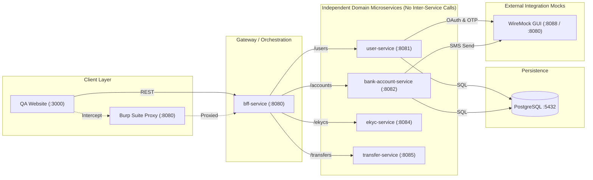

<div class="cover-slide">

<div class="cover-eyebrow">🏦 Banking Microservices POC</div>

# Ultra Smoooooth Testing

<div class="cover-subtitle">Microservices Integration Testing & Testing Strategy Workshop</div>

<div class="cover-tags">
  <span class="cover-tag">⚙️ Go Workspaces</span>
  <span class="cover-tag">🪝 WireMock</span>
  <span class="cover-tag">🛡️ Burp Suite</span>
  <span class="cover-tag">🎭 Playwright</span>
  <span class="cover-tag">🐳 Testcontainers</span>
</div>

<div class="cover-cta" @click="$slidev.nav.next">
  Start Workshop &nbsp;→
</div>

</div>

---
transition: fade-out
---

# 🏗 System Architecture

<div class="w-full flex justify-center items-center overflow-hidden my-auto py-2">



</div>

---

# 🛠️ Technology Stack & Infrastructure

<div class="tech-slide space-y-3 pt-2">

<div class="slide-card">
  <h3>⚙️ Core Runtime & Frameworks</h3>
  <ul>
    <li><span class="tech-badge">Go 1.26+</span> <strong>Go Workspaces (go.work)</strong>: Monorepo module synchronization across microservices.</li>
    <li><span class="tech-badge">Next.js 16</span> <strong>QA Web Frontend</strong>: Modern Web UI built with React 19 & Tailwind CSS.</li>
    <li><span class="tech-badge">PostgreSQL</span> <strong>Relational Database</strong>: Primary persistent storage with SQL transaction support.</li>
  </ul>
</div>

<div class="slide-card">
  <h3>🧪 Testing & Security Infrastructure</h3>
  <ul>
    <li><span class="tech-badge">WireMock</span> <strong>3rd-Party API Mocking</strong>: Stubbing external OAuth (Paotang Pass), OTP, & SMS gateways.</li>
    <li><span class="tech-badge">Burp Suite</span> <strong>MITM Proxy</strong>: Live HTTP traffic inspection, parameter tampering, & header injection.</li>
    <li><span class="tech-badge">Playwright</span> <strong>Testcontainers Suite</strong>: Containerized end-to-end and integration automation.</li>
  </ul>
</div>

</div>

---

# 🧱 Core Microservices

<div class="space-y-4 pt-2">

<div class="slide-card">
  <ul>
    <li>
      <div class="svc-name"><strong class="text-emerald-400">bff-service</strong> <span class="port-badge">:8080</span></div>
      <div class="svc-desc">API Gateway / Service Orchestrator (Stateless).</div>
    </li>
    <li>
      <div class="svc-name"><strong class="text-emerald-400">user-service</strong> <span class="port-badge">:8081</span></div>
      <div class="svc-desc">User identity, profile management, and Paotang Pass OAuth (PostgreSQL).</div>
    </li>
    <li>
      <div class="svc-name"><strong class="text-emerald-400">bank-account-service</strong> <span class="port-badge">:8082</span></div>
      <div class="svc-desc">Ledger accounts, balances, and transaction history (PostgreSQL).</div>
    </li>
    <li>
      <div class="svc-name"><strong class="text-emerald-400">ekyc-service</strong> <span class="port-badge">:8084</span></div>
      <div class="svc-desc">Identity verification pipeline and approval status tracking.</div>
    </li>
    <li>
      <div class="svc-name"><strong class="text-emerald-400">transfer-service</strong> <span class="port-badge">:8085</span></div>
      <div class="svc-desc">Inter-account fund transfer execution and logging.</div>
    </li>
  </ul>
</div>

</div>

---

# 🎯 Workshop Thinking Cases (1–5)

<div class="text-sm pt-1">

| Category | Challenge / Case | Core Assertions |
| :--- | :--- | :--- |
| **Workflow** | **Case 1: Fund Transfer Execution** | `httpStatus.Created`, balance deducted from source & added to target. |
| **Workflow** | **Case 2: eKYC-Gated Opening** | eKYC `APPROVED` ➔ `httpStatus.Created`; `REJECTED` ➔ `httpStatus.BadRequest`. |
| **Data Integrity** | **Case 3: Atomic Rollback** | Insufficient funds ➔ Rollback transaction without partial write. |
| **Data Integrity** | **Case 4: Race Condition** | Simultaneous debits ➔ Exactly 1 succeeds, second fails `400`. |
| **Resilience** | **Case 5: Outbound SMS Failure** | WireMock returns `503` ➔ Account creation succeeds (fail-soft). |

</div>

---

# 🎯 Workshop Thinking Cases (6–10)

<div class="text-sm pt-1">

| Category | Challenge / Case | Core Assertions |
| :--- | :--- | :--- |
| **Integrations** | **Case 6: OAuth Authcode Exchange** | Single-use authcode ➔ Replay rejected on 2nd attempt. |
| **BFF Layer** | **Case 7: BFF Data Aggregation** | Concurrently fetches user + accounts into unified payload. |
| **Contract** | **Case 8: Strict REST Schema** | Standardized JSON error response: `{"error": "...", "code": "..."}`. |
| **Resilience** | **Case 9: Timeout Fault Injection** | 10s latency injection ➔ HTTP client returns `504 Gateway Timeout`. |
| **Resilience** | **Case 10: Idempotency Key** | Duplicate requests ➔ Returns cached transaction result. |

</div>

---

# 🔄 WireMock Stateful Stubbing


<div class="slide-card" style="margin-top:1rem">

💡 **Key Takeaways**
- Use **Scenario State Machines** to test multi-step workflows.
- Prevent **Replay Attacks** — one-time auth codes rejected on 2nd attempt.
- Reset all scenarios between tests: `POST /__admin/scenarios/reset`

</div>

---

# 🔄 WireMock Stateful — Example

### Stub Mapping: `04-order-pay.json`

```json
{
  "scenarioName": "order-fulfillment-lifecycle",
  "requiredScenarioState": "Started",
  "newScenarioState": "PAID",
  "request": {
    "method": "POST",
    "urlPath": "/lab/api/orders/101/pay"
  },
  "response": { "status": 200 }
}
```

➡️ First `POST /pay` transitions state `Started → PAID`. A second call requires state `PAID` — any call in wrong state returns `409 Conflict`.

---

# ⚡ WireMock Stateless Stubbing & Matching

```json
{
  "priority": 1,
  "request": {
    "method": "POST",
    "urlPath": "/lab/api/stateless/payments",
    "headers": { "Authorization": { "matches": "Bearer secret-token-[0-9]+" } },
    "bodyPatterns": [{ "matchesJsonPath": "$.payment[?(@.amount > 1000)]" }]
  },
  "response": {
    "status": 201,
    "jsonBody": { "status": "APPROVED", "flag": "HIGH_VALUE_TRANSACTION" },
    "transformers": ["response-template"]
  }
}
```

<div class="text-xs opacity-75 pt-2">
  ✨ Supports JSONPath payload matching, regex headers, Handlebars response templating (<code>{{request.headers.X-Request-ID}}</code>), and artificial delay (<code>fixedDelayMilliseconds</code>).
</div>

---

# 🔀 Burp Suite — Proxy Intercept

<div class="slide-card">

### What it does
- Sits between client and bff-service as a **transparent MITM proxy**.
- **Pause, inspect, and modify** any request before forwarding.
- Inject custom headers to trigger specific WireMock stubs.
- Works with HTTP and HTTPS (install Burp CA cert first).

</div>

---

# 🔀 Proxy Intercept — Example

<div class="grid grid-cols-2 gap-4 pt-2">
<div>

### 📤 Original Request (Client)
```http
POST http://localhost:8080/api/v1/users HTTP/1.1
Host: localhost:8080
Content-Type: application/json

{
  "username": "testuser",
  "password": "secret"
}
```

</div>
<div>

### 🔀 After Burp Intercept (Modified)
```http
POST http://localhost:8080/api/v1/users HTTP/1.1
Host: localhost:8080
Content-Type: application/json
Mock-Scenario: PT_PASS:SUCCESS_ONCE

{
  "username": "testuser",
  "password": "secret"
}
```

<div class="inject-highlight">
  💉 Injected: <code>Mock-Scenario: PT_PASS:SUCCESS_ONCE</code>
</div>

</div>
</div>

---

# 🔁 Burp Suite — Repeater

<div class="slide-card">

### What it does
- Capture a request once, **replay it** unlimited times with manual edits.
- Test boundary values and malformed payloads **without writing code**.
- Verify exact error response contracts `{"error":"...","code":"..."}`.
- Compare responses side-by-side across runs.

</div>

---

# 🔁 Repeater — Example

### Boundary & Error Contract Testing

```typescript
import { HttpStatusCode } from "axios";

// Run 1: normal amount
const res1 = await request.post("/api/v1/transfers",
  { data: { amount: 500, to_account: "ACC-002" } });
expect(res1.status()).toBe(HttpStatusCode.Created);

// Run 2: negative amount
const res2 = await request.post("/api/v1/transfers",
  { data: { amount: -1, to_account: "ACC-002" } });
expect(res2.status()).toBe(HttpStatusCode.BadRequest);

// Run 3: SQL injection probe
const res3 = await request.post("/api/v1/transfers",
  { data: { amount: "1; DROP TABLE transfers;--" } });
expect(res3.status()).toBe(HttpStatusCode.BadRequest); // never 500
```

---

# 💣 Burp Suite — Intruder

<div class="slide-card">

### What it does
- **Automates fuzzing** across marked payload positions `§value§`.
- **Sniper mode**: one position, iterate through a wordlist.
- **Cluster Bomb mode**: multiple positions, combine all wordlists.
- Detect IDOR, brute-force IDs, and stress rate limiters.

</div>

---

# 💣 Intruder — Example

### IDOR Detection (Sniper Mode)

```
Target:  GET /api/v1/accounts/§ACCOUNT_ID§

Payload list:
  ACC-001, ACC-002, ACC-003, ACC-100 ...

Attack result:
  ACC-001 → 200 OK   ✅  own account
  ACC-002 → 200 OK   🚨  IDOR! other user's data exposed
  ACC-999 → 404      ✅  expected not found
```

➡️ Any `200 OK` on an account not owned by the test user = **IDOR vulnerability found**.

---

# 📋 Burp Suite — Logger / HTTP History

<div class="slide-card">

### What it does
- Full **real-time audit trail** of every request/response pair.
- Filter by host, HTTP method, status code, or response size.
- Compare requests across test runs to catch regressions.
- Export full session as a **HAR file** for CI pipeline evidence.

</div>

---

# 📋 Logger — Example

### Filter & Export for CI Evidence

```
HTTP History filters:
  Host:    localhost:8080
  Method:  POST
  Status:  4xx   ← highlight unexpected errors

Export → Save as session.har

# Use in CI pipeline:
npx playwright har-diff baseline.har session.har
→ Detect any new unexpected 500 errors
   or missing validation responses between builds
```

---

# 🧪 Playwright & Testcontainers Automation

```typescript
import { test, expect, APIRequestContext } from "@playwright/test";
import { HttpStatusCode } from "axios";
import { startNetwork, startPostgres, startWiremock, startBffService } from "../support/containers";

test.beforeAll(async () => {
  const network = await startNetwork();
  await startPostgres(network);
  await startWiremock(network, "paotang", [wiremockMapping("paotang", { flat: true })]);
  await startBffService(network, { USER_SERVICE_URL: "http://user-service:8080" });
});

test("fund transfer returns Created", async ({ request }) => {
  const res = await request.post("/api/v1/transfers",
    { data: { amount: 500, to_account: "ACC-002" } });
  expect(res.status()).toBe(HttpStatusCode.Created);
});

test.afterEach(async ({ request }: { request: APIRequestContext }) => {
  await request.post(`${wiremockUrl}/__admin/scenarios/reset`);
});
```

---

# 🛠️ Command Cheat Sheet

<div class="grid grid-cols-2 gap-4 text-xs pt-4">
<div>

### 🏗 Local Development (`Makefile`)
```bash
# Build all Go service binaries in ./bin/
make build

# Run unit tests across all microservices
make test

# Sync go.work dependencies
make sync
```

</div>
<div>

### 🧪 Automated Integration
```bash
# Run Integration Tests with Testcontainers
make test-integration

# Run Playwright E2E Browser Tests
make test-e2e
```

</div>
</div>

---
layout: center
class: text-center
---

# 🎉 Thank You!
## Happy Ultra Smoooooth Testing

[GitHub Repository](https://github.com/SiwakornSitti/ultra-smoooooth-testing) • [Workshop Guide](WORKSHOP.md)
