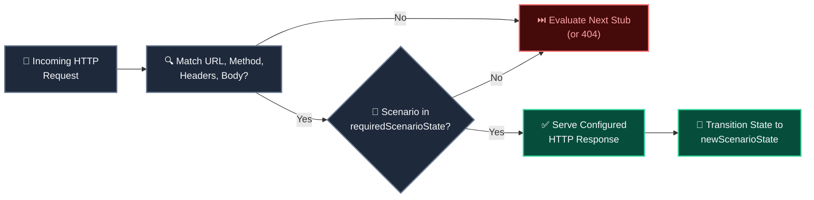
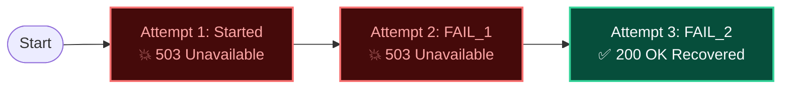

<div class="flex justify-center items-center w-full h-full my-auto">
  <div class="cover-poster-container">
    
  </div>
</div>

---
class: pt-3 pb-2 px-8
---

# ⚠️ The Testing Crisis

### Why Traditional Microservice Testing Fails in Practice

<div class="grid grid-cols-2 gap-3 mt-1.5">

<v-clicks>

<div class="slide-card p-3 border-rose-500/40 bg-rose-950/20">
  <h3 class="text-rose-400 font-bold mb-1 text-base flex items-center gap-1.5">
    <span>🌪️</span> 1. The Flakiness Spiral
  </h3>
  <p class="text-slate-300 text-xs leading-relaxed">
    Shared staging databases and unstable 3rd-party sandboxes cause <strong>40%+ false-positive CI failures</strong>. Teams start ignoring red pipelines.
  </p>
  <div class="mt-1.5 text-rose-300 font-mono text-[11px]">
    🚨 "Just re-run CI until it passes" anti-pattern.
  </div>
</div>

<div class="slide-card p-3 border-amber-500/40 bg-amber-950/20">
  <h3 class="text-amber-400 font-bold mb-1 text-base flex items-center gap-1.5">
    <span>⏳</span> 2. The Debugging Black Hole
  </h3>
  <p class="text-slate-300 text-xs leading-relaxed">
    Engineers waste <strong>5+ hours/week</strong> triaging "works on my machine" drift, port collisions, and orphan background zombie processes.
  </p>
  <div class="mt-1.5 text-amber-300 font-mono text-[11px]">
    🚨 Discrepancy between macOS and Linux CI runners.
  </div>
</div>

<div class="slide-card p-3 border-amber-500/40 bg-amber-950/20">
  <h3 class="text-amber-400 font-bold mb-1 text-base flex items-center gap-1.5">
    <span>💸</span> 3. Third-Party Sandbox Quotas &amp; Lock-in
  </h3>
  <p class="text-slate-300 text-xs leading-relaxed">
    Payment and SMS provider test environments have <strong>rate limits, maintenance windows, and billing costs</strong> that block parallel pull requests.
  </p>
  <div class="mt-1.5 text-amber-300 font-mono text-[11px]">
    🚨 Blocked deployments waiting on sandbox stability.
  </div>
</div>

<div class="slide-card p-3 border-emerald-500/40 bg-emerald-950/20">
  <h3 class="text-emerald-400 font-bold mb-1 text-base flex items-center gap-1.5">
    <span>🎯</span> 4. The Goal: Ultra Smoooooth
  </h3>
  <p class="text-slate-300 text-xs leading-relaxed">
    Achieve <strong>100% deterministic, hermetic, sub-second test execution</strong> on local laptops and CI with zero shared infrastructure flakiness.
  </p>
  <div class="mt-1.5 text-emerald-300 font-mono text-[11px]">
    ✨ Green locally = Guaranteed green in CI.
  </div>
</div>

</v-clicks>

</div>

---
class: agenda-slide pt-4 pb-2 px-8
---

# 📋 Workshop Agenda

### What We'll Cover Today

<div class="agenda-grid">

<v-clicks>

<div class="agenda-card">
  <h3>🏗️ Part 1 — Ecosystem Architecture</h3>
  <p>Go Workspace monorepo, microservices topology, and technology stack overview.</p>
</div>

<div class="agenda-card">
  <h3>🪝 Part 2 — WireMock Deep Dive</h3>
  <p>Request matching, priority stubs, Handlebars templating, and state machines.</p>
</div>

<div class="agenda-card">
  <h3>🛡️ Part 3 — Burp Suite MITM</h3>
  <p>HTTP intercept, header tampering, Intruder fuzzing, and traffic auditing.</p>
</div>

<div class="agenda-card">
  <h3>🐳 Part 4 — Testcontainers</h3>
  <p>Ephemeral container lifecycle, dynamic port binding, and bootstrapping.</p>
</div>

<div class="agenda-card col-span-2">
  <h3>🎭 Part 5 — Playwright (Full-Stack Automation)</h3>
  <p>Web locators, dynamic route mock steering, native device bridge injection, and CI trace diagnostics.</p>
</div>

</v-clicks>

</div>

---
class: strategy-slide
---

# 🎯 Testing Strategy & Core Pillars

### Comprehensive Architectural Foundations for Integration Testing

<div class="strategy-grid text-sm">

<v-click>
<div class="slide-card">
  <h3 class="text-emerald-400 font-bold mb-1 text-base">🌐 1. External API Virtualization (WireMock)</h3>
  <p class="text-slate-300 leading-relaxed">
    Virtualize all third-party external integrations with deterministic stateful stubs, dynamic Handlebars responses, and zero sandbox dependencies.
  </p>
</div>
</v-click>

<v-click>
<div class="slide-card">
  <h3 class="text-emerald-400 font-bold mb-1 text-base">⚡ 2. In-Flight Traffic Interception (Burp Suite)</h3>
  <p class="text-slate-300 leading-relaxed">
    Intercept live HTTP traffic in-flight, tamper with payloads, inject fault scenarios, and probe security/IDOR boundaries.
  </p>
</div>
</v-click>

<v-click>
<div class="slide-card">
  <h3 class="text-emerald-400 font-bold mb-1 text-base">🐳 3. Hermetic Infrastructure (Testcontainers)</h3>
  <p class="text-slate-300 leading-relaxed">
    Execute integration suites against isolated, ephemeral Docker containers with dynamic ports and guaranteed Ryuk teardown.
  </p>
</div>
</v-click>

<v-click>
<div class="slide-card">
  <h3 class="text-emerald-400 font-bold mb-1 text-base">🎭 4. Full-Stack E2E Automation (Playwright)</h3>
  <p class="text-slate-300 leading-relaxed">
    Drive unified browser DOM interactions and headless REST API validation with zero-flake auto-waiting assertions and rich tracing.
  </p>
</div>
</v-click>

</div>

---

# 🌐 Pillar 1: External API Virtualization (WireMock)

### Eliminating External API Dependencies & Sandbox Flakiness

<div class="multi-col-grid-2">

<div class="col-card space-y-3">
  <h3 class="text-emerald-400">🪝 Architectural Role</h3>
  <div class="text-sm text-slate-200 space-y-3 leading-relaxed">
    <div>
      <strong class="text-emerald-300 block text-base font-bold mb-0.5">1. Third-Party Simulation</strong>
      Virtualize Paotang OAuth (<code>/oauth/token</code>) and SMS gateways with lightweight HTTP stubs.
    </div>
    <div>
      <strong class="text-emerald-300 block text-base font-bold mb-0.5">2. Deterministic Edge Cases</strong>
      Instantly test token expiration, rate-limit throttling, HTTP 503, and network timeouts on demand.
    </div>
    <div>
      <strong class="text-emerald-300 block text-base font-bold mb-0.5">3. Zero Limits &amp; Zero Billing</strong>
      Execute thousands of CI/CD test runs without provider sandboxes or billing quotas.
    </div>
  </div>
</div>

<div class="col-card">
  <h3 class="text-emerald-400">📄 Mapping Stub Example</h3>

```json
{
  "request": {
    "method": "POST",
    "url": "/oauth/token",
    "headers": {
      "Mock-Scenario": { "contains": "SUCCESS" }
    }
  },
  "response": {
    "status": 200,
    "jsonBody": {
      "access_token": "mock_jwt_paotang_9988",
      "token_type": "Bearer",
      "expires_in": 3600
    }
  }
}
```

</div>

</div>

---

# ⚡ Pillar 2: In-Flight Traffic Interception (Burp Suite)

### Live MITM Traffic Inspection, Fault Injection & Security Boundaries

<div class="multi-col-grid-2">

<div class="col-card space-y-3">
  <h3 class="text-amber-400">🔀 MITM Interception Role</h3>
  <div class="text-sm text-slate-200 space-y-3 leading-relaxed">
    <div>
      <strong class="text-amber-300 block text-base font-bold mb-0.5">1. Transparent In-Flight Proxy</strong>
      Sits between browser / mobile WebViews and backend services to inspect and alter HTTP traffic.
    </div>
    <div>
      <strong class="text-amber-300 block text-base font-bold mb-0.5">2. Mock-Scenario Header Steering</strong>
      Inject <code>Mock-Scenario: PAOTANG:SUCCESS</code> on the fly to steer stubs without code modifications.
    </div>
    <div>
      <strong class="text-amber-300 block text-base font-bold mb-0.5">3. Response Status &amp; Payload Tampering</strong>
      Mutate backend responses into HTTP 401/500 to test frontend fallback UI banners and error handling.
    </div>
  </div>
</div>

<div class="col-card">
  <h3 class="text-amber-400">📡 Intercepted HTTP Packet</h3>

```http
POST /api/v1/auth/login HTTP/1.1
Host: localhost:8080
Content-Type: application/json
Mock-Scenario: PAOTANG:SUCCESS,OTP:SUCCESS

{
  "auth_code": "auth_code_live_7721",
  "phone": "0812345678"
}
```

  <div class="text-sm text-slate-200 mt-2 font-medium">
    💡 Injects scenario headers directly in-flight before forwarding to BFF.
  </div>
</div>

</div>

---

# 🐳 Pillar 3: Hermetic Infrastructure (Testcontainers)

### Isolated Ephemeral Containers, Dynamic Ports & Automatic Teardown

<div class="multi-col-grid-2">

<div class="col-card space-y-3">
  <h3 class="text-cyan-400">🐳 Hermetic Lifecycle Role</h3>
  <div class="text-sm text-slate-200 space-y-3 leading-relaxed">
    <div>
      <strong class="text-cyan-300 block text-base font-bold mb-0.5">1. Ephemeral On-Demand Instances</strong>
      Spins up clean PostgreSQL 16 and WireMock instances directly inside test suite hooks.
    </div>
    <div>
      <strong class="text-cyan-300 block text-base font-bold mb-0.5">2. Dynamic Randomized Ports</strong>
      Assigns randomized host ports to eliminate port collisions across developer workstations &amp; CI.
    </div>
    <div>
      <strong class="text-cyan-300 block text-base font-bold mb-0.5">3. Guaranteed Ryuk Teardown</strong>
      Automatic Moby Ryuk container removes all network bridges and volumes—zero orphan leaks.
    </div>
  </div>
</div>

<div class="col-card">
  <h3 class="text-cyan-400">💻 Code-Driven Container Bootstrap</h3>

```typescript
// tests/specs/support/containers.ts
const postgres = await new PostgreSqlContainer("postgres:16-alpine")
  .withDatabase("ultrasmooth")
  .start();

const wiremock = await new GenericContainer("wiremock/wiremock:3.3.1")
  .withExposedPorts(8080)
  .start();

process.env.DB_PORT = postgres.getMappedPort(5432).toString();
process.env.WIREMOCK_PORT = wiremock.getMappedPort(8080).toString();
```

</div>

</div>

---

# 🎭 Pillar 4: Full-Stack E2E Automation (Playwright)

### Unified Browser Automation, REST API Testing & Zero Flakiness

<div class="multi-col-grid-2">

<div class="col-card space-y-3">
  <h3 class="text-purple-400">🎭 Full-Stack Test Engine</h3>
  <div class="text-sm text-slate-200 space-y-3 leading-relaxed">
    <div>
      <strong class="text-purple-300 block text-base font-bold mb-0.5">1. Unified UI + API Testing</strong>
      Drive browser DOM interactions and headless REST verification in the same test spec.
    </div>
    <div>
      <strong class="text-purple-300 block text-base font-bold mb-0.5">2. Web-First Auto-Waiting</strong>
      Eliminates flaky <code>sleep()</code> by dynamically awaiting element visibility and network idle.
    </div>
    <div>
      <strong class="text-purple-300 block text-base font-bold mb-0.5">3. Post-Mortem CI Tracing</strong>
      Captures DOM snapshots, action timelines, and network waterfalls for failure analysis.
    </div>
  </div>
</div>

<div class="col-card">
  <h3 class="text-purple-400">💻 Full-Stack TypeScript Spec</h3>

```typescript
// tests/specs/e2e/website.spec.ts
test("Paotang login verifies OTP & redirects", async ({ page, request }) => {
  mockScenario(page)("PAOTANG:SUCCESS", "OTP:SUCCESS");

  await page.goto(`${websiteUrl}/login`);
  await page.getByTestId("btn-paotang-login").click();
  await expect(page).toHaveURL(/\/dashboard$/);

  const res = await request.get(`${bffUrl}/api/v1/users/me`);
  expect(res.status()).toBe(200);
});
```

</div>

</div>

---
layout: section
---

# 🏗️ Part 1
## Ecosystem Architecture

<p class="section-narrative">
  Before we can eliminate test flakiness, we need to understand our system topology: a Go Workspace monorepo, 6 microservices, PostgreSQL, and external provider integrations.
</p>


---

# 🗺️ Detailed Service Topology & Flow

```mermaid {scale: 0.62}
flowchart LR
    subgraph Clients["🌐 1. Client & Automation Layer (Playwright & Burp)"]
        Website["💻 Web Application<br/>Next.js :3000"]
        Playwright["🎭 Playwright E2E<br/>Runner"]
        Burp["🛡️ Burp MITM Proxy<br/>:8080"]
    end

    subgraph API_Gateway["⚡ 2. Gateway & Orchestration Layer"]
        BFF["⚙️ bff-service<br/>Go :8080"]
    end

    subgraph Core_Services["🏡 3. Microservices Domain Layer (Go Workspace)"]
        UserService["👤 user-service<br/>:8081"]
        BankService["🏦 bank-account-service<br/>:8082"]
        EKYCService["🪪 ekyc-service<br/>:8084"]
        TransferService["💸 transfer-service<br/>:8085"]
        OTPService["🔑 otp-service<br/>:8087"]
    end

    subgraph Persistence["🗄️ 4. Persistence Layer"]
        DB[("🐘 PostgreSQL DB<br/>:5432")]
    end

    subgraph External_Mocks["🤖 5. External Mocks (WireMock Virtualization)"]
        WireMock["🪝 WireMock Stubs<br/>:8088"]
        PaotangProvider["💳 Paotang Provider"]
        SMSProvider["📡 SMS Provider"]
    end

    Website -->|REST| BFF
    Playwright -->|E2E + page.addInitScript| Website
    Website -.->|MITM Intercept| Burp
    Burp -.->|Proxied REST| BFF

    BFF -->|/users| UserService
    BFF -->|/accounts| BankService
    BFF -->|/ekycs| EKYCService
    BFF -->|/transfers| TransferService
    BFF -->|/auth/otp/verify| OTPService

    UserService -->|SQL| DB
    BankService -->|SQL| DB
    TransferService -->|SQL| DB

    UserService -->|OAuth via WireMock| WireMock
    OTPService -->|Send SMS via WireMock| WireMock
    WireMock -.->|Proxy Unmatched| PaotangProvider
    WireMock -.->|Proxy Unmatched| SMSProvider

    classDef client fill:#0e7490,stroke:#67e8f9,color:#f8fafc,stroke-width:3px
    classDef gateway fill:#1d4ed8,stroke:#93c5fd,color:#ffffff,stroke-width:3px
    classDef core fill:#047857,stroke:#6ee7b7,color:#ffffff,stroke-width:3px
    classDef persistence fill:#4338ca,stroke:#c4b5fd,color:#ffffff,stroke-width:3px
    classDef external fill:#b45309,stroke:#fcd34d,color:#fff7ed,stroke-width:3px

    class Website,Playwright,Burp client
    class BFF gateway
    class UserService,BankService,EKYCService,TransferService,OTPService core
    class DB persistence
    class WireMock,PaotangProvider,SMSProvider external

    style Clients fill:#082f49,stroke:#0891b2,stroke-width:2px,color:#cffafe
    style API_Gateway fill:#172554,stroke:#2563eb,stroke-width:2px,color:#dbeafe
    style Core_Services fill:#052e2b,stroke:#059669,stroke-width:2px,color:#d1fae5
    style Persistence fill:#1e1b4b,stroke:#7c3aed,stroke-width:2px,color:#ede9fe
    style External_Mocks fill:#451a03,stroke:#d97706,stroke-width:2px,color:#ffedd5
```


<div class="topology-diagram w-full flex justify-center items-center my-auto py-1">



</div>

---

# ⚙️ Technology Stack — Core Runtime & Services

### Monorepo Workspaces, Modern Web & Relational Persistence

<div class="slide-card text-sm space-y-3 pt-2">

<div>
  <h3 class="text-emerald-400 font-bold mb-1 text-base">🐹 Go Workspaces (`go.work`)</h3>
  <p class="text-slate-300 leading-relaxed">
    Unifies all 6 microservices in a single monorepo with cross-service dependency synchronization, fast incremental compilation, and shared domain models.
  </p>
</div>

<div>
  <h3 class="text-emerald-400 font-bold mb-1 text-base">⚛️ Next.js 19</h3>
  <p class="text-slate-300 leading-relaxed">
    Modern React 19 application with Tailwind CSS for testing full-stack user journeys, authentication flows, and dynamic client routing.
  </p>
</div>

<div>
  <h3 class="text-emerald-400 font-bold mb-1 text-base">🐘 PostgreSQL Relational Database</h3>
  <p class="text-slate-300 leading-relaxed">
    Provides transactional ACID integrity for bank balances, atomic transfer rollbacks, and concurrent debit race condition testing.
  </p>
</div>

</div>

---
class: compact-stack-slide
---

# 🧪 Technology Stack — Testing & Security Infrastructure

### Mocking, MITM Proxy, Ephemeral Containers & E2E Engine

<div class="slide-card text-sm space-y-2.5 pt-2">

<div>
  <h3 class="text-emerald-400 font-bold mb-1 text-base">🪝 WireMock (API Virtualization)</h3>
  <p class="text-slate-300 leading-relaxed">
    Stubs external Paotang Pass OAuth and SMS gateways with dynamic Handlebars response templating, latency injection, and stateful machines.
  </p>
</div>

<div>
  <h3 class="text-emerald-400 font-bold mb-1 text-base">🛡️ Burp Suite (MITM Proxy)</h3>
  <p class="text-slate-300 leading-relaxed">
    Enables live HTTP inspection, parameter tampering, and automated Intruder fuzzing to uncover IDOR security vulnerabilities.
  </p>
</div>

<div>
  <h3 class="text-emerald-400 font-bold mb-1 text-base">🐳 Testcontainers (Ephemeral Infrastructure)</h3>
  <p class="text-slate-300 leading-relaxed">
    Spins up disposable PostgreSQL and WireMock Docker containers with dynamic ports and automatic Moby Ryuk garbage collection.
  </p>
</div>

<div>
  <h3 class="text-emerald-400 font-bold mb-1 text-base">🎭 Playwright (Full-Stack Test Runner)</h3>
  <p class="text-slate-300 leading-relaxed">
    Drives headless browser E2E workflows and direct backend REST API integration tests with auto-waiting assertions and tracing.
  </p>
</div>

</div>

---
layout: section
---

# 🪝 Part 2
## WireMock — External API Virtualization

<p class="section-narrative">
  We know our architecture, but external third-party dependencies (OAuth, SMS) are unpredictable and fragile. How do we virtualize external APIs deterministically? Enter WireMock.
</p>


---

# 🪝 What is WireMock? — Core Capabilities

### Programmable HTTP Mock Server for External API Simulation

<div class="multi-col-grid-3">

<div class="col-card">
  <h3 class="text-emerald-400">🌐 Precision Matching</h3>
  <p>Match incoming HTTP traffic by exact URLs, regex patterns, custom headers (e.g. <code>Mock-Scenario</code>), query parameters, and semantic JSON payloads.</p>
</div>

<div class="col-card">
  <h3 class="text-emerald-400">🪄 Dynamic Templating</h3>
  <p>Echo client request parameters, compute arithmetic fee calculations, and generate ISO dates/UUIDs dynamically via Handlebars.</p>
</div>

<div class="col-card">
  <h3 class="text-emerald-400">⚡ Chaos &amp; FSM (Finite State Machine)</h3>
  <p>Inject network latency, dropped TCP sockets, and model multi-step lifecycles (e.g. <code>Started → PAID</code>) with automatic test reset.</p>
</div>

</div>

---

# 🎯 Why WireMock in Testing?

### Deterministic Isolation, Zero Sandbox Flakiness & Fast Test Execution

<div class="multi-col-grid-3">

<div class="col-card">
  <h3 class="text-emerald-400">🛡️ Hermetic Isolation</h3>
  <p>Eliminates third-party sandbox flakiness and maintenance windows by simulating SMS, OAuth, and banking APIs with deterministic local stubs.</p>
</div>

<div class="col-card">
  <h3 class="text-emerald-400">⚡ Sub-Millisecond Speed</h3>
  <p>Executes tests in sub-milliseconds with zero remote network roundtrips, zero API credit costs, and zero provider rate-limit throttling.</p>
</div>

<div class="col-card">
  <h3 class="text-emerald-400">🔄 Live Proxy &amp; Record</h3>
  <p>Records real-world HTTP traffic directly into JSON stub definitions and transparently proxies unmapped routes to live upstream providers.</p>
</div>

</div>

---

# ⚡ WireMock — URL & Path Matching

### Exact Path Routing, Regex Patterns & Query Strings

<div class="multi-col-grid-2">

<div class="col-card">
  <h3 class="text-emerald-400">🌐 Path Matcher Operators</h3>
  <ul class="space-y-1.5 text-slate-300 text-sm">
    <li>• <strong><code>url</code></strong>: Matches full absolute path <em>including</em> query parameters.</li>
    <li>• <strong><code>urlPath</code></strong>: Matches URI path only, safely ignoring query parameters.</li>
    <li>• <strong><code>urlPathPattern</code></strong>: Regular expression matching on URI paths.</li>
    <li>• <strong><code>urlPattern</code></strong>: Regular expression matching on the complete URL.</li>
  </ul>
</div>

<div class="col-card">
  <h3 class="text-emerald-400">💡 Best Practice &amp; Dynamic Routing</h3>
  <p class="mb-2">
    Use <strong><code>urlPath</code></strong> for stable REST endpoints when query strings vary, and <strong><code>urlPathPattern</code></strong> for dynamic path parameters (e.g. UUIDs, IDs).
  </p>
  <div class="slide-card text-sm mt-auto bg-slate-900/60 p-2.5 border-emerald-500/30">
    🎯 <em>Example</em>: <code>/lab/api/users/[0-9a-f-]+</code> safely matches any valid UUID path without hardcoding.
  </div>
</div>

</div>

---

# ⚡ WireMock — Header Matching Operators

### Exact Matches, Substrings, Regex & Absence Checks

<div class="multi-col-grid-2">

<div class="col-card">
  <h3 class="text-emerald-400">🏷️ Operator Reference</h3>
  <ul class="space-y-1.5 text-slate-300 text-sm">
    <li>• <strong><code>equalTo</code></strong>: Exact case-sensitive match (e.g. <code>Content-Type: application/json</code>).</li>
    <li>• <strong><code>matches</code></strong>: Regular expression on header value (e.g. <code>Bearer [A-Za-z0-9-_\\.]+</code>).</li>
    <li>• <strong><code>contains</code></strong>: Substring check (e.g. <code>Mock-Scenario: TRANSFER:INSUFFICIENT_FUNDS</code>).</li>
    <li>• <strong><code>absent</code></strong>: Asserts header is completely omitted from the request.</li>
  </ul>
</div>

<div class="col-card">
  <h3 class="text-emerald-400">🛡️ Auth &amp; Mock Steer Patterns</h3>
  <p class="mb-2">
    Steer test scenarios dynamically via custom headers while verifying authorization tokens and security boundaries.
  </p>
  <div class="slide-card text-sm mt-auto bg-slate-900/60 p-2.5 border-emerald-500/30">
    💉 <em>Header Steering</em>: Allows frontend tests and Burp MITM to select specific mock responses dynamically without restarting services.
  </div>
</div>

</div>

---

# ⚡ WireMock — Query Parameter & Cookie Filters

### Parameter Flags, Cookie Assertions & Multi-Criteria Conjunction

<div class="multi-col-grid-2">

<div class="col-card">
  <h3 class="text-emerald-400">🔍 Query &amp; Cookie Filters</h3>
  <ul class="space-y-1.5 text-slate-300 text-sm">
    <li>• <strong><code>queryParameters</code></strong>: Match query flags (e.g. <code>?active=true</code>) or numeric limits (<code>?limit=10</code>).</li>
    <li>• <strong><code>cookies</code></strong>: Assert session, authentication, or tracking cookies.</li>
    <li>• <strong><code>absent: true</code></strong>: Verify optional query parameters or cookies are omitted.</li>
  </ul>
</div>

<div class="col-card">
  <h3 class="text-emerald-400">⚡ Multi-Criteria Conjunction Rule</h3>
  <p class="mb-2">
    WireMock evaluates HTTP method, path, headers, and query parameters simultaneously. <strong>All defined matchers must evaluate to true</strong> for a match.
  </p>
  <div class="slide-card text-sm mt-auto bg-slate-900/60 p-2.5 border-emerald-500/30">
    ⚖️ If any single matcher fails, WireMock cascades evaluation to the next priority stub.
  </div>
</div>

</div>

---

# ⚡ Request Matching — URL & Header Example

### Regex Path Routing & Bearer JWT Validation

```json
{
  "request": {
    "method": "GET",
    "urlPathPattern": "/lab/api/users/[0-9]+",
    "headers": {
      "Authorization": { "matches": "Bearer [A-Za-z0-9-_]+" },
      "Mock-Scenario": { "contains": "ACCOUNT_ACTIVE" }
    }
  },
  "response": {
    "status": 200,
    "jsonBody": { "status": "ACTIVE" }
  }
}
```

<div class="slide-card text-sm mt-3">
  🎯 <strong>Key Features</strong>: Matches any numeric user ID (e.g. <code>/users/101</code>), validates Bearer token format, and routes based on <code>Mock-Scenario: ACCOUNT_ACTIVE</code>.
</div>

---

# ⚡ Request Matching — Query Parameter Example

### Query Flag Filtering & Multi-Criteria Evaluation

```json
{
  "request": {
    "method": "GET",
    "urlPath": "/lab/api/users/filter",
    "queryParameters": {
      "active": { "equalTo": "true" },
      "limit": { "matches": "[0-9]+" }
    }
  },
  "response": {
    "status": 200,
    "jsonBody": { "count": 10, "users": [] }
  }
}
```

<div class="slide-card text-sm mt-3">
  🏷️ <strong>Key Features</strong>: Enforces exact flag matching (<code>?active=true</code>) and regex numeric limits (<code>?limit=10</code>). All criteria must match simultaneously.
</div>

---

# ⚖️ WireMock — Priority & Matching Precedence

### Resolution Hierarchy for Overlapping Stub Mappings

<div class="multi-col-grid-2">

<div class="col-card">
  <h3 class="text-emerald-400">⚡ Precedence Hierarchy</h3>
  <p class="mb-2">
    Lower integer value = <strong>Higher Precedence</strong> (<code>1 &gt; 5 &gt; 10 &gt; 100</code>). WireMock stops evaluation on the first matching highest-priority stub.
  </p>
  <ul class="space-y-1 text-slate-300 text-sm mt-auto">
    <li>• <strong>Priority 1</strong>: Specific Error & Fault Overrides</li>
    <li>• <strong>Priority 5–10</strong>: Default Happy Path Stubs</li>
    <li>• <strong>Priority 100</strong>: Catch-All Proxy Fallback</li>
  </ul>
</div>

<div class="col-card">
  <h3 class="text-emerald-400">🔢 Default Priority &amp; Evaluation</h3>
  <p class="mb-2">
    If the <code>"priority"</code> field is omitted in a JSON mapping file, WireMock automatically assigns a default priority of <strong>5</strong>.
  </p>
  <div class="slide-card text-sm mt-auto bg-slate-900/60 p-2.5 border-emerald-500/30">
    💡 <em>Resolution</em>: Highest priority (lowest number) wins. If stubs share the same priority, the most recently loaded stub takes precedence.
  </div>
</div>

</div>

---

# 🥇 Priority Tier 1: Specific Error Overrides

### Fault Injection & Error Contracts

```json
{
  "priority": 1,
  "request": {
    "method": "POST",
    "urlPath": "/lab/api/transfers",
    "headers": { "Mock-Scenario": { "contains": "INSUFFICIENT_FUNDS" } }
  },
  "response": {
    "status": 400,
    "jsonBody": { "code": "ERR_INSUFFICIENT_FUNDS" }
  }
}
```

<div class="slide-card text-sm mt-3">
  🎯 <strong>Purpose &amp; Scope</strong>: Highest precedence override (<code>priority: 1</code>) for explicit error contracts and fault simulation triggered via <code>Mock-Scenario</code> headers.
</div>

---

# 🥈 Priority Tier 5–10: Default Happy Paths

### Standard Business Logic & Route Matchers

```json
{
  "priority": 10,
  "request": {
    "method": "POST",
    "urlPath": "/lab/api/transfers"
  },
  "response": {
    "status": 201,
    "jsonBody": { "status": "COMPLETED" }
  }
}
```

<div class="slide-card text-sm mt-3">
  🎯 <strong>Purpose &amp; Scope</strong>: Default domain responses (<code>200 OK</code> / <code>201 Created</code>) matching standard routes when no scenario steering headers are present.
</div>

---

# 🛡️ Priority Tier 100: Catch-All Proxy

### Transparent Fallback to Real Downstream Endpoints

```json
{
  "priority": 100,
  "request": {
    "urlPattern": "/.*"
  },
  "response": {
    "proxyBaseUrl": "https://api.external-provider.com"
  }
}
```

<div class="slide-card text-sm mt-3">
  🎯 <strong>Purpose &amp; Scope</strong>: Lowest priority catch-all proxy stubs that forward any unmatched traffic to live downstream environments or external legacy services.
</div>

---

# ⚖️ Priority Precedence in Action

### Comparing Matched Stubs: Scenario Override vs. Default Route

<div class="multi-col-grid-2 gap-3 mb-1.5">

<div class="col-card p-2.5 space-y-1 bg-slate-900/60 border-rose-500/30">
  <h3 class="text-rose-400 text-sm mb-0.5">🥇 Case A: Header Present (Priority 1 Wins)</h3>
  <div class="text-[11px] text-slate-300">
    <code>POST /lab/api/transfers</code> + <span class="text-amber-300">Mock-Scenario: INSUFFICIENT_FUNDS</span>
  </div>
  <div class="bg-slate-950/90 rounded p-1.5 border border-rose-500/40 font-mono text-[11px] text-rose-200 mt-auto">
    <div class="text-[10px] text-slate-400 font-sans mb-0.5">💥 Evaluated Response:</div>
    <code>HTTP/1.1 400 Bad Request<br/>
    {"code": "ERR_INSUFFICIENT_FUNDS"}</code>
  </div>
  <p class="text-rose-300/80 text-[11px] leading-tight">
    Matches Priority 1 error stub explicitly; evaluation terminates immediately.
  </p>
</div>

<div class="col-card p-2.5 space-y-1 bg-slate-900/60 border-emerald-500/30">
  <h3 class="text-emerald-400 text-sm mb-0.5">🥈 Case B: Header Absent (Falls to Priority 10)</h3>
  <div class="text-[11px] text-slate-300">
    <code>POST /lab/api/transfers</code> (Standard request, no steer header)
  </div>
  <div class="bg-slate-950/90 rounded p-1.5 border border-emerald-500/40 font-mono text-[11px] text-emerald-200 mt-auto">
    <div class="text-[10px] text-slate-400 font-sans mb-0.5">✅ Evaluated Response:</div>
    <code>HTTP/1.1 201 Created<br/>
    {"status": "COMPLETED"}</code>
  </div>
  <p class="text-emerald-300/80 text-[11px] leading-tight">
    Priority 1 check fails (missing header); cascades down to Priority 10 happy path.
  </p>
</div>

</div>

<div class="slide-card text-xs bg-slate-900/70 border-cyan-500/50 p-2 flex items-center gap-2 shadow-lg">
  <span class="text-base">💡</span>
  <span class="text-slate-200 leading-snug"><strong>Resolution Rule</strong>: Lowest integer priority wins first. Cascades downward until a stub's full criteria (URL, method, headers, body) match.</span>
</div>

---

# 🔀 Multi-Scenario Steering — Comma-Separated Headers

### Steer Multiple Downstream Services from a Single Test Request

<div class="multi-col-grid-2 gap-3 mb-1.5">

<div class="col-card p-2.5 space-y-1.5">
  <h3 class="text-cyan-400 text-sm mb-0.5">📤 1. Injected Steering Header</h3>
  <p class="text-slate-300 text-xs leading-relaxed">
    Playwright or Burp Suite injects a single comma-separated header targeting multiple downstream dependencies:
  </p>
  <div class="bg-slate-950/80 rounded p-1.5 border border-cyan-500/40 font-mono text-xs text-cyan-200 mt-auto">
    <code>Mock-Scenario: PAOTANG:SUCCESS,OTP:EXPIRED,TRANSFER:FAIL</code>
  </div>
</div>

<div class="col-card p-2.5 space-y-1.5">
  <h3 class="text-emerald-400 text-sm mb-0.5">🎯 2. Independent Stub Matching (<code>contains</code>)</h3>
  <ul class="space-y-0.5 text-slate-200 text-xs leading-relaxed">
    <li>• <strong>Paotang Stub</strong>: <code>"contains": "PAOTANG:SUCCESS"</code> ➔ <span class="text-emerald-400 font-semibold">200 OK</span></li>
    <li>• <strong>OTP Stub</strong>: <code>"contains": "OTP:EXPIRED"</code> ➔ <span class="text-rose-400 font-semibold">400 Expired</span></li>
    <li>• <strong>Transfer Stub</strong>: <code>"contains": "TRANSFER:FAIL"</code> ➔ <span class="text-rose-400 font-semibold">500 Error</span></li>
  </ul>
  <div class="bg-slate-950/80 rounded p-1.5 border border-emerald-500/40 font-mono text-xs text-emerald-200 mt-auto">
    <code>"headers": { "Mock-Scenario": { "contains": "OTP:EXPIRED" } }</code>
  </div>
</div>

</div>

<div class="slide-card text-xs bg-slate-900/70 border-cyan-500/50 p-2 flex items-center gap-2 shadow-lg">
  <span class="text-base">💡</span>
  <span class="text-slate-200 leading-snug"><strong>Orchestration Benefit</strong>: Using <code>contains</code> instead of <code>equalTo</code> allows a single test case to orchestrate complex multi-service branch paths simultaneously.</span>
</div>

---

# 📦 WireMock — Semantic JSON Matching (`equalToJson`)

### Data & Structural Meaning vs. Raw Character Matching

<div class="multi-col-grid-2 gap-3 mb-1.5">

<div class="col-card p-2.5 space-y-1.5">
  <h3 class="text-rose-400 text-sm mb-0.5">❌ Literal String Matching (Raw Text)</h3>
  <ul class="space-y-0.5 text-slate-200 text-xs leading-relaxed">
    <li>• <strong>Character Stream</strong>: Treats JSON as unparsed dumb text.</li>
    <li>• ⚠️ <strong>Spacing Sensitive</strong>: <code>{"a":1}</code> ≠ <code>{"a": 1}</code>.</li>
    <li>• ⚠️ <strong>Newline Sensitive</strong>: Indented JSON triggers test failure.</li>
    <li>• ⚠️ <strong>Key Order Sensitive</strong>: <code>{"a":1,"b":2}</code> ≠ <code>{"b":2,"a":1}</code>.</li>
  </ul>
  <div class="bg-rose-950/50 rounded p-1.5 border border-rose-500/40 text-xs text-rose-200 mt-auto flex items-center justify-between font-mono">
    <span>{"a":1, "b":2}</span>
    <span class="text-rose-400 font-bold font-sans">❌ NO MATCH</span>
    <span>{"b":2, "a":1}</span>
  </div>
</div>

<div class="col-card p-2.5 space-y-1.5">
  <h3 class="text-emerald-400 text-sm mb-0.5">✅ Semantic JSON Matching (<code>equalToJson</code>)</h3>
  <ul class="space-y-0.5 text-slate-200 text-xs leading-relaxed">
    <li>• <strong>AST Object Parsing</strong>: Parses JSON document tree first.</li>
    <li>• 🟢 <strong>Whitespace Immune</strong>: Ignores spaces, tabs, and linebreaks.</li>
    <li>• 🟢 <strong>Key Order Agnostic</strong>: Compares key-values semantically.</li>
    <li>• 🟢 <strong>Cross-Language Safe</strong>: 100% stable across Go, Java, and Node.</li>
  </ul>
  <div class="bg-emerald-950/50 rounded p-1.5 border border-emerald-500/40 text-xs text-emerald-200 mt-auto flex items-center justify-between font-mono">
    <span>{"a":1, "b":2}</span>
    <span class="text-emerald-400 font-bold font-sans">✅ EQUIVALENT</span>
    <span>{"b":2, "a":1}</span>
  </div>
</div>

</div>

<div class="slide-card text-xs bg-slate-900/70 border-cyan-500/50 p-2 flex items-center gap-2 shadow-lg">
  <span class="text-base">💡</span>
  <span class="text-slate-200 leading-snug"><strong>Key Principle</strong>: <code>equalToJson</code> validates the <em>data contract and values</em> rather than accidental serializer formatting differences.</span>
</div>

---

# ⚙️ WireMock — Body Match Operators & Lenient Flags

### Strict Matchers vs. Resilient Microservice Contracts

<div class="multi-col-grid-2 gap-3 mb-1.5">

<div class="col-card p-2.5 space-y-1.5">
  <h3 class="text-cyan-400 text-sm mb-0.5">🛠️ Core Body Match Operators</h3>
  <ul class="space-y-0.5 text-slate-200 text-xs leading-relaxed">
    <li>• <strong><code>equalToJson</code></strong>: Semantic JSON equivalence (AST-based).</li>
    <li>• <strong><code>equalToXml</code></strong>: Semantic XML payload comparison.</li>
    <li>• <strong><code>matches</code></strong>: Regular expression across raw body text.</li>
    <li>• <strong><code>contains</code></strong>: Simple substring occurrence check.</li>
  </ul>
  <div class="bg-slate-900/90 rounded p-1.5 border border-cyan-500/40 font-mono text-xs text-cyan-200 mt-auto text-center">
    <code>{ "equalToJson": "{ \"type\": \"SAVINGS\" }" }</code>
  </div>
</div>

<div class="col-card p-2.5 space-y-1.5">
  <h3 class="text-emerald-400 text-sm mb-0.5">⚙️ Lenient Flags (Avoid Flaky Tests)</h3>
  <ul class="space-y-1 text-slate-200 text-xs leading-relaxed">
    <li>
      • <strong><code>ignoreExtraElements: true</code></strong><br/>
      <span class="text-slate-400">Ignores extra fields (e.g. <code>traceId</code>, <code>timestamp</code>) for schema evolution.</span>
    </li>
    <li>
      • <strong><code>ignoreArrayOrder: true</code></strong><br/>
      <span class="text-slate-400">Treats arrays as sets (<code>[A, B]</code> matches <code>[B, A]</code>).</span>
    </li>
  </ul>
  <div class="bg-slate-900/90 rounded p-1.5 border border-emerald-500/40 font-mono text-xs text-emerald-200 mt-auto text-center">
    <code>{ "ignoreExtraElements": true, "ignoreArrayOrder": true }</code>
  </div>
</div>

</div>

<div class="slide-card text-xs bg-cyan-950/50 border-cyan-500/60 p-2 flex items-center gap-2 shadow-lg">
  <span class="text-base">💡</span>
  <span class="text-cyan-100 leading-snug"><strong>Why Use Lenient Flags?</strong> Prevents false test failures when upstream microservices add non-breaking fields or return database records in non-deterministic array orders.</span>
</div>

---

# 📦 Body Matching — Example

### Match Request Bodies with `equalToJson`

```json
{
  "request": {
    "method": "POST",
    "urlPath": "/lab/api/accounts/open",
    "bodyPatterns": [
      {
        "equalToJson": "{\"citizenId\": \"1100500123456\", \"type\": \"SAVINGS\"}",
        "ignoreExtraElements": true,
        "ignoreArrayOrder": true
      }
    ]
  },
  "response": {
    "status": 201,
    "jsonBody": { "accountId": "ACC-998877", "status": "OPENED" }
  }
}
```

<div class="slide-card text-sm mt-3">
  ✨ <code>ignoreExtraElements: true</code> permits non-breaking extra payload fields, while <code>ignoreArrayOrder: true</code> permits array items in any sequence.
</div>

---

# 🔍 WireMock — JSONPath Expression Capabilities

### Advanced Payload Filtering with Jayway JsonPath

<div class="grid grid-cols-2 gap-3 mb-2">

<div class="col-card p-2.5 space-y-1 bg-slate-900/60 border-cyan-500/30">
  <div class="text-cyan-400 font-bold text-sm flex items-center gap-1.5">
    <span>📊</span> <span>1. Numeric Comparison</span>
  </div>
  <div class="text-cyan-200 text-xs font-mono bg-slate-950/80 p-1.5 rounded border border-cyan-500/30">
    $.payment[?(@.amount &gt; 1000)]
  </div>
  <p class="text-slate-300 text-[11px] leading-tight">
    Supports <code>&gt;</code>, <code>&gt;=</code>, <code>&lt;</code>, <code>&lt;=</code>, <code>==</code>, <code>!=</code> for value thresholds.
  </p>
</div>

<div class="col-card p-2.5 space-y-1 bg-slate-900/60 border-indigo-500/30">
  <div class="text-indigo-400 font-bold text-sm flex items-center gap-1.5">
    <span>🔀</span> <span>2. Logical Combinations</span>
  </div>
  <div class="text-indigo-200 text-xs font-mono bg-slate-950/80 p-1.5 rounded border border-indigo-500/30">
    [?(@.amount &gt; 1000 &amp;&amp; @.currency == 'THB')]
  </div>
  <p class="text-slate-300 text-[11px] leading-tight">
    Combines criteria with <code>&amp;&amp;</code> (AND), <code>||</code> (OR), <code>!</code> (NOT).
  </p>
</div>

<div class="col-card p-2.5 space-y-1 bg-slate-900/60 border-amber-500/30">
  <div class="text-amber-400 font-bold text-sm flex items-center gap-1.5">
    <span>🏷️</span> <span>3. Set Membership &amp; Field Check</span>
  </div>
  <div class="text-amber-200 text-xs font-mono bg-slate-950/80 p-1.5 rounded border border-amber-500/30">
    $.order[?(@.status in ['PENDING', 'PAID'])]
  </div>
  <p class="text-slate-300 text-[11px] leading-tight">
    Allowed lists with <code>in</code> / <code>nin</code>, or existence via <code>$[?(@.promoCode)]</code>.
  </p>
</div>

<div class="col-card p-2.5 space-y-1 bg-slate-900/60 border-emerald-500/30">
  <div class="text-emerald-400 font-bold text-sm flex items-center gap-1.5">
    <span>🎯</span> <span>4. RegEx &amp; Deep Scan</span>
  </div>
  <div class="text-emerald-200 text-xs font-mono bg-slate-950/80 p-1.5 rounded border border-emerald-500/30">
    $..[?(@.sku =~ /^IPHONE-.*/)]
  </div>
  <p class="text-slate-300 text-[11px] leading-tight">
    Regex matching with <code>=~</code> and recursive object scan with <code>..</code>.
  </p>
</div>

</div>

<div class="slide-card text-xs bg-slate-900/70 border-cyan-500/50 p-2 flex items-center gap-2 shadow-lg">
  <span class="text-base">💡</span>
  <span class="text-slate-200 leading-snug"><strong>Evaluation Rule</strong>: When the filter returns a non-empty result set, WireMock evaluates it as <strong>TRUE (200/201 Match)</strong>.</span>
</div>

---

# 🔍 JSONPath Expression — High-Value Payment Example

### Value Threshold Filtering & Dynamic Approval Routing

```json
{
  "priority": 1,
  "request": {
    "method": "POST",
    "urlPath": "/lab/api/stateless/payments",
    "bodyPatterns": [
      { "matchesJsonPath": "$.payment[?(@.amount > 1000)]" }
    ]
  },
  "response": {
    "status": 201,
    "jsonBody": { "status": "APPROVED", "flag": "HIGH_VALUE_TRANSACTION" }
  }
}
```

<div class="slide-card text-sm mt-3">
  ✅ <strong>Matching request</strong>: <code>POST /lab/api/stateless/payments</code> with <code>{"payment":[{"amount":1500,"currency":"THB"}]}</code> → <code>201 APPROVED</code> / <code>HIGH_VALUE_TRANSACTION</code>.
</div>

---

# 🎯 WireMock — Multi-Segment Path RegEx Matching

### Regular Expressions for Nested Sub-Resources & Dynamic Route Patterns

<div class="multi-col-grid-2">

<div class="col-card">
  <h3 class="text-emerald-400">🌐 Path RegEx Pattern Types</h3>
  <ul class="space-y-1.5 text-slate-300 text-sm">
    <li>• <strong>Standard UUID</strong>: <code>[0-9a-fA-F-]{36}</code> (RFC 4122 identifiers)</li>
    <li>• <strong>Entity Prefixes</strong>: <code>(ACC|USR|TXN)-[0-9]{6}</code> (Banking domain IDs)</li>
    <li>• <strong>Date Partitions</strong>: <code>[0-9]{4}-(0[1-9]|1[0-2])</code> (Monthly statements)</li>
    <li>• <strong>Sub-Resource Hierarchy</strong>: Combines static segments &amp; regex slots.</li>
  </ul>
</div>

<div class="col-card">
  <h3 class="text-emerald-400">💡 Deep REST Routing Pattern</h3>
  <p class="mb-2">
    Route complex nested sub-resources in a single resilient stub without hardcoding database IDs:
  </p>
  <div class="slide-card text-xs mt-auto bg-slate-900/60 p-2.5 border-emerald-500/30 font-mono text-emerald-200">
    <code>/api/users/[0-9a-fA-F-]{36}/accounts/ACC-[0-9]{6}</code>
  </div>
</div>

</div>

---

# 🎯 WireMock RegEx — Nested Resource Path Example

### Multi-Segment Nested Sub-Resource Routing in API Stubs

```json
{
  "request": {
    "method": "GET", 
    "urlPathPattern": "/lab/api/users/[0-9a-fA-F-]{36}/accounts/ACC-[0-9]{6}/statements"
  },
  "response": {
    "status": 200,
    "jsonBody": {
      "accountType": "SAVINGS",
      "currency": "THB",
      "status": "ACTIVE"
    }
  }
}
```

<div class="slide-card text-sm mt-3">
  ✨ <code>urlPathPattern</code> matches complex nested resource hierarchies (UUID User ID + <code>ACC-######</code> Account ID) while safely ignoring query parameters like <code>?limit=10&page=1</code>.
</div>

---

# 🎯 WireMock — Header & Query RegEx Matching

### Bearer Tokens & Scenario Enums

<div class="multi-col-grid-2">

<div class="col-card">
  <h3 class="text-emerald-400">🏷️ Header RegEx Operators</h3>
  <ul class="space-y-1.5 text-slate-300 text-sm">
    <li>• <strong><code>matches</code></strong>: Value must satisfy the regular expression pattern.</li>
    <li>• <strong><code>doesNotMatch</code></strong>: Passes only when regex evaluation fails.</li>
  </ul>
</div>

<div class="col-card">
  <h3 class="text-emerald-400">💡 Token &amp; Scenario Verification</h3>
  <p class="mb-2">
    Validate Bearer JWTs and restrict scenarios strictly to registered enum values:
  </p>
  <div class="slide-card text-sm mt-auto bg-slate-900/60 p-2.5 border-emerald-500/30">
    <code>"matches": "TRANSFER:(SUCCESS|INSUFFICIENT_FUNDS)"</code>
  </div>
</div>

</div>

---

# 🎯 WireMock RegEx — JWT Bearer & Scenario Enum

### Strict Token & Scenario Routing

```json
{
  "request": {
    "method": "POST",
    "urlPath": "/lab/api/transfers",
    "headers": {
      "Authorization": { "matches": "Bearer [A-Za-z0-9-_\\.]+" },
      "Mock-Scenario": { "matches": "TRANSFER:(SUCCESS|INSUFFICIENT_FUNDS)" }
    }
  },
  "response": {
    "status": 200,
    "jsonBody": { "authorized": true }
  }
}
```

<div class="slide-card text-sm mt-3">
  🔐 Enforces valid JWT Bearer header structures and restricts <code>Mock-Scenario</code> strictly to registered enum choices.
</div>

---

# 🎯 WireMock — Body & JSONPath RegEx Matching

### Raw Text Matching vs. Semantic JSON Evaluation

<div class="multi-col-grid-2 gap-3 mb-2">

<div class="col-card p-3 space-y-1.5">
  <h3 class="text-amber-400 text-base mb-1">📝 1. Raw Body RegEx (<code>matches</code>)</h3>
  <ul class="space-y-1 text-slate-200 text-xs leading-relaxed">
    <li>• <strong>Evaluation</strong>: Treats entire body as unparsed plain text string.</li>
    <li>• ⚠️ <strong>Fragile</strong>: Breaks on spaces, line breaks, or key reordering.</li>
    <li>• <strong>Best For</strong>: Non-JSON payloads (XML, CSV, plain text, form-data).</li>
  </ul>
  <div class="bg-slate-900/90 rounded p-2 border border-amber-500/40 font-mono text-xs text-amber-200 mt-auto">
    <code>{ "matches": ".*\"national_id\"\\s*:\\s*\"[0-9]{13}\".*" }</code>
  </div>
</div>

<div class="col-card p-3 space-y-1.5">
  <h3 class="text-emerald-400 text-base mb-1">🔍 2. Inline JSONPath RegEx (<code>matchesJsonPath</code>)</h3>
  <ul class="space-y-1 text-slate-200 text-xs leading-relaxed">
    <li>• <strong>Evaluation</strong>: Parses JSON tree first, then evaluates regex on target field.</li>
    <li>• 🟢 <strong>Immune</strong>: Ignores formatting, whitespace, minification, or key order.</li>
    <li>• <strong>Best For</strong>: Modern REST APIs &amp; structured JSON microservices.</li>
  </ul>
  <div class="bg-slate-900/90 rounded p-2 border border-emerald-500/40 font-mono text-xs text-emerald-200 mt-auto">
    <code>{ "matchesJsonPath": "$[?(@.phone =~ /^0[689]\\d{8}$/)]" }</code>
  </div>
</div>

</div>

<div class="slide-card text-xs bg-emerald-950/50 border-emerald-500/60 p-2.5 flex items-center gap-2 shadow-lg">
  <span class="text-lg">💡</span>
  <span class="text-emerald-100 leading-relaxed"><strong>Key Takeaway</strong>: Always prefer <code>matchesJsonPath</code> with the <code>=~</code> regex operator for JSON payloads to guarantee test stability against formatting and whitespace changes.</span>
</div>

---

# 🎯 WireMock RegEx — Body & Parameter Matching

### 13-Digit National ID & Query Version Validation

```json
{
  "request": {
    "method": "POST",
    "urlPath": "/lab/api/ekyc/verify",
    "queryParameters": { "version": { "matches": "v[1-3].*" } },
    "bodyPatterns": [
      { "matches": ".*\"national_id\":\"[0-9]{13}\".*" }
    ]
  },
  "response": {
    "status": 200,
    "jsonBody": { "verified": true }
  }
}
```

<div class="slide-card text-sm mt-3">
  🪪 Asserts a strict 13-digit Thai National ID within request body and routes across API versions (<code>v1</code>, <code>v2</code>, <code>v3</code>).
</div>

---

# 🎯 WireMock RegEx — JSONPath Phone Validation

### Thai Mobile Number Pattern Matching in Payload

```json
{
  "request": {
    "method": "POST",
    "urlPath": "/lab/api/otp/send",
    "bodyPatterns": [
      {
        "matchesJsonPath": "$[?(@.phone =~ /^0[689]\\d{8}$/)]"
      }
    ]
  },
  "response": {
    "status": 200,
    "jsonBody": { "status": "sent" }
  }
}
```

<div class="slide-card text-sm mt-3">
  📱 Extracts and regex-evaluates only the <code>phone</code> field without breaking on whitespace or extra payload keys.
</div>

---

# 🔍 JSONPath RegEx Deep Dive — Expression Breakdown

### Anatomy of `matchesJsonPath: "$[?(@.phone =~ /^0[689]\\d{8}$/)]"`

<div class="grid grid-cols-2 gap-3 mt-1 text-sm">

<div class="slide-card space-y-2 p-3">
  <h3 class="text-emerald-400 font-bold text-sm">🧩 1. Expression Anatomy</h3>
  <div class="space-y-1.5 text-slate-300 font-mono text-[11px]">
    <div><code class="text-cyan-300">$</code> — <span class="text-slate-300 font-sans">Root object of incoming JSON document</span></div>
    <div><code class="text-cyan-300">[?( ... )]</code> — <span class="text-slate-300 font-sans">Filter predicate evaluating condition inside</span></div>
    <div><code class="text-cyan-300">@.phone</code> — <span class="text-slate-300 font-sans">Extracts the <code>phone</code> field on object</span></div>
    <div><code class="text-amber-300">=~</code> — <span class="text-slate-300 font-sans">Jayway JsonPath <strong>regex match operator</strong></span></div>
    <div><code class="text-amber-300">/^0[689]\d{8}$/</code> — <span class="text-slate-300 font-sans">10-digit Thai mobile format</span></div>
  </div>
  <p class="text-slate-400 text-[11px] pt-1.5 border-t border-slate-700/50">
    📌 <strong>Regex rule</strong>: Starts with <code>0</code>, second digit <code>6, 8, 9</code>, followed by 8 numeric digits.
  </p>
</div>

<div class="slide-card space-y-2 p-3">
  <h3 class="text-emerald-400 font-bold text-sm">🧪 2. Matching vs Non-Matching</h3>
  <div class="space-y-1 text-slate-300 text-[11px]">
    <div class="text-emerald-400 font-semibold">✅ Matches (200 Stub Served):</div>
    <div>• <code>{"phone": "0812345678"}</code> <span class="text-slate-400 font-sans">(Standard mobile)</span></div>
    <div>• <code>{"user": "Alice", "phone": "0698765432"}</code> <span class="text-slate-400 font-sans">(Extra fields ignored)</span></div>
    <div class="text-rose-400 font-semibold pt-1">❌ Rejects (Falls through to 404):</div>
    <div>• <code>{"phone": "021234567"}</code> <span class="text-slate-400 font-sans">(Landline 02 prefix)</span></div>
    <div>• <code>{"phone": "081234567"}</code> <span class="text-slate-400 font-sans">(Only 9 digits)</span></div>
  </div>
  <p class="text-slate-400 text-[11px] pt-1.5 border-t border-slate-700/50">
    🛡️ <strong>Schema Safe</strong>: Immune to key ordering and whitespace differences unlike raw body regex.
  </p>
</div>

</div>

---

# 🪄 WireMock — Dynamic Response Templating

### Handlebars Response Templating (`response-template`)

<div v-pre>

```json
{
  "request": {
    "method": "POST",
    "urlPath": "/lab/api/orders"
  },
  "response": {
    "status": 201,
    "headers": { "Content-Type": "application/json" },
    "body": "{\"orderId\": \"{{randomValue type='UUID'}}\", \"userId\": \"{{jsonPath request.body '$.userId'}}\", \"traceId\": \"{{request.headers.X-Trace-ID}}\", \"createdAt\": \"{{now}}\"}",
    "transformers": ["response-template"]
  }
}
```

</div>

<div v-pre class="slide-card text-sm mt-3">
  🪄 Echoes incoming request headers/body and dynamically generates UUIDs and timestamps on the fly with <code>response-template</code>.
</div>

---

# 📥 WireMock — Extracting Request Data & Echoing IDs

### Reading Path, Query, Header & Body Values into Responses

<div v-pre class="multi-col-grid-2 gap-3 mb-1.5">

<div class="col-card p-2.5 space-y-1.5 bg-slate-900/60 border-cyan-500/30">
  <h3 class="text-cyan-400 text-sm mb-0.5">🌐 1. URL Path &amp; Query Params</h3>
  <div class="text-[11px] text-slate-300">
    <strong>Incoming</strong>: <code>GET /api/users/USR-99?id=ORD-123</code>
  </div>
  
  <div class="bg-slate-950/90 rounded p-1.5 border border-slate-700/50 font-mono text-[11px] text-cyan-200">
    <div class="text-[10px] text-slate-400 font-sans mb-0.5">📝 Response Template:</div>
    <code>{<br/>
    &nbsp;&nbsp;"userId": "{{request.pathSegments.[2]}}",<br/>
    &nbsp;&nbsp;"orderId": "{{request.query.id}}"<br/>
    }</code>
  </div>

  <div class="bg-emerald-950/50 rounded p-1.5 border border-emerald-500/40 font-mono text-[11px] text-emerald-200 mt-auto">
    <div class="text-[10px] text-emerald-400 font-sans mb-0.5 font-bold">✨ Rendered Response JSON:</div>
    <code>{<br/>
    &nbsp;&nbsp;"userId": "USR-99",<br/>
    &nbsp;&nbsp;"orderId": "ORD-123"<br/>
    }</code>
  </div>
</div>

<div class="col-card p-2.5 space-y-1.5 bg-slate-900/60 border-emerald-500/30">
  <h3 class="text-emerald-400 text-sm mb-0.5">📦 2. Headers &amp; JSON Body Fields</h3>
  <div class="text-[11px] text-slate-300">
    <strong>Incoming</strong>: <code>X-User-Id: U-88</code> + Body <code>{"account":{"id":"ACC-55"}}</code>
  </div>
  
  <div class="bg-slate-950/90 rounded p-1.5 border border-slate-700/50 font-mono text-[11px] text-cyan-200">
    <div class="text-[10px] text-slate-400 font-sans mb-0.5">📝 Response Template:</div>
    <code>{<br/>
    &nbsp;&nbsp;"userId": "{{request.headers.[X-User-Id]}}",<br/>
    &nbsp;&nbsp;"accountId": "{{jsonPath request.body '$.account.id'}}"<br/>
    }</code>
  </div>

  <div class="bg-emerald-950/50 rounded p-1.5 border border-emerald-500/40 font-mono text-[11px] text-emerald-200 mt-auto">
    <div class="text-[10px] text-emerald-400 font-sans mb-0.5 font-bold">✨ Rendered Response JSON:</div>
    <code>{<br/>
    &nbsp;&nbsp;"userId": "U-88",<br/>
    &nbsp;&nbsp;"accountId": "ACC-55"<br/>
    }</code>
  </div>
</div>

</div>

<div v-pre class="slide-card text-xs bg-slate-900/70 border-emerald-500/50 p-2 flex items-center gap-2 shadow-lg">
  <span class="text-base">💡</span>
  <span class="text-slate-200 leading-snug">Always declare <code>"transformers": ["response-template"]</code> in the response block to enable dynamic Handlebars interpolation.</span>
</div>

---

# 🪄 Dynamic Response Headers & Timezones

### Injecting In-Flight Tracking IDs, Cookies & Location Headers

<div v-pre class="multi-col-grid-2 gap-3 mb-1.5">

<div class="col-card p-2.5 space-y-1.5">
  <h3 class="text-cyan-400 text-sm mb-0.5">🏷️ Dynamic Header Interpolation</h3>
  <ul class="space-y-0.5 text-slate-200 text-xs leading-relaxed">
    <li>• <strong>Echo Correlation ID</strong>: Preserves end-to-end tracing across services.</li>
    <li>• <strong>Dynamic Session Cookie</strong>: Generates random hex/alphanumeric tokens.</li>
    <li>• <strong>Dynamic 201 Location</strong>: Constructs REST resource URI on the fly.</li>
  </ul>
  <div class="bg-slate-950/80 rounded p-1.5 border border-cyan-500/40 font-mono text-xs text-cyan-200 mt-auto">
    <code>"X-Trace-ID": "{{request.headers.[X-Trace-ID]}}",<br/>"Location": "/api/orders/{{randomValue type='UUID'}}"</code>
  </div>
</div>

<div class="col-card p-2.5 space-y-1.5">
  <h3 class="text-emerald-400 text-sm mb-0.5">🕒 Timezones &amp; Unix Epoch Timestamps</h3>
  <ul class="space-y-0.5 text-slate-200 text-xs leading-relaxed">
    <li>• <strong>Bangkok Timezone</strong>: <code>{{now timezone='Asia/Bangkok' format='yyyy-MM-dd HH:mm:ss'}}</code></li>
    <li>• <strong>Past Expiry (-1 day)</strong>: <code>{{now offset='-1 days'}}</code> (Expired token test)</li>
    <li>• <strong>Unix Epoch Milliseconds</strong>: <code>{{now format='epoch'}}</code> (Timestamp numbers)</li>
  </ul>
  <div class="bg-slate-950/80 rounded p-1.5 border border-emerald-500/40 font-mono text-xs text-emerald-200 mt-auto">
    <code>"timestamp": {{now format='epoch'}},<br/>"expiresAt": "{{now offset='30 minutes'}}"</code>
  </div>
</div>

</div>

<div v-pre class="slide-card text-xs bg-slate-900/70 border-cyan-500/50 p-2 flex items-center gap-2 shadow-lg">
  <span class="text-base">💡</span>
  <span class="text-slate-200 leading-snug"><strong>Header Templating</strong>: Response templating applies to both <code>"headers"</code> and <code>"body"</code> blocks, allowing realistic simulation of security cookies and REST redirect protocols.</span>
</div>

---

# 🪄 WireMock — Handlebars Request & Encoding Helpers

### Request Model Extraction & Data Encoders

<div v-pre class="slide-card text-sm p-2.5">

| Helper Type | Syntax Example | Description |
| :--- | :--- | :--- |
| **Request Headers** | `{{request.headers.[X-Trace-ID]}}` | Extracts incoming HTTP header value |
| **Query Parameters** | `{{request.query.page}}` | Extracts query parameter from URL |
| **JSON Path Body** | `{{jsonPath request.body '$.account.id'}}` | Extracts nested field from request body |
| **Base64 Encoding** | `{{base64 request.body}}` | Base64 encodes/decodes request payload |
| **URL Encoding** | `{{urlEncode request.query.target}}` | Encodes URL parameter strings |

</div>

---

# 🎲 WireMock — Handlebars Dynamic Data Generators

### Timestamps, Random IDs & Token Generation

<div v-pre class="slide-card text-sm p-2.5">

| Generator | Syntax Example | Generated Output |
| :--- | :--- | :--- |
| **Random UUID** | `{{randomValue type='UUID'}}` | `a1b2c3d4-e5f6-4a1b-8c2d-9e0f1a2b3c4d` |
| **Random OTP** | `{{randomValue type='NUMERIC' length=6}}` | `849201` *(6-digit SMS OTP)* |
| **Current Date** | `{{now format='yyyy-MM-dd'}}` | `2026-08-23` *(Formatted date)* |
| **Expiry Timestamp** | `{{now offset='1 hours'}}` | `2026-08-23T11:45:00Z` *(Relative offset)* |

</div>

---

# 🪄 Handlebars Logic & Math — Example

### Conditionals, Dynamic Math & Response Configuration

<div v-pre>

```handlebars
{
  {{#if (eq (jsonPath request.body '$.amount') 0)}}
  "status": "REJECTED",
  {{else}}
  "status": "APPROVED",
  {{/if}}
  "fee": {{math (jsonPath request.body '$.amount') '*' 0.01}},
  "expiresAt": "{{now offset='3 days' format='yyyy-MM-dd'}}"
}
```

</div>

<div v-pre class="slide-card text-sm mt-2">
  🔀 Supports conditional response branching (`#if eq`), arithmetic fee calculations (`math '*' 0.01`), and relative date offsets.
</div>

---

# 🔤 WireMock — Handlebars String Transformation Helpers

### String Manipulation & Substring Extractors

<div v-pre class="slide-card text-sm p-2.5">

| Helper | Syntax Example | Description |
| :--- | :--- | :--- |
| **Case Conversion** | `{{upper value}}` / `{{lower value}}` | Converts text to uppercase / lowercase |
| **Capitalize** | `{{capitalize value}}` | Uppercases the first character |
| **Whitespace Trim** | `{{trim value}}` | Strips leading and trailing whitespace |
| **String Replace** | `{{replace 'old' 'new' value}}` | Replaces occurrences of substring |
| **Regex Extraction** | `{{regexExtract value '([0-9]+)' '1'}}` | Extracts regex capture group 1 |

</div>

---

# 🔁 WireMock — Handlebars Array & Iteration Helpers

### Array Looping, Sizing & Variable Lookups

<div v-pre class="slide-card text-sm p-2.5">

| Helper | Syntax Example | Description |
| :--- | :--- | :--- |
| **Loop Iteration** | `{{#each (jsonPath request.body '$.items')}}` | Iterates over array elements |
| **Index Counter** | `{{@index}}` / `{{@first}}` / `{{@last}}` | 0-based iteration index & position flags |
| **Array Sizing** | `{{size (jsonPath request.body '$.items')}}` | Returns total number of array elements |
| **Local Variable** | `{{val 'key' (jsonPath request.body '$.id')}}` | Assigns scoped local variable |
| **Dynamic Lookup** | `{{lookup array index}}` | Looks up array element at specific index |

</div>

---

# 🪄 Handlebars Array Iteration — Example

### Generating Dynamic Arrays with `{{#each}}` and Indexing

<div v-pre>

```handlebars
{
  "totalItems": {{size (jsonPath request.body '$.items')}},
  "processedItems": [
    {{#each (jsonPath request.body '$.items')}}
    {
      "index": {{@index}},
      "sku": "{{upper this.sku}}",
      "status": "VERIFIED"
    }{{#unless @last}},{{/unless}}
    {{/each}}
  ]
}
```

</div>

<div v-pre class="slide-card text-sm mt-3">
  🔁 Loops through request arrays, applies string transformations (`upper this.sku`), and uses `{{#unless @last}},{{/unless}}` to suppress trailing commas.
</div>

---

# 🔍 WireMock — Handlebars jsonPath Traversal & Indexing

### Deep Object Traversal & Array Indexing

<div v-pre class="slide-card text-sm space-y-3 pt-2">

<div>
  <h3 class="text-emerald-400 font-bold mb-1 text-base">🎯 Deep Field Traversal</h3>
  <p class="text-slate-300 leading-relaxed">
    Extract nested request fields directly into response bodies: <code>{{jsonPath request.body '$.customer.id'}}</code> or <code>{{jsonPath request.body '$.account.no'}}</code>.
  </p>
</div>

<div>
  <h3 class="text-emerald-400 font-bold mb-1 text-base">📊 Array Index Extraction</h3>
  <p class="text-slate-300 leading-relaxed">
    Target specific array elements: <code>{{jsonPath request.body '$.items[0].sku'}}</code> to echo the first purchased item in order confirmations.
  </p>
</div>

</div>

---

# 🛡️ WireMock — Safe Default Fallbacks & Dynamic Sizing

### Graceful Fallbacks & Array Counting

<div v-pre class="slide-card text-sm space-y-3 pt-2">

<div>
  <h3 class="text-emerald-400 font-bold mb-1 text-base">🛡️ Safe Default Fallbacks</h3>
  <p class="text-slate-300 leading-relaxed">
    Use <code>default='...'</code> parameter: <code>{{jsonPath request.body '$.tier' default='SILVER'}}</code> to prevent blank responses when optional client fields are missing.
  </p>
</div>

<div>
  <h3 class="text-emerald-400 font-bold mb-1 text-base">📊 Dynamic Array Sizing</h3>
  <p class="text-slate-300 leading-relaxed">
    Wrap <code>jsonPath</code> with <code>size</code> to compute array element counts on the fly: <code>{{size (jsonPath request.body '$.items')}}</code>.
  </p>
</div>

</div>

---

# 🔍 Handlebars jsonPath — Example

### Echoing Nested Request Payloads & Handling Missing Fields

<div v-pre>

```handlebars
{
  "orderId": "{{randomValue type='UUID'}}",
  "customerId": "{{jsonPath request.body '$.customer.id'}}",
  "tier": "{{jsonPath request.body '$.customer.tier' default='SILVER'}}",
  "firstSku": "{{jsonPath request.body '$.items[0].sku'}}",
  "itemCount": {{size (jsonPath request.body '$.items')}}
}
```

</div>

<div v-pre class="slide-card text-sm mt-3">
  🎯 Extracts nested customer IDs and array elements, applies safe default tiers (<code>default='SILVER'</code>), and counts total items dynamically.
</div>

---

# 📁 File-Based Response Templates (`bodyFileName`)

### Decoupling Large Dynamic JSON/XML Payloads from Mapping Stubs

<div v-pre class="multi-col-grid-2 gap-3 mb-1.5">

<div class="col-card p-2.5 space-y-1.5 bg-slate-900/60 border-slate-700/40">
  <h3 class="text-cyan-400 text-sm mb-0.5">📑 1. Mapping Stub (<code>mappings/order.json</code>)</h3>
  <div class="bg-slate-950/90 rounded p-2 border border-cyan-500/30 font-mono text-xs text-cyan-200">
    {<br/>
    &nbsp;&nbsp;"request": { "method": "POST", "urlPath": "/api/orders" },<br/>
    &nbsp;&nbsp;"response": {<br/>
    &nbsp;&nbsp;&nbsp;&nbsp;"status": 201,<br/>
    &nbsp;&nbsp;&nbsp;&nbsp;<strong class="text-amber-300">"bodyFileName": "orders/created.json"</strong>,<br/>
    &nbsp;&nbsp;&nbsp;&nbsp;"transformers": ["response-template"]<br/>
    &nbsp;&nbsp;}<br/>
    }
  </div>
  <p class="text-slate-400 text-[11px] leading-tight mt-auto">
    Mapping file remains clean and concise; delegates body rendering to template.
  </p>
</div>

<div class="col-card p-2.5 space-y-1.5 bg-slate-900/60 border-emerald-500/40">
  <h3 class="text-emerald-400 text-sm mb-0.5">📦 2. Template File (<code>__files/orders/created.json</code>)</h3>
  <div class="bg-slate-950/90 rounded p-2 border border-emerald-500/30 font-mono text-xs text-emerald-200">
    {<br/>
    &nbsp;&nbsp;"orderId": "{{randomValue type='UUID'}}",<br/>
    &nbsp;&nbsp;"userId": "{{jsonPath request.body '$.userId'}}",<br/>
    &nbsp;&nbsp;"total": {{math (jsonPath request.body '$.price') '*' 1.07}},<br/>
    &nbsp;&nbsp;"createdAt": "{{now timezone='Asia/Bangkok' format='yyyy-MM-dd HH:mm:ss'}}"<br/>
    }
  </div>
  <p class="text-emerald-300/80 text-[11px] leading-tight mt-auto">
    Full Handlebars expressions evaluate dynamically when served from <code>__files/</code>.
  </p>
</div>

</div>

<div v-pre class="slide-card text-xs bg-slate-900/70 border-emerald-500/50 p-2 flex items-center gap-2 shadow-lg">
  <span class="text-base">💡</span>
  <span class="text-slate-200 leading-snug"><strong>Best Practice for Large Payloads</strong>: Keeps mapping JSONs lightweight and readable while allowing complex 100+ line JSON/XML template files to live under <code>__files/</code>.</span>
</div>

---

# ⏱️ WireMock — Fixed Latency & Timeout Testing

### Deterministic Delay Injection (`fixedDelayMilliseconds`)

```json
{
  "request": {
    "method": "POST",
    "urlPath": "/lab/api/sms/send"
  },
  "response": {
    "status": 200,
    "fixedDelayMilliseconds": 8000,
    "jsonBody": { "status": "DELIVERED" }
  }
}
```

<div class="slide-card text-sm mt-3">
  ⏱️ Holds HTTP response for exactly <code>8000ms</code> to assert client timeout triggers (e.g. 5s HTTP context deadline) without hanging test workers.
</div>

---

# 🎲 WireMock — Random Jitter & Latency Distributions

### Real-World Latency Simulation (`delayDistribution`)

<div class="jitter-grid text-sm">

<div class="slide-card space-y-2">
  <div>
    <h3 class="text-emerald-400 font-bold mb-1">📈 Log-Normal</h3>
    <p class="text-slate-300 mb-2">Fast median + realistic long-tail spikes — models real network traffic.</p>

```json
{
  "response": {
    "delayDistribution": {
      "type": "lognormal",
      "median": 150,
      "sigma": 0.5
    }
  }
}
```
  </div>

  <p class="text-slate-300 text-sm mt-2 pt-1 border-t border-slate-700/50">📌 <strong>median</strong>: 50th-percentile ms &nbsp;|&nbsp; <strong>sigma</strong>: tail spread</p>
</div>

<div class="slide-card space-y-2">
  <div>
    <h3 class="text-emerald-400 font-bold mb-1">📊 Uniform</h3>
    <p class="text-slate-300 mb-2">Flat random delay between a fixed min and max — predictable jitter band.</p>

```json
{
  "response": {
    "delayDistribution": {
      "type": "uniform",
      "lower": 100,
      "upper": 500
    }
  }
}
```
  </div>

  <p class="text-slate-300 text-sm mt-2 pt-1 border-t border-slate-700/50">📌 <strong>lower</strong>: min delay ms &nbsp;|&nbsp; <strong>upper</strong>: max delay ms</p>
</div>

</div>


---

# 💥 WireMock — Network Fault Injection

### Simulating Hard Network Failures & Socket Errors

```json
{
  "request": {
    "method": "GET",
    "urlPath": "/lab/api/unstable-upstream"
  },
  "response": {
    "fault": "CONNECTION_RESET_BY_PEER"
  }
}
```

<div class="slide-card text-sm mt-3">
  💥 <strong>Available Fault Types</strong>: <code>CONNECTION_RESET_BY_PEER</code> (abrupt TCP RST), <code>MALFORMED_RESPONSE_CHUNK</code> (corrupted byte stream), and <code>EMPTY_RESPONSE</code> (0 bytes).
</div>

---

# 🔄 WireMock — Stateful Scenario Primitives

### Transforming Stateless HTTP Mocks into Finite State Machines (FSM)

<div class="multi-col-grid-3">

<v-clicks>

<div class="col-card">
  <h3 class="text-emerald-400">🏷️ scenarioName</h3>
  <p class="mb-2"><strong>Scenario Identifier</strong>: Groups related stub mappings into a single isolated state machine instance.</p>
  <div class="slide-card text-sm mt-auto bg-slate-900/60 p-2 border-emerald-500/30">
    <code>"scenarioName": "order-lifecycle"</code>
  </div>
</div>

<div class="col-card">
  <h3 class="text-emerald-400">🚦 requiredScenarioState</h3>
  <p class="mb-2"><strong>Precondition Guard</strong>: Required state for this stub to match. Always begins in default state <code>"Started"</code>.</p>
  <div class="slide-card text-sm mt-auto bg-slate-900/60 p-2 border-emerald-500/30">
    <code>"requiredScenarioState": "Started"</code>
  </div>
</div>

<div class="col-card">
  <h3 class="text-emerald-400">🔄 newScenarioState</h3>
  <p class="mb-2"><strong>State Transition</strong>: Target state to transition into <em>after</em> serving response. If omitted, state persists.</p>
  <div class="slide-card text-sm mt-auto bg-slate-900/60 p-2 border-emerald-500/30">
    <code>"newScenarioState": "PAID"</code>
  </div>
</div>

</v-clicks>

</div>

---

# 🔄 WireMock — Scenario Execution Flow

### State-Aware Request Evaluation & Transition Mechanics

<div class="w-full flex justify-center py-2">



</div>

<div class="slide-card text-sm mt-2">
  ⚡ <strong>Deterministic Routing</strong>: The exact same HTTP endpoint produces completely different responses based on the caller's historical interaction sequence.
</div>

---

# 🔄 Stateful Pattern 1: Single-Use Tokens & Replays

### OAuth Authorization Code & OTP Replay Attack Prevention

<div class="jitter-grid text-sm">

<div class="slide-card space-y-2">
  <div>
    <h3 class="text-emerald-400 font-bold mb-1">✅ 1st Call: Exchange Token</h3>
    <p class="text-slate-300 mb-2"><code>Started</code> ➔ <code>TOKEN_ISSUED</code>: Consumes auth code and issues token.</p>

```json
{
  "scenarioName": "auth-token-flow",
  "requiredScenarioState": "Started",
  "newScenarioState": "TOKEN_ISSUED",
  "request": {
    "method": "POST",
    "urlPath": "/lab/api/oauth/token"
  },
  "response": {
    "status": 200,
    "jsonBody": { "access_token": "jwt_abc123" }
  }
}
```
  </div>
  <p class="text-slate-300 text-sm pt-1 border-t border-slate-700/50">🟢 <strong>Returns 200 OK</strong> &amp; transitions state to <code>TOKEN_ISSUED</code></p>
</div>

<div class="slide-card space-y-2">
  <div>
    <h3 class="text-rose-400 font-bold mb-1">🚨 2nd Call: Replay Rejected</h3>
    <p class="text-slate-300 mb-2"><code>TOKEN_ISSUED</code>: Replay attempt fails with invalid grant.</p>

```json
{
  "scenarioName": "auth-token-flow",
  "requiredScenarioState": "TOKEN_ISSUED",
  "request": {
    "method": "POST",
    "urlPath": "/lab/api/oauth/token"
  },
  "response": {
    "status": 400,
    "jsonBody": { "error": "invalid_grant" }
  }
}
```
  </div>
  <p class="text-slate-300 text-sm pt-1 border-t border-slate-700/50">🔴 <strong>Returns 400 Bad Request</strong> (Code already consumed)</p>
</div>

</div>

---

# 🔄 Stateful Pattern 2: Multi-Step Order Lifecycle

### Modeling Sequential Domain State Transitions

<div class="w-full flex justify-center py-1">


</div>

```json
{
  "scenarioName": "order-fulfillment-lifecycle",
  "requiredScenarioState": "PAID",
  "newScenarioState": "SHIPPED",
  "request": { "method": "POST", "urlPath": "/lab/api/orders/101/ship" },
  "response": { "status": 200, "jsonBody": { "status": "ORDER_SHIPPED" } }
}
```

<div class="slide-card text-sm mt-2">
  📦 Shipping is allowed only after <code>PAID</code>. A duplicate ship attempt triggers a <code>400 Bad Request</code> stub.
</div>

---

# 🔄 Stateful Pattern 3: Transient Failure & Retries

### Testing Client Exponential Backoff & Circuit Breakers

<div class="w-full flex justify-center py-1">



</div>

<div class="jitter-grid text-sm">

<div class="slide-card space-y-1">
  <h3 class="text-rose-400 font-bold">💥 Flapping Failures (Attempts 1 &amp; 2)</h3>

```json
{
  "scenarioName": "retry-flow",
  "requiredScenarioState": "Started",
  "newScenarioState": "FAIL_1",
  "request": { "method": "GET", "urlPath": "/lab/api/flaky" },
  "response": { "status": 503, "jsonBody": { "error": "Flapping" } }
}
```
</div>

<div class="slide-card space-y-1">
  <h3 class="text-emerald-400 font-bold">✅ Self-Healing Recovery (Attempt 3)</h3>

```json
{
  "scenarioName": "retry-flow",
  "requiredScenarioState": "FAIL_2",
  "request": { "method": "GET", "urlPath": "/lab/api/flaky" },
  "response": { "status": 200, "jsonBody": { "status": "RECOVERED" } }
}
```
</div>

</div>

---

# 🔄 Stateful Pattern 4: Webhook Idempotency

### At-Least-Once Delivery & Duplicate Message Detection

<div class="jitter-grid text-sm">

<div class="slide-card space-y-2">
  <div>
    <h3 class="text-emerald-400 font-bold mb-1">📨 1st Delivery: Processed</h3>
    <p class="text-slate-300 mb-2"><code>Started</code> ➔ <code>WEBHOOK_PROCESSED</code>: Accepts payment event.</p>

```json
{
  "scenarioName": "webhook-idempotency",
  "requiredScenarioState": "Started",
  "newScenarioState": "WEBHOOK_PROCESSED",
  "request": {
    "method": "POST",
    "urlPath": "/lab/api/payments/pay_123/webhook"
  },
  "response": {
    "status": 202,
    "jsonBody": { "status": "ACCEPTED" }
  }
}
```
  </div>
  <p class="text-slate-300 text-sm pt-1 border-t border-slate-700/50">🟢 <strong>Returns 202 Accepted</strong> (First-time processing)</p>
</div>

<div class="slide-card space-y-2">
  <div>
    <h3 class="text-amber-400 font-bold mb-1">🛡️ 2nd Delivery: Duplicate</h3>
    <p class="text-slate-300 mb-2"><code>WEBHOOK_PROCESSED</code>: Detects duplicate and rejects.</p>

```json
{
  "scenarioName": "webhook-idempotency",
  "requiredScenarioState": "WEBHOOK_PROCESSED",
  "request": {
    "method": "POST",
    "urlPath": "/lab/api/payments/pay_123/webhook"
  },
  "response": {
    "status": 409,
    "jsonBody": { "error": "DUPLICATE_EVENT" }
  }
}
```
  </div>
  <p class="text-slate-300 text-sm pt-1 border-t border-slate-700/50">🟡 <strong>Returns 409 Conflict</strong> (Idempotent guard)</p>
</div>

</div>

---

# 🧹 WireMock — State Management & Test Isolation

### Preventing State Bleed with the WireMock Admin API

<div class="slide-card text-sm space-y-2.5 pt-2">

<div>
  <h3 class="text-emerald-400 font-bold mb-1 text-sm">🔄 Automatic Scenario Reset in Test Teardown</h3>
  <p class="text-slate-300 leading-relaxed mb-1">
    Call <code>POST /__admin/scenarios/reset</code> in your test runner's <code>afterEach</code> hook to reset all state machines back to <code>"Started"</code>.
  </p>

```typescript
test.afterEach(async ({ request }) => {
  // Reset all WireMock state machines to 'Started' after every spec
  await request.post(`${wiremockUrl}/__admin/scenarios/reset`);
});
```
</div>

<div class="grid grid-cols-2 gap-3 pt-1 border-t border-slate-700/50">
  <div>
    <h4 class="text-cyan-400 font-semibold text-sm mb-0.5">🔍 Inspect Active Scenario States</h4>
    <code class="text-sm text-slate-200">curl http://localhost:8088/__admin/scenarios</code>
  </div>
  <div>
    <h4 class="text-cyan-400 font-semibold text-sm mb-0.5">⚡ Fast-Forward State for Test Setup</h4>
    <code class="text-sm text-slate-200">PUT /__admin/scenarios/{name}/state {"state": "PAID"}</code>
  </div>
</div>

</div>

---
layout: section
---

# 🛡️ Part 3
## Burp Suite — MITM Traffic Control & Interception

<p class="section-narrative">
  WireMock virtualizes downstream services, but what about manipulating live in-flight traffic between web/mobile clients and backend gateways without modifying code? Enter Burp Suite.
</p>


---
class: pt-4 pb-2 px-8
---

# 🔀 Burp Suite — Request & Response Intercept

### Bi-Directional In-Flight Traffic Interception & Tampering

<div class="flex justify-center items-center w-full mt-1">
  <div class="adorable-arch-container">
    
  </div>
</div>

---

# 🔀 Burp Suite — Proxy Intercept Capabilities

### Dual-Direction Traffic Control: Requests and Responses

<div class="multi-col-grid-2">

<v-clicks>

<div class="col-card">
  <h3 class="text-amber-400">📤 Request Interception (Client ➔ Server)</h3>
  <p class="mb-2">
    Pause outbound HTTP requests mid-flight to inspect payloads, inject custom <code>Mock-Scenario</code> headers, or tamper with parameters before reaching the gateway.
  </p>
  <div class="slide-card text-sm mt-auto bg-slate-900/60 p-2.5 border-amber-500/30">
    💉 <em>Scenario</em>: Force specific error conditions without code modifications.
  </div>
</div>

<div class="col-card">
  <h3 class="text-emerald-400">📥 Response Interception (Server ➔ Client)</h3>
  <p class="mb-2">
    Pause inbound HTTP responses to alter status codes (<code>200 ➔ 500/403</code>) and mutate JSON payloads to test frontend error handling and UI fallback resilience.
  </p>
  <div class="slide-card text-sm mt-auto bg-slate-900/60 p-2.5 border-emerald-500/30">
    🛡️ <em>Resilience</em>: Verify UI gracefully handles partial outages and error banners.
  </div>
</div>

</v-clicks>

</div>

---

# 🔀 Proxy Intercept — Example

### Before & After Request Header Injection

<div class="multi-col-grid-2 gap-3 mb-1.5">

<div class="col-card p-2.5 space-y-1.5 bg-slate-900/60 border-slate-700/40">
  <h3 class="text-slate-300 text-sm mb-0.5">📤 1. Before (Original Request from App)</h3>
  <div class="bg-slate-950/90 rounded p-2 border border-slate-700/50 font-mono text-xs text-slate-300">
    <span class="text-cyan-400">POST</span> /api/v1/users HTTP/1.1<br/>
    Host: localhost:8080<br/>
    Content-Type: application/json<br/>
    <br/>
    {<br/>
    &nbsp;&nbsp;"username": "testuser",<br/>
    &nbsp;&nbsp;"password": "secret"<br/>
    }
  </div>
  <p class="text-slate-400 text-[11px] leading-tight mt-auto">
    Standard request dispatched by frontend or test runner without special headers.
  </p>
</div>

<div class="col-card p-2.5 space-y-1.5 bg-slate-900/60 border-amber-500/40">
  <h3 class="text-amber-400 text-sm mb-0.5">💉 2. After (Burp MITM Injected)</h3>
  <div class="bg-slate-950/90 rounded p-2 border border-amber-500/40 font-mono text-xs text-slate-300">
    <span class="text-cyan-400">POST</span> /api/v1/users HTTP/1.1<br/>
    Host: localhost:8080<br/>
    Content-Type: application/json<br/>
    <strong class="text-amber-300 bg-amber-950/60 px-1 rounded">Mock-Scenario: PAOTANG:SUCCESS,OTP:SUCCESS</strong><br/>
    <br/>
    {<br/>
    &nbsp;&nbsp;"username": "testuser",<br/>
    &nbsp;&nbsp;"password": "secret"<br/>
    }
  </div>
  <p class="text-amber-300/80 text-[11px] leading-tight mt-auto">
    Burp intercepts packet in-flight and injects multiple scenarios to steer all downstream mocks at once.
  </p>
</div>

</div>

<div class="slide-card text-xs bg-slate-900/70 border-amber-500/50 p-2 flex items-center gap-2 shadow-lg">
  <span class="text-base">💡</span>
  <span class="text-slate-200 leading-snug"><strong>Multi-Scenario MITM</strong>: Dynamically steers multiple downstream WireMock stubs simultaneously (e.g. OAuth + OTP + Core Banking) without modifying application source code.</span>
</div>

---

# 📋 Burp Suite — Logger / HTTP History

### Real-Time Traffic Auditing & Inspection

<div class="multi-col-grid-2">

<div class="col-card">
  <h3 class="text-emerald-400">📋 Real-Time Audit Trail</h3>
  <p class="mb-2">
    Maintains a complete chronological record of every outbound request and inbound response with filtering by status code, method, host, or payload size.
  </p>
  <div class="slide-card text-sm mt-auto bg-slate-900/60 p-2.5 border-emerald-500/30">
    🔍 Filter by regex or status code (e.g. <code>4xx / 5xx</code>) to isolate regressions instantly.
  </div>
</div>

<div class="col-card">
  <h3 class="text-emerald-400">🔍 Rapid Troubleshooting &amp; Tool Handoff</h3>
  <p class="mb-2">
    Instantly isolate failing API calls and right-click to send requests directly to <strong>Repeater</strong> for manual replay or <strong>Intruder</strong> for boundary fuzzing.
  </p>
  <div class="slide-card text-sm mt-auto bg-slate-900/60 p-2.5 border-emerald-500/30">
    ⚡ One-click handoff between live logging, manual replay, and parameter fuzzing.
  </div>
</div>

</div>

---
layout: section
---

# 🐳 Part 4
## Testcontainers — Hermetic Infrastructure

<p class="section-narrative">
  We can intercept traffic and mock external APIs, but what about local stateful infrastructure? How do we eliminate port collisions and dirty database state? Enter Testcontainers.
</p>


---

# 🐳 What is Testcontainers? — Core Concepts

### Programmable Docker Infrastructure Directly in Your Test Suite

<div class="multi-col-grid-3">

<v-clicks>

<div class="col-card">
  <h3 class="text-emerald-400">📦 Code-Driven Containers</h3>
  <p>An open-source library that provisions real Docker containers (PostgreSQL, WireMock, Redis) directly as test fixtures in TypeScript.</p>
</div>

<div class="col-card">
  <h3 class="text-emerald-400">🔌 Dynamic Port Mapping</h3>
  <p>Exposes containers on randomized host ports mapped dynamically at runtime, completely eliminating port collision errors in parallel CI runs.</p>
</div>

<div class="col-card">
  <h3 class="text-emerald-400">🔄 Test Lifecycle Hooks</h3>
  <p>Boots containers in <code>beforeAll()</code> hooks, seeds migrations, injects URLs into services, and guarantees teardown on completion.</p>
</div>

</v-clicks>

</div>

---

# 🐳 Do We Need Docker for Testcontainers?

### Docker Daemon Requirement & Supported Runtimes

<div class="multi-col-grid-2">

<div class="col-card">
  <h3 class="text-amber-400">🔌 Docker API Socket Required</h3>
  <p class="mb-2">
    Testcontainers is a <strong>code SDK</strong> (TypeScript/Go/Java), not a standalone container engine. It communicates via the local Docker socket (<code>/var/run/docker.sock</code>).
  </p>
  <div class="slide-card text-sm mt-auto bg-slate-900/60 p-2.5 border-amber-500/30">
    🎯 <strong>Zero Host Tooling</strong>: Docker is the <em>only</em> tool needed. No local DBs or Java runtimes on host!
  </div>
</div>

<div class="col-card">
  <h3 class="text-emerald-400">🛠️ Supported Container Runtimes</h3>
  <ul class="space-y-1 text-slate-200 text-sm">
    <li>• <strong>Docker Desktop / Docker CE</strong>: Default on macOS, Windows, Linux, and CI.</li>
    <li>• <strong>OrbStack / Colima</strong>: Ultra-fast, lightweight macOS open-source alternatives.</li>
    <li>• <strong>Podman / Rancher Desktop</strong>: Compatible via standard Docker socket emulation.</li>
    <li>• <strong>Testcontainers Cloud</strong>: Offloads container execution to cloud workers.</li>
  </ul>
</div>

</div>

---
class: hermetic-grid-slide pt-3 pb-2 px-8
---

# ❌ The Shared Environment Problem in Testing

### Flakiness, Collisions & State Bleed in Shared Test Infrastructure

<div class="grid grid-cols-2 gap-2.5 mt-1 text-sm">

<v-clicks>

<div class="slide-card p-2.5">
  <h3 class="text-rose-400 font-bold mb-1 text-sm flex items-center gap-1.5">
    <span>💥</span> 1. State Pollution &amp; Deadlocks
  </h3>
  <p class="text-slate-300 leading-relaxed text-xs">
    Test A mutates shared rows; Test B fails due to dirty state, foreign key conflicts, or missing row resets.
  </p>
  <div class="mt-1 text-rose-300/90 font-mono text-[10px]">
    🚨 Flaky when test suites run concurrently.
  </div>
</div>

<div class="slide-card p-2.5">
  <h3 class="text-rose-400 font-bold mb-1 text-sm flex items-center gap-1.5">
    <span>🔌</span> 2. Hardcoded Port Collisions
  </h3>
  <p class="text-slate-300 leading-relaxed text-xs">
    Static bindings to <code>:5432</code> or <code>:8080</code> crash when local tools or parallel CI jobs compete for sockets.
  </p>
  <div class="mt-1 text-rose-300/90 font-mono text-[10px]">
    🚨 <code>bind: address already in use</code> error.
  </div>
</div>

<div class="slide-card p-2.5">
  <h3 class="text-amber-400 font-bold mb-1 text-sm flex items-center gap-1.5">
    <span>💻</span> 3. "Works on My Machine" Drift
  </h3>
  <p class="text-slate-300 leading-relaxed text-xs">
    Discrepancies between local macOS, Linux CI runners, and staging create false-positives and hidden regressions.
  </p>
  <div class="mt-1 text-amber-300/90 font-mono text-[10px]">
    🚨 Passes locally, but fails in GitHub Actions.
  </div>
</div>

<div class="slide-card p-2.5">
  <h3 class="text-rose-400 font-bold mb-1 text-sm flex items-center gap-1.5">
    <span>🧟</span> 4. Flaky Teardowns &amp; Zombie Leaks
  </h3>
  <p class="text-slate-300 leading-relaxed text-xs">
    When tests crash unexpectedly, orphan DB connections and background processes linger indefinitely.
  </p>
  <div class="mt-1 text-rose-300/90 font-mono text-[10px]">
    🚨 Leaks system memory and locks resources.
  </div>
</div>

</v-clicks>

</div>

---
class: hermetic-grid-slide pt-3 pb-2 px-8
---

# ✅ The Hermetic Containerized Solution

### Isolated, Disposable & Predictable Infrastructure On-Demand

<div class="grid grid-cols-2 gap-2.5 mt-1 text-sm">

<v-clicks>

<div class="slide-card p-2.5">
  <h3 class="text-emerald-400 font-bold mb-1 text-sm flex items-center gap-1.5">
    <span>🛡️</span> 1. Hermetic Test Isolation
  </h3>
  <p class="text-slate-300 leading-relaxed text-xs">
    Dedicated, pristine PostgreSQL and WireMock container per test suite with zero data bleed.
  </p>
  <div class="mt-1 text-emerald-300/90 font-mono text-[10px]">
    ✨ 100% deterministic &amp; safe parallel execution.
  </div>
</div>

<div class="slide-card p-2.5">
  <h3 class="text-emerald-400 font-bold mb-1 text-sm flex items-center gap-1.5">
    <span>🏭</span> 2. 100% Production Parity
  </h3>
  <p class="text-slate-300 leading-relaxed text-xs">
    Runs the exact PostgreSQL 16 Alpine image and migrations used in production.
  </p>
  <div class="mt-1 text-emerald-300/90 font-mono text-[10px]">
    ✨ Catches real SQL syntax &amp; schema bugs early.
  </div>
</div>

<div class="slide-card p-2.5">
  <h3 class="text-emerald-400 font-bold mb-1 text-sm flex items-center gap-1.5">
    <span>🚀</span> 3. Zero Host Tooling Required
  </h3>
  <p class="text-slate-300 leading-relaxed text-xs">
    Developers only need Docker installed — no local DBs or Java runtimes required.
  </p>
  <div class="mt-1 text-emerald-300/90 font-mono text-[10px]">
    ✨ Instant onboarding with <code>bun test</code>.
  </div>
</div>

<div class="slide-card p-2.5">
  <h3 class="text-emerald-400 font-bold mb-1 text-sm flex items-center gap-1.5">
    <span>🔄</span> 4. Guaranteed CI / Local Parity
  </h3>
  <p class="text-slate-300 leading-relaxed text-xs">
    Identical TypeScript orchestration executes on local workstations and headless GitHub Actions.
  </p>
  <div class="mt-1 text-emerald-300/90 font-mono text-[10px]">
    ✨ Green locally = Guaranteed green in CI.
  </div>
</div>

</v-clicks>

</div>

---

# 🧪 Testcontainers — Programmable Test Infrastructure

### Dynamic Ports & Code-Driven Orchestration

<div class="slide-card text-sm space-y-3 pt-2">

| Feature | Static Docker Compose | Dynamic Testcontainers |
| :--- | :--- | :--- |
| **Lifecycle** | Manual `docker compose up` | **Code-managed in test runner** |
| **Port Binding** | Fixed host ports (collisions) | **Random dynamic host ports** |
| **Parallelism** | Hard to run in parallel | **Isolated parallel test suites** |
| **Teardown** | Leaks on process crash | **Automatic cleanup on test exit** |
| **Control** | Static YAML configuration | **Native TypeScript / Go APIs** |

</div>

---

# 🧪 Testcontainers — Network Isolation & Dynamic Ports

### Code-Driven Container Helper Architecture (`tests/specs/support/containers.ts`)

```typescript
// 1. Create isolated Docker bridge network for the test runner session
export async function startHermeticNetwork() {
  return await new Network().start();
}

// 2. Start PostgreSQL & retrieve dynamically mapped random host port
export async function startPostgres(network: StartedNetwork) {
  return await new PostgreSqlContainer("postgres:16-alpine")
    .withNetwork(network)
    .withNetworkAliases("postgres")
    .withDatabase("ultrasmooth")
    .start();
}

// 3. Inject dynamic connection URLs into application runtime environment
process.env.DB_URL = postgres.getConnectionString();
process.env.WIREMOCK_URL = `http://localhost:${wiremock.getMappedPort(8080)}`;
```

<div class="slide-card text-sm mt-3">
  🔌 <strong>Dynamic Resolution</strong>: Containers communicate internally via network aliases (<code>postgres:5432</code>), while test runners talk via randomized external mapped ports—guaranteeing zero port collisions in CI.
</div>

---

# 🧪 Recommended Test Setup — 3-Step Hermetic Lifecycle

### Complete Test Hook Pipeline (`beforeAll` Setup & `afterAll` Teardown)

```typescript
// tests/specs/integration/bff.spec.ts
test.beforeAll(async () => {
  // Step 1: Boot isolated containers on dynamic ports
  const network = await startHermeticNetwork();
  const db = await startPostgres(network);
  const wm = await startWiremock(network, "wiremock", [wiremockMapping("paotang")]);

  // Step 2 & 3: Run exact production DDL migrations & pristine fixture seeds
  await runMigrations(db);
  await runSeedData(db);
});

test.afterAll(async () => {
  // Guaranteed cleanup: stop network & dispose session
  await stopHermeticSuite();
});
```

<div class="grid grid-cols-3 gap-2 mt-2 text-xs">
  <div class="slide-card p-2.5">
    <strong class="text-emerald-400 font-bold block mb-1">1. Ephemeral Containers</strong>
    <p class="text-slate-300 leading-snug">Spins up fresh isolated PostgreSQL &amp; WireMock instances on dynamic ports.</p>
  </div>
  <div class="slide-card p-2.5">
    <strong class="text-emerald-400 font-bold block mb-1">2. Run Schema Migrations</strong>
    <p class="text-slate-300 leading-snug">Executes DDL migration scripts (<code>*.sql</code>) to build exact production schema.</p>
  </div>
  <div class="slide-card p-2.5">
    <strong class="text-emerald-400 font-bold block mb-1">3. Guaranteed Teardown</strong>
    <p class="text-slate-300 leading-snug">Auto-Ryuk teardown cleans up all containers and network bridges upon exit.</p>
  </div>
</div>

---
layout: section
---

# 🎭 Part 5
## Playwright — Full-Stack E2E Automation

<p class="section-narrative">
  Our infrastructure is hermetic and our mocks are deterministic. Now, who drives the full user journey from browser DOM to backend REST APIs with zero flakiness? Enter Playwright.
</p>


---

# 🎭 Playwright — Unified UI & API Test Engine

### Modern Full-Stack Integration Testing Architecture

<div class="multi-col-grid-3">

<v-clicks>

<div class="col-card">
  <h3 class="text-emerald-400">⚡ DevTools Protocol</h3>
  <p>Direct communication with browser engines via Chromium DevTools / BiDi for sub-millisecond execution speed without flaky external drivers.</p>
</div>

<div class="col-card">
  <h3 class="text-emerald-400">🛡️ Context Isolation</h3>
  <p>Every test executes in an isolated incognito browser context with zero cookie, localStorage, or session bleed across concurrent workers.</p>
</div>

<div class="col-card">
  <h3 class="text-emerald-400">🌐 Unified Full-Stack</h3>
  <p>Drive real browser UI workflows and execute backend headless REST API requests simultaneously in the exact same test file.</p>
</div>

</v-clicks>

</div>

---

# 🎭 Playwright — Web-First Locators & Auto-Waiting

### Eliminating Flaky `sleep()` Calls with Actionability Checks

<div class="multi-col-grid-2">

<div class="col-card">
  <h3 class="text-emerald-400">🎯 4-Stage Actionability Lifecycle</h3>
  <p class="mb-2 text-slate-200 text-sm">Playwright automatically awaits all 4 conditions before clicking or filling:</p>
  <ul class="space-y-1.5 text-slate-200 text-sm">
    <li>1️⃣ <strong>Attached</strong> — Element exists in the DOM tree</li>
    <li>2️⃣ <strong>Visible</strong> — Non-zero bounding box, not <code>display: none</code></li>
    <li>3️⃣ <strong>Stable</strong> — Completed CSS animations &amp; transitions</li>
    <li>4️⃣ <strong>Receives Events</strong> — Not obscured by modal dialogs</li>
  </ul>
</div>

<div class="col-card">
  <h3 class="text-emerald-400">💻 Resilient Locator Pattern</h3>

```typescript
// ❌ Bad: Fragile manual sleep
await page.waitForTimeout(5000);
await page.locator("#btn-submit").click();

// ✅ Good: Auto-retrying web-first assertion
const submitBtn = page.getByTestId("btn-submit");
await expect(submitBtn).toBeEnabled();
await submitBtn.click();
```

</div>

</div>

---

# 🎭 Playwright — Network Route Interception

### Dynamic Mock Header Injection with `page.route()`

```typescript
// tests/specs/support/mock-scenario.ts
export function mockScenario(page: Page) {
  const box = { value: "" };

  // Intercept every outgoing browser fetch/XHR request
  page.route("**/*", (route) => {
    const headers = { ...route.request().headers() };
    if (box.value && !headers["mock-scenario"]) {
      headers["mock-scenario"] = box.value; // Inject WireMock steer header
    }
    route.continue({ headers });
  });

  // Supports multiple simultaneous scenario tags: setScenario(tag1, tag2, ...)
  return (...scenarios: (string | undefined)[]) => {
    box.value = scenarios.filter(Boolean).join(",");
  };
}
```

<div class="slide-card text-sm mt-2">
  🔀 Injects custom <code>Mock-Scenario</code> headers dynamically. Supports multi-scenario arguments (e.g. <code>setScenario(PAOTANG.SUCCESS, OTP.SUCCESS)</code>) to steer multiple downstream WireMock stubs simultaneously.
</div>

---

# 🎭 Playwright — Hybrid Mobile WebView & JSBridge

### Mocking Native Device APIs with `page.addInitScript()`

```typescript
test("Biometric verification via native JSBridge", async ({ page }) => {
  // Inject mock JSBridge object into browser window before page scripts run
  await page.addInitScript(() => {
    (window as any).JSBridge = {
      verifyBiometrics: async () => ({ success: true, token: "bio_token_9988" }),
      getDeviceInfo: () => ({ platform: "iOS", model: "iPhone15,2" })
    };
  });

  await page.goto(`${websiteUrl}/webview/biometrics`);
  await page.getByTestId("btn-scan-face").click();
  await expect(page.getByTestId("auth-status")).toHaveText("Verified via FaceID");
});
```

<div class="slide-card text-sm mt-2">
  📱 <strong>Zero Mock Servers Needed</strong>: Playwright injects the native device bridge (<code>window.JSBridge</code>) directly into browser contexts before scripts execute via <code>page.addInitScript()</code>, eliminating separate mock servers.
</div>

---

# 🎭 Playwright — Full-Stack Browser E2E Flow

### Testing Multi-Step Auth Flow with Mock Steer (`website.spec.ts`)

```typescript
test("Paotang login verifies OTP & redirects", async ({ page }) => {
  const setScenario = mockScenario(page);

  // Set multiple mock scenarios at once (OAuth + OTP):
  setScenario(MOCK_SCENARIO.PAOTANG.SUCCESS, MOCK_SCENARIO.OTP.SUCCESS);

  await page.goto(`${websiteUrl}/login`);

  // Step 1: Paotang OAuth with Mock Scenario
  await page.getByTestId("btn-paotang-login").click();
  await expect(page.getByTestId("result-paotang")).toContainText("successfully");

  // Step 2: Verify OTP with WireMock Stub
  await page.getByTestId("btn-verify-otp").click();

  // Step 3: Assert redirected to dashboard
  await expect(page).toHaveURL(/\/$/);
});
```

<div class="slide-card text-sm mt-2">
  🎯 Combines DOM click actions, dynamic network header steering, and auto-waiting URL assertions in a single deterministic test.
</div>

---

# 🎭 Playwright — Direct API Integration Testing

### Headless REST Verification & Scenario Resets (`bff.spec.ts`)

```typescript
test("fund transfer returns 201 Created and persists transaction", async ({ request }) => {
  const res = await request.post(`${bffUrl}/api/v1/transfers`, {
    headers: { "Mock-Scenario": "TRANSFER:SUCCESS" },
    data: { amount: 500, from_account: "ACC-001", to_account: "ACC-002" }
  });

  expect(res.status()).toBe(201);
  const body = await res.json();
  expect(body.status).toBe("COMPLETED");
});

test.afterEach(async ({ request }) => {
  await request.post(`${wiremockUrl}/__admin/scenarios/reset`); // Clean state machine
});
```

<div class="slide-card text-sm mt-2">
  🎭 Built-in <code>request</code> fixture executes backend REST tests against live containerized services with zero browser overhead.
</div>

---

# 🎭 Playwright — Tracing & Diagnostics in CI

### Record Every Action, DOM Snapshot & Network Request for Post-Mortem Debugging

<div class="grid grid-cols-2 gap-3 mt-1 text-sm">

<div class="slide-card p-3">
  <h3 class="text-emerald-400 font-bold mb-1.5 text-sm flex items-center gap-1.5">
    <span>🎬</span> 1. Enable Recording in Config
  </h3>
  <div class="text-slate-300 space-y-1.5">
    <p class="leading-relaxed">Configure <code>playwright.config.ts</code> to automatically capture traces upon test failure:</p>

```typescript
// playwright.config.ts
export default defineConfig({
  use: {
    // 'off' | 'on' | 'retain-on-failure'
    trace: 'retain-on-failure',
    screenshot: 'only-on-failure',
  },
});
```

    <div class="text-[11px] text-slate-400 font-mono">
      💡 Only saves traces on failed tests to save CI storage.
    </div>
  </div>
</div>

<div class="slide-card p-3">
  <h3 class="text-emerald-400 font-bold mb-1.5 text-sm flex items-center gap-1.5">
    <span>🔍</span> 2. Open &amp; Inspect Trace Viewer
  </h3>
  <div class="space-y-1.5 text-slate-300 font-mono text-[11px]">
    <div><code class="text-emerald-300">npx playwright show-trace &lt;path/trace.zip&gt;</code><br/><span class="text-slate-400 font-sans">Opens local interactive trace GUI.</span></div>
    <div><code class="text-emerald-300">https://trace.playwright.dev</code><br/><span class="text-slate-400 font-sans">Drop zip file in browser (100% client-side privacy).</span></div>
  </div>
  <div class="mt-2 pt-2 border-t border-slate-700/50 text-[11px] text-slate-300 space-y-0.5">
    <div>• <strong>Filmstrip Timeline</strong>: Time-travel through page renders.</div>
    <div>• <strong>DOM Snapshots</strong>: Interactive before/after HTML inspection.</div>
    <div>• <strong>Network Activity</strong>: Request/response bodies and mock headers.</div>
    <div>• <strong>Console &amp; Source</strong>: Stack trace mapped to TypeScript lines.</div>
  </div>
</div>

</div>

---

# 🎭 Playwright Scripting — Essential TypeScript API Cheat Sheet

### Common Locators, Actions, Web-First Assertions & Network Steering

<div class="grid grid-cols-2 gap-3 mt-1 text-sm">

<div class="slide-card p-3">
  <h3 class="text-emerald-400 font-bold mb-1.5 text-sm flex items-center gap-1.5">
    <span>📍</span> Locators &amp; Browser Actions
  </h3>
  <div class="space-y-1.5 text-slate-300 font-mono text-[11px]">
    <div><code class="text-emerald-300">page.getByTestId("btn-login").click()</code><br/><span class="text-slate-400 font-sans">Clicks resilient test ID locator with auto-waiting.</span></div>
    <div><code class="text-emerald-300">page.getByRole("button", { name: "Pay" })</code><br/><span class="text-slate-400 font-sans">Finds accessibility role element with accessible name.</span></div>
    <div><code class="text-emerald-300">locator.fill("0812345678")</code><br/><span class="text-slate-400 font-sans">Clears existing input and types text cleanly.</span></div>
    <div><code class="text-emerald-300">locator.selectOption("ACTIVE")</code><br/><span class="text-slate-400 font-sans">Selects option in <code>&lt;select&gt;</code> dropdown by value or label.</span></div>
    <div><code class="text-emerald-300">locator.press("Enter")</code><br/><span class="text-slate-400 font-sans">Dispatches keyboard key press event to element.</span></div>
  </div>
</div>

<div class="slide-card p-3">
  <h3 class="text-emerald-400 font-bold mb-1.5 text-sm flex items-center gap-1.5">
    <span>🎯</span> Web-First Assertions &amp; Route Mocking
  </h3>
  <div class="space-y-1.5 text-slate-300 font-mono text-[11px]">
    <div><code class="text-emerald-300">await expect(locator).toBeVisible()</code><br/><span class="text-slate-400 font-sans">Auto-retrying assertion until element is in DOM &amp; visible.</span></div>
    <div><code class="text-emerald-300">await expect(locator).toHaveText("Success")</code><br/><span class="text-slate-400 font-sans">Asserts element inner text matches expected string.</span></div>
    <div><code class="text-emerald-300">await expect(page).toHaveURL(/\/dashboard$/)</code><br/><span class="text-slate-400 font-sans">Asserts browser navigation completes to URL pattern.</span></div>
    <div><code class="text-emerald-300">await expect(locator).toBeDisabled()</code><br/><span class="text-slate-400 font-sans">Asserts button/input is in disabled state.</span></div>
    <div><code class="text-emerald-300">page.route("**/*", route =&gt; route.continue())</code><br/><span class="text-slate-400 font-sans">Intercepts network requests to inject headers or stubs.</span></div>
  </div>
</div>

</div>

---

# 🎭 Playwright CLI — Debugging & Test Runner Cheat Sheet

### Interactive UI, Debugging, Filtering & Code Generation

<div class="grid grid-cols-2 gap-3 mt-1 text-sm">

<div class="slide-card p-3">
  <h3 class="text-emerald-400 font-bold mb-1.5 text-sm flex items-center gap-1.5">
    <span>🖥️</span> Interactive UI &amp; Inspector
  </h3>
  <div class="space-y-1.5 text-slate-300 font-mono text-[11px]">
    <div><code class="text-emerald-300">npx playwright test --ui</code><br/><span class="text-slate-400 font-sans">Opens time-travel UI debugger with watch mode.</span></div>
    <div><code class="text-emerald-300">npx playwright test --debug</code><br/><span class="text-slate-400 font-sans">Step-by-step execution with Playwright Inspector.</span></div>
    <div><code class="text-emerald-300">npx playwright test --headed</code><br/><span class="text-slate-400 font-sans">Runs tests visually inside visible browser windows.</span></div>
  </div>
</div>

<div class="slide-card p-3">
  <h3 class="text-emerald-400 font-bold mb-1.5 text-sm flex items-center gap-1.5">
    <span>🎯</span> Filtering, Codegen &amp; Traces
  </h3>
  <div class="space-y-1.5 text-slate-300 font-mono text-[11px]">
    <div><code class="text-emerald-300">npx playwright test -g "login"</code><br/><span class="text-slate-400 font-sans">Runs only tests matching regex pattern title.</span></div>
    <div><code class="text-emerald-300">npx playwright codegen &lt;url&gt;</code><br/><span class="text-slate-400 font-sans">Record browser interactions to generate test code.</span></div>
    <div><code class="text-emerald-300">npx playwright show-trace &lt;zip&gt;</code><br/><span class="text-slate-400 font-sans">Inspect network, DOM snapshots, and console logs.</span></div>
  </div>
</div>

</div>

---

# 🪝 WireMock — Admin API & Testing Cheat Sheet

### Dynamic Stubs, State Resets & Verification Endpoints

<div class="grid grid-cols-2 gap-3 mt-1 text-sm">

<div class="slide-card p-3">
  <h3 class="text-emerald-400 font-bold mb-1.5 text-sm flex items-center gap-1.5">
    <span>🔄</span> State Management &amp; Stub Control
  </h3>
  <div class="space-y-1.5 text-slate-300 font-mono text-[11px]">
    <div><code class="text-emerald-300">POST /__admin/scenarios/reset</code><br/><span class="text-slate-400 font-sans">Resets all state machines back to Started state.</span></div>
    <div><code class="text-emerald-300">POST /__admin/mappings/reset</code><br/><span class="text-slate-400 font-sans">Restores stubs to initial JSON files on disk.</span></div>
    <div><code class="text-emerald-300">POST /__admin/mappings</code><br/><span class="text-slate-400 font-sans">Dynamically creates a new stub at runtime.</span></div>
  </div>
</div>

<div class="slide-card p-3">
  <h3 class="text-emerald-400 font-bold mb-1.5 text-sm flex items-center gap-1.5">
    <span>🔍</span> Request Verification &amp; Diagnostics
  </h3>
  <div class="space-y-1.5 text-slate-300 font-mono text-[11px]">
    <div><code class="text-emerald-300">GET /__admin/requests</code><br/><span class="text-slate-400 font-sans">Fetch journal of all incoming requests received.</span></div>
    <div><code class="text-emerald-300">GET /__admin/requests/unmatched</code><br/><span class="text-slate-400 font-sans">Find requests that received 404 unmatched errors.</span></div>
    <div><code class="text-emerald-300">POST /__admin/requests/reset</code><br/><span class="text-slate-400 font-sans">Clears the request log journal between test runs.</span></div>
  </div>
</div>

</div>

---

# 🐳 Testcontainers & Local Dev — Command Cheat Sheet

### Everyday Monorepo, Build & Hermetic Test Commands

<div class="grid grid-cols-2 gap-3 mt-1 text-sm">

<div class="slide-card p-3">
  <h3 class="text-emerald-400 font-bold mb-1.5 text-sm flex items-center gap-1.5">
    <span>🚀</span> Monorepo &amp; Local Services
  </h3>
  <div class="space-y-1.5 text-slate-300 font-mono text-[11px]">
    <div><code class="text-emerald-300">make build</code><br/><span class="text-slate-400 font-sans">Compiles all 6 Go service binaries into <code>./bin/</code>.</span></div>
    <div><code class="text-emerald-300">make test</code><br/><span class="text-slate-400 font-sans">Runs fast isolated Go unit tests across workspace.</span></div>
    <div><code class="text-emerald-300">make sync</code><br/><span class="text-slate-400 font-sans">Synchronizes Go multi-module workspace (<code>go.work</code>).</span></div>
    <div><code class="text-emerald-300">make slides</code><br/><span class="text-slate-400 font-sans">Starts Slidev presentation on <code>http://localhost:3030</code>.</span></div>
  </div>
</div>

<div class="slide-card p-3">
  <h3 class="text-emerald-400 font-bold mb-1.5 text-sm flex items-center gap-1.5">
    <span>🧪</span> Integration &amp; E2E Testing
  </h3>
  <div class="space-y-1.5 text-slate-300 font-mono text-[11px]">
    <div><code class="text-emerald-300">make test-integration</code><br/><span class="text-slate-400 font-sans">Runs hermetic BFF integration suite with Testcontainers.</span></div>
    <div><code class="text-emerald-300">make test-e2e</code><br/><span class="text-slate-400 font-sans">Executes full browser E2E tests with Playwright.</span></div>
    <div><code class="text-emerald-300">docker ps --filter "label=org.testcontainers=true"</code><br/><span class="text-slate-400 font-sans">Inspect active ephemeral test containers.</span></div>
    <div><code class="text-emerald-300">bun test tests/specs/e2e/website.spec.ts</code><br/><span class="text-slate-400 font-sans">Run a single targeted test file directly.</span></div>
  </div>
</div>

</div>

---
layout: center
class: text-center
---

<div class="thank-you-slide">

<div class="text-7xl mb-2">🎬</div>

# Live Demo

<div class="cover-subtitle" style="font-size: 1.6rem; margin-top: 0.5rem;">Hands-On Walkthrough 🚀</div>

<div class="cover-tags" style="margin-top: 1.5rem;">
  <span class="cover-tag">🪝 WireMock</span>
  <span class="cover-tag">🛡️ Burp Suite</span>
  <span class="cover-tag">🐳 Testcontainers</span>
  <span class="cover-tag">🎭 Playwright</span>
</div>

</div>

---

# 💬 Open Q&A & Key Takeaways

### Bringing All 4 Pillars Together for Ultra Smoooooth Testing

<div class="multi-col-grid-2 gap-3 mb-1.5">

<div class="col-card p-3 space-y-1.5 bg-slate-900/60 border-emerald-500/30">
  <h3 class="text-emerald-400 text-base mb-1">🎯 The 4 Core Pillars Summary</h3>
  <ul class="space-y-1 text-slate-200 text-xs leading-relaxed">
    <li>• 🪝 <strong>WireMock</strong>: Deterministic 3rd-party virtualization &amp; state machines.</li>
    <li>• 🛡️ <strong>Burp Suite</strong>: Live in-flight traffic inspection &amp; fault injection.</li>
    <li>• 🐳 <strong>Testcontainers</strong>: Ephemeral, isolated, zero-drift infrastructure.</li>
    <li>• 🎭 <strong>Playwright</strong>: Unified full-stack UI &amp; REST API automation.</li>
  </ul>
  <div class="bg-slate-950/80 rounded p-1.5 border border-emerald-500/40 font-mono text-xs text-emerald-200 mt-auto">
    <span>✨ Result: Fast, reliable, deterministic tests with zero flakiness.</span>
  </div>
</div>

<div class="col-card p-3 space-y-1.5 bg-slate-900/60 border-cyan-500/30">
  <h3 class="text-cyan-400 text-base mb-1">🚀 Next Steps &amp; Resources</h3>
  <ul class="space-y-1 text-slate-200 text-xs leading-relaxed">
    <li>• 📖 <strong>Follow the Guide</strong>: Walk through all labs in <code>WORKSHOP.md</code>.</li>
    <li>• 💻 <strong>Fork &amp; Experiment</strong>: Try adding a new microservice or stub.</li>
    <li>• 🤝 <strong>Adopt in Your Team</strong>: Start by replacing shared test DBs or sandboxes.</li>
    <li>• ⭐ <strong>Star the Repo</strong>: <code>SiwakornSitti/ultra-smoooooth-testing</code>.</li>
  </ul>
  <div class="bg-slate-950/80 rounded p-1.5 border border-cyan-500/40 font-mono text-xs text-cyan-200 mt-auto">
    <span>💡 Ask anything — architecture, implementation, or tooling!</span>
  </div>
</div>

</div>

<div class="slide-card text-xs bg-slate-900/70 border-emerald-500/50 p-2 flex items-center gap-2 shadow-lg">
  <span class="text-base">🎙️</span>
  <span class="text-slate-200 leading-snug"><strong>Floor Open for Questions</strong>: Any thoughts, edge cases, or real-world adoption challenges?</span>
</div>

---
layout: center
class: text-center
---

<div class="thank-you-slide">

# 🎉 Thank You!

<div class="cover-subtitle" style="font-size: 1.4rem; margin-top: 0.5rem;">Happy Ultra Smoooooth Testing 🚀</div>

<div class="thank-you-recap">
  <div class="thank-you-pill">🪝 WireMock — API Virtualization</div>
  <div class="thank-you-pill">🛡️ Burp Suite — Traffic Control</div>
  <div class="thank-you-pill">🐳 Testcontainers — Hermetic Infra</div>
  <div class="thank-you-pill">🎭 Playwright — Full-Stack E2E</div>
</div>

<div class="thank-you-links">
  <a href="https://github.com/SiwakornSitti/ultra-smoooooth-testing" target="_blank" class="thank-you-link">⭐ GitHub Repository</a>
  <span class="text-slate-500">•</span>
  <a href="WORKSHOP.md" class="thank-you-link">📖 Workshop Guide</a>
</div>

</div>

---
layout: section
---

# 📚 Appendix
## Additional Tools — Trace Atlas & k6 Performance Testing

<p class="section-narrative">
  Beyond core integration testing, ecosystem visibility and high-throughput reliability are vital. Here is a look at Trace (our multi-repo dependency atlas) and Grafana k6 (developer-centric load testing).
</p>

---
class: pt-4 pb-2 px-8
---

# 🗺️ Internal Tools — Trace Workspaces Catalog

### Multi-Repo Service Discovery, Workspaces & Ecosystem Scale

<div class="flex justify-center items-center w-full mt-1">
  <div class="adorable-arch-container">
    
  </div>
</div>

---
class: pt-4 pb-2 px-8
---

# 🕸️ Internal Tools — Multi-Tier Dependency Graph

### Visualizing Microservice Call Chains, External Dependencies & Datastores

<div class="flex justify-center items-center w-full mt-1">
  <div class="adorable-arch-container">
    
  </div>
</div>

---

# ⚡ k6 — Modern Load & Performance Testing

### Developer-Centric High-Concurrency Performance Testing & SLA Verification

<div class="multi-col-grid-3">

<div class="col-card">
  <h3 class="text-emerald-400">🚀 High Throughput & Go Engine</h3>
  <p>Engineered in Go to compile JavaScript test scripts into blazing fast native threads, generating thousands of Virtual Users (VUs) with minimal CPU and memory footprint.</p>
</div>

<div class="col-card">
  <h3 class="text-emerald-400">🎯 Thresholds as Code (SLAs/SLOs)</h3>
  <p>Define objective performance criteria directly in test scripts (e.g. <code>p(95) &lt; 200ms</code>, <code>http_req_failed &lt; 1%</code>) to enforce automated pass/fail CI/CD quality gates.</p>
</div>

<div class="col-card">
  <h3 class="text-emerald-400">🔀 Microservice Scenario Orchestration</h3>
  <p>Simulate realistic multi-phase load curves with ramp-up/ramp-down stages, custom <code>Mock-Scenario</code> header injection, and concurrent user journeys.</p>
</div>

</div>

<div class="slide-card text-sm mt-2 bg-slate-900/60 border-emerald-500/30">
  💡 <strong>Testing Synergy</strong>: Pair k6 with WireMock and Testcontainers to performance-test Go microservices at scale without incurring 3rd-party API rate limits.
</div>

---

# ⚡ k6 Load Scripting — Microservices Example

### Simulating High-Throughput BFF & Core Service Traffic with WireMock Backing

```javascript
import http from 'k6/http';
import { check, sleep } from 'k6';

export const options = {
  stages: [
    { duration: '10s', target: 20 }, // Ramp up to 20 VUs
    { duration: '30s', target: 50 }, // Sustained load at 50 VUs
    { duration: '10s', target: 0 },  // Graceful ramp down
  ],
  thresholds: {
    http_req_duration: ['p(95)<250'], // 95% of requests must complete < 250ms
    http_req_failed: ['rate<0.01'],    // Error rate must be < 1%
  },
};

export default function () {
  const payload = JSON.stringify({
    from_account: 'ACC-10000001',
    to_account: 'ACC-10000002',
    amount: 500,
  });

  const params = {
    headers: {
      'Content-Type': 'application/json',
      'Mock-Scenario': 'TRANSFER:SUCCESS', // Steer WireMock doubles
    },
  };

  const res = http.post('http://localhost:8080/api/v1/transfers', payload, params);
  check(res, {
    'status is 201': (r) => r.status === 201,
    'has transaction id': (r) => r.json('id') !== undefined,
  });

  sleep(0.1);
}
```

<div class="slide-card text-sm mt-2">
  ⚡ Executes concurrent user scenarios against containerized endpoints with millisecond-level precision metrics and automated assertion checks.
</div>

---

# ⚡ k6 CLI — Performance Runner & Metrics Cheat Sheet

### Everyday Execution Commands, Dynamic Overrides & Live Dashboards

<div class="grid grid-cols-2 gap-3 mt-1 text-sm">

<div class="slide-card p-3">
  <h3 class="text-emerald-400 font-bold mb-1.5 text-sm flex items-center gap-1.5">
    <span>🚀</span> Execution &amp; Runtime Overrides
  </h3>
  <div class="space-y-1.5 text-slate-300 font-mono text-[11px]">
    <div><code class="text-emerald-300">k6 run load-test.js</code><br/><span class="text-slate-400 font-sans">Executes test script using configuration defined in <code>options</code>.</span></div>
    <div><code class="text-emerald-300">k6 run --vus 50 --duration 1m test.js</code><br/><span class="text-slate-400 font-sans">Overrides script with 50 concurrent virtual users for 1 minute.</span></div>
    <div><code class="text-emerald-300">k6 run -e TARGET_URL=http://localhost:8080</code><br/><span class="text-slate-400 font-sans">Passes dynamic environment variables to the JS test script.</span></div>
    <div><code class="text-emerald-300">k6 run --http-debug="full" test.js</code><br/><span class="text-slate-400 font-sans">Prints full raw HTTP request/response headers and bodies.</span></div>
  </div>
</div>

<div class="slide-card p-3">
  <h3 class="text-emerald-400 font-bold mb-1.5 text-sm flex items-center gap-1.5">
    <span>📊</span> Metrics, Dashboards &amp; CI Export
  </h3>
  <div class="space-y-1.5 text-slate-300 font-mono text-[11px]">
    <div><code class="text-emerald-300">K6_WEB_DASHBOARD=true k6 run test.js</code><br/><span class="text-slate-400 font-sans">Opens real-time interactive browser performance dashboard.</span></div>
    <div><code class="text-emerald-300">k6 run --out json=results.json test.js</code><br/><span class="text-slate-400 font-sans">Streams raw point-in-time metrics to JSON file for post-analysis.</span></div>
    <div><code class="text-emerald-300">k6 run --out influxdb=http://localhost:8086/k6</code><br/><span class="text-slate-400 font-sans">Streams live metrics directly to InfluxDB / Prometheus / Grafana.</span></div>
    <div><code class="text-emerald-300">k6 run --summary-export=summary.json test.js</code><br/><span class="text-slate-400 font-sans">Exports aggregated percentile metrics for CI/CD status reporting.</span></div>
  </div>
</div>

</div>


