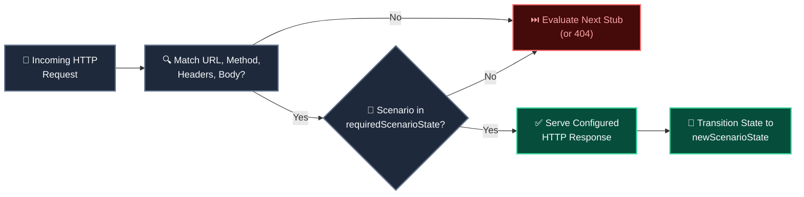
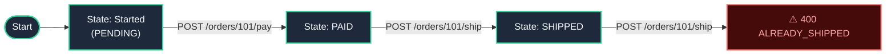

<div class="cover-slide">

<div class="cover-decor-container">
  
</div>

# Ultra Smoooooth Testing

<div class="cover-subtitle">Mock the world. Control the chaos. Test without limits.</div>

<div class="cover-tags">
  <span class="cover-tag">⚙️ Go Workspaces</span>
  <span class="cover-tag">🪝 WireMock</span>
  <span class="cover-tag">🛡️ Burp Suite</span>
  <span class="cover-tag">🎭 Playwright</span>
  <span class="cover-tag">🐳 Testcontainers</span>
</div>

</div>

---
layout: default
---

# 📋 Workshop Agenda

### What We'll Cover Today

<div class="slide-card text-xs space-y-2 pt-2">

<v-clicks>

<div>
  <h3 class="text-emerald-400 font-bold mb-0.5 text-sm">🏗️ Part 1 — Ecosystem Architecture</h3>
  <p class="text-slate-300 leading-relaxed">
    Go Workspace monorepo, microservices topology, and technology stack overview.
  </p>
</div>

<div>
  <h3 class="text-emerald-400 font-bold mb-0.5 text-sm">🪝 Part 2 — WireMock Deep Dive</h3>
  <p class="text-slate-300 leading-relaxed">
    Request matching, priority stubs, Handlebars templating, fault injection, and stateful scenario machines.
  </p>
</div>

<div>
  <h3 class="text-emerald-400 font-bold mb-0.5 text-sm">🛡️ Part 3 — Burp Suite MITM</h3>
  <p class="text-slate-300 leading-relaxed">
    Dual-direction HTTP intercept, Repeater manual exploration, Intruder fuzzing, and Logger traffic auditing.
  </p>
</div>

<div>
  <h3 class="text-emerald-400 font-bold mb-0.5 text-sm">🐳 Part 4 — Testcontainers (Hermetic Infrastructure)</h3>
  <p class="text-slate-300 leading-relaxed">
    Ephemeral container lifecycle, dynamic port binding, and automated suite bootstrapping.
  </p>
</div>

<div>
  <h3 class="text-emerald-400 font-bold mb-0.5 text-sm">🎭 Part 5 — Playwright (Test Without Limits)</h3>
  <p class="text-slate-300 leading-relaxed">
    Web-first locators, dynamic route mock steering, hybrid mobile JSBridge, and CI trace diagnostics.
  </p>
</div>

</v-clicks>

</div>

---
class: strategy-slide
---

# 🎯 Testing Strategy & Core Pillars

### Mock the world. Control the chaos. Test without limits.

<div class="strategy-grid text-sm">

<v-click>
<div class="slide-card">
  <h3 class="text-emerald-400 font-bold mb-1 text-base">🌐 1. Mock the World (WireMock)</h3>
  <p class="text-slate-300 leading-relaxed">
    Virtualize all third-party external integrations with deterministic stateful stubs, dynamic Handlebars responses, and zero sandbox dependencies.
  </p>
</div>
</v-click>

<v-click>
<div class="slide-card">
  <h3 class="text-emerald-400 font-bold mb-1 text-base">⚡ 2. Control the Chaos (Burp Suite)</h3>
  <p class="text-slate-300 leading-relaxed">
    Intercept live HTTP traffic in-flight, tamper with payloads, inject fault scenarios, and probe security/IDOR boundaries.
  </p>
</div>
</v-click>

<v-click>
<div class="slide-card">
  <h3 class="text-emerald-400 font-bold mb-1 text-base">🐳 3. Hermetic Infrastructure (Testcontainers)</h3>
  <p class="text-slate-300 leading-relaxed">
    Execute integration suites against isolated, ephemeral Docker containers with dynamic ports and guaranteed Ryuk teardown.
  </p>
</div>
</v-click>

<v-click>
<div class="slide-card">
  <h3 class="text-emerald-400 font-bold mb-1 text-base">🎭 4. Test Without Limits (Playwright)</h3>
  <p class="text-slate-300 leading-relaxed">
    Drive unified browser DOM interactions and headless REST API validation with zero-flake auto-waiting assertions and rich tracing.
  </p>
</div>
</v-click>

</div>

---

# 🌐 Pillar 1: Mock the World — WireMock

### Eliminating External API Dependencies & Sandbox Flakiness

<div class="slide-card text-sm space-y-3 pt-2">

<v-clicks>

<div>
  <h3 class="text-emerald-400 font-bold mb-1 text-base">🪝 Complete External Virtualization</h3>
  <p class="text-slate-300 leading-relaxed">
    Third-party payment gateways, OAuth identity providers (Paotang Pass), and SMS delivery networks are fully simulated using lightweight HTTP stubs.
  </p>
</div>

<div>
  <h3 class="text-emerald-400 font-bold mb-1 text-base">🎯 Deterministic Edge Cases</h3>
  <p class="text-slate-300 leading-relaxed">
    Instantly trigger error contracts, latency jitter, or auth code expiration that are difficult or impossible to reproduce against live sandboxes.
  </p>
</div>

<div>
  <h3 class="text-emerald-400 font-bold mb-1 text-base">⚡ Zero Rate Limits & Zero Cost</h3>
  <p class="text-slate-300 leading-relaxed">
    Execute thousands of automated test runs in CI/CD without hitting API billing quotas or being throttled by provider rate limits.
  </p>
</div>

</v-clicks>

</div>

---

# ⚡ Pillar 2: Control the Chaos — Burp Suite

### Live MITM Traffic Inspection, Fault Injection & Security Boundaries

<div class="slide-card text-sm space-y-3 pt-2">

<v-clicks>

<div>
  <h3 class="text-emerald-400 font-bold mb-1 text-base">🔀 Transparent In-Flight Interception</h3>
  <p class="text-slate-300 leading-relaxed">
    Sits directly between client frontends and backend services to inspect, pause, and modify HTTP headers and request bodies on the fly.
  </p>
</div>

<div>
  <h3 class="text-emerald-400 font-bold mb-1 text-base">💉 Mock Scenario Header Injection</h3>
  <p class="text-slate-300 leading-relaxed">
    Inject custom <code>Mock-Scenario</code> routing headers into live browser traffic to steer downstream WireMock stubs without code changes.
  </p>
</div>

<div>
  <h3 class="text-emerald-400 font-bold mb-1 text-base">📥 Response Tampering &amp; UI Resilience</h3>
  <p class="text-slate-300 leading-relaxed">
    Intercept and mutate backend response status codes and JSON payloads to validate frontend error handling and fallback UI behaviors.
  </p>
</div>

</v-clicks>

</div>

---

# 🐳 Pillar 3: Hermetic Infrastructure — Testcontainers

### Isolated Ephemeral Containers, Dynamic Ports & Automatic Teardown

<div class="slide-card text-sm space-y-3 pt-2">

<v-clicks>

<div>
  <h3 class="text-emerald-400 font-bold mb-1 text-base">🐳 Code-Driven Ephemeral Infrastructure</h3>
  <p class="text-slate-300 leading-relaxed">
    Spins up fresh PostgreSQL, Redis, and WireMock instances on demand inside test lifecycle hooks, providing pristine isolation for every test run.
  </p>
</div>

<div>
  <h3 class="text-emerald-400 font-bold mb-1 text-base">🔌 Dynamic Port Binding & Parallelism</h3>
  <p class="text-slate-300 leading-relaxed">
    Assigns randomized ephemeral host ports to eliminate port conflict errors and allow parallel execution across developer workstations and CI runners.
  </p>
</div>

<div>
  <h3 class="text-emerald-400 font-bold mb-1 text-base">🧹 Automatic Lifecycle Cleanup</h3>
  <p class="text-slate-300 leading-relaxed">
    Guarantees clean removal of containers, bridge networks, and attached volumes upon test completion to prevent orphan resource leaks.
  </p>
</div>

</v-clicks>

</div>

---

# 🎭 Pillar 4: Test Without Limits — Playwright

### Unified Browser Automation, REST API Testing & Zero Flakiness

<div class="slide-card text-sm space-y-3 pt-2">

<div>
  <h3 class="text-emerald-400 font-bold mb-1 text-base">🎭 Unified UI + Headless API Testing</h3>
  <p class="text-slate-300 leading-relaxed">
    Drives real browser DOM interactions while simultaneously executing direct backend REST API requests in the exact same spec file.
  </p>
</div>

<div>
  <h3 class="text-emerald-400 font-bold mb-1 text-base">🛡️ Auto-Waiting & Zero Flakiness</h3>
  <p class="text-slate-300 leading-relaxed">
    Auto-waiting assertions eliminate arbitrary <code>sleep()</code> timers by dynamically awaiting element visibility, actionability, and network idle.
  </p>
</div>

<div>
  <h3 class="text-emerald-400 font-bold mb-1 text-base">📊 Rich Diagnostics & Trace Recording</h3>
  <p class="text-slate-300 leading-relaxed">
    Captures full execution traces, step-by-step DOM snapshots, console logs, and network activity for instant root-cause debugging.
  </p>
</div>

</div>

---
layout: section
---

# 🏗️ Part 1
## Ecosystem Architecture

---

# 🗺️ Detailed Service Topology & Flow

```mermaid {scale: 0.62}
flowchart LR
    subgraph Clients["🌐 1. Client & Automation Layer (Test Without Limits)"]
        Website["💻 Website<br/>:3000"]
        BridgeWebsite["📱 Mobile WebView<br/>JSBridge"]
        Playwright["🐦 Playwright E2E<br/>Runner"]
        Burp["🛡️ Burp MITM Proxy<br/>:8080"]
    end

    subgraph API_Gateway["⚡ 2. Gateway & Orchestration Layer"]
        BFF["⚙️ bff-service<br/>Go :8080"]
    end

    subgraph Core_Services["🏡 3. Microservices Domain Layer (Go Workspace)"]
        UserService["👤 user-service<br/>:8081"]
        BankService["🏦 bank-account-service<br/>:8082"]
        EKYCService["🪪 ekyc-service<br/>:8084"]
        TransferService["💸 transfer-service<br/>:8085"]
        OTPService["🔑 otp-service<br/>:8087"]
    end

    subgraph Persistence["🗄️ 4. Persistence Layer"]
        DB[("🐘 PostgreSQL DB<br/>:5432")]
    end

    subgraph External_Mocks["🤖 5. External Mocks (Mock The World)"]
        WireMock["🪝 WireMock Stubs<br/>:8088"]
        PaotangProvider["💳 Paotang Provider"]
        SMSProvider["📡 SMS Provider"]
    end

    Website -->|REST| BFF
    BridgeWebsite -->|REST + JSBridge| BFF
    Playwright -->|E2E| Website
    Playwright -->|E2E| BridgeWebsite
    Website -.->|MITM Intercept| Burp
    BridgeWebsite -.->|MITM Intercept| Burp
    Burp -.->|Proxied REST| BFF

    BFF -->|/users| UserService
    BFF -->|/accounts| BankService
    BFF -->|/ekycs| EKYCService
    BFF -->|/transfers| TransferService
    BFF -->|/auth/otp/verify| OTPService

    UserService -->|SQL| DB
    BankService -->|SQL| DB
    TransferService -->|SQL| DB

    UserService -->|OAuth via WireMock| WireMock
    OTPService -->|Send SMS via WireMock| WireMock
    WireMock -.->|Proxy Unmatched| PaotangProvider
    WireMock -.->|Proxy Unmatched| SMSProvider

    classDef client fill:#0e7490,stroke:#67e8f9,color:#f8fafc,stroke-width:3px
    classDef gateway fill:#1d4ed8,stroke:#93c5fd,color:#ffffff,stroke-width:3px
    classDef core fill:#047857,stroke:#6ee7b7,color:#ffffff,stroke-width:3px
    classDef persistence fill:#4338ca,stroke:#c4b5fd,color:#ffffff,stroke-width:3px
    classDef external fill:#b45309,stroke:#fcd34d,color:#fff7ed,stroke-width:3px

    class Website,BridgeWebsite,Playwright,Burp client
    class BFF gateway
    class UserService,BankService,EKYCService,TransferService,OTPService core
    class DB persistence
    class WireMock,PaotangProvider,SMSProvider external

    style Clients fill:#082f49,stroke:#0891b2,stroke-width:2px,color:#cffafe
    style API_Gateway fill:#172554,stroke:#2563eb,stroke-width:2px,color:#dbeafe
    style Core_Services fill:#052e2b,stroke:#059669,stroke-width:2px,color:#d1fae5
    style Persistence fill:#1e1b4b,stroke:#7c3aed,stroke-width:2px,color:#ede9fe
    style External_Mocks fill:#451a03,stroke:#d97706,stroke-width:2px,color:#ffedd5
```


<div class="topology-diagram w-full flex justify-center items-center my-auto py-1">



</div>

---

# ⚙️ Technology Stack — Core Runtime & Services

### Monorepo Workspaces, Modern Web & Relational Persistence

<div class="slide-card text-sm space-y-3 pt-2">

<div>
  <h3 class="text-emerald-400 font-bold mb-1 text-base">🐹 Go Workspaces (`go.work`)</h3>
  <p class="text-slate-300 leading-relaxed">
    Unifies all 6 microservices in a single monorepo with cross-service dependency synchronization, fast incremental compilation, and shared domain models.
  </p>
</div>

<div>
  <h3 class="text-emerald-400 font-bold mb-1 text-base">⚛️ Next.js 19</h3>
  <p class="text-slate-300 leading-relaxed">
    Modern React 19 application with Tailwind CSS and interactive JSBridge integration for testing complex end-to-end user workflows.
  </p>
</div>

<div>
  <h3 class="text-emerald-400 font-bold mb-1 text-base">🐘 PostgreSQL Relational Database</h3>
  <p class="text-slate-300 leading-relaxed">
    Provides transactional ACID integrity for bank balances, atomic transfer rollbacks, and concurrent debit race condition testing.
  </p>
</div>

</div>

---
class: compact-stack-slide
---

# 🧪 Technology Stack — Testing & Security Infrastructure

### Mocking, MITM Proxy, Ephemeral Containers & E2E Engine

<div class="slide-card text-sm space-y-2.5 pt-2">

<div>
  <h3 class="text-emerald-400 font-bold mb-1 text-base">🪝 WireMock (API Virtualization)</h3>
  <p class="text-slate-300 leading-relaxed">
    Stubs external Paotang Pass OAuth and SMS gateways with dynamic Handlebars response templating, latency injection, and stateful machines.
  </p>
</div>

<div>
  <h3 class="text-emerald-400 font-bold mb-1 text-base">🛡️ Burp Suite (MITM Proxy)</h3>
  <p class="text-slate-300 leading-relaxed">
    Enables live HTTP inspection, parameter tampering, and automated Intruder fuzzing to uncover IDOR security vulnerabilities.
  </p>
</div>

<div>
  <h3 class="text-emerald-400 font-bold mb-1 text-base">🐳 Testcontainers (Ephemeral Infrastructure)</h3>
  <p class="text-slate-300 leading-relaxed">
    Spins up disposable PostgreSQL and WireMock Docker containers with dynamic ports and automatic Moby Ryuk garbage collection.
  </p>
</div>

<div>
  <h3 class="text-emerald-400 font-bold mb-1 text-base">🎭 Playwright (Full-Stack Test Runner)</h3>
  <p class="text-slate-300 leading-relaxed">
    Drives headless browser E2E workflows and direct backend REST API integration tests with auto-waiting assertions and tracing.
  </p>
</div>

</div>

---
layout: section
---

# 🪝 Part 2
## WireMock — Mock the World

---

# 🪝 What is WireMock? — Core Capabilities


### Programmable HTTP Mock Server for External API Simulation

<div class="slide-card text-sm space-y-3 pt-2">

<div>
  <h3 class="text-emerald-400 font-bold mb-1 text-base">🌐 Precision Request Matching</h3>
  <p class="text-slate-300 leading-relaxed">
    Match incoming HTTP traffic by exact URLs, regex patterns, custom headers (e.g. <code>Mock-Scenario</code>), query parameters, and semantic JSON payloads.
  </p>
</div>

<div>
  <h3 class="text-emerald-400 font-bold mb-1 text-base">🪄 Dynamic Response Templating</h3>
  <p class="text-slate-300 leading-relaxed">
    Echo client request parameters, compute arithmetic fee calculations, and generate ISO dates/UUIDs dynamically via Handlebars.
  </p>
</div>

<div>
  <h3 class="text-emerald-400 font-bold mb-1 text-base">⚡ Chaos Engineering & State Machines</h3>
  <p class="text-slate-300 leading-relaxed">
    Inject network latency, dropped TCP sockets, and model multi-step lifecycles (e.g. <code>Started → PAID</code>) with automatic test reset.
  </p>
</div>

</div>

---

# 🎯 Why WireMock in Testing?

### Deterministic Isolation, Zero Sandbox Flakiness & Fast Test Execution

<div class="slide-card text-sm space-y-3 pt-2">

<div>
  <h3 class="text-emerald-400 font-bold mb-1 text-base">🛡️ Hermetic Isolation & Zero Provider Outages</h3>
  <p class="text-slate-300 leading-relaxed">
    Eliminates third-party sandbox flakiness and maintenance windows by simulating SMS, OAuth, and banking APIs with deterministic local stubs.
  </p>
</div>

<div>
  <h3 class="text-emerald-400 font-bold mb-1 text-base">⚡ Sub-Millisecond Speed & Zero API Quota Limits</h3>
  <p class="text-slate-300 leading-relaxed">
    Executes tests in sub-milliseconds with zero remote network roundtrips, zero API credit costs, and zero provider rate-limit throttling.
  </p>
</div>

<div>
  <h3 class="text-emerald-400 font-bold mb-1 text-base">🔄 Transparent Live Proxy & Traffic Recording</h3>
  <p class="text-slate-300 leading-relaxed">
    Records real-world HTTP traffic directly into JSON stub definitions and transparently proxies unmapped routes to live upstream providers.
  </p>
</div>

</div>

---

# ⚡ WireMock — URL & Path Matching

### Exact Path Routing, Regex Patterns & Query Strings

<div class="slide-card text-sm space-y-3 pt-2">

<div>
  <h3 class="text-emerald-400 font-bold mb-1 text-base">🌐 Path Matcher Operators</h3>
  <ul class="space-y-1 text-slate-300">
    <li>• <strong><code>url</code></strong>: Matches full absolute path <em>including</em> query parameters.</li>
    <li>• <strong><code>urlPath</code></strong>: Matches URI path only, safely ignoring query parameters.</li>
    <li>• <strong><code>urlPathPattern</code></strong>: Regular expression matching on URI paths.</li>
    <li>• <strong><code>urlPattern</code></strong>: Regular expression matching on the complete URL.</li>
  </ul>
</div>

<div>
  <h3 class="text-emerald-400 font-bold mb-1 text-base">💡 Best Practice</h3>
  <p class="text-slate-300 leading-relaxed">
    Use <strong><code>urlPath</code></strong> for stable REST endpoints when query strings vary, and <strong><code>urlPathPattern</code></strong> for dynamic path parameters (e.g. UUIDs, IDs).
  </p>
</div>

</div>

---

# ⚡ WireMock — Header Matching Operators

### Exact Matches, Substrings, Regex & Absence Checks

<div class="slide-card text-sm space-y-3 pt-2">

<div>
  <h3 class="text-emerald-400 font-bold mb-1 text-base">🏷️ Operator Reference</h3>
  <ul class="space-y-1 text-slate-300">
    <li>• <strong><code>equalTo</code></strong>: Exact case-sensitive match (e.g. <code>Content-Type: application/json</code>).</li>
    <li>• <strong><code>matches</code></strong>: Regular expression on header value (e.g. <code>Bearer [A-Za-z0-9-_\\.]+</code>).</li>
    <li>• <strong><code>contains</code></strong>: Substring check (e.g. <code>Mock-Scenario: TRANSFER:INSUFFICIENT_FUNDS</code>).</li>
    <li>• <strong><code>absent</code></strong>: Asserts header is completely omitted from the request.</li>
  </ul>
</div>

<div>
  <h3 class="text-emerald-400 font-bold mb-1 text-base">🛡️ Auth & Mock Steer Patterns</h3>
  <p class="text-slate-300 leading-relaxed">
    Steer test scenarios dynamically via custom headers while verifying authorization tokens and security boundaries.
  </p>
</div>

</div>

---

# ⚡ WireMock — Query Parameter & Cookie Filters

### Parameter Flags, Cookie Assertions & Multi-Criteria Conjunction

<div class="slide-card text-sm space-y-3 pt-2">

<div>
  <h3 class="text-emerald-400 font-bold mb-1 text-base">🔍 Query & Cookie Filters</h3>
  <ul class="space-y-1 text-slate-300">
    <li>• <strong><code>queryParameters</code></strong>: Match query flags (e.g. <code>?active=true</code>) or numeric limits (<code>?limit=10</code>).</li>
    <li>• <strong><code>cookies</code></strong>: Assert session, authentication, or tracking cookies.</li>
    <li>• <strong><code>absent: true</code></strong>: Verify optional query parameters or cookies are omitted.</li>
  </ul>
</div>

<div>
  <h3 class="text-emerald-400 font-bold mb-1 text-base">⚡ Multi-Criteria Conjunction Rule</h3>
  <p class="text-slate-300 leading-relaxed">
    WireMock evaluates HTTP method, path, headers, and query parameters simultaneously. <strong>All defined matchers must evaluate to true</strong> for a 200 match.
  </p>
</div>

</div>

---

# ⚡ Request Matching — URL & Header Example

### Regex Path Routing & Bearer JWT Validation

```json
{
  "request": {
    "method": "GET",
    "urlPathPattern": "/lab/api/users/[0-9]+",
    "headers": {
      "Authorization": { "matches": "Bearer [A-Za-z0-9-_]+" },
      "Mock-Scenario": { "contains": "ACCOUNT_ACTIVE" }
    }
  },
  "response": {
    "status": 200,
    "jsonBody": { "status": "ACTIVE" }
  }
}
```

<div class="slide-card text-sm mt-3">
  🎯 <strong>Key Features</strong>: Matches any numeric user ID (e.g. <code>/users/101</code>), validates Bearer token format, and routes based on <code>Mock-Scenario: ACCOUNT_ACTIVE</code>.
</div>

---

# ⚡ Request Matching — Query Parameter Example

### Query Flag Filtering & Multi-Criteria Evaluation

```json
{
  "request": {
    "method": "GET",
    "urlPath": "/lab/api/users/filter",
    "queryParameters": {
      "active": { "equalTo": "true" },
      "limit": { "matches": "[0-9]+" }
    }
  },
  "response": {
    "status": 200,
    "jsonBody": { "count": 10, "users": [] }
  }
}
```

<div class="slide-card text-sm mt-3">
  🏷️ <strong>Key Features</strong>: Enforces exact flag matching (<code>?active=true</code>) and regex numeric limits (<code>?limit=10</code>). All criteria must match simultaneously.
</div>

---

# ⚖️ WireMock — Priority & Matching Precedence

### Resolution Hierarchy for Overlapping Stub Mappings

<div class="slide-card text-sm space-y-3 pt-2">

<div>
  <h3 class="text-emerald-400 font-bold mb-1 text-base">⚡ Precedence Rule</h3>
  <p class="text-slate-300 leading-relaxed">
    Lower integer value = <strong>Higher Precedence</strong> (<code>1 &gt; 5 &gt; 10 &gt; 100</code>). WireMock stops evaluation on the first matching highest-priority stub.
  </p>
</div>

<div>
  <h3 class="text-emerald-400 font-bold mb-1 text-base">🔢 Default Priority</h3>
  <p class="text-slate-300 leading-relaxed">
    If the <code>"priority"</code> field is omitted in a JSON mapping file, WireMock automatically assigns a default priority of <strong>5</strong>.
  </p>
</div>

</div>

---

# 🥇 Priority Tier 1: Specific Error Overrides

### Fault Injection & Error Contracts

<div class="slide-card text-sm space-y-3 pt-2">

<div>
  <h3 class="text-emerald-400 font-bold mb-1 text-base">🎯 Purpose & Scope</h3>
  <p class="text-slate-300 leading-relaxed">
    Specific error overrides, fault injections, and edge cases triggered via explicit headers (e.g. <code>Mock-Scenario: INSUFFICIENT_FUNDS</code>) or error IDs.
  </p>
</div>

```json
{
  "priority": 1,
  "request": {
    "method": "POST",
    "urlPath": "/lab/api/transfers",
    "headers": { "Mock-Scenario": { "contains": "INSUFFICIENT_FUNDS" } }
  },
  "response": {
    "status": 400,
    "jsonBody": { "code": "ERR_INSUFFICIENT_FUNDS" }
  }
}
```

</div>

---

# 🥈 Priority Tier 5–10: Default Happy Paths

### Standard Business Logic & Route Matchers

<div class="slide-card text-sm space-y-3 pt-2">

<div>
  <h3 class="text-emerald-400 font-bold mb-1 text-base">🎯 Purpose & Scope</h3>
  <p class="text-slate-300 leading-relaxed">
    Default domain responses (<code>200 OK</code> / <code>201 Created</code>) matching standard routes when no error steering headers are passed.
  </p>
</div>

```json
{
  "priority": 10,
  "request": {
    "method": "POST",
    "urlPath": "/lab/api/transfers"
  },
  "response": {
    "status": 201,
    "jsonBody": { "status": "COMPLETED" }
  }
}
```

</div>

---

# 🛡️ Priority Tier 100: Catch-All Proxy

### Transparent Fallback to Real Downstream Endpoints

<div class="slide-card text-sm space-y-3 pt-2">

<div>
  <h3 class="text-emerald-400 font-bold mb-1 text-base">🎯 Purpose & Scope</h3>
  <p class="text-slate-300 leading-relaxed">
    Lowest priority catch-all proxy stubs that forward any unmatched traffic to live downstream environments or external legacy services.
  </p>
</div>

```json
{
  "priority": 100,
  "request": {
    "urlPattern": "/.*"
  },
  "response": {
    "proxyBaseUrl": "https://api.external-provider.com"
  }
}
```

</div>

---

# ⚖️ Priority & Precedence — Example

### Error Scenario Override vs Default Happy Path

```json
// Priority 1: Triggered ONLY when Mock-Scenario header is present
{
  "priority": 1,
  "request": {
    "method": "POST", "urlPath": "/lab/api/transfers",
    "headers": { "Mock-Scenario": { "contains": "INSUFFICIENT_FUNDS" } }
  },
  "response": { "status": 400, "jsonBody": { "code": "ERR_INSUFFICIENT_FUNDS" } }
}
```

<div class="slide-card text-sm mt-3">
  ⚡ <strong>Behavior</strong>: Sending <code>Mock-Scenario: INSUFFICIENT_FUNDS</code> overrides Priority 10 and returns <code>400</code>; without header, requests fall through to Priority 10 and return <code>201</code>.
</div>

---

# 🎯 WireMock — URL & Path RegEx Matching

### Regular Expressions for Dynamic Resource Identifiers

<div class="slide-card text-sm space-y-3 pt-2">

<div>
  <h3 class="text-emerald-400 font-bold mb-1 text-base">🌐 Path RegEx Matchers</h3>
  <ul class="space-y-1 text-slate-300">
    <li>• <strong><code>urlPathPattern</code></strong>: Matches path using regex, safely ignoring query parameters.</li>
    <li>• <strong><code>urlPattern</code></strong>: Matches the entire URI string including query parameters.</li>
  </ul>
</div>

<div>
  <h3 class="text-emerald-400 font-bold mb-1 text-base">💡 Dynamic UUID Example</h3>
  <p class="text-slate-300 leading-relaxed">
    Match 36-character standard UUIDs: <code>"urlPathPattern": "/api/users/[0-9a-fA-F-]{36}/accounts"</code>.
  </p>
</div>

</div>

---

# 🎯 WireMock — Header & Query RegEx Matching

### Bearer Tokens & Scenario Enums

<div class="slide-card text-sm space-y-3 pt-2">

<div>
  <h3 class="text-emerald-400 font-bold mb-1 text-base">🏷️ Header RegEx Operators</h3>
  <ul class="space-y-1 text-slate-300">
    <li>• <strong><code>matches</code></strong>: Value must satisfy the regular expression pattern.</li>
    <li>• <strong><code>doesNotMatch</code></strong>: Passes only when regex evaluation fails.</li>
  </ul>
</div>

<div>
  <h3 class="text-emerald-400 font-bold mb-1 text-base">💡 Token & Scenario Verification</h3>
  <p class="text-slate-300 leading-relaxed">
    Validate Bearer JWTs: <code>"Authorization": { "matches": "Bearer [A-Za-z0-9-_\\.]+" }</code> and restrict scenarios to valid enum values: <code>"matches": "TRANSFER:(SUCCESS|INSUFFICIENT_FUNDS)"</code>.
  </p>
</div>

</div>

---

# 🎯 WireMock — Body & JSONPath RegEx Matching

### Payload Validation & Pattern Filtering

<div class="slide-card text-sm space-y-3 pt-2">

<div>
  <h3 class="text-emerald-400 font-bold mb-1 text-base">📝 Raw Body RegEx</h3>
  <p class="text-slate-300 leading-relaxed">
    Match unparsed raw body: <code>.*"national_id"\\s*:\\s*"[0-9]{13}".*</code> (useful for legacy formats).
  </p>
</div>

<div>
  <h3 class="text-emerald-400 font-bold mb-1 text-base">🔍 Inline JSONPath RegEx</h3>
  <p class="text-slate-300 leading-relaxed">
    Evaluate regex inside JSONPath expressions: <code>$[?(@.phone =~ /^0[689][0-9]{8}$/)]</code> to inspect specific nested attributes without fragility.
  </p>
</div>

</div>

---

# 🎯 WireMock RegEx — Dynamic UUID Path Example

### Matching UUID Paths in API Stubs

```json
{
  "request": {
    "method": "GET", 
    "urlPathPattern": "/lab/api/users/[0-9a-fA-F-]{36}/accounts"
  },
  "response": {
    "status": 200,
    "jsonBody": { "tier": "PREMIUM" }
  }
}
```

<div class="slide-card text-sm mt-3">
  ✨ <code>urlPathPattern</code> dynamically matches any 36-character UUID user account request while ignoring query parameters.
</div>

---

# 🎯 WireMock RegEx — JWT Bearer & Scenario Enum

### Strict Token & Scenario Routing

```json
{
  "request": {
    "method": "POST",
    "urlPath": "/lab/api/transfers",
    "headers": {
      "Authorization": { "matches": "Bearer [A-Za-z0-9-_\\.]+" },
      "Mock-Scenario": { "matches": "TRANSFER:(SUCCESS|INSUFFICIENT_FUNDS)" }
    }
  },
  "response": {
    "status": 200,
    "jsonBody": { "authorized": true }
  }
}
```

<div class="slide-card text-sm mt-3">
  🔐 Enforces valid JWT Bearer header structures and restricts <code>Mock-Scenario</code> strictly to registered enum choices.
</div>

---

# 🎯 WireMock RegEx — Body & Parameter Matching

### 13-Digit National ID & Query Version Validation

```json
{
  "request": {
    "method": "POST",
    "urlPath": "/lab/api/ekyc/verify",
    "queryParameters": { "version": { "matches": "v[1-3].*" } },
    "bodyPatterns": [
      { "matches": ".*\"national_id\":\"[0-9]{13}\".*" }
    ]
  },
  "response": {
    "status": 200,
    "jsonBody": { "verified": true }
  }
}
```

<div class="slide-card text-sm mt-3">
  🪪 Asserts a strict 13-digit Thai National ID within request body and routes across API versions (<code>v1</code>, <code>v2</code>, <code>v3</code>).
</div>

---

# 🎯 WireMock RegEx — JSONPath Phone Validation

### Thai Mobile Number Pattern Matching in Payload

```json
{
  "request": {
    "method": "POST",
    "urlPath": "/lab/api/otp/send",
    "bodyPatterns": [
      {
        "matchesJsonPath": "$[?(@.phone =~ /^0[689]\\d{8}$/)]"
      }
    ]
  },
  "response": {
    "status": 200,
    "jsonBody": { "status": "sent" }
  }
}
```

<div class="slide-card text-sm mt-3">
  📱 Extracts and regex-evaluates only the <code>phone</code> field without breaking on whitespace or extra payload keys.
</div>

---

# 📦 WireMock — Semantic JSON Matching

### Robust Structural JSON Equivalence

<div class="slide-card text-sm space-y-3 pt-2">

<div>
  <h3 class="text-emerald-400 font-bold mb-1 text-base">🧩 Semantic vs Literal Comparison</h3>
  <p class="text-slate-300 leading-relaxed">
    Raw string comparison fails when key ordering changes or indentation differs. <code>equalToJson</code> deserializes both payloads and performs <strong>semantic JSON comparison</strong>.
  </p>
</div>

<div>
  <h3 class="text-emerald-400 font-bold mb-1 text-base">🛡️ Schema Invariance</h3>
  <p class="text-slate-300 leading-relaxed">
    Guarantees tests pass regardless of JSON serialization differences across Go, Next.js, and Java client libraries.
  </p>
</div>

</div>

---

# ⚙️ WireMock — Body Match Operators & Lenient Flags

### Matching Operators & Lenient Contract Flags

<div class="slide-card text-sm space-y-3 pt-2">

<div>
  <h3 class="text-emerald-400 font-bold mb-1 text-base">🛠️ Body Match Operators</h3>
  <ul class="space-y-1 text-slate-300">
    <li>• <strong><code>equalToJson</code></strong>: Semantic JSON equivalence.</li>
    <li>• <strong><code>equalToXml</code></strong>: Semantic XML payload comparison.</li>
    <li>• <strong><code>matches</code></strong>: Regular expression on raw body string.</li>
    <li>• <strong><code>contains</code></strong>: Substring occurrence check.</li>
  </ul>
</div>

<div>
  <h3 class="text-emerald-400 font-bold mb-1 text-base">⚙️ Lenient Match Flags</h3>
  <ul class="space-y-1 text-slate-300">
    <li>• <strong><code>ignoreExtraElements: true</code></strong>: Allows additional unexpected attributes (schema evolution).</li>
    <li>• <strong><code>ignoreArrayOrder: true</code></strong>: Treats JSON arrays as unordered sets.</li>
  </ul>
</div>

</div>

---

# 📦 Body Matching — Example

### Match Request Bodies with `equalToJson`

```json
{
  "request": {
    "method": "POST",
    "urlPath": "/lab/api/accounts/open",
    "bodyPatterns": [
      {
        "equalToJson": "{\"citizenId\": \"1100500123456\", \"type\": \"SAVINGS\"}",
        "ignoreExtraElements": true,
        "ignoreArrayOrder": true
      }
    ]
  },
  "response": {
    "status": 201,
    "jsonBody": { "accountId": "ACC-998877", "status": "OPENED" }
  }
}
```

<div class="slide-card text-sm mt-3">
  ✨ <code>ignoreExtraElements: true</code> permits non-breaking extra payload fields, while <code>ignoreArrayOrder: true</code> permits array items in any sequence.
</div>

---

# 🔍 WireMock — JSONPath Expression Matching

### Filter & Assert Payloads with `matchesJsonPath`

```json
{
  "priority": 1,
  "request": {
    "method": "POST",
    "urlPath": "/lab/api/stateless/payments",
    "bodyPatterns": [
      { "matchesJsonPath": "$.payment[?(@.amount > 1000)]" }
    ]
  },
  "response": {
    "status": 201,
    "jsonBody": { "status": "APPROVED", "flag": "HIGH_VALUE_TRANSACTION" }
  }
}
```

<div class="slide-card text-sm mt-3">
  ✅ <strong>Matching request</strong>: <code>POST /lab/api/stateless/payments</code> with <code>{"payment":[{"amount":1500,"currency":"THB"}]}</code> → <code>201 APPROVED</code> / <code>HIGH_VALUE_TRANSACTION</code>.
</div>

---

# 🪄 WireMock — Dynamic Response Templating

### Handlebars Response Templating (`response-template`)

<div v-pre>

```json
{
  "request": {
    "method": "POST",
    "urlPath": "/lab/api/orders"
  },
  "response": {
    "status": 201,
    "headers": { "Content-Type": "application/json" },
    "body": "{\"orderId\": \"{{randomValue type='UUID'}}\", \"userId\": \"{{jsonPath request.body '$.userId'}}\", \"traceId\": \"{{request.headers.X-Trace-ID}}\", \"createdAt\": \"{{now}}\"}",
    "transformers": ["response-template"]
  }
}
```

</div>

<div v-pre class="slide-card text-sm mt-3">
  🪄 Echoes incoming request headers/body and dynamically generates UUIDs and timestamps on the fly with <code>response-template</code>.
</div>

---

# 🪄 WireMock — Handlebars Request & Encoding Helpers

### Request Model Extraction & Data Encoders

<div v-pre class="slide-card text-sm pt-2">

| Helper Type | Syntax Example | Description |
| :--- | :--- | :--- |
| **Request Headers** | `{{request.headers.[X-Trace-ID]}}` | Extracts incoming HTTP header value |
| **Query Parameters** | `{{request.query.page}}` | Extracts query parameter from URL |
| **JSON Path Body** | `{{jsonPath request.body '$.account.id'}}` | Extracts nested field from request body |
| **Base64 Encoding** | `{{base64 request.body}}` | Base64 encodes/decodes request payload |
| **URL Encoding** | `{{urlEncode request.query.target}}` | Encodes URL parameter strings |

</div>

---

# 🎲 WireMock — Handlebars Dynamic Data Generators

### Timestamps, Random IDs & Token Generation

<div v-pre class="slide-card text-sm pt-2">

| Generator | Syntax Example | Generated Output |
| :--- | :--- | :--- |
| **Random UUID** | `{{randomValue type='UUID'}}` | `a1b2c3d4-e5f6-4a1b-8c2d-9e0f1a2b3c4d` |
| **Random OTP** | `{{randomValue type='NUMERIC' length=6}}` | `849201` *(6-digit SMS OTP)* |
| **Current Date** | `{{now format='yyyy-MM-dd'}}` | `2026-08-23` *(Formatted date)* |
| **Expiry Timestamp** | `{{now offset='1 hours'}}` | `2026-08-23T11:45:00Z` *(Relative offset)* |

</div>

---

# 🪄 Handlebars Logic & Math — Example

### Conditionals, Dynamic Math & Response Configuration

<div v-pre>

```handlebars
{
  {{#if (eq (jsonPath request.body '$.amount') 0)}}
  "status": "REJECTED",
  {{else}}
  "status": "APPROVED",
  {{/if}}
  "fee": {{math (jsonPath request.body '$.amount') '*' 0.01}},
  "expiresAt": "{{now offset='3 days' format='yyyy-MM-dd'}}"
}
```

</div>

<div v-pre class="slide-card text-sm mt-3">
  🔀 Supports conditional response branching (`#if eq`), arithmetic fee calculations (`math '*' 0.01`), and relative date offsets.
</div>

---

# 🔤 WireMock — Handlebars String Transformation Helpers

### String Manipulation & Substring Extractors

<div v-pre class="slide-card text-sm pt-2">

| Helper | Syntax Example | Description |
| :--- | :--- | :--- |
| **Case Conversion** | `{{upper value}}` / `{{lower value}}` | Converts text to uppercase / lowercase |
| **Capitalize** | `{{capitalize value}}` | Uppercases the first character |
| **Whitespace Trim** | `{{trim value}}` | Strips leading and trailing whitespace |
| **String Replace** | `{{replace 'old' 'new' value}}` | Replaces occurrences of substring |
| **Regex Extraction** | `{{regexExtract value '([0-9]+)' '1'}}` | Extracts regex capture group 1 |

</div>

---

# 🔁 WireMock — Handlebars Array & Iteration Helpers

### Array Looping, Sizing & Variable Lookups

<div v-pre class="slide-card text-sm pt-2">

| Helper | Syntax Example | Description |
| :--- | :--- | :--- |
| **Loop Iteration** | `{{#each (jsonPath request.body '$.items')}}` | Iterates over array elements |
| **Index Counter** | `{{@index}}` / `{{@first}}` / `{{@last}}` | 0-based iteration index & position flags |
| **Array Sizing** | `{{size (jsonPath request.body '$.items')}}` | Returns total number of array elements |
| **Local Variable** | `{{val 'key' (jsonPath request.body '$.id')}}` | Assigns scoped local variable |
| **Dynamic Lookup** | `{{lookup array index}}` | Looks up array element at specific index |

</div>

---

# 🪄 Handlebars Array Iteration — Example

### Generating Dynamic Arrays with `{{#each}}` and Indexing

<div v-pre>

```handlebars
{
  "totalItems": {{size (jsonPath request.body '$.items')}},
  "processedItems": [
    {{#each (jsonPath request.body '$.items')}}
    {
      "index": {{@index}},
      "sku": "{{upper this.sku}}",
      "status": "VERIFIED"
    }{{#unless @last}},{{/unless}}
    {{/each}}
  ]
}
```

</div>

<div v-pre class="slide-card text-sm mt-3">
  🔁 Loops through request arrays, applies string transformations (`upper this.sku`), and uses `{{#unless @last}},{{/unless}}` to suppress trailing commas.
</div>

---

# 🔍 WireMock — Handlebars jsonPath Traversal & Indexing

### Deep Object Traversal & Array Indexing

<div v-pre class="slide-card text-sm space-y-3 pt-2">

<div>
  <h3 class="text-emerald-400 font-bold mb-1 text-base">🎯 Deep Field Traversal</h3>
  <p class="text-slate-300 leading-relaxed">
    Extract nested request fields directly into response bodies: <code>{{jsonPath request.body '$.customer.id'}}</code> or <code>{{jsonPath request.body '$.account.no'}}</code>.
  </p>
</div>

<div>
  <h3 class="text-emerald-400 font-bold mb-1 text-base">📊 Array Index Extraction</h3>
  <p class="text-slate-300 leading-relaxed">
    Target specific array elements: <code>{{jsonPath request.body '$.items[0].sku'}}</code> to echo the first purchased item in order confirmations.
  </p>
</div>

</div>

---

# 🛡️ WireMock — Safe Default Fallbacks & Dynamic Sizing

### Graceful Fallbacks & Array Counting

<div v-pre class="slide-card text-sm space-y-3 pt-2">

<div>
  <h3 class="text-emerald-400 font-bold mb-1 text-base">🛡️ Safe Default Fallbacks</h3>
  <p class="text-slate-300 leading-relaxed">
    Use <code>default='...'</code> parameter: <code>{{jsonPath request.body '$.tier' default='SILVER'}}</code> to prevent blank responses when optional client fields are missing.
  </p>
</div>

<div>
  <h3 class="text-emerald-400 font-bold mb-1 text-base">📊 Dynamic Array Sizing</h3>
  <p class="text-slate-300 leading-relaxed">
    Wrap <code>jsonPath</code> with <code>size</code> to compute array element counts on the fly: <code>{{size (jsonPath request.body '$.items')}}</code>.
  </p>
</div>

</div>

---

# 🔍 Handlebars jsonPath — Example

### Echoing Nested Request Payloads & Handling Missing Fields

<div v-pre>

```handlebars
{
  "orderId": "{{randomValue type='UUID'}}",
  "customerId": "{{jsonPath request.body '$.customer.id'}}",
  "tier": "{{jsonPath request.body '$.customer.tier' default='SILVER'}}",
  "firstSku": "{{jsonPath request.body '$.items[0].sku'}}",
  "itemCount": {{size (jsonPath request.body '$.items')}}
}
```

</div>

<div v-pre class="slide-card text-sm mt-3">
  🎯 Extracts nested customer IDs and array elements, applies safe default tiers (<code>default='SILVER'</code>), and counts total items dynamically.
</div>

---

# ⏱️ WireMock — Fixed Latency & Timeout Testing

### Deterministic Delay Injection (`fixedDelayMilliseconds`)

```json
{
  "request": {
    "method": "POST",
    "urlPath": "/lab/api/sms/send"
  },
  "response": {
    "status": 200,
    "fixedDelayMilliseconds": 8000,
    "jsonBody": { "status": "DELIVERED" }
  }
}
```

<div class="slide-card text-sm mt-3">
  ⏱️ Holds HTTP response for exactly <code>8000ms</code> to assert client timeout triggers (e.g. 5s HTTP context deadline) without hanging test workers.
</div>

---

# 🎲 WireMock — Random Jitter & Latency Distributions

### Real-World Latency Simulation (`delayDistribution`)

<div class="jitter-grid text-xs">

<div class="slide-card space-y-2">
  <div>
    <h3 class="text-emerald-400 font-bold mb-1">📈 Log-Normal</h3>
    <p class="text-slate-300 mb-2">Fast median + realistic long-tail spikes — models real network traffic.</p>

```json
{
  "response": {
    "delayDistribution": {
      "type": "lognormal",
      "median": 150,
      "sigma": 0.5
    }
  }
}
```
  </div>

  <p class="text-slate-400 text-xs mt-2 pt-1 border-t border-slate-700/50">📌 <strong>median</strong>: 50th-percentile ms &nbsp;|&nbsp; <strong>sigma</strong>: tail spread</p>
</div>

<div class="slide-card space-y-2">
  <div>
    <h3 class="text-emerald-400 font-bold mb-1">📊 Uniform</h3>
    <p class="text-slate-300 mb-2">Flat random delay between a fixed min and max — predictable jitter band.</p>

```json
{
  "response": {
    "delayDistribution": {
      "type": "uniform",
      "lower": 100,
      "upper": 500
    }
  }
}
```
  </div>

  <p class="text-slate-400 text-xs mt-2 pt-1 border-t border-slate-700/50">📌 <strong>lower</strong>: min delay ms &nbsp;|&nbsp; <strong>upper</strong>: max delay ms</p>
</div>

</div>


---

# 💥 WireMock — Network Fault Injection

### Simulating Hard Network Failures & Socket Errors

```json
{
  "request": {
    "method": "GET",
    "urlPath": "/lab/api/unstable-upstream"
  },
  "response": {
    "fault": "CONNECTION_RESET_BY_PEER"
  }
}
```

<div class="slide-card text-sm mt-3">
  💥 <strong>Available Fault Types</strong>: <code>CONNECTION_RESET_BY_PEER</code> (abrupt TCP RST), <code>MALFORMED_RESPONSE_CHUNK</code> (corrupted byte stream), and <code>EMPTY_RESPONSE</code> (0 bytes).
</div>

---

# 🔄 WireMock — Stateful Scenario Primitives

### Transforming Stateless HTTP Mocks into Finite State Machines

<div class="slide-card text-sm space-y-3 pt-2">

<v-clicks>

<div>
  <h3 class="text-emerald-400 font-bold mb-1 text-base">🏷️ 1. <code>scenarioName</code> (Scenario Identifier)</h3>
  <p class="text-slate-300 leading-relaxed">
    Groups related stub mappings into a single isolated state machine (e.g. <code>"order-fulfillment-lifecycle"</code>).
  </p>
</div>

<div>
  <h3 class="text-emerald-400 font-bold mb-1 text-base">🚦 2. <code>requiredScenarioState</code> (State Precondition)</h3>
  <p class="text-slate-300 leading-relaxed">
    The state required for this stub to match. Every scenario automatically starts in the default state <strong><code>"Started"</code></strong>.
  </p>
</div>

<div>
  <h3 class="text-emerald-400 font-bold mb-1 text-base">🔄 3. <code>newScenarioState</code> (State Transition)</h3>
  <p class="text-slate-300 leading-relaxed">
    The target state to transition into <em>after</em> the stub matches and serves its response. If omitted, state remains unchanged.
  </p>
</div>

</v-clicks>

</div>

---

# 🔄 WireMock — Scenario Execution Flow

### State-Aware Request Evaluation & Transition Mechanics

<div class="w-full flex justify-center py-2">



</div>

<div class="slide-card text-xs mt-2">
  ⚡ <strong>Deterministic Routing</strong>: The exact same HTTP endpoint produces completely different responses based on the caller's historical interaction sequence.
</div>

---

# 🔄 Stateful Pattern 1: Single-Use Tokens & Replays

### OAuth Authorization Code & OTP Replay Attack Prevention

<div class="jitter-grid text-xs">

<div class="slide-card space-y-2">
  <div>
    <h3 class="text-emerald-400 font-bold mb-1">✅ 1st Call: Exchange Token</h3>
    <p class="text-slate-300 mb-2"><code>Started</code> ➔ <code>TOKEN_ISSUED</code>: Consumes auth code and issues token.</p>

```json
{
  "scenarioName": "auth-token-flow",
  "requiredScenarioState": "Started",
  "newScenarioState": "TOKEN_ISSUED",
  "request": {
    "method": "POST",
    "urlPath": "/lab/api/oauth/token"
  },
  "response": {
    "status": 200,
    "jsonBody": { "access_token": "jwt_abc123" }
  }
}
```
  </div>
  <p class="text-slate-400 text-xs pt-1 border-t border-slate-700/50">🟢 <strong>Returns 200 OK</strong> &amp; transitions state to <code>TOKEN_ISSUED</code></p>
</div>

<div class="slide-card space-y-2">
  <div>
    <h3 class="text-rose-400 font-bold mb-1">🚨 2nd Call: Replay Rejected</h3>
    <p class="text-slate-300 mb-2"><code>TOKEN_ISSUED</code>: Replay attempt fails with invalid grant.</p>

```json
{
  "scenarioName": "auth-token-flow",
  "requiredScenarioState": "TOKEN_ISSUED",
  "request": {
    "method": "POST",
    "urlPath": "/lab/api/oauth/token"
  },
  "response": {
    "status": 400,
    "jsonBody": { "error": "invalid_grant" }
  }
}
```
  </div>
  <p class="text-slate-400 text-xs pt-1 border-t border-slate-700/50">🔴 <strong>Returns 400 Bad Request</strong> (Code already consumed)</p>
</div>

</div>

---

# 🔄 Stateful Pattern 2: Multi-Step Order Lifecycle

### Modeling Sequential Domain State Transitions

<div class="w-full flex justify-center py-2">



</div>

```json
{
  "scenarioName": "order-fulfillment-lifecycle",
  "requiredScenarioState": "PAID",
  "newScenarioState": "SHIPPED",
  "request": { "method": "POST", "urlPath": "/lab/api/orders/101/ship" },
  "response": { "status": 200, "jsonBody": { "status": "ORDER_SHIPPED" } }
}
```

<div class="slide-card text-xs mt-2">
  📦 Shipping is allowed only after <code>PAID</code>. A duplicate ship attempt triggers a <code>400 Bad Request</code> stub.
</div>

---

# 🔄 Stateful Pattern 3: Transient Failure & Retries

### Testing Client Exponential Backoff & Circuit Breakers

<div class="w-full flex justify-center py-1">


</div>

<div class="jitter-grid text-xs">

<div class="slide-card space-y-1">
  <h3 class="text-rose-400 font-bold">💥 Flapping Failures (Attempts 1 &amp; 2)</h3>

```json
{
  "scenarioName": "retry-flow",
  "requiredScenarioState": "Started",
  "newScenarioState": "FAIL_1",
  "request": { "method": "GET", "urlPath": "/lab/api/flaky" },
  "response": { "status": 503, "jsonBody": { "error": "Flapping" } }
}
```
</div>

<div class="slide-card space-y-1">
  <h3 class="text-emerald-400 font-bold">✅ Self-Healing Recovery (Attempt 3)</h3>

```json
{
  "scenarioName": "retry-flow",
  "requiredScenarioState": "FAIL_2",
  "request": { "method": "GET", "urlPath": "/lab/api/flaky" },
  "response": { "status": 200, "jsonBody": { "status": "RECOVERED" } }
}
```
</div>

</div>

---

# 🔄 Stateful Pattern 4: Webhook Idempotency

### At-Least-Once Delivery & Duplicate Message Detection

<div class="jitter-grid text-xs">

<div class="slide-card space-y-2">
  <div>
    <h3 class="text-emerald-400 font-bold mb-1">📨 1st Delivery: Processed</h3>
    <p class="text-slate-300 mb-2"><code>Started</code> ➔ <code>WEBHOOK_PROCESSED</code>: Accepts payment event.</p>

```json
{
  "scenarioName": "webhook-idempotency",
  "requiredScenarioState": "Started",
  "newScenarioState": "WEBHOOK_PROCESSED",
  "request": {
    "method": "POST",
    "urlPath": "/lab/api/payments/pay_123/webhook"
  },
  "response": {
    "status": 202,
    "jsonBody": { "status": "ACCEPTED" }
  }
}
```
  </div>
  <p class="text-slate-400 text-xs pt-1 border-t border-slate-700/50">🟢 <strong>Returns 202 Accepted</strong> (First-time processing)</p>
</div>

<div class="slide-card space-y-2">
  <div>
    <h3 class="text-amber-400 font-bold mb-1">🛡️ 2nd Delivery: Duplicate</h3>
    <p class="text-slate-300 mb-2"><code>WEBHOOK_PROCESSED</code>: Detects duplicate and rejects.</p>

```json
{
  "scenarioName": "webhook-idempotency",
  "requiredScenarioState": "WEBHOOK_PROCESSED",
  "request": {
    "method": "POST",
    "urlPath": "/lab/api/payments/pay_123/webhook"
  },
  "response": {
    "status": 409,
    "jsonBody": { "error": "DUPLICATE_EVENT" }
  }
}
```
  </div>
  <p class="text-slate-400 text-xs pt-1 border-t border-slate-700/50">🟡 <strong>Returns 409 Conflict</strong> (Idempotent guard)</p>
</div>

</div>

---

# 🧹 WireMock — State Management & Test Isolation

### Preventing State Bleed with the WireMock Admin API

<div class="slide-card text-xs space-y-2.5 pt-2">

<div>
  <h3 class="text-emerald-400 font-bold mb-1 text-sm">🔄 Automatic Scenario Reset in Test Teardown</h3>
  <p class="text-slate-300 leading-relaxed mb-1">
    Call <code>POST /__admin/scenarios/reset</code> in your test runner's <code>afterEach</code> hook to reset all state machines back to <code>"Started"</code>.
  </p>

```typescript
test.afterEach(async ({ request }) => {
  // Reset all WireMock state machines to 'Started' after every spec
  await request.post(`${wiremockUrl}/__admin/scenarios/reset`);
});
```
</div>

<div class="grid grid-cols-2 gap-3 pt-1 border-t border-slate-700/50">
  <div>
    <h4 class="text-cyan-400 font-semibold text-xs mb-0.5">🔍 Inspect Active Scenario States</h4>
    <code class="text-xs text-slate-300">curl http://localhost:8088/__admin/scenarios</code>
  </div>
  <div>
    <h4 class="text-cyan-400 font-semibold text-xs mb-0.5">⚡ Fast-Forward State for Test Setup</h4>
    <code class="text-xs text-slate-300">PUT /__admin/scenarios/{name}/state {"state": "PAID"}</code>
  </div>
</div>

</div>


---
layout: section
---

# 🛡️ Part 3
## Burp Suite — Control the Chaos

---
class: py-4
---

# 🔀 Burp Suite — Request & Response Intercept

### Bi-Directional In-Flight Traffic Interception & Tampering

<div class="flex justify-center items-center mt-1">
  <div class="adorable-arch-container">
    
  </div>
</div>

---

# 🔀 Burp Suite — Proxy Intercept Capabilities

### Dual-Direction Traffic Control: Requests and Responses

<div class="slide-card text-sm space-y-3 pt-2">

<v-clicks>

<div>
  <h3 class="text-amber-400 font-bold mb-1 text-base">📤 1. Request Interception (Client ➔ Server)</h3>
  <p class="text-slate-300 leading-relaxed">
    Pause outbound HTTP requests mid-flight to inject custom <code>Mock-Scenario</code> headers, tamper with form parameters, or test unauthorized API calls before reaching the gateway.
  </p>
</div>

<div>
  <h3 class="text-emerald-400 font-bold mb-1 text-base">📥 2. Response Interception (Server ➔ Client)</h3>
  <p class="text-slate-300 leading-relaxed">
    Pause inbound HTTP responses to alter status codes (e.g. <code>200 ➔ 500/403</code>), mutate JSON payloads (e.g. simulate edge-case error bodies), and test frontend resilience without backend code changes.
  </p>
</div>

</v-clicks>

</div>


---

# 🔀 Proxy Intercept — Example

### Before & After Request Header Injection

```http
POST http://localhost:8080/api/v1/users HTTP/1.1
Host: localhost:8080
Content-Type: application/json
Mock-Scenario: PT_PASS:SUCCESS_ONCE

{
  "username": "testuser",
  "password": "secret"
}
```

<div class="slide-card text-sm mt-3">
  💉 Burp intercepts the outbound user creation request and injects <code>Mock-Scenario: PT_PASS:SUCCESS_ONCE</code> to steer the downstream OAuth mock.
</div>

---

# 📋 Burp Suite — Logger / HTTP History


### Real-Time Traffic Auditing & Inspection

<div class="slide-card text-sm space-y-3 pt-2">

<div>
  <h3 class="text-emerald-400 font-bold mb-1 text-base">📋 Real-Time Audit Trail</h3>
  <p class="text-slate-300 leading-relaxed">
    Maintains a complete chronological record of every outbound request and inbound response with filtering by status code, method, host, or payload size.
  </p>
</div>

<div>
  <h3 class="text-emerald-400 font-bold mb-1 text-base">🔍 Rapid Troubleshooting &amp; Tool Handoff</h3>
  <p class="text-slate-300 leading-relaxed">
    Instantly isolate failing API calls (<code>4xx / 5xx</code>) and right-click to send requests directly to <strong>Repeater</strong> for manual replay or <strong>Intruder</strong> for boundary fuzzing.
  </p>
</div>

</div>

---
layout: section
---

# 🐳 Part 4
## Testcontainers — Hermetic Infrastructure

---

# 🐳 What is Testcontainers? — Core Concepts

### Programmable Docker Infrastructure Directly in Your Test Suite

<div class="slide-card text-sm space-y-3 pt-2">

<v-clicks>

<div>
  <h3 class="text-emerald-400 font-bold mb-1 text-base">📦 Code-Driven Ephemeral Containers</h3>
  <p class="text-slate-300 leading-relaxed">
    An open-source library that allows test code (TypeScript, Go, Java, Python) to provision and manage real Docker containers (databases, mock servers, brokers) directly as test fixtures.
  </p>
</div>

<div>
  <h3 class="text-emerald-400 font-bold mb-1 text-base">🔌 Dynamic Port Forwarding & Zero Host Conflicts</h3>
  <p class="text-slate-300 leading-relaxed">
    Exposes containers on randomized host ports mapped dynamically at runtime, completely eliminating port collisions during parallel test executions.
  </p>
</div>

<div>
  <h3 class="text-emerald-400 font-bold mb-1 text-base">🔄 Native Test Lifecycle Integration</h3>
  <p class="text-slate-300 leading-relaxed">
    Boots containers in <code>beforeAll()</code> hooks, seeds initial database migrations, injects dynamic connection URLs into microservices, and guarantees cleanup on test completion.
  </p>
</div>

</v-clicks>

</div>

---

# 🐳 Do We Need Docker for Testcontainers?

### Docker Daemon Requirement & Supported Runtimes

<div class="slide-card text-sm space-y-3 pt-2">

<div>
  <h3 class="text-amber-400 font-bold mb-1 text-base">🔌 Yes — Docker API Socket is Required</h3>
  <p class="text-slate-300 leading-relaxed">
    Testcontainers is a <strong>code SDK</strong> (TypeScript/Go/Java), not a standalone container engine. It connects to the local Docker socket (<code>/var/run/docker.sock</code>) to pull images, configure dynamic ports, and manage container lifecycles.
  </p>
</div>

<div>
  <h3 class="text-emerald-400 font-bold mb-1 text-base">🛠️ Supported Container Runtimes</h3>
  <ul class="space-y-1 text-slate-300">
    <li>• <strong>Docker Desktop / Docker CE</strong>: Standard default on macOS, Windows, Linux, and CI runners.</li>
    <li>• <strong>OrbStack / Colima</strong>: Ultra-fast, lightweight macOS open-source alternatives.</li>
    <li>• <strong>Podman / Rancher Desktop</strong>: Fully compatible via standard Docker socket emulation.</li>
    <li>• <strong>Testcontainers Cloud</strong>: Offloads container execution to cloud workers with zero local Docker.</li>
  </ul>
</div>

</div>

<div class="slide-card text-xs mt-3">
  🎯 <strong>Zero Host Tooling</strong>: Docker is the <em>only</em> tool needed. No local PostgreSQL, Redis, Kafka, or Java runtimes required on developer machines!
</div>

---

# ❌ The Shared Environment Problem in Testing

### Flakiness, Collisions & State Bleed in Shared Test Infrastructure

<div class="grid grid-cols-2 gap-3 mt-1 text-xs">

<v-clicks>

<div class="slide-card p-3">
  <h3 class="text-rose-400 font-bold mb-1 text-sm flex items-center gap-1.5">
    <span>💥</span> 1. State Pollution &amp; Deadlocks
  </h3>
  <p class="text-slate-300 leading-relaxed">
    Test A mutates shared rows; Test B fails due to dirty state, foreign key conflicts, or missing row resets.
  </p>
  <div class="mt-1.5 text-rose-300/90 font-mono text-[11px]">
    🚨 Flaky when test suites run concurrently.
  </div>
</div>

<div class="slide-card p-3">
  <h3 class="text-rose-400 font-bold mb-1 text-sm flex items-center gap-1.5">
    <span>🔌</span> 2. Hardcoded Port Collisions
  </h3>
  <p class="text-slate-300 leading-relaxed">
    Static bindings to <code>:5432</code> or <code>:8080</code> crash when local tools or parallel CI jobs compete for sockets.
  </p>
  <div class="mt-1.5 text-rose-300/90 font-mono text-[11px]">
    🚨 <code>bind: address already in use</code> error.
  </div>
</div>

<div class="slide-card p-3">
  <h3 class="text-amber-400 font-bold mb-1 text-sm flex items-center gap-1.5">
    <span>💻</span> 3. "Works on My Machine" Drift
  </h3>
  <p class="text-slate-300 leading-relaxed">
    Discrepancies between local macOS, Linux CI runners, and staging create false-positives and hidden regressions.
  </p>
  <div class="mt-1.5 text-amber-300/90 font-mono text-[11px]">
    🚨 Passes locally, but fails in GitHub Actions.
  </div>
</div>

<div class="slide-card p-3">
  <h3 class="text-rose-400 font-bold mb-1 text-sm flex items-center gap-1.5">
    <span>🧟</span> 4. Flaky Teardowns &amp; Zombie Leaks
  </h3>
  <p class="text-slate-300 leading-relaxed">
    When tests crash unexpectedly, orphan DB connections and background processes linger indefinitely.
  </p>
  <div class="mt-1.5 text-rose-300/90 font-mono text-[11px]">
    🚨 Leaks system memory and locks resources.
  </div>
</div>

</v-clicks>

</div>

---

# ✅ The Hermetic Containerized Solution

### Isolated, Disposable & Predictable Infrastructure On-Demand

<div class="grid grid-cols-2 gap-3 mt-1 text-xs">

<v-clicks>

<div class="slide-card p-3">
  <h3 class="text-emerald-400 font-bold mb-1 text-sm flex items-center gap-1.5">
    <span>🛡️</span> 1. Hermetic Test Isolation
  </h3>
  <p class="text-slate-300 leading-relaxed">
    Dedicated, pristine PostgreSQL and WireMock container per test suite with zero data bleed.
  </p>
  <div class="mt-1.5 text-emerald-300/90 font-mono text-[11px]">
    ✨ 100% deterministic &amp; safe parallel execution.
  </div>
</div>

<div class="slide-card p-3">
  <h3 class="text-emerald-400 font-bold mb-1 text-sm flex items-center gap-1.5">
    <span>🏭</span> 2. 100% Production Parity
  </h3>
  <p class="text-slate-300 leading-relaxed">
    Runs the exact PostgreSQL 16 Alpine image and migrations used in production.
  </p>
  <div class="mt-1.5 text-emerald-300/90 font-mono text-[11px]">
    ✨ Catches real SQL syntax &amp; schema bugs early.
  </div>
</div>

<div class="slide-card p-3">
  <h3 class="text-emerald-400 font-bold mb-1 text-sm flex items-center gap-1.5">
    <span>🚀</span> 3. Zero Host Tooling Required
  </h3>
  <p class="text-slate-300 leading-relaxed">
    Developers only need Docker installed — no local DBs or Java runtimes required.
  </p>
  <div class="mt-1.5 text-emerald-300/90 font-mono text-[11px]">
    ✨ Instant onboarding with <code>bun test</code>.
  </div>
</div>

<div class="slide-card p-3">
  <h3 class="text-emerald-400 font-bold mb-1 text-sm flex items-center gap-1.5">
    <span>🔄</span> 4. Guaranteed CI / Local Parity
  </h3>
  <p class="text-slate-300 leading-relaxed">
    Identical TypeScript orchestration executes on local workstations and headless GitHub Actions.
  </p>
  <div class="mt-1.5 text-emerald-300/90 font-mono text-[11px]">
    ✨ Green locally = Guaranteed green in CI.
  </div>
</div>

</v-clicks>

</div>

---

# 🧪 Testcontainers — Programmable Test Infrastructure

### Dynamic Ports & Code-Driven Orchestration

<div class="slide-card text-sm space-y-3 pt-2">

| Feature | Static Docker Compose | Dynamic Testcontainers |
| :--- | :--- | :--- |
| **Lifecycle** | Manual `docker compose up` | **Code-managed in test runner** |
| **Port Binding** | Fixed host ports (collisions) | **Random dynamic host ports** |
| **Parallelism** | Hard to run in parallel | **Isolated parallel test suites** |
| **Teardown** | Leaks on process crash | **Automatic cleanup on test exit** |
| **Control** | Static YAML configuration | **Native TypeScript / Go APIs** |

</div>

---

# 🧪 Testcontainers — Ephemeral Suite Bootstrapping


### Code-Driven Container Lifecycle (`tests/specs/support/containers.ts`)

```typescript
// 1. Boot isolated Docker bridge network
const network = await new Network().start();

// 2. Start ephemeral PostgreSQL & WireMock containers
const db = await startPostgres(network);
const wm = await startWiremock(network, "wiremock", [wiremockMapping("paotang")]);

// 3. Start BFF Service wired to dynamic DB & WireMock
const bff = await startBffService(network, {
  DB_URL: db.getConnectionString(),
  WIREMOCK_URL: `http://${wm.getNetworkHost()}:${wm.getMappedPort(8080)}`
});
```

<div class="slide-card text-sm mt-3">
  🐳 Dynamically creates isolated networks, boots database and mock containers on random ports, and passes runtime connection strings to services.
</div>

---

# 🧪 Recommended Test Setup — 3-Step Hermetic Lifecycle

### Best Practice Test Suite Initialization in `beforeAll()` Hook

```typescript
test.beforeAll(async () => {
  // Step 1: Initialize Ephemeral Containers
  const network = await startNetwork();
  const db = await startPostgres(network);
  const wm = await startWiremock(network, "wiremock", [wiremockMapping("paotang")]);

  // Step 2: Run Schema Migrations (DDL)
  await runMigrations(db);

  // Step 3: Run Baseline Seed Data (Fixtures)
  await runSeedData(db);

  // Boot BFF Service wired to dynamic DB & WireMock
  const bff = await startBffService(network, {
    DB_URL: db.getConnectionString(),
    WIREMOCK_URL: `http://${wm.getNetworkHost()}:${wm.getMappedPort(8080)}`
  });
});
```

<div class="grid grid-cols-3 gap-2 mt-2 text-xs">
  <div class="slide-card p-2.5">
    <strong class="text-emerald-400 font-bold block mb-1">1. Ephemeral Containers</strong>
    <p class="text-slate-300 leading-snug">Spins up fresh isolated PostgreSQL &amp; WireMock instances on dynamic ports.</p>
  </div>
  <div class="slide-card p-2.5">
    <strong class="text-emerald-400 font-bold block mb-1">2. Run Schema Migrations</strong>
    <p class="text-slate-300 leading-snug">Executes DDL migration scripts (<code>*.sql</code>) to build exact production schema.</p>
  </div>
  <div class="slide-card p-2.5">
    <strong class="text-emerald-400 font-bold block mb-1">3. Run Seed Data</strong>
    <p class="text-slate-300 leading-snug">Inserts pristine reference users, accounts, and balances for deterministic tests.</p>
  </div>
</div>

---
layout: section
---

# 🎭 Part 5
## Playwright — Test Without Limits

---

# 🎭 Playwright — Unified UI & API Test Engine


### Modern Full-Stack Integration Testing Architecture

<div class="slide-card text-sm space-y-3 pt-2">

<v-clicks>

<div>
  <h3 class="text-emerald-400 font-bold mb-1 text-base">⚡ Native DevTools Protocol (Zero WebDriver Overhead)</h3>
  <p class="text-slate-300 leading-relaxed">
    Communicates directly with browser engines via Chromium DevTools / BiDi protocols for sub-millisecond execution speed without flaky external drivers.
  </p>
</div>

<div>
  <h3 class="text-emerald-400 font-bold mb-1 text-base">🛡️ Pristine Browser Context Isolation</h3>
  <p class="text-slate-300 leading-relaxed">
    Every test executes in an isolated incognito browser context with zero cookie, localStorage, or session bleed across concurrent workers.
  </p>
</div>

<div>
  <h3 class="text-emerald-400 font-bold mb-1 text-base">🌐 Unified UI DOM + Direct Headless REST API</h3>
  <p class="text-slate-300 leading-relaxed">
    Drive real browser workflows and execute backend API requests simultaneously in the exact same spec file.
  </p>
</div>

</v-clicks>

</div>

---

# 🎭 Playwright — Web-First Locators & Auto-Waiting

### Eliminating Flaky `sleep()` Calls with Actionability Checks

<div class="slide-card text-xs space-y-2 pt-2">

<div>
  <h3 class="text-emerald-400 font-bold mb-1 text-sm">🎯 4-Stage Actionability Lifecycle</h3>
  <p class="text-slate-300 mb-1">
    Playwright automatically waits for elements before performing actions (e.g. <code>.click()</code>, <code>.fill()</code>):
  </p>
  <ul class="text-slate-300 space-y-0.5 ml-2">
    <li>1️⃣ <strong>Attached</strong> — Element exists in the DOM tree</li>
    <li>2️⃣ <strong>Visible</strong> — Non-zero bounding box, not <code>display: none</code></li>
    <li>3️⃣ <strong>Stable</strong> — Not undergoing CSS animation/transitions</li>
    <li>4️⃣ <strong>Receives Events</strong> — Not obscured by overlay modal dialogs</li>
  </ul>
</div>

<div class="pt-1 border-t border-slate-700/50">

```typescript
// ❌ Bad: Fragile manual sleep
await page.waitForTimeout(5000);
await page.locator("#btn-submit").click();

// ✅ Good: Resilient locator + auto-retrying web-first assertion
const submitBtn = page.getByTestId("btn-submit");
await expect(submitBtn).toBeEnabled();
await submitBtn.click();
```

</div>

</div>

---

# 🎭 Playwright — Network Route Interception

### Dynamic Mock Header Injection with `page.route()`

```typescript
// tests/specs/support/mock-scenario.ts
export function mockScenario(page: Page) {
  const box = { value: "" };

  // Intercept every outgoing browser fetch/XHR request
  page.route("**/*", (route) => {
    const headers = { ...route.request().headers() };
    if (box.value && !headers["mock-scenario"]) {
      headers["mock-scenario"] = box.value; // Inject WireMock steer header
    }
    route.continue({ headers });
  });

  // Supports multiple simultaneous scenario tags: setScenario(tag1, tag2, ...)
  return (...scenarios: (string | undefined)[]) => {
    box.value = scenarios.filter(Boolean).join(",");
  };
}
```

<div class="slide-card text-xs mt-2">
  🔀 Injects custom <code>Mock-Scenario</code> headers dynamically. Supports multi-scenario arguments (e.g. <code>setScenario(PAOTANG.SUCCESS, OTP.SUCCESS)</code>) to steer multiple downstream WireMock stubs simultaneously.
</div>

---

# 🎭 Playwright — Hybrid Mobile WebView & JSBridge

### Mocking Native Device APIs with `page.addInitScript()`

```typescript
test("Biometric verification via native JSBridge", async ({ page }) => {
  // Inject mock JSBridge object into browser window before page scripts run
  await page.addInitScript(() => {
    (window as any).JSBridge = {
      verifyBiometrics: async () => ({ success: true, token: "bio_token_9988" }),
      getDeviceInfo: () => ({ platform: "iOS", model: "iPhone15,2" })
    };
  });

  await page.goto(`${websiteUrl}/webview/biometrics`);
  await page.getByTestId("btn-scan-face").click();
  await expect(page.getByTestId("auth-status")).toHaveText("Verified via FaceID");
});
```

<div class="slide-card text-xs mt-2">
  📱 Simulates hybrid mobile environments (Paotang Mobile App WebViews) by injecting native device bridges before page scripts execute.
</div>

---

# 🎭 Playwright — Full-Stack Browser E2E Flow

### Testing Multi-Step Auth Flow with Mock Steer (`website.spec.ts`)

```typescript
test("Paotang login verifies OTP & redirects", async ({ page }) => {
  const setScenario = mockScenario(page);

  // Set multiple mock scenarios at once (OAuth + OTP):
  setScenario(MOCK_SCENARIO.PAOTANG.SUCCESS, MOCK_SCENARIO.OTP.SUCCESS);

  await page.goto(`${websiteUrl}/login`);

  // Step 1: Paotang OAuth with Mock Scenario
  await page.getByTestId("btn-paotang-login").click();
  await expect(page.getByTestId("result-paotang")).toContainText("successfully");

  // Step 2: Verify OTP with WireMock Stub
  await page.getByTestId("btn-verify-otp").click();

  // Step 3: Assert redirected to dashboard
  await expect(page).toHaveURL(/\/$/);
});
```

<div class="slide-card text-xs mt-2">
  🎯 Combines DOM click actions, dynamic network header steering, and auto-waiting URL assertions in a single deterministic test.
</div>

---

# 🎭 Playwright — Direct API Integration Testing

### Headless REST Verification & Scenario Resets (`bff.spec.ts`)

```typescript
test("fund transfer returns 201 Created and persists transaction", async ({ request }) => {
  const res = await request.post(`${bffUrl}/api/v1/transfers`, {
    headers: { "Mock-Scenario": "TRANSFER:SUCCESS" },
    data: { amount: 500, from_account: "ACC-001", to_account: "ACC-002" }
  });

  expect(res.status()).toBe(201);
  const body = await res.json();
  expect(body.status).toBe("COMPLETED");
});

test.afterEach(async ({ request }) => {
  await request.post(`${wiremockUrl}/__admin/scenarios/reset`); // Clean state machine
});
```

<div class="slide-card text-xs mt-2">
  🎭 Built-in <code>request</code> fixture executes backend REST tests against live containerized services with zero browser overhead.
</div>

---

# 🎭 Playwright — Tracing & Diagnostics in CI

### Record Every Action, DOM Snapshot & Network Request for Post-Mortem Debugging

<div class="grid grid-cols-2 gap-3 mt-1 text-xs">

<div class="slide-card p-3">
  <h3 class="text-emerald-400 font-bold mb-1.5 text-sm flex items-center gap-1.5">
    <span>🎬</span> 1. Enable Recording in Config
  </h3>
  <div class="text-slate-300 space-y-1.5">
    <p class="leading-relaxed">Configure <code>playwright.config.ts</code> to automatically capture traces upon test failure:</p>

```typescript
// playwright.config.ts
export default defineConfig({
  use: {
    // 'off' | 'on' | 'retain-on-failure'
    trace: 'retain-on-failure',
    screenshot: 'only-on-failure',
  },
});
```

    <div class="text-[11px] text-slate-400 font-mono">
      💡 Only saves traces on failed tests to save CI storage.
    </div>
  </div>
</div>

<div class="slide-card p-3">
  <h3 class="text-emerald-400 font-bold mb-1.5 text-sm flex items-center gap-1.5">
    <span>🔍</span> 2. Open &amp; Inspect Trace Viewer
  </h3>
  <div class="space-y-1.5 text-slate-300 font-mono text-[11px]">
    <div><code class="text-emerald-300">npx playwright show-trace &lt;path/trace.zip&gt;</code><br/><span class="text-slate-400 font-sans">Opens local interactive trace GUI.</span></div>
    <div><code class="text-emerald-300">https://trace.playwright.dev</code><br/><span class="text-slate-400 font-sans">Drop zip file in browser (100% client-side privacy).</span></div>
  </div>
  <div class="mt-2 pt-2 border-t border-slate-700/50 text-[11px] text-slate-300 space-y-0.5">
    <div>• <strong>Filmstrip Timeline</strong>: Time-travel through page renders.</div>
    <div>• <strong>DOM Snapshots</strong>: Interactive before/after HTML inspection.</div>
    <div>• <strong>Network Activity</strong>: Request/response bodies and mock headers.</div>
    <div>• <strong>Console &amp; Source</strong>: Stack trace mapped to TypeScript lines.</div>
  </div>
</div>

</div>


---

# 🎭 Playwright Scripting — Essential TypeScript API Cheat Sheet

### Common Locators, Actions, Web-First Assertions & Network Steering

<div class="grid grid-cols-2 gap-3 mt-1 text-xs">

<div class="slide-card p-3">
  <h3 class="text-emerald-400 font-bold mb-1.5 text-sm flex items-center gap-1.5">
    <span>📍</span> Locators &amp; Browser Actions
  </h3>
  <div class="space-y-1.5 text-slate-300 font-mono text-[11px]">
    <div><code class="text-emerald-300">page.getByTestId("btn-login").click()</code><br/><span class="text-slate-400 font-sans">Clicks resilient test ID locator with auto-waiting.</span></div>
    <div><code class="text-emerald-300">page.getByRole("button", { name: "Pay" })</code><br/><span class="text-slate-400 font-sans">Finds accessibility role element with accessible name.</span></div>
    <div><code class="text-emerald-300">locator.fill("0812345678")</code><br/><span class="text-slate-400 font-sans">Clears existing input and types text cleanly.</span></div>
    <div><code class="text-emerald-300">locator.selectOption("ACTIVE")</code><br/><span class="text-slate-400 font-sans">Selects option in <code>&lt;select&gt;</code> dropdown by value or label.</span></div>
    <div><code class="text-emerald-300">locator.press("Enter")</code><br/><span class="text-slate-400 font-sans">Dispatches keyboard key press event to element.</span></div>
  </div>
</div>

<div class="slide-card p-3">
  <h3 class="text-emerald-400 font-bold mb-1.5 text-sm flex items-center gap-1.5">
    <span>🎯</span> Web-First Assertions &amp; Route Mocking
  </h3>
  <div class="space-y-1.5 text-slate-300 font-mono text-[11px]">
    <div><code class="text-emerald-300">await expect(locator).toBeVisible()</code><br/><span class="text-slate-400 font-sans">Auto-retrying assertion until element is in DOM &amp; visible.</span></div>
    <div><code class="text-emerald-300">await expect(locator).toHaveText("Success")</code><br/><span class="text-slate-400 font-sans">Asserts element inner text matches expected string.</span></div>
    <div><code class="text-emerald-300">await expect(page).toHaveURL(/\/dashboard$/)</code><br/><span class="text-slate-400 font-sans">Asserts browser navigation completes to URL pattern.</span></div>
    <div><code class="text-emerald-300">await expect(locator).toBeDisabled()</code><br/><span class="text-slate-400 font-sans">Asserts button/input is in disabled state.</span></div>
    <div><code class="text-emerald-300">page.route("**/*", route =&gt; route.continue())</code><br/><span class="text-slate-400 font-sans">Intercepts network requests to inject headers or stubs.</span></div>
  </div>
</div>

</div>

---

# 🎭 Playwright CLI — Debugging & Test Runner Cheat Sheet

### Interactive UI, Debugging, Filtering & Code Generation

<div class="grid grid-cols-2 gap-3 mt-1 text-xs">

<div class="slide-card p-3">
  <h3 class="text-emerald-400 font-bold mb-1.5 text-sm flex items-center gap-1.5">
    <span>🖥️</span> Interactive UI &amp; Inspector
  </h3>
  <div class="space-y-1.5 text-slate-300 font-mono text-[11px]">
    <div><code class="text-emerald-300">npx playwright test --ui</code><br/><span class="text-slate-400 font-sans">Opens time-travel UI debugger with watch mode.</span></div>
    <div><code class="text-emerald-300">npx playwright test --debug</code><br/><span class="text-slate-400 font-sans">Step-by-step execution with Playwright Inspector.</span></div>
    <div><code class="text-emerald-300">npx playwright test --headed</code><br/><span class="text-slate-400 font-sans">Runs tests visually inside visible browser windows.</span></div>
  </div>
</div>

<div class="slide-card p-3">
  <h3 class="text-emerald-400 font-bold mb-1.5 text-sm flex items-center gap-1.5">
    <span>🎯</span> Filtering, Codegen &amp; Traces
  </h3>
  <div class="space-y-1.5 text-slate-300 font-mono text-[11px]">
    <div><code class="text-emerald-300">npx playwright test -g "login"</code><br/><span class="text-slate-400 font-sans">Runs only tests matching regex pattern title.</span></div>
    <div><code class="text-emerald-300">npx playwright codegen &lt;url&gt;</code><br/><span class="text-slate-400 font-sans">Record browser interactions to generate test code.</span></div>
    <div><code class="text-emerald-300">npx playwright show-trace &lt;zip&gt;</code><br/><span class="text-slate-400 font-sans">Inspect network, DOM snapshots, and console logs.</span></div>
  </div>
</div>

</div>

---

# 🪝 WireMock — Admin API & Testing Cheat Sheet

### Dynamic Stubs, State Resets & Verification Endpoints

<div class="grid grid-cols-2 gap-3 mt-1 text-xs">

<div class="slide-card p-3">
  <h3 class="text-emerald-400 font-bold mb-1.5 text-sm flex items-center gap-1.5">
    <span>🔄</span> State Management &amp; Stub Control
  </h3>
  <div class="space-y-1.5 text-slate-300 font-mono text-[11px]">
    <div><code class="text-emerald-300">POST /__admin/scenarios/reset</code><br/><span class="text-slate-400 font-sans">Resets all state machines back to Started state.</span></div>
    <div><code class="text-emerald-300">POST /__admin/mappings/reset</code><br/><span class="text-slate-400 font-sans">Restores stubs to initial JSON files on disk.</span></div>
    <div><code class="text-emerald-300">POST /__admin/mappings</code><br/><span class="text-slate-400 font-sans">Dynamically creates a new stub at runtime.</span></div>
  </div>
</div>

<div class="slide-card p-3">
  <h3 class="text-emerald-400 font-bold mb-1.5 text-sm flex items-center gap-1.5">
    <span>🔍</span> Request Verification &amp; Diagnostics
  </h3>
  <div class="space-y-1.5 text-slate-300 font-mono text-[11px]">
    <div><code class="text-emerald-300">GET /__admin/requests</code><br/><span class="text-slate-400 font-sans">Fetch journal of all incoming requests received.</span></div>
    <div><code class="text-emerald-300">GET /__admin/requests/unmatched</code><br/><span class="text-slate-400 font-sans">Find requests that received 404 unmatched errors.</span></div>
    <div><code class="text-emerald-300">POST /__admin/requests/reset</code><br/><span class="text-slate-400 font-sans">Clears the request log journal between test runs.</span></div>
  </div>
</div>

</div>

---

# 🐳 Testcontainers & Local Dev — Command Cheat Sheet

### Everyday Monorepo, Build & Hermetic Test Commands

<div class="grid grid-cols-2 gap-3 mt-1 text-xs">

<div class="slide-card p-3">
  <h3 class="text-emerald-400 font-bold mb-1.5 text-sm flex items-center gap-1.5">
    <span>🚀</span> Monorepo &amp; Local Services
  </h3>
  <div class="space-y-1.5 text-slate-300 font-mono text-[11px]">
    <div><code class="text-emerald-300">make build</code><br/><span class="text-slate-400 font-sans">Compiles all 6 Go service binaries into <code>./bin/</code>.</span></div>
    <div><code class="text-emerald-300">make test</code><br/><span class="text-slate-400 font-sans">Runs fast isolated Go unit tests across workspace.</span></div>
    <div><code class="text-emerald-300">make sync</code><br/><span class="text-slate-400 font-sans">Synchronizes Go multi-module workspace (<code>go.work</code>).</span></div>
    <div><code class="text-emerald-300">make slides</code><br/><span class="text-slate-400 font-sans">Starts Slidev presentation on <code>http://localhost:3030</code>.</span></div>
  </div>
</div>

<div class="slide-card p-3">
  <h3 class="text-emerald-400 font-bold mb-1.5 text-sm flex items-center gap-1.5">
    <span>🧪</span> Integration &amp; E2E Testing
  </h3>
  <div class="space-y-1.5 text-slate-300 font-mono text-[11px]">
    <div><code class="text-emerald-300">make test-integration</code><br/><span class="text-slate-400 font-sans">Runs hermetic BFF integration suite with Testcontainers.</span></div>
    <div><code class="text-emerald-300">make test-e2e</code><br/><span class="text-slate-400 font-sans">Executes full browser E2E tests with Playwright.</span></div>
    <div><code class="text-emerald-300">docker ps --filter "label=org.testcontainers=true"</code><br/><span class="text-slate-400 font-sans">Inspect active ephemeral test containers.</span></div>
    <div><code class="text-emerald-300">bun test tests/specs/e2e/website.spec.ts</code><br/><span class="text-slate-400 font-sans">Run a single targeted test file directly.</span></div>
  </div>
</div>

</div>

---
layout: center
class: text-center
---

<div class="thank-you-slide">

# 🎉 Thank You!

<div class="cover-subtitle" style="font-size: 1.4rem; margin-top: 0.5rem;">Happy Ultra Smoooooth Testing 🚀</div>

<div class="thank-you-recap">
  <div class="thank-you-pill">🪝 WireMock — Mock the World</div>
  <div class="thank-you-pill">🛡️ Burp Suite — Control the Chaos</div>
  <div class="thank-you-pill">🐳 Testcontainers — Hermetic Infrastructure</div>
  <div class="thank-you-pill">🎭 Playwright — Test Without Limits</div>
</div>

<div class="thank-you-links">
  <a href="https://github.com/SiwakornSitti/ultra-smoooooth-testing" target="_blank" class="thank-you-link">⭐ GitHub Repository</a>
  <span class="text-slate-500">•</span>
  <a href="WORKSHOP.md" class="thank-you-link">📖 Workshop Guide</a>
</div>

</div>
