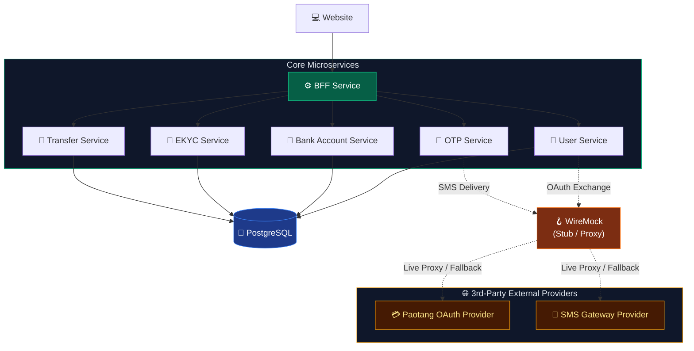

<div class="cover-slide">

<div class="cover-decor-container">
  
</div>

# Ultra Smoooooth Testing

<div class="cover-subtitle">Mock the world. Control the chaos. Test without limits.</div>

<div class="cover-tags">
  <span class="cover-tag">⚙️ Go Workspaces</span>
  <span class="cover-tag">🪝 WireMock</span>
  <span class="cover-tag">🛡️ Burp Suite</span>
  <span class="cover-tag">🎭 Playwright</span>
  <span class="cover-tag">🐳 Testcontainers</span>
</div>

</div>

---

# 🎯 Testing Strategy & Core Pillars

### Mock the world. Control the chaos. Test without limits.

<div class="space-y-3 pt-2 text-sm">

<div class="slide-card">
  <h3 class="text-emerald-400 font-bold mb-1 text-base">🌐 1. Mock the World (WireMock)</h3>
  <p class="text-slate-300 leading-relaxed">
    Virtualize all third-party external integrations with deterministic stateful stubs, dynamic Handlebars responses, and zero sandbox dependencies.
  </p>
</div>

<div class="slide-card">
  <h3 class="text-emerald-400 font-bold mb-1 text-base">⚡ 2. Control the Chaos (Burp Suite)</h3>
  <p class="text-slate-300 leading-relaxed">
    Intercept live HTTP traffic in-flight, tamper with payloads, inject fault scenarios, and probe security/IDOR boundaries.
  </p>
</div>

<div class="slide-card">
  <h3 class="text-emerald-400 font-bold mb-1 text-base">🚀 3. Test Without Limits (Playwright & Testcontainers)</h3>
  <p class="text-slate-300 leading-relaxed">
    Execute full-stack integration and E2E browser tests against disposable, hermetic Docker containers with zero state pollution or port conflicts.
  </p>
</div>

</div>

---

# 🌐 Pillar 1: Mock the World — WireMock

### Eliminating External API Dependencies & Sandbox Flakiness

<div class="slide-card text-sm space-y-3 pt-2">

<div>
  <h3 class="text-emerald-400 font-bold mb-1 text-base">🪝 Complete External Virtualization</h3>
  <p class="text-slate-300 leading-relaxed">
    Third-party payment gateways, OAuth identity providers (Paotang Pass), and SMS delivery networks are fully simulated using lightweight HTTP stubs.
  </p>
</div>

<div>
  <h3 class="text-emerald-400 font-bold mb-1 text-base">🎯 Deterministic Edge Cases</h3>
  <p class="text-slate-300 leading-relaxed">
    Instantly trigger error contracts, latency jitter, or auth code expiration that are difficult or impossible to reproduce against live sandboxes.
  </p>
</div>

<div>
  <h3 class="text-emerald-400 font-bold mb-1 text-base">⚡ Zero Rate Limits & Zero Cost</h3>
  <p class="text-slate-300 leading-relaxed">
    Execute thousands of automated test runs in CI/CD without hitting API billing quotas or being throttled by provider rate limits.
  </p>
</div>

</div>

---

# ⚡ Pillar 2: Control the Chaos — Burp Suite

### Live MITM Traffic Inspection, Fault Injection & Security Boundaries

<div class="slide-card text-sm space-y-3 pt-2">

<div>
  <h3 class="text-emerald-400 font-bold mb-1 text-base">🔀 Transparent In-Flight Interception</h3>
  <p class="text-slate-300 leading-relaxed">
    Sits directly between client frontends and backend services to inspect, pause, and modify HTTP headers and request bodies on the fly.
  </p>
</div>

<div>
  <h3 class="text-emerald-400 font-bold mb-1 text-base">🔁 Rapid Manual Edge-Case Exploration</h3>
  <p class="text-slate-300 leading-relaxed">
    Replay and manipulate requests in Repeater to discover payload vulnerabilities and verify schema error contracts before writing automated tests.
  </p>
</div>

<div>
  <h3 class="text-emerald-400 font-bold mb-1 text-base">💣 Automated Parameter Fuzzing & IDOR Probes</h3>
  <p class="text-slate-300 leading-relaxed">
    Fuzz sequential resource IDs and auth tokens with Intruder to uncover broken object-level authorization (IDOR) and rate-limit leaks.
  </p>
</div>

</div>

---

# 🚀 Pillar 3: Test Without Limits — Playwright & Testcontainers

### Hermetic Disposability & Full-Stack Test Automation

<div class="slide-card text-sm space-y-3 pt-2">

<div>
  <h3 class="text-emerald-400 font-bold mb-1 text-base">🐳 Disposable Ephemeral Infrastructure</h3>
  <p class="text-slate-300 leading-relaxed">
    Testcontainers spins up fresh PostgreSQL and WireMock containers with dynamic port allocations for every test suite, torn down automatically by Moby Ryuk.
  </p>
</div>

<div>
  <h3 class="text-emerald-400 font-bold mb-1 text-base">🎭 Unified UI & Headless API Testing</h3>
  <p class="text-slate-300 leading-relaxed">
    Playwright drives real browser DOM interactions while simultaneously executing direct backend REST API requests in the exact same test file.
  </p>
</div>

<div>
  <h3 class="text-emerald-400 font-bold mb-1 text-base">🛡️ Zero Flakiness & Full Tracing</h3>
  <p class="text-slate-300 leading-relaxed">
    Auto-waiting assertions eliminate arbitrary <code>sleep()</code> timers, while failure recordings and HAR archives provide instant root-cause analysis.
  </p>
</div>

</div>

---

# 🏗️ Ecosystem System Architecture

<div class="adorable-arch-container my-auto">
  
</div>

---

# 🗺️ Detailed Service Topology & Flow

```mermaid {scale: 0.62}
flowchart LR
    subgraph Clients["🌐 1. Client & Automation Layer (Test Without Limits)"]
        Website["💻 Website<br/>:3000"]
        BridgeWebsite["📱 Mobile WebView<br/>JSBridge"]
        Playwright["🐦 Playwright E2E<br/>Runner"]
        Burp["🛡️ Burp MITM Proxy<br/>:8080"]
    end

    subgraph API_Gateway["⚡ 2. Gateway & Orchestration Layer"]
        BFF["⚙️ bff-service<br/>Go :8080"]
    end

    subgraph Core_Services["🏡 3. Microservices Domain Layer (Go Workspace)"]
        UserService["👤 user-service<br/>:8081"]
        BankService["🏦 bank-account-service<br/>:8082"]
        EKYCService["🪪 ekyc-service<br/>:8084"]
        TransferService["💸 transfer-service<br/>:8085"]
        OTPService["🔑 otp-service<br/>:8087"]
    end

    subgraph Persistence["🗄️ 4. Persistence Layer"]
        DB[("🐘 PostgreSQL DB<br/>:5432")]
    end

    subgraph External_Mocks["🤖 5. External Mocks (Mock The World)"]
        WireMock["🪝 WireMock Stubs<br/>:8088"]
        PaotangProvider["💳 Paotang Provider"]
        SMSProvider["📡 SMS Provider"]
    end

    Website -->|REST| BFF
    BridgeWebsite -->|REST + JSBridge| BFF
    Playwright -->|E2E| Website
    Playwright -->|E2E| BridgeWebsite
    Website -.->|MITM Intercept| Burp
    BridgeWebsite -.->|MITM Intercept| Burp
    Burp -.->|Proxied REST| BFF

    BFF -->|/users| UserService
    BFF -->|/accounts| BankService
    BFF -->|/ekycs| EKYCService
    BFF -->|/transfers| TransferService
    BFF -->|/auth/otp/verify| OTPService

    UserService -->|SQL| DB
    BankService -->|SQL| DB
    TransferService -->|SQL| DB

    UserService -->|OAuth via WireMock| WireMock
    OTPService -->|Send SMS via WireMock| WireMock
    WireMock -.->|Proxy Unmatched| PaotangProvider
    WireMock -.->|Proxy Unmatched| SMSProvider

    classDef client fill:#0e7490,stroke:#67e8f9,color:#f8fafc,stroke-width:3px
    classDef gateway fill:#1d4ed8,stroke:#93c5fd,color:#ffffff,stroke-width:3px
    classDef core fill:#047857,stroke:#6ee7b7,color:#ffffff,stroke-width:3px
    classDef persistence fill:#4338ca,stroke:#c4b5fd,color:#ffffff,stroke-width:3px
    classDef external fill:#b45309,stroke:#fcd34d,color:#fff7ed,stroke-width:3px

    class Website,BridgeWebsite,Playwright,Burp client
    class BFF gateway
    class UserService,BankService,EKYCService,TransferService,OTPService core
    class DB persistence
    class WireMock,PaotangProvider,SMSProvider external

    style Clients fill:#082f49,stroke:#0891b2,stroke-width:2px,color:#cffafe
    style API_Gateway fill:#172554,stroke:#2563eb,stroke-width:2px,color:#dbeafe
    style Core_Services fill:#052e2b,stroke:#059669,stroke-width:2px,color:#d1fae5
    style Persistence fill:#1e1b4b,stroke:#7c3aed,stroke-width:2px,color:#ede9fe
    style External_Mocks fill:#451a03,stroke:#d97706,stroke-width:2px,color:#ffedd5
```

<div class="topology-diagram w-full flex justify-center items-center my-auto py-1">



</div>

---

# ⚙️ Technology Stack — Core Runtime & Services

### Monorepo Workspaces, Modern Web & Relational Persistence

<div class="slide-card text-sm space-y-3 pt-2">

<div>
  <h3 class="text-emerald-400 font-bold mb-1 text-base">🐹 Go Workspaces (`go.work`)</h3>
  <p class="text-slate-300 leading-relaxed">
    Unifies all 6 microservices in a single monorepo with cross-service dependency synchronization, fast incremental compilation, and shared domain models.
  </p>
</div>

<div>
  <h3 class="text-emerald-400 font-bold mb-1 text-base">⚛️ Next.js 19 QA Web Frontend</h3>
  <p class="text-slate-300 leading-relaxed">
    Modern React 19 application with Tailwind CSS and interactive JSBridge integration for testing complex end-to-end user workflows.
  </p>
</div>

<div>
  <h3 class="text-emerald-400 font-bold mb-1 text-base">🐘 PostgreSQL Relational Database</h3>
  <p class="text-slate-300 leading-relaxed">
    Provides transactional ACID integrity for bank balances, atomic transfer rollbacks, and concurrent debit race condition testing.
  </p>
</div>

</div>

---

# 🧪 Technology Stack — Testing & Security Infrastructure

### Mocking, MITM Proxy & Container Orchestration

<div class="slide-card text-sm space-y-3 pt-2">

<div>
  <h3 class="text-emerald-400 font-bold mb-1 text-base">🪝 WireMock (API Virtualization)</h3>
  <p class="text-slate-300 leading-relaxed">
    Stubs external Paotang Pass OAuth and SMS gateways with dynamic Handlebars response templating, latency injection, and stateful machines.
  </p>
</div>

<div>
  <h3 class="text-emerald-400 font-bold mb-1 text-base">🛡️ Burp Suite (MITM Proxy)</h3>
  <p class="text-slate-300 leading-relaxed">
    Enables live HTTP inspection, parameter tampering, and automated Intruder fuzzing to uncover IDOR security vulnerabilities.
  </p>
</div>

<div>
  <h3 class="text-emerald-400 font-bold mb-1 text-base">🎭 Playwright & 🐳 Testcontainers</h3>
  <p class="text-slate-300 leading-relaxed">
    Executes integration and E2E suites against ephemeral, code-managed Docker containers with guaranteed teardown by Moby Ryuk.
  </p>
</div>

</div>

---

# 🧱 Core Microservices

<div class="w-full flex justify-center items-center my-auto py-1">



</div>

<div class="text-center text-sm text-gray-400 pt-1">
  BFF orchestrates · services own domain data · WireMock isolates all 3rd-party external providers
</div>

---

# 🪝 What is WireMock? — Core Capabilities

### Programmable HTTP Mock Server for External API Simulation

<div class="slide-card text-sm space-y-3 pt-2">

<div>
  <h3 class="text-emerald-400 font-bold mb-1 text-base">🌐 Precision Request Matching</h3>
  <p class="text-slate-300 leading-relaxed">
    Match incoming HTTP traffic by exact URLs, regex patterns, custom headers (e.g. <code>Mock-Scenario</code>), query parameters, and semantic JSON payloads.
  </p>
</div>

<div>
  <h3 class="text-emerald-400 font-bold mb-1 text-base">🪄 Dynamic Response Templating</h3>
  <p class="text-slate-300 leading-relaxed">
    Echo client request parameters, compute arithmetic fee calculations, and generate ISO dates/UUIDs dynamically via Handlebars.
  </p>
</div>

<div>
  <h3 class="text-emerald-400 font-bold mb-1 text-base">⚡ Chaos Engineering & State Machines</h3>
  <p class="text-slate-300 leading-relaxed">
    Inject network latency, dropped TCP sockets, and model multi-step lifecycles (e.g. <code>Started → PAID</code>) with automatic test reset.
  </p>
</div>

</div>

---

# 🎯 Why WireMock in Testing?

### Deterministic Isolation, Zero Sandbox Flakiness & Fast Test Execution

<div class="slide-card text-sm space-y-3 pt-2">

<div>
  <h3 class="text-emerald-400 font-bold mb-1 text-base">🛡️ Hermetic Isolation & Zero Provider Outages</h3>
  <p class="text-slate-300 leading-relaxed">
    Eliminates third-party sandbox flakiness and maintenance windows by simulating SMS, OAuth, and banking APIs with deterministic local stubs.
  </p>
</div>

<div>
  <h3 class="text-emerald-400 font-bold mb-1 text-base">⚡ Sub-Millisecond Speed & Zero API Quota Limits</h3>
  <p class="text-slate-300 leading-relaxed">
    Executes tests in sub-milliseconds with zero remote network roundtrips, zero API credit costs, and zero provider rate-limit throttling.
  </p>
</div>

<div>
  <h3 class="text-emerald-400 font-bold mb-1 text-base">🔄 Transparent Live Proxy & Traffic Recording</h3>
  <p class="text-slate-300 leading-relaxed">
    Records real-world HTTP traffic directly into JSON stub definitions and transparently proxies unmapped routes to live upstream providers.
  </p>
</div>

</div>

---

# ⚡ WireMock — URL & Path Matching

### Exact Path Routing, Regex Patterns & Query Strings

<div class="slide-card text-sm space-y-3 pt-2">

<div>
  <h3 class="text-emerald-400 font-bold mb-1 text-base">🌐 Path Matcher Operators</h3>
  <ul class="space-y-1 text-slate-300">
    <li>• <strong><code>url</code></strong>: Matches full absolute path <em>including</em> query parameters.</li>
    <li>• <strong><code>urlPath</code></strong>: Matches URI path only, safely ignoring query parameters.</li>
    <li>• <strong><code>urlPathPattern</code></strong>: Regular expression matching on URI paths.</li>
    <li>• <strong><code>urlPattern</code></strong>: Regular expression matching on the complete URL.</li>
  </ul>
</div>

<div>
  <h3 class="text-emerald-400 font-bold mb-1 text-base">💡 Best Practice</h3>
  <p class="text-slate-300 leading-relaxed">
    Use <strong><code>urlPath</code></strong> for stable REST endpoints when query strings vary, and <strong><code>urlPathPattern</code></strong> for dynamic path parameters (e.g. UUIDs, IDs).
  </p>
</div>

</div>

---

# ⚡ WireMock — Header Matching Operators

### Exact Matches, Substrings, Regex & Absence Checks

<div class="slide-card text-sm space-y-3 pt-2">

<div>
  <h3 class="text-emerald-400 font-bold mb-1 text-base">🏷️ Operator Reference</h3>
  <ul class="space-y-1 text-slate-300">
    <li>• <strong><code>equalTo</code></strong>: Exact case-sensitive match (e.g. <code>Content-Type: application/json</code>).</li>
    <li>• <strong><code>matches</code></strong>: Regular expression on header value (e.g. <code>Bearer [A-Za-z0-9-_\\.]+</code>).</li>
    <li>• <strong><code>contains</code></strong>: Substring check (e.g. <code>Mock-Scenario: TRANSFER:INSUFFICIENT_FUNDS</code>).</li>
    <li>• <strong><code>absent</code></strong>: Asserts header is completely omitted from the request.</li>
  </ul>
</div>

<div>
  <h3 class="text-emerald-400 font-bold mb-1 text-base">🛡️ Auth & Mock Steer Patterns</h3>
  <p class="text-slate-300 leading-relaxed">
    Steer test scenarios dynamically via custom headers while verifying authorization tokens and security boundaries.
  </p>
</div>

</div>

---

# ⚡ WireMock — Query Parameter & Cookie Filters

### Parameter Flags, Cookie Assertions & Multi-Criteria Conjunction

<div class="slide-card text-sm space-y-3 pt-2">

<div>
  <h3 class="text-emerald-400 font-bold mb-1 text-base">🔍 Query & Cookie Filters</h3>
  <ul class="space-y-1 text-slate-300">
    <li>• <strong><code>queryParameters</code></strong>: Match query flags (e.g. <code>?active=true</code>) or numeric limits (<code>?limit=10</code>).</li>
    <li>• <strong><code>cookies</code></strong>: Assert session, authentication, or tracking cookies.</li>
    <li>• <strong><code>absent: true</code></strong>: Verify optional query parameters or cookies are omitted.</li>
  </ul>
</div>

<div>
  <h3 class="text-emerald-400 font-bold mb-1 text-base">⚡ Multi-Criteria Conjunction Rule</h3>
  <p class="text-slate-300 leading-relaxed">
    WireMock evaluates HTTP method, path, headers, and query parameters simultaneously. <strong>All defined matchers must evaluate to true</strong> for a 200 match.
  </p>
</div>

</div>

---

# ⚡ Request Matching — URL & Header Example

### Regex Path Routing & Bearer JWT Validation

```json
{
  "request": {
    "method": "GET",
    "urlPathPattern": "/lab/api/users/[0-9]+",
    "headers": {
      "Authorization": { "matches": "Bearer [A-Za-z0-9-_]+" },
      "Mock-Scenario": { "contains": "ACCOUNT_ACTIVE" }
    }
  },
  "response": {
    "status": 200,
    "jsonBody": { "status": "ACTIVE" }
  }
}
```

<div class="slide-card text-sm mt-3">
  🎯 <strong>Key Features</strong>: Matches any numeric user ID (e.g. <code>/users/101</code>), validates Bearer token format, and routes based on <code>Mock-Scenario: ACCOUNT_ACTIVE</code>.
</div>

---

# ⚡ Request Matching — Query Parameter Example

### Query Flag Filtering & Multi-Criteria Evaluation

```json
{
  "request": {
    "method": "GET",
    "urlPath": "/lab/api/users/filter",
    "queryParameters": {
      "active": { "equalTo": "true" },
      "limit": { "matches": "[0-9]+" }
    }
  },
  "response": {
    "status": 200,
    "jsonBody": { "count": 10, "users": [] }
  }
}
```

<div class="slide-card text-sm mt-3">
  🏷️ <strong>Key Features</strong>: Enforces exact flag matching (<code>?active=true</code>) and regex numeric limits (<code>?limit=10</code>). All criteria must match simultaneously.
</div>

---

# ⚖️ WireMock — Priority & Matching Precedence

### Resolution Hierarchy for Overlapping Stub Mappings

<div class="slide-card text-sm space-y-3 pt-2">

<div>
  <h3 class="text-emerald-400 font-bold mb-1 text-base">⚡ Precedence Rule</h3>
  <p class="text-slate-300 leading-relaxed">
    Lower integer value = <strong>Higher Precedence</strong> (<code>1 &gt; 5 &gt; 10 &gt; 100</code>). WireMock stops evaluation on the first matching highest-priority stub.
  </p>
</div>

<div>
  <h3 class="text-emerald-400 font-bold mb-1 text-base">🔢 Default Priority</h3>
  <p class="text-slate-300 leading-relaxed">
    If the <code>"priority"</code> field is omitted in a JSON mapping file, WireMock automatically assigns a default priority of <strong>5</strong>.
  </p>
</div>

</div>

---

# 🥇 Priority Tier 1: Specific Error Overrides

### Fault Injection & Error Contracts

<div class="slide-card text-sm space-y-3 pt-2">

<div>
  <h3 class="text-emerald-400 font-bold mb-1 text-base">🎯 Purpose & Scope</h3>
  <p class="text-slate-300 leading-relaxed">
    Specific error overrides, fault injections, and edge cases triggered via explicit headers (e.g. <code>Mock-Scenario: INSUFFICIENT_FUNDS</code>) or error IDs.
  </p>
</div>

```json
{
  "priority": 1,
  "request": {
    "method": "POST",
    "urlPath": "/lab/api/transfers",
    "headers": { "Mock-Scenario": { "contains": "INSUFFICIENT_FUNDS" } }
  },
  "response": {
    "status": 400,
    "jsonBody": { "code": "ERR_INSUFFICIENT_FUNDS" }
  }
}
```

</div>

---

# 🥈 Priority Tier 5–10: Default Happy Paths

### Standard Business Logic & Route Matchers

<div class="slide-card text-sm space-y-3 pt-2">

<div>
  <h3 class="text-emerald-400 font-bold mb-1 text-base">🎯 Purpose & Scope</h3>
  <p class="text-slate-300 leading-relaxed">
    Default domain responses (<code>200 OK</code> / <code>201 Created</code>) matching standard routes when no error steering headers are passed.
  </p>
</div>

```json
{
  "priority": 10,
  "request": {
    "method": "POST",
    "urlPath": "/lab/api/transfers"
  },
  "response": {
    "status": 201,
    "jsonBody": { "status": "COMPLETED" }
  }
}
```

</div>

---

# 🛡️ Priority Tier 100: Catch-All Proxy

### Transparent Fallback to Real Downstream Endpoints

<div class="slide-card text-sm space-y-3 pt-2">

<div>
  <h3 class="text-emerald-400 font-bold mb-1 text-base">🎯 Purpose & Scope</h3>
  <p class="text-slate-300 leading-relaxed">
    Lowest priority catch-all proxy stubs that forward any unmatched traffic to live downstream environments or external legacy services.
  </p>
</div>

```json
{
  "priority": 100,
  "request": {
    "urlPattern": "/.*"
  },
  "response": {
    "proxyBaseUrl": "https://api.external-provider.com"
  }
}
```

</div>

---

# ⚖️ Priority & Precedence — Example

### Error Scenario Override vs Default Happy Path

```json
// Priority 1: Triggered ONLY when Mock-Scenario header is present
{
  "priority": 1,
  "request": {
    "method": "POST", "urlPath": "/lab/api/transfers",
    "headers": { "Mock-Scenario": { "contains": "INSUFFICIENT_FUNDS" } }
  },
  "response": { "status": 400, "jsonBody": { "code": "ERR_INSUFFICIENT_FUNDS" } }
}
```

<div class="slide-card text-sm mt-3">
  ⚡ <strong>Behavior</strong>: Sending <code>Mock-Scenario: INSUFFICIENT_FUNDS</code> overrides Priority 10 and returns <code>400</code>; without header, requests fall through to Priority 10 and return <code>201</code>.
</div>

---

# 🎯 WireMock — URL & Path RegEx Matching

### Regular Expressions for Dynamic Resource Identifiers

<div class="slide-card text-sm space-y-3 pt-2">

<div>
  <h3 class="text-emerald-400 font-bold mb-1 text-base">🌐 Path RegEx Matchers</h3>
  <ul class="space-y-1 text-slate-300">
    <li>• <strong><code>urlPathPattern</code></strong>: Matches path using regex, safely ignoring query parameters.</li>
    <li>• <strong><code>urlPattern</code></strong>: Matches the entire URI string including query parameters.</li>
  </ul>
</div>

<div>
  <h3 class="text-emerald-400 font-bold mb-1 text-base">💡 Dynamic UUID Example</h3>
  <p class="text-slate-300 leading-relaxed">
    Match 36-character standard UUIDs: <code>"urlPathPattern": "/api/users/[0-9a-fA-F-]{36}/accounts"</code>.
  </p>
</div>

</div>

---

# 🎯 WireMock — Header & Query RegEx Matching

### Bearer Tokens & Scenario Enums

<div class="slide-card text-sm space-y-3 pt-2">

<div>
  <h3 class="text-emerald-400 font-bold mb-1 text-base">🏷️ Header RegEx Operators</h3>
  <ul class="space-y-1 text-slate-300">
    <li>• <strong><code>matches</code></strong>: Value must satisfy the regular expression pattern.</li>
    <li>• <strong><code>doesNotMatch</code></strong>: Passes only when regex evaluation fails.</li>
  </ul>
</div>

<div>
  <h3 class="text-emerald-400 font-bold mb-1 text-base">💡 Token & Scenario Verification</h3>
  <p class="text-slate-300 leading-relaxed">
    Validate Bearer JWTs: <code>"Authorization": { "matches": "Bearer [A-Za-z0-9-_\\.]+" }</code> and restrict scenarios to valid enum values: <code>"matches": "TRANSFER:(SUCCESS|INSUFFICIENT_FUNDS)"</code>.
  </p>
</div>

</div>

---

# 🎯 WireMock — Body & JSONPath RegEx Matching

### Payload Validation & Pattern Filtering

<div class="slide-card text-sm space-y-3 pt-2">

<div>
  <h3 class="text-emerald-400 font-bold mb-1 text-base">📝 Raw Body RegEx</h3>
  <p class="text-slate-300 leading-relaxed">
    Match unparsed raw body: <code>.*"national_id"\\s*:\\s*"[0-9]{13}".*</code> (useful for legacy formats).
  </p>
</div>

<div>
  <h3 class="text-emerald-400 font-bold mb-1 text-base">🔍 Inline JSONPath RegEx</h3>
  <p class="text-slate-300 leading-relaxed">
    Evaluate regex inside JSONPath expressions: <code>$[?(@.phone =~ /^0[689][0-9]{8}$/)]</code> to inspect specific nested attributes without fragility.
  </p>
</div>

</div>

---

# 🎯 WireMock RegEx — Dynamic UUID Path Example

### Matching UUID Paths in API Stubs

```json
{
  "request": {
    "method": "GET", 
    "urlPathPattern": "/lab/api/users/[0-9a-fA-F-]{36}/accounts"
  },
  "response": {
    "status": 200,
    "jsonBody": { "tier": "PREMIUM" }
  }
}
```

<div class="slide-card text-sm mt-3">
  ✨ <code>urlPathPattern</code> dynamically matches any 36-character UUID user account request while ignoring query parameters.
</div>

---

# 🎯 WireMock RegEx — JWT Bearer & Scenario Enum

### Strict Token & Scenario Routing

```json
{
  "request": {
    "method": "POST",
    "urlPath": "/lab/api/transfers",
    "headers": {
      "Authorization": { "matches": "Bearer [A-Za-z0-9-_\\.]+" },
      "Mock-Scenario": { "matches": "TRANSFER:(SUCCESS|INSUFFICIENT_FUNDS)" }
    }
  },
  "response": {
    "status": 200,
    "jsonBody": { "authorized": true }
  }
}
```

<div class="slide-card text-sm mt-3">
  🔐 Enforces valid JWT Bearer header structures and restricts <code>Mock-Scenario</code> strictly to registered enum choices.
</div>

---

# 🎯 WireMock RegEx — Body & Parameter Matching

### 13-Digit National ID & Query Version Validation

```json
{
  "request": {
    "method": "POST",
    "urlPath": "/lab/api/ekyc/verify",
    "queryParameters": { "version": { "matches": "v[1-3].*" } },
    "bodyPatterns": [
      { "matches": ".*\"national_id\":\"[0-9]{13}\".*" }
    ]
  },
  "response": {
    "status": 200,
    "jsonBody": { "verified": true }
  }
}
```

<div class="slide-card text-sm mt-3">
  🪪 Asserts a strict 13-digit Thai National ID within request body and routes across API versions (<code>v1</code>, <code>v2</code>, <code>v3</code>).
</div>

---

# 🎯 WireMock RegEx — JSONPath Phone Validation

### Thai Mobile Number Pattern Matching in Payload

```json
{
  "request": {
    "method": "POST",
    "urlPath": "/lab/api/otp/send",
    "bodyPatterns": [
      {
        "matchesJsonPath": "$[?(@.phone =~ /^0[689]\\d{8}$/)]"
      }
    ]
  },
  "response": {
    "status": 200,
    "jsonBody": { "status": "sent" }
  }
}
```

<div class="slide-card text-sm mt-3">
  📱 Extracts and regex-evaluates only the <code>phone</code> field without breaking on whitespace or extra payload keys.
</div>

---

# 📦 WireMock — Semantic JSON Matching

### Robust Structural JSON Equivalence

<div class="slide-card text-sm space-y-3 pt-2">

<div>
  <h3 class="text-emerald-400 font-bold mb-1 text-base">🧩 Semantic vs Literal Comparison</h3>
  <p class="text-slate-300 leading-relaxed">
    Raw string comparison fails when key ordering changes or indentation differs. <code>equalToJson</code> deserializes both payloads and performs <strong>semantic JSON comparison</strong>.
  </p>
</div>

<div>
  <h3 class="text-emerald-400 font-bold mb-1 text-base">🛡️ Schema Invariance</h3>
  <p class="text-slate-300 leading-relaxed">
    Guarantees tests pass regardless of JSON serialization differences across Go, Next.js, and Java client libraries.
  </p>
</div>

</div>

---

# ⚙️ WireMock — Body Match Operators & Lenient Flags

### Matching Operators & Lenient Contract Flags

<div class="slide-card text-sm space-y-3 pt-2">

<div>
  <h3 class="text-emerald-400 font-bold mb-1 text-base">🛠️ Body Match Operators</h3>
  <ul class="space-y-1 text-slate-300">
    <li>• <strong><code>equalToJson</code></strong>: Semantic JSON equivalence.</li>
    <li>• <strong><code>equalToXml</code></strong>: Semantic XML payload comparison.</li>
    <li>• <strong><code>matches</code></strong>: Regular expression on raw body string.</li>
    <li>• <strong><code>contains</code></strong>: Substring occurrence check.</li>
  </ul>
</div>

<div>
  <h3 class="text-emerald-400 font-bold mb-1 text-base">⚙️ Lenient Match Flags</h3>
  <ul class="space-y-1 text-slate-300">
    <li>• <strong><code>ignoreExtraElements: true</code></strong>: Allows additional unexpected attributes (schema evolution).</li>
    <li>• <strong><code>ignoreArrayOrder: true</code></strong>: Treats JSON arrays as unordered sets.</li>
  </ul>
</div>

</div>

---

# 📦 Body Matching — Example

### Match Request Bodies with `equalToJson`

```json
{
  "request": {
    "method": "POST",
    "urlPath": "/lab/api/accounts/open",
    "bodyPatterns": [
      {
        "equalToJson": "{\"citizenId\": \"1100500123456\", \"type\": \"SAVINGS\"}",
        "ignoreExtraElements": true,
        "ignoreArrayOrder": true
      }
    ]
  },
  "response": {
    "status": 201,
    "jsonBody": { "accountId": "ACC-998877", "status": "OPENED" }
  }
}
```

<div class="slide-card text-sm mt-3">
  ✨ <code>ignoreExtraElements: true</code> permits non-breaking extra payload fields, while <code>ignoreArrayOrder: true</code> permits array items in any sequence.
</div>

---

# 🔍 WireMock — JSONPath Expression Matching

### Filter & Assert Payloads with `matchesJsonPath`

```json
{
  "priority": 1,
  "request": {
    "method": "POST",
    "urlPath": "/lab/api/stateless/payments",
    "bodyPatterns": [
      { "matchesJsonPath": "$.payment[?(@.amount > 1000)]" },
      { "matchesJsonPath": "$.payment[?(@.currency == 'THB')]" },
      { "matchesJsonPath": "$[?(@.recipient.mobile =~ /^08[0-9]{8}$/)]" }
    ]
  },
  "response": {
    "status": 201,
    "jsonBody": { "status": "APPROVED", "flag": "HIGH_VALUE" }
  }
}
```

<div class="slide-card text-sm mt-3">
  🔍 Compares numeric ranges (<code>&gt; 1000</code>), exact currencies, and evaluates inline regex without fragile string parsing.
</div>

---

# 🪄 WireMock — Dynamic Response Templating

### Handlebars Response Templating (`response-template`)

<div v-pre>

```json
{
  "request": {
    "method": "POST",
    "urlPath": "/lab/api/orders"
  },
  "response": {
    "status": 201,
    "headers": { "Content-Type": "application/json" },
    "body": "{\"orderId\": \"{{randomValue type='UUID'}}\", \"userId\": \"{{jsonPath request.body '$.userId'}}\", \"traceId\": \"{{request.headers.X-Trace-ID}}\", \"createdAt\": \"{{now}}\"}",
    "transformers": ["response-template"]
  }
}
```

</div>

<div v-pre class="slide-card text-sm mt-3">
  🪄 Echoes incoming request headers/body and dynamically generates UUIDs and timestamps on the fly with <code>response-template</code>.
</div>

---

# 🪄 WireMock — Handlebars Request & Encoding Helpers

### Request Model Extraction & Data Encoders

<div v-pre class="slide-card text-sm pt-2">

| Helper Type | Syntax Example | Description |
| :--- | :--- | :--- |
| **Request Headers** | `{{request.headers.[X-Trace-ID]}}` | Extracts incoming HTTP header value |
| **Query Parameters** | `{{request.query.page}}` | Extracts query parameter from URL |
| **JSON Path Body** | `{{jsonPath request.body '$.account.id'}}` | Extracts nested field from request body |
| **Base64 Encoding** | `{{base64 request.body}}` | Base64 encodes/decodes request payload |
| **URL Encoding** | `{{urlEncode request.query.target}}` | Encodes URL parameter strings |

</div>

---

# 🎲 WireMock — Handlebars Dynamic Data Generators

### Timestamps, Random IDs & Token Generation

<div v-pre class="slide-card text-sm pt-2">

| Generator | Syntax Example | Generated Output |
| :--- | :--- | :--- |
| **Random UUID** | `{{randomValue type='UUID'}}` | `a1b2c3d4-e5f6-4a1b-8c2d-9e0f1a2b3c4d` |
| **Random OTP** | `{{randomValue type='NUMERIC' length=6}}` | `849201` *(6-digit SMS OTP)* |
| **Current Date** | `{{now format='yyyy-MM-dd'}}` | `2026-08-23` *(Formatted date)* |
| **Expiry Timestamp** | `{{now offset='1 hours'}}` | `2026-08-23T11:45:00Z` *(Relative offset)* |

</div>

---

# 🪄 Handlebars Logic & Math — Example

### Conditionals, Dynamic Math & Response Configuration

<div v-pre>

```handlebars
{
  {{#if (eq (jsonPath request.body '$.amount') 0)}}
  "status": "REJECTED",
  {{else}}
  "status": "APPROVED",
  {{/if}}
  "fee": {{math (jsonPath request.body '$.amount') '*' 0.01}},
  "expiresAt": "{{now offset='3 days' format='yyyy-MM-dd'}}"
}
```

</div>

<div v-pre class="slide-card text-sm mt-3">
  🔀 Supports conditional response branching (`#if eq`), arithmetic fee calculations (`math '*' 0.01`), and relative date offsets.
</div>

---

# 🔤 WireMock — Handlebars String Transformation Helpers

### String Manipulation & Substring Extractors

<div v-pre class="slide-card text-sm pt-2">

| Helper | Syntax Example | Description |
| :--- | :--- | :--- |
| **Case Conversion** | `{{upper value}}` / `{{lower value}}` | Converts text to uppercase / lowercase |
| **Capitalize** | `{{capitalize value}}` | Uppercases the first character |
| **Whitespace Trim** | `{{trim value}}` | Strips leading and trailing whitespace |
| **String Replace** | `{{replace 'old' 'new' value}}` | Replaces occurrences of substring |
| **Regex Extraction** | `{{regexExtract value '([0-9]+)' '1'}}` | Extracts regex capture group 1 |

</div>

---

# 🔁 WireMock — Handlebars Array & Iteration Helpers

### Array Looping, Sizing & Variable Lookups

<div v-pre class="slide-card text-sm pt-2">

| Helper | Syntax Example | Description |
| :--- | :--- | :--- |
| **Loop Iteration** | `{{#each (jsonPath request.body '$.items')}}` | Iterates over array elements |
| **Index Counter** | `{{@index}}` / `{{@first}}` / `{{@last}}` | 0-based iteration index & position flags |
| **Array Sizing** | `{{size (jsonPath request.body '$.items')}}` | Returns total number of array elements |
| **Local Variable** | `{{val 'key' (jsonPath request.body '$.id')}}` | Assigns scoped local variable |
| **Dynamic Lookup** | `{{lookup array index}}` | Looks up array element at specific index |

</div>

---

# 🪄 Handlebars Array Iteration — Example

### Generating Dynamic Arrays with `{{#each}}` and Indexing

<div v-pre>

```handlebars
{
  "totalItems": {{size (jsonPath request.body '$.items')}},
  "processedItems": [
    {{#each (jsonPath request.body '$.items')}}
    {
      "index": {{@index}},
      "sku": "{{upper this.sku}}",
      "status": "VERIFIED"
    }{{#unless @last}},{{/unless}}
    {{/each}}
  ]
}
```

</div>

<div v-pre class="slide-card text-sm mt-3">
  🔁 Loops through request arrays, applies string transformations (`upper this.sku`), and uses `{{#unless @last}},{{/unless}}` to suppress trailing commas.
</div>

---

# 🔍 WireMock — Handlebars jsonPath Traversal & Indexing

### Deep Object Traversal & Array Indexing

<div v-pre class="slide-card text-sm space-y-3 pt-2">

<div>
  <h3 class="text-emerald-400 font-bold mb-1 text-base">🎯 Deep Field Traversal</h3>
  <p class="text-slate-300 leading-relaxed">
    Extract nested request fields directly into response bodies: <code>{{jsonPath request.body '$.customer.id'}}</code> or <code>{{jsonPath request.body '$.account.no'}}</code>.
  </p>
</div>

<div>
  <h3 class="text-emerald-400 font-bold mb-1 text-base">📊 Array Index Extraction</h3>
  <p class="text-slate-300 leading-relaxed">
    Target specific array elements: <code>{{jsonPath request.body '$.items[0].sku'}}</code> to echo the first purchased item in order confirmations.
  </p>
</div>

</div>

---

# 🛡️ WireMock — Safe Default Fallbacks & Dynamic Sizing

### Graceful Fallbacks & Array Counting

<div v-pre class="slide-card text-sm space-y-3 pt-2">

<div>
  <h3 class="text-emerald-400 font-bold mb-1 text-base">🛡️ Safe Default Fallbacks</h3>
  <p class="text-slate-300 leading-relaxed">
    Use <code>default='...'</code> parameter: <code>{{jsonPath request.body '$.tier' default='SILVER'}}</code> to prevent blank responses when optional client fields are missing.
  </p>
</div>

<div>
  <h3 class="text-emerald-400 font-bold mb-1 text-base">📊 Dynamic Array Sizing</h3>
  <p class="text-slate-300 leading-relaxed">
    Wrap <code>jsonPath</code> with <code>size</code> to compute array element counts on the fly: <code>{{size (jsonPath request.body '$.items')}}</code>.
  </p>
</div>

</div>

---

# 🔍 Handlebars jsonPath — Example

### Echoing Nested Request Payloads & Handling Missing Fields

<div v-pre>

```handlebars
{
  "orderId": "{{randomValue type='UUID'}}",
  "customerId": "{{jsonPath request.body '$.customer.id'}}",
  "tier": "{{jsonPath request.body '$.customer.tier' default='SILVER'}}",
  "firstSku": "{{jsonPath request.body '$.items[0].sku'}}",
  "itemCount": {{size (jsonPath request.body '$.items')}}
}
```

</div>

<div v-pre class="slide-card text-sm mt-3">
  🎯 Extracts nested customer IDs and array elements, applies safe default tiers (<code>default='SILVER'</code>), and counts total items dynamically.
</div>

---

# ⏱️ WireMock — Fixed Latency & Timeout Testing

### Deterministic Delay Injection (`fixedDelayMilliseconds`)

```json
{
  "request": {
    "method": "POST",
    "urlPath": "/lab/api/sms/send"
  },
  "response": {
    "status": 200,
    "fixedDelayMilliseconds": 8000,
    "jsonBody": { "status": "DELIVERED" }
  }
}
```

<div class="slide-card text-sm mt-3">
  ⏱️ Holds HTTP response for exactly <code>8000ms</code> to assert client timeout triggers (e.g. 5s HTTP context deadline) without hanging test workers.
</div>

---

# 🎲 WireMock — Random Jitter & Latency Distributions

### Real-World Latency Simulation (`delayDistribution`)

```json
{
  "request": {
    "method": "GET",
    "urlPath": "/lab/api/rates"
  },
  "response": {
    "status": 200,
    "delayDistribution": {
      "type": "lognormal",
      "median": 150,
      "sigma": 0.5
    },
    "jsonBody": { "USD_THB": 35.85 }
  }
}
```

<div class="slide-card text-sm mt-3">
  🎲 <strong>Supported Distributions</strong>: <code>lognormal</code> (fast median + long-tail spikes), <code>uniform</code> (flat min–max bounds), and <code>normal</code> (Gaussian mean/stdDev).
</div>

---

# 💥 WireMock — Network Fault Injection

### Simulating Hard Network Failures & Socket Errors

```json
{
  "request": {
    "method": "GET",
    "urlPath": "/lab/api/unstable-upstream"
  },
  "response": {
    "fault": "CONNECTION_RESET_BY_PEER"
  }
}
```

<div class="slide-card text-sm mt-3">
  💥 <strong>Available Fault Types</strong>: <code>CONNECTION_RESET_BY_PEER</code> (abrupt TCP RST), <code>MALFORMED_RESPONSE_CHUNK</code> (corrupted byte stream), and <code>EMPTY_RESPONSE</code> (0 bytes).
</div>

---

# 🔄 WireMock Stateful Stubbing

### Scenario State Machines & Replay Prevention

<div class="w-full flex justify-center py-2">


</div>

<div class="slide-card text-sm mt-3">
  🔄 Model multi-step business lifecycles and single-use tokens; call <code>POST /__admin/scenarios/reset</code> in test teardown to restore back to <code>Started</code>.
</div>

---

# 🔄 WireMock Stateful — Example

### Scenario State Machine Stub: `04-order-pay.json`

```json
{
  "scenarioName": "order-fulfillment-lifecycle",
  "requiredScenarioState": "Started",
  "newScenarioState": "PAID",
  "request": {
    "method": "POST",
    "urlPath": "/lab/api/orders/101/pay"
  },
  "response": { 
    "status": 200,
    "jsonBody": { "status": "PAYMENT_SUCCESS" }
  }
}
```

<div class="slide-card text-sm mt-3">
  🔄 Transitions scenario state to <code>PAID</code> on first payment. Subsequent calls fail and trigger a <code>409 Conflict</code> or <code>404</code> stub.
</div>

---

# 🔀 Burp Suite — Proxy Intercept

### Transparent MITM HTTP Traffic Interception

<div class="slide-card text-sm space-y-3 pt-2">

<div>
  <h3 class="text-emerald-400 font-bold mb-1 text-base">🌐 Transparent MITM Proxy</h3>
  <p class="text-slate-300 leading-relaxed">
    Sits directly between client applications (browsers, mobile WebViews) and the BFF gateway to inspect, pause, and modify HTTP traffic in flight.
  </p>
</div>

<div>
  <h3 class="text-emerald-400 font-bold mb-1 text-base">💉 Mock Header & Payload Injection</h3>
  <p class="text-slate-300 leading-relaxed">
    Inject custom <code>Mock-Scenario</code> headers or tamper with request JSON bodies to steer WireMock stubs without code modifications.
  </p>
</div>

</div>

---

# 🔀 Proxy Intercept — Example

### Before & After Request Header Injection

```http
POST http://localhost:8080/api/v1/users HTTP/1.1
Host: localhost:8080
Content-Type: application/json
Mock-Scenario: PT_PASS:SUCCESS_ONCE

{
  "username": "testuser",
  "password": "secret"
}
```

<div class="slide-card text-sm mt-3">
  💉 Burp intercepts the outbound user creation request and injects <code>Mock-Scenario: PT_PASS:SUCCESS_ONCE</code> to steer the downstream OAuth mock.
</div>

---

# 🔁 Burp Suite — Repeater

### Manual Request Replay & Contract Validation

<div class="slide-card text-sm space-y-3 pt-2">

<div>
  <h3 class="text-emerald-400 font-bold mb-1 text-base">🔁 Interactive Request Replay</h3>
  <p class="text-slate-300 leading-relaxed">
    Capture any request once, modify payload boundaries, and replay unlimited times with sub-second feedback to explore edge cases before writing automated tests.
  </p>
</div>

<div>
  <h3 class="text-emerald-400 font-bold mb-1 text-base">🎯 Verification Scenarios</h3>
  <p class="text-slate-300 leading-relaxed">
    Validate <code>400 Bad Request</code> error shapes, test negative amounts / overflow, and ensure malicious injection strings never trigger <code>500</code> server crashes.
  </p>
</div>

</div>

---

# 🔁 Repeater — Example

### Boundary & Error Contract Testing (`transfers.spec.ts`)

```typescript
// 1. Normal transfer (201 Created)
const res1 = await request.post("/api/v1/transfers", {
  data: { amount: 500, to_account: "ACC-002" }
});
expect(res1.status()).toBe(201);

// 2. Negative amount (400 Bad Request)
const res2 = await request.post("/api/v1/transfers", {
  data: { amount: -1, to_account: "ACC-002" }
});
expect(res2.status()).toBe(400);
```

<div class="slide-card text-sm mt-3">
  🧪 Manual Repeater edge cases are converted directly into permanent Playwright regression safeguards.
</div>

---

# 💣 Burp Suite — Intruder Attack Modes

### Automated Payload Fuzzing & Parameter Attacks

<div class="slide-card text-sm space-y-3 pt-2">

<div>
  <h3 class="text-emerald-400 font-bold mb-1 text-base">🎯 Attack Modes Overview</h3>
  <ul class="space-y-1.5 text-slate-300">
    <li>• <strong>Sniper Mode</strong>: Fuzzes a single target parameter position (e.g. <code>§id§</code>) through an entire wordlist.</li>
    <li>• <strong>Cluster Bomb</strong>: Multi-position permutation attack across usernames and passwords.</li>
    <li>• <strong>Pitchfork</strong>: Multi-position synchronized parallel pairing.</li>
  </ul>
</div>

</div>

---

# 💣 Burp Suite — Security & IDOR Discovery

### Horizontal Privilege Escalation & Rate Limits

<div class="slide-card text-sm space-y-3 pt-2">

<div>
  <h3 class="text-emerald-400 font-bold mb-1 text-base">🛡️ Vulnerability Discovery</h3>
  <ul class="space-y-1.5 text-slate-300">
    <li>• <strong>IDOR Detection</strong>: Detect unauthorized access to other customers' accounts (<code>ACC-002</code>).</li>
    <li>• <strong>Rate Limit Validation</strong>: Stress test OTP/login endpoints to verify <code>429 Too Many Requests</code> triggers.</li>
    <li>• <strong>Hidden Parameter Discovery</strong>: Uncover unadvertised admin flags or debug parameters.</li>
  </ul>
</div>

</div>

---

# 💣 Intruder — Example

### IDOR Detection Across Sequential Account IDs

```http
GET /api/v1/accounts/§ACCOUNT_ID§ HTTP/1.1
Host: localhost:8080
Authorization: Bearer <user_token>

Payloads: ACC-001, ACC-002, ACC-003, ACC-999...
```

<div class="slide-card mt-3 text-sm">
  <table class="w-full">
    <thead>
      <tr class="text-slate-400 border-b border-slate-700">
        <th class="text-left pb-1">Payload</th>
        <th class="text-left pb-1">Status</th>
        <th class="text-left pb-1">Verdict</th>
      </tr>
    </thead>
    <tbody class="divide-y divide-slate-800 text-slate-300">
      <tr><td><code>ACC-001</code></td><td><span class="text-emerald-400">200 OK</span></td><td>✅ Own account (Authorized)</td></tr>
      <tr><td><code>ACC-002</code></td><td><span class="text-rose-400 font-bold">200 OK</span></td><td>🚨 <strong>IDOR Leak! (Horizontal breach)</strong></td></tr>
      <tr><td><code>ACC-999</code></td><td><span class="text-slate-400">404</span></td><td>✅ Not found</td></tr>
    </tbody>
  </table>
</div>

---

# 📋 Burp Suite — Logger / HTTP History

### Real-Time Traffic Auditing & HAR Exports

<div class="slide-card text-sm space-y-3 pt-2">

<div>
  <h3 class="text-emerald-400 font-bold mb-1 text-base">📋 Real-Time Audit Trail</h3>
  <p class="text-slate-300 leading-relaxed">
    Maintains a complete record of every outbound request and inbound response with filtering by status code, method, host, or payload size.
  </p>
</div>

<div>
  <h3 class="text-emerald-400 font-bold mb-1 text-base">📦 CI/CD HAR Export</h3>
  <p class="text-slate-300 leading-relaxed">
    Export full traffic sessions as <strong>HAR files</strong> for automated regression diffing and test evidence in CI pipelines.
  </p>
</div>

</div>

---

# 📋 Logger — Example

### Filter & Export for CI Evidence

```bash
# Export HTTP traffic from test session as HAR
Save as session.har

# Compare baseline against current test run in CI:
npx playwright har-diff baseline.har session.har
→ Detect any new unexpected 500 errors or missing headers
```

<div class="slide-card text-sm mt-3">
  📋 Automatically compares network traffic across pull requests to catch unintended backend contract regressions.
</div>

---

# ❌ The Shared Environment Problem in Testing

### Flakiness, Collisions & State Bleed

<div class="slide-card text-sm space-y-3 pt-2">

<div>
  <h3 class="text-rose-400 font-bold mb-1 text-base">⚠️ Shared Environment Pitfalls</h3>
  <ul class="space-y-1.5 text-slate-300">
    <li>• <strong>State Pollution</strong>: Test A mutates database records; Test B fails intermittently due to dirty state.</li>
    <li>• <strong>Port Collisions</strong>: Hardcoded <code>:5432</code> or <code>:8080</code> ports conflict with other local processes.</li>
    <li>• <strong>"Works on My Machine"</strong>: Discrepancies between local macOS workstations, Linux CI runners, and staging.</li>
    <li>• <strong>Flaky Cleanups</strong>: Crashed test suites leave orphan DB records and background zombie processes.</li>
  </ul>
</div>

</div>

---

# ✅ The Hermetic Containerized Solution

### Isolated, Disposable & Predictable Infrastructure

<div class="slide-card text-sm space-y-3 pt-2">

<div>
  <h3 class="text-emerald-400 font-bold mb-1 text-base">🐳 Containerized Testing Benefits</h3>
  <ul class="space-y-1.5 text-slate-300">
    <li>• <strong>Hermetic Isolation</strong>: Every test suite executes against dedicated, pristine container instances.</li>
    <li>• <strong>Production Parity</strong>: Exactly matches production PostgreSQL versions and network bridge topology.</li>
    <li>• <strong>Zero Host Tooling</strong>: Developers only need Docker installed — no local database engines or Go binaries required.</li>
    <li>• <strong>Guaranteed CI Parity</strong>: The exact same containerized test orchestration runs locally and in GitHub Actions.</li>
  </ul>
</div>

</div>

---

# 🧪 Testcontainers — Programmable Test Infrastructure

### Dynamic Ports & Code-Driven Orchestration

<div class="slide-card text-sm space-y-3 pt-2">

| Feature | Static Docker Compose | Dynamic Testcontainers |
| :--- | :--- | :--- |
| **Lifecycle** | Manual `docker compose up` | **Code-managed in test runner** |
| **Port Binding** | Fixed host ports (collisions) | **Random dynamic host ports** |
| **Parallelism** | Hard to run in parallel | **Isolated parallel test suites** |
| **Teardown** | Leaks on process crash | **Guaranteed cleanup via Ryuk** |
| **Control** | Static YAML configuration | **Native TypeScript / Go APIs** |

</div>

---

# 🧪 Moby Ryuk — Container Garbage Collector

### Automatic Socket-Driven Teardown for Containers, Networks & Volumes

```typescript
// tests/specs/support/containers.ts
import { GenericContainer, Network } from "testcontainers";

// 1. Ryuk starts automatically on first container call:
const network = await new Network().start();
const wm = await new GenericContainer("wiremock/wiremock:latest")
  .withNetwork(network)
  .withExposedPorts(8080)
  .start();

// 2. Debug Mode: Keep containers alive to inspect DB / UI
// $ TESTCONTAINERS_RYUK_DISABLED=true bun test
process.env.TESTCONTAINERS_RYUK_DISABLED = "true";
```

<div class="slide-card text-sm mt-3">
  🔌 Ryuk monitors the test runner's TCP socket and wipes all labeled containers, networks, and volumes if tests finish or crash (<code>kill -9</code>).
</div>

---

# 🎭 Playwright — Unified UI & API Test Engine

### Modern Full-Stack Integration Testing Advantages

<div class="slide-card text-sm space-y-3 pt-2">

<div>
  <h3 class="text-emerald-400 font-bold mb-1 text-base">⚡ Unified UI + API Automation</h3>
  <p class="text-slate-300 leading-relaxed">
    Automate headless browser DOM interactions and direct backend REST APIs in the same spec file without WebDriver overhead.
  </p>
</div>

<div>
  <h3 class="text-emerald-400 font-bold mb-1 text-base">🛡️ Zero-Flake Reliability</h3>
  <p class="text-slate-300 leading-relaxed">
    Auto-waiting assertions eliminate fragile <code>sleep()</code> calls, while native network routing (<code>page.route()</code>) steers mock scenarios on the fly.
  </p>
</div>

</div>

---

# 🎭 Playwright — Core Test Primitives & API

### Selectors, Auto-Waiting Assertions & Mock Header Injection

<div class="slide-card text-sm space-y-3 pt-2">

<div>
  <h3 class="text-emerald-400 font-bold mb-1 text-base">🔍 Locators & Assertions</h3>
  <ul class="space-y-1 text-slate-300">
    <li>• <code>page.getByTestId("btn-login")</code> — User-facing resilient DOM locators.</li>
    <li>• <code>await expect(page).toHaveURL(/.../)</code> — Auto-retrying assertion engine.</li>
    <li>• <code>const res = await request.post(...)</code> — Built-in headless REST API client.</li>
  </ul>
</div>

<div>
  <h3 class="text-emerald-400 font-bold mb-1 text-base">🔀 Mock Scenario Steering</h3>
  <p class="text-slate-300 leading-relaxed">
    <code>page.setExtraHTTPHeaders(...)</code> injects WireMock <code>Mock-Scenario</code> tags directly into browser fetch requests.
  </p>
</div>

</div>

---

# 🎭 Playwright — Full-Stack Browser E2E Flow

### Testing Multi-Step Auth Flow with Mock Steer (`website.spec.ts`)

```typescript
test("Paotang login verifies OTP & redirects", async ({ page }) => {
  const setScenario = mockScenario(page);
  await page.goto(`${websiteUrl}/login`);

  // Step 1: Paotang OAuth with Mock Scenario
  setScenario(MOCK_SCENARIO.PAOTANG.SUCCESS);
  await page.getByTestId("btn-paotang-login").click();
  await expect(page.getByTestId("result-paotang")).toContainText("successfully");

  // Step 2: Verify OTP with WireMock Stub
  setScenario(MOCK_SCENARIO.OTP.SUCCESS);
  await page.getByTestId("btn-verify-otp").click();

  // Step 3: Assert redirected to dashboard
  await expect(page).toHaveURL(/\/$/);
});
```

<div class="slide-card text-sm mt-3">
  🎯 <code>mockScenario(page)</code> sets the <code>Mock-Scenario</code> header on browser requests so WireMock serves deterministic scenario responses.
</div>

---

# 🧪 Playwright & Testcontainers — Orchestration

### API Testing with Dynamic Ephemeral Containers (`bff.spec.ts`)

```typescript
test.beforeAll(async () => {
  const network = await startNetwork();
  const db = await startPostgres(network);
  const wm = await startWiremock(network, "wiremock", [wiremockMapping("paotang")]);
  const bff = await startBffService(network, { DB_URL: db.getConnectionString() });
});

test("fund transfer returns 201 Created and persists transaction", async ({ request }) => {
  const res = await request.post(`${bffUrl}/api/v1/transfers`, {
    data: { amount: 500, from_account: "ACC-001", to_account: "ACC-002" }
  });
  expect(res.status()).toBe(201);
});

test.afterEach(async ({ request }) => {
  await request.post(`${wiremockUrl}/__admin/scenarios/reset`); // Clean state machine
});
```

<div class="slide-card text-sm mt-3">
  🐳 Spins up ephemeral PostgreSQL and WireMock containers per test suite and resets state machines in <code>test.afterEach</code>.
</div>

---

# 🏗 Local Development — Command Cheat Sheet

### Build, Unit Test & Monorepo Synchronization

<div class="slide-card text-sm space-y-3 pt-2">

<div>
  <h3 class="text-emerald-400 font-bold mb-1 text-base">🚀 Essential Local Commands</h3>
  <ul class="space-y-1.5 text-slate-300">
    <li>• <code>make build</code> — Compiles all 6 Go service binaries into <code>./bin/</code>.</li>
    <li>• <code>make test</code> — Executes unit tests across all microservices.</li>
    <li>• <code>make sync</code> — Synchronizes Go workspace (<code>go.work</code>) dependencies.</li>
    <li>• <code>make slides</code> — Launches the interactive Slidev presentation locally.</li>
  </ul>
</div>

</div>

---

# 🧪 Automated Integration — Command Cheat Sheet

### Testcontainers & Playwright E2E Test Execution

<div class="slide-card text-sm space-y-3 pt-2">

<div>
  <h3 class="text-emerald-400 font-bold mb-1 text-base">🧪 Integration & E2E Commands</h3>
  <ul class="space-y-1.5 text-slate-300">
    <li>• <code>make test-integration</code> — Runs full integration suite with Testcontainers & WireMock.</li>
    <li>• <code>make test-e2e</code> — Executes Playwright browser end-to-end tests against real containers.</li>
    <li>• <code>TESTCONTAINERS_RYUK_DISABLED=true bun test</code> — Keeps containers alive for post-mortem debugging.</li>
  </ul>
</div>

</div>

---
layout: center
class: text-center
---

# 🎉 Thank You!
## Happy Ultra Smoooooth Testing

[GitHub Repository](https://github.com/SiwakornSitti/ultra-smoooooth-testing) • [Workshop Guide](WORKSHOP.md)
