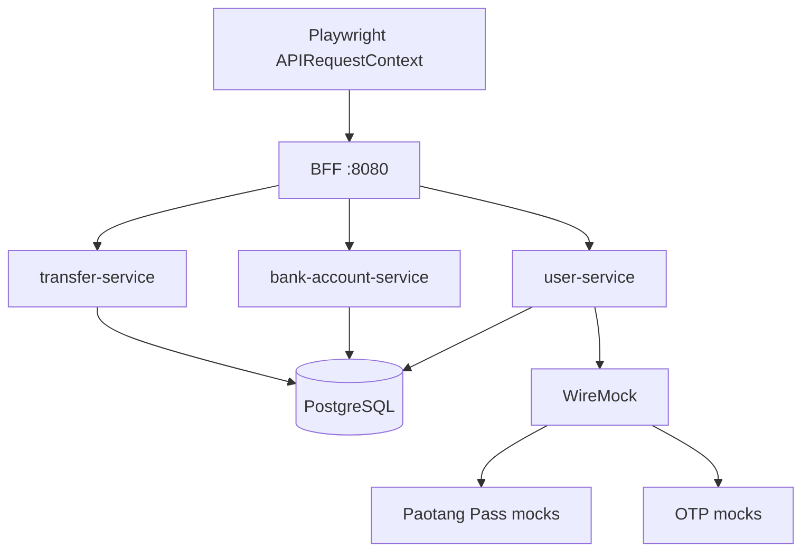

# BFF Integration Tests

The BFF integration suite exercises the real HTTP path across the BFF and its
downstream services. Playwright provides the test runner and API client;
Testcontainers starts the disposable database, WireMock dependencies, and
service containers.

## Run

From the repository root:

```bash
cd tests
npm ci
npm run test:integration
```

The test fixture builds and starts the required service images. Docker must be
running, and the images referenced by `tests/specs/support/containers.ts` must
be available locally.

To run against an already-running BFF instead of creating containers:

```bash
cd tests
BASE_URL=http://localhost:8080 npm run test:integration
```

When `BASE_URL` is set, the suite skips Testcontainers setup and uses the
provided URL.

## Test topology



The fixture creates one isolated Docker network and starts:

- PostgreSQL with service migrations and seeds.
- WireMock for Paotang Pass and OTP responses.
- `user-service` and `bank-account-service` connected to PostgreSQL.
- `transfer-service` connected to PostgreSQL.
- `bff-service`, configured with Docker network aliases for its downstreams.

Test data is seeded before the BFF starts. By default, the suite creates the
user and accounts through service APIs. Set `SEED_MODE=direct` to seed the
database directly with stable IDs:

```bash
cd tests
SEED_MODE=direct npm run test:integration
```

## Covered use cases

The current suite in [`specs/integration/bff.spec.ts`](./specs/integration/bff.spec.ts)
covers:

- Fetching a user profile with only that user's accounts.
- Returning `404` for an unknown user.
- Creating a user successfully.
- Rejecting duplicate user email addresses with `409`.
- Rejecting a user without a phone number with `400`.
- Rejecting malformed JSON during user creation with `400`.
- Returning `200` with the current empty-account response for a user without accounts.
- Paotang auth-code exchange success.
- Paotang one-time auth-code replay rejection with `400 invalid_grant`.
- OTP verification success.
- Invalid OTP rejection with `400 invalid_otp`.
- eKYC verification response and `Location`/status handling.
- Successful transfer creation and response mapping.
- Insufficient-funds rejection with `INSUFFICIENT_FUNDS`.
- Retrieving a created transfer by ID and preserving its `Location` header.
- Listing transfers.
- Rejecting transfers between the same account with `VALIDATION_FAILED`.
- Rejecting currency mismatches with `CURRENCY_MISMATCH`.

## Scenario and reset behavior

WireMock scenarios are selected with the `Mock-Scenario` request header. The
integration suite uses constants from
[`specs/support/mock-scenario.ts`](./specs/support/mock-scenario.ts), including:

| Scenario | Purpose |
|---|---|
| `PT_PASS:SUCCESS_ONCE` | First Paotang exchange succeeds; replay fails. |
| `OTP:SUCCESS` | OTP verification succeeds. |
| `OTP:INVALID` | OTP verification returns an invalid-code error. |

After each test, the fixture calls WireMock's scenario reset endpoint so the
next test starts from `Started` state.

## Related tests

- Go handler and proxy tests: [`../services/bff-service/main_test.go`](../services/bff-service/main_test.go)
- Browser journeys: [`specs/e2e/website.spec.ts`](./specs/e2e/website.spec.ts)
- Playwright configuration: [`playwright.config.ts`](./playwright.config.ts)
- Shared container setup: [`specs/support/containers.ts`](./specs/support/containers.ts)

## Current boundary

The integration fixture currently configures the BFF with an eKYC service URL
but does not start an eKYC container. The eKYC route therefore needs a live
eKYC service when running the integration suite; otherwise use the BFF Go unit
tests for isolated eKYC proxy coverage. Add `startEKYCService` to the fixture
before treating eKYC as a complete live integration dependency.
